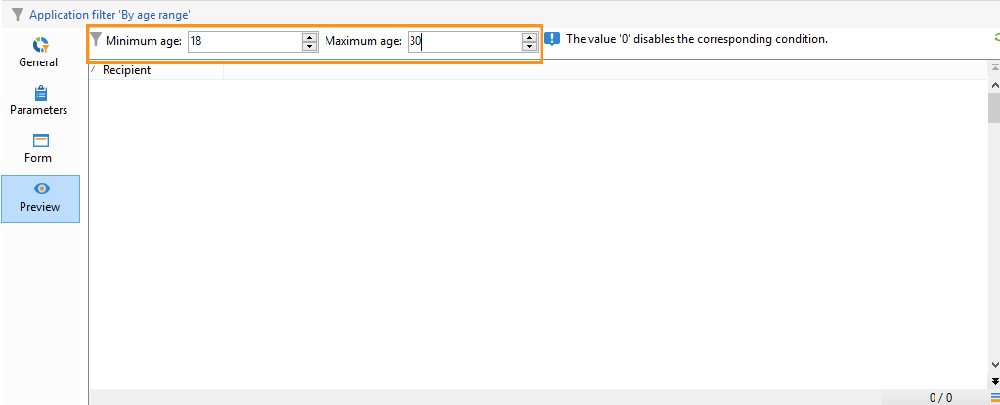
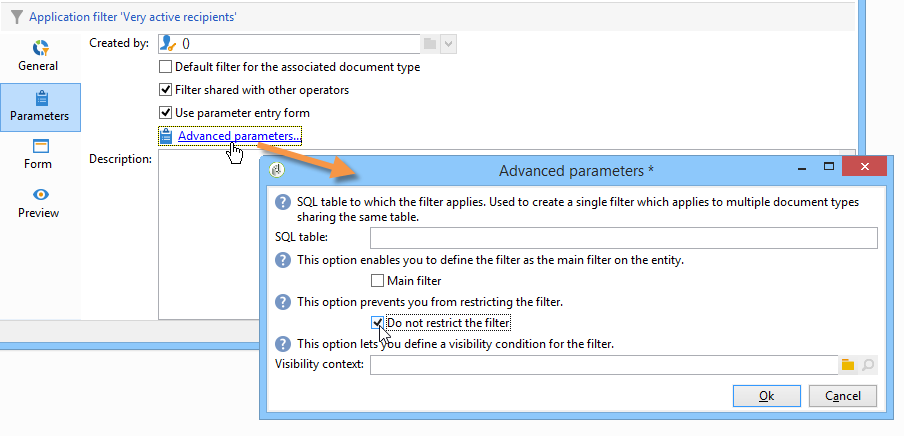

# 建立篩選器{#creating-filters}

當您在Adobe Campaign樹狀結構中進行導覽（從首頁的&#x200B;**[!UICONTROL Explorer]**&#x200B;功能表）時，資料庫中包含的資料會顯示於清單中。 這些清單可設定為僅顯示運運算元所需的資料。 接著，您就可以針對篩選的資料啟動動作。 篩選設定可讓您從清單&#x200B;**[!UICONTROL dynamically]**&#x200B;中選取資料。 如果修改資料，則會更新篩選的資料。

>[!NOTE]
>
>使用者介面組態設定是在裝置層級本機定義的。 有時可能必須清除此資料，尤其是在重新整理資料時發生問題時。 若要這麼做，請使用&#x200B;**[!UICONTROL File > Clear the local cache]**&#x200B;功能表。

## 可用篩選器的型別 {#typology-of-available-filters}

Adobe Campaign可讓您將篩選器套用至資料清單。

這些篩選器僅能使用一次，您也可以儲存以供日後使用。 您可以同時套用數個篩選器。

Adobe Campaign中有以下篩選器型別：

* **預設篩選器**

  可透過清單上方的欄位存取&#x200B;**預設篩選器**。 它可讓您依預先定義的欄位進行篩選（對於收件者設定檔，預設為名稱和電子郵件地址）。 您可以使用欄位來輸入要篩選的字元，或從下拉式清單中選取篩選條件。

  
<!--
  >[!NOTE]
  >
  >The **%** character replaces any character string. For example, the string `%@yahoo.com` lets you display all the profiles with an email address in the domain "yahoo.com".
-->
您可以變更清單的預設篩選器。 如需詳細資訊，請參閱[變更預設篩選器](#altering-the-default-filter)。

* **簡單篩選器**

  **簡單篩選器**&#x200B;是資料行的一次性篩選器。 它們是在顯示的欄上以一個或多個簡單搜尋條件定義的。

  您可以在相同的資料清單上結合數個簡單的篩選器，以縮小搜尋範圍。 篩選器欄位會一個顯示在另一個欄位下方。 它們可以各自獨立刪除。

  

  在[建立簡單篩選器](#creating-a-simple-filter)中會詳細說明簡單篩選器。

* **進階篩選器**

  **進階篩選器**&#x200B;是使用資料上的查詢或查詢組合所建立。

  如需建立進階篩選的詳細資訊，請參閱[建立進階篩選](#creating-an-advanced-filter)。

  您可以使用函式來定義篩選器的內容。 如需詳細資訊，請參閱[使用函式](#creating-an-advanced-filter-with-functions)建立進階篩選器。

  >[!NOTE]
  >
  >如需在Adobe Campaign中建立查詢的詳細資訊，請參閱[本節](../../platform/using/about-queries-in-campaign.md)。

* **使用者篩選器**

  **應用程式篩選器**&#x200B;是已儲存的進階篩選器，可用來與其他運運算元共用其組態。

  位於清單上方的&#x200B;**[!UICONTROL Filters]**&#x200B;按鈕提供一組應用程式篩選器，可結合這些篩選器以調整篩選。 建立這些篩選的方法會顯示在[儲存篩選](#saving-a-filter)中。

## 變更預設篩選器 {#altering-the-default-filter}

若要變更收件者清單的預設篩選器，請按一下樹狀結構的&#x200B;**[!UICONTROL Profiles and Targets > Pre-defined filters]**&#x200B;節點。

對於所有其他型別的資料，請透過&#x200B;**[!UICONTROL Administration > Configuration > Predefined filters]**&#x200B;節點設定預設篩選器。

應用以下步驟：

1. 選取預設要使用的篩選器。
1. 按一下「**[!UICONTROL Parameters]**」索引標籤並選取「**[!UICONTROL Default filter for the associated document type]**」。

   

   >[!CAUTION]
   >
   >如果預設篩選器已套用至清單，則需在套用新篩選器之前先將其停用。 若要這麼做，請按一下篩選欄位右側的紅十字。

1. 按一下&#x200B;**[!UICONTROL Save]**&#x200B;以套用篩選。

   >[!NOTE]
   >
   >篩選器定義視窗在[建立進階篩選器](#creating-an-advanced-filter)和[儲存篩選器](#saving-a-filter)中有詳細說明。

## 建立簡單篩選器 {#creating-a-simple-filter}

若要建立&#x200B;**簡單篩選器**，請套用下列步驟：

1. 用滑鼠右鍵按一下您要篩選的欄位，然後選取&#x200B;**[!UICONTROL Filter on this field]**。

   

   預設篩選欄位會顯示在清單上方。

1. 從下拉式清單中選取篩選選項，或輸入要套用的篩選條件（選取或輸入條件的方法取決於欄位型別：文字、列舉等）。

   

1. 若要啟動篩選，請按鍵盤上的Enter鍵，或按一下篩選欄位右側的綠色箭頭。

如果您要篩選資料的欄位未以設定檔形式顯示，您可以在顯示的欄中新增資料，然後在該欄中篩選。 若要這麼做，

1. 按一下&#x200B;**[!UICONTROL Configure the list]**&#x200B;圖示。

   

1. 選取要顯示的欄，例如收件者的年齡。

   

1. 以滑鼠右鍵按一下收件者清單中的&#x200B;**年齡**&#x200B;欄，然後選取&#x200B;**[!UICONTROL Filter on this column]**。

   

   然後，您可以選取年齡篩選選項。

   

## 建立進階篩選 {#creating-an-advanced-filter}

若要建立&#x200B;**進階篩選器**，請套用下列步驟：

1. 按一下&#x200B;**[!UICONTROL Filters]**&#x200B;按鈕並選取&#x200B;**[!UICONTROL Advanced filter...]**。

   

   您也可以用滑鼠右鍵按一下要篩選的資料清單，然後選取&#x200B;**[!UICONTROL Advanced filter...]**。

   篩選條件定義視窗隨即顯示。

1. 按一下&#x200B;**[!UICONTROL Expression]**&#x200B;欄以定義輸入值。
1. 按一下&#x200B;**[!UICONTROL Edit expression]**&#x200B;以選取將套用篩選的欄位。

   

1. 從清單中，選取要篩選資料的欄位。 按一下 **[!UICONTROL Finish]** 確認。
1. 按一下&#x200B;**[!UICONTROL Operator]**&#x200B;欄，然後從下拉式清單中選取要套用的運運算元。
1. 從&#x200B;**[!UICONTROL Value]**&#x200B;欄選取預期的值。 您可以合併多個篩選器來縮小查詢範圍。 若要新增篩選條件，請按一下&#x200B;**[!UICONTROL Add]**。

   

1. 您可以將階層指派給運算式，或使用工具列箭頭來變更查詢運算式的順序。
1. 運算式之間的預設運運算元是&#x200B;**和**，但您可以按一下欄位來變更此運運算元。 您可以選取&#x200B;**或**&#x200B;運運算元。

   

1. 按一下&#x200B;**[!UICONTROL OK]**&#x200B;以確認建立篩選器，並將其套用至清單。

套用的篩選器會顯示在清單上方。

若要編輯或修改此篩選，請按一下其標籤。

若要取消此篩選，請按一下篩選右邊的&#x200B;**[!UICONTROL Remove this filter]**&#x200B;圖示。

您可以儲存進階篩選器，以備將來使用。 如需有關此型別篩選的進一步資訊，請參閱[儲存篩選](#saving-a-filter)。

### 使用函式建立進階篩選 {#creating-an-advanced-filter-with-functions}

進階篩選器可以使用函式；具有函式&#x200B;**的**&#x200B;篩選器是透過運算式編輯器建立的，可讓您使用資料庫資料和進階函式建立公式。 若要使用函式建立篩選器，請重複進階篩選器建立步驟1、2和3，然後依照下列步驟進行：

1. 在欄位選取視窗中，按一下&#x200B;**[!UICONTROL Advanced selection]**。
1. 選取要使用的公式型別：彙總、現有使用者篩選器或運算式。

   

   可以使用以下選項：

   * **[!UICONTROL Field only]**&#x200B;以選取欄位。 這是預設模式。
   * **[!UICONTROL Aggregate]**&#x200B;以選取要使用的彙總公式（計數、總和、平均值、最大值、最小值）。
   * **[!UICONTROL User filter]**&#x200B;以選取其中一個現有的使用者篩選器。 使用者篩選器在[儲存篩選器](#saving-a-filter)中有詳細說明。
   * **[!UICONTROL Expression]**&#x200B;以存取運算式編輯器。

     運算式編輯器可讓您定義進階篩選器。 類似於：

     

     它可讓您選取資料庫表格中的欄位，並將進階函式附加至這些欄位：選取要在&#x200B;**[!UICONTROL List of functions]**&#x200B;中使用的函式。 可用的函式在[函式清單](../../platform/using/defining-filter-conditions.md#list-of-functions)中有詳細說明。 接著，選取函式涉及的欄位，然後按一下&#x200B;**[!UICONTROL OK]**&#x200B;以核准運算式。

     >[!NOTE]
     >
     >如需根據運算式建立篩選的範例，請參閱[本節](../../workflow/using/sending-a-birthday-email.md#identifying-recipients-whose-birthday-it-is)。

## 儲存篩選器 {#saving-a-filter}

篩選器是每個運運算元所專屬的，每當運運算元清除其使用者端主控台的快取時，就會重新初始化。

您可以儲存進階篩選器來建立&#x200B;**應用程式篩選器**：您可以在任何清單中按一下滑鼠右鍵或透過清單上方的&#x200B;**[!UICONTROL Filters]**&#x200B;按鈕重複使用它。

這些篩選器也可以透過傳遞精靈在目標選擇階段中直接存取（如需建立傳遞的詳細資訊，請參閱[本節](../../delivery/using/creating-an-email-delivery.md)）。 若要建立應用程式篩選器，您可以：

* 將進階篩選器轉換為應用程式篩選器。 若要這麼做，請在關閉進階篩選編輯器前按一下&#x200B;**[!UICONTROL Save]**。

  

* 透過樹狀結構的&#x200B;**[!UICONTROL Administration > Configuration > Predefined filters]** （或收件者的&#x200B;**[!UICONTROL Profiles and targets > Predefined filters]**）節點建立此應用程式篩選器。 若要這麼做，請以滑鼠右鍵按一下篩選器清單，然後選取&#x200B;**[!UICONTROL New...]**。 此程式與建立進階篩選的程式相同。

  **[!UICONTROL Label]**&#x200B;欄位可讓您命名此篩選器。 此名稱將出現在&#x200B;**[!UICONTROL Filters...]**&#x200B;按鈕的組合方塊中。

  

您可以按一下滑鼠右鍵並選取「**[!UICONTROL No filter]**」，或透過清單上方的「**[!UICONTROL Filters]**」圖示刪除目前清單中的所有篩選器。

您可以按一下&#x200B;**[!UICONTROL Filters]**&#x200B;按鈕並使用&#x200B;**[!UICONTROL And...]**&#x200B;功能表來組合篩選器。

## 篩選收件者 {#filtering-recipients}

預先定義的篩選器（請參閱[儲存篩選器](#saving-a-filter)）可讓您篩選資料庫中包含的收件者設定檔。 您可以從樹狀結構的&#x200B;**[!UICONTROL Profiles and Targets > Predefined filters]**&#x200B;節點編輯篩選器。 篩選器會透過&#x200B;**[!UICONTROL Filters]**&#x200B;按鈕列在工作區的上半部分。

選取篩選器以顯示其定義並存取篩選資料的預覽。

>[!NOTE]
>
>如需預先定義篩選建立的詳細範例，請參閱[使用案例](../../platform/using/use-case.md)。

預先定義的篩選條件包括：

<table> 
 <tbody> 
  <tr> 
   <td> <strong>標籤</strong>  </td> 
   <td> <strong>查詢</strong>  </td> 
  </tr> 
  <tr> 
   <td> 已開啟  </td> 
   <td> 選取已開啟傳遞的收件者。  </td> 
  </tr> 
  <tr> 
   <td> 已開啟但未點按  </td> 
   <td> 選取已開啟傳遞但未點按連結的收件者。  </td> 
  </tr> 
  <tr> 
   <td> 非使用中的收件者  </td> 
   <td> 選取在X個月內未開啟傳遞的收件者。  </td> 
  </tr> 
  <tr> 
   <td> 依裝置型別的最後一個活動  </td> 
   <td> 選取在過去Z天內使用裝置X點選或開啟傳遞Y的收件者。  </td> 
  </tr> 
  <tr> 
   <td> 依裝置型別的最後一個活動（追蹤）  </td> 
   <td> 選取在過去Z天內使用裝置X點選或開啟傳遞Y的收件者。  </td> 
  </tr> 
  <tr> 
   <td> 未鎖定目標的收件者  </td> 
   <td> 選取在X個月內從未透過管道Y定位的收件者。  </td> 
  </tr> 
  <tr> 
   <td> 非常活躍的收件者  </td> 
   <td> 選取在過去Y個月中至少點按X次傳遞的收件者。  </td> 
  </tr> 
  <tr> 
 <td> 已加入封鎖清單的電子郵件地址  </td> 
    <td> 選取電子郵件地址在封鎖清單上的收件者。  </td>
  </tr> 
  <tr> 
   <td> 隔離的電子郵件地址  </td> 
   <td> 選取已隔離電子郵件地址的收件者。  </td> 
  </tr> 
  <tr> 
   <td> 在資料夾 中重複的電子郵件地址 </td> 
   <td> 選取資料夾中電子郵件地址重複的收件者。  </td> 
  </tr> 
  <tr> 
   <td> 未開啟或未按一下  </td> 
   <td> 選取尚未開啟傳遞或按一下傳遞的收件者。  </td> 
  </tr> 
  <tr> 
   <td> 新收件者（天）  </td> 
   <td> 選取過去X天建立的收件者。  </td> 
  </tr> 
  <tr> 
   <td> 新收件者（分鐘）  </td> 
   <td> 選取過去X分鐘建立的收件者。  </td> 
  </tr> 
  <tr> 
   <td> 新收件者（月）  </td> 
   <td> 選取過去X個月建立的收件者。  </td> 
  </tr> 
  <tr> 
   <td> 依訂閱  </td> 
   <td> 依訂閱選取收件者。  </td> 
  </tr> 
  <tr> 
   <td> 按一下特定連結  </td> 
   <td> 選取按一下傳遞中特定URL的收件者。  </td> 
  </tr> 
  <tr> 
   <td> 透過傳遞行為  </td> 
   <td> 根據收件者在收到傳遞後的行為選取收件者。  </td> 
  </tr> 
  <tr> 
   <td> 依據建立日期  </td> 
   <td> 依建立日期選取從X個月（目前日期減去n個月）到Y個月（目前日期減去n個月）的期間內的收件者。  </td> 
  </tr> 
  <tr> 
   <td> 依清單  </td> 
   <td> 依清單選取收件者。  </td> 
  </tr> 
  <tr> 
   <td> 按點按次數  </td> 
   <td> 選取過去X個月內點選傳遞的收件者。  </td> 
  </tr> 
  <tr> 
   <td> 依已接收的訊息數  </td> 
   <td> 根據收件者收到的郵件數目選取收件者。  </td> 
  </tr> 
  <tr> 
   <td> 按開啟次數  </td> 
   <td> 選取在X和Y傳遞之間開啟超過Z時間量的收件者。  </td> 
  </tr> 
  <tr> 
   <td> 依名稱或電子郵件  </td> 
   <td> 根據收件者的名稱或電子郵件選取收件者。  </td> 
  </tr> 
  <tr> 
   <td> 依年齡範圍  </td> 
   <td> 根據收件者的年齡選取收件者。  </td> 
  </tr> 
 </tbody> 
</table>

>[!NOTE]
>
>有關計數和期間的所有比較都應該更廣泛地理解（與查詢限制相對應的收件者會包含在比較中）。

資料計算方式範例：

* 選取小於30歲的收件者：

  

* 選取18歲或以上的收件者：

  

* 選取年齡介於18至30歲的收件者：

  

## 資料篩選器的進階設定 {#advanced-settings-for-data-filters}

按一下「**[!UICONTROL Settings]**」標籤以存取下列選項：

* **[!UICONTROL Default filter for the associated document type]**：此選項可讓您預設在排序相關清單的編輯器中建議此篩選器。

  例如，**[!UICONTROL By name or login]**&#x200B;篩選器已套用至運運算元。 此選項已選取，因此所有運運算元清單一律會提供篩選條件。

* **[!UICONTROL Filter shared with other operators]**：此選項可讓您將篩選器提供給目前資料庫上的所有其他運運算元。
* **[!UICONTROL Use parameter entry form]**：此選項可讓您定義在選取此篩選時，要顯示在清單上方的篩選欄位。 這些欄位可讓您定義篩選設定。 必須透過&#x200B;**[!UICONTROL Form]**&#x200B;按鈕以XML格式輸入此表單。 例如，收件者清單中提供的預先設定篩選器&#x200B;**[!UICONTROL Recipients who have opened]**&#x200B;會顯示篩選欄位，讓您選取篩選所針對的傳遞。

  **[!UICONTROL Preview]**&#x200B;按鈕會顯示所選篩選的結果。

* **[!UICONTROL Advanced parameters]**&#x200B;連結可讓您定義其他設定。 特別是，您可以將SQL表格與篩選器建立關聯，使其成為共用表格的所有編輯器的共同專案。

  如果要停止使用者覆寫此篩選器，請選取&#x200B;**[!UICONTROL Do not restrict the filter]**&#x200B;選項。

  此選項針對傳遞精靈中提供的「傳遞的收件者」和「屬於資料夾的傳遞的收件者」篩選條件啟用，且無法多載。

  
