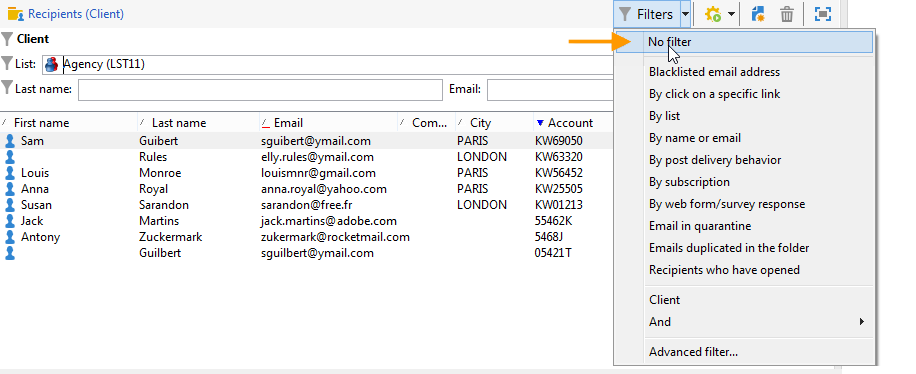

# 建立篩選器{#creating-filters}

在Adobe Campaign樹中導覽時(從 **[!UICONTROL Explorer]** 功能表)，則資料庫中包含的資料會顯示在清單中。 這些清單可設定為只顯示運算子所需的資料。 接著，即可對篩選的資料啟動動作。 篩選設定可讓您從清單中選取資料 **[!UICONTROL dynamically]**. 如果修改了資料，則更新篩選的資料。

>[!NOTE]
>
>用戶介面配置設定是在本地設備級別定義的。 有時可能需要清除此資料，尤其是在重新整理資料時出現問題時。 若要這麼做，請使用 **[!UICONTROL File > Clear the local cache]** 功能表。

## 可用篩選器的類型 {#typology-of-available-filters}

Adobe Campaign可讓您將篩選器套用至資料清單。

這些篩選器可以使用一次，或者您可以儲存以供日後使用。 您可以同時套用數個篩選器。

下列篩選類型適用於Adobe Campaign:

* **預設篩選**

   此 **預設篩選** 可透過清單上方的欄位存取。 它可讓您篩選預先定義的欄位（對於收件者設定檔，預設為名稱和電子郵件地址）。 您可以使用欄位輸入要篩選的字元，或從下拉式清單中選取篩選條件。

   
<!--
  >[!NOTE]
  >
  >The **%** character replaces any character string. For example, the string `%@yahoo.com` lets you display all the profiles with an email address in the domain "yahoo.com".
-->
您可以變更清單的預設篩選。 有關詳細資訊，請參閱 [變更預設篩選](#altering-the-default-filter).

* **簡單篩選**

   **簡單篩選** 是欄上的一次性篩選。 它們是以顯示欄上的一或多個簡單搜尋准則所定義。

   您可以將多個簡單篩選器合併至相同的資料清單，以縮小搜尋範圍。 篩選欄位會顯示在另一個下方。 可以相互獨立刪除。

   

   簡單篩選器在 [建立簡單篩選](#creating-a-simple-filter).

* **進階篩選**

   **進階篩選** 是使用查詢或資料查詢組合來建立。

   如需建立進階篩選器的詳細資訊，請參閱 [建立進階篩選](#creating-an-advanced-filter).

   您可以使用函式來定義篩選器的內容。 有關詳細資訊，請參閱 [建立含有函式的進階篩選器](#creating-an-advanced-filter-with-functions).

   >[!NOTE]
   >
   >如需在Adobe Campaign中建立查詢的詳細資訊，請參閱 [本節](../../platform/using/about-queries-in-campaign.md).

* **使用者篩選器**

   安 **應用程式篩選** 是已儲存的進階篩選器，可與其他運算子使用及共用其設定。

   此 **[!UICONTROL Filters]** 按鈕位於清單上方，提供一組應用程式篩選器，可結合這些篩選器來調整篩選。 建立這些篩選器的方法如 [儲存篩選器](#saving-a-filter).

## 變更預設篩選 {#altering-the-default-filter}

若要變更收件者清單的預設篩選，請按一下 **[!UICONTROL Profiles and Targets > Pre-defined filters]** 樹的節點。

對於所有其他類型的資料，請透過 **[!UICONTROL Administration > Configuration > Predefined filters]** 節點。

應用以下步驟：

1. 選取您預設要使用的篩選器。
1. 按一下 **[!UICONTROL Parameters]** 索引標籤和選取 **[!UICONTROL Default filter for the associated document type]**.

   

   >[!CAUTION]
   >
   >如果預設篩選器已套用至清單，您必須在套用新篩選器前先停用該篩選器。 要執行此操作，請按一下篩選欄位右側的紅十字。

1. 按一下 **[!UICONTROL Save]** 來套用篩選。

   >[!NOTE]
   >
   >篩選器定義視窗在 [建立進階篩選](#creating-an-advanced-filter) 和 [儲存篩選器](#saving-a-filter).

## 建立簡單篩選 {#creating-a-simple-filter}

建立 **簡單篩選**，請套用下列步驟：

1. 以滑鼠右鍵按一下您要篩選的欄位並選取 **[!UICONTROL Filter on this field]**.

   

   預設篩選欄位會顯示在清單上方。

1. 從下拉式清單中選取篩選選項，或輸入要套用的篩選條件(選取或輸入條件的方法取決於欄位類型：文字、列舉等)。

   

1. 要激活篩選器，請按鍵盤上的Enter，或按一下篩選欄位右側的綠色箭頭。

如果您要篩選資料的欄位未以設定檔的形式顯示，您可以將其新增至顯示的欄中，然後篩選該欄。 要做到，

1. 按一下 **[!UICONTROL Configure the list]** 表徵圖。

   

1. 選取要顯示的欄，例如收件者的年齡。

   

1. 以滑鼠右鍵按一下 **年齡** 欄，然後選取 **[!UICONTROL Filter on this column]**.

   

   然後，您可以選取年齡篩選選項。

   

## 建立進階篩選 {#creating-an-advanced-filter}

若要建立 **進階篩選**，請套用下列步驟：

1. 按一下 **[!UICONTROL Filters]** 按鈕並選取 **[!UICONTROL Advanced filter...]**.

   

   您也可以以滑鼠右鍵按一下要篩選和選取的資料清單 **[!UICONTROL Advanced filter...]**.

   將顯示篩選條件定義窗口。

1. 按一下 **[!UICONTROL Expression]** 欄以定義輸入值。
1. 按一下 **[!UICONTROL Edit expression]** 選擇要應用篩選的欄位。

   

1. 從清單中，選取要篩選資料的欄位。 按一下 **[!UICONTROL Finish]** 確認。
1. 按一下 **[!UICONTROL Operator]** 欄，然後從下拉式清單中選取要套用的運算子。
1. 從 **[!UICONTROL Value]** 欄。 您可以結合數個篩選器來調整查詢。 若要新增篩選條件，請按一下 **[!UICONTROL Add]**.

   

1. 您可以為運算式指派階層，或使用工具列箭頭來變更查詢運算式的順序。
1. 運算式之間的預設運算子為 **和**，但您可以按一下欄位來變更此項目。 您可以選取 **或** 運算元。

   

1. 按一下 **[!UICONTROL OK]** 確認篩選器建立並將其套用至清單。

套用的篩選器會顯示在清單上方。

若要編輯或修改此篩選器，請按一下其標籤。

若要取消此篩選器，請按一下 **[!UICONTROL Remove this filter]** 表徵圖。

您可以儲存進階篩選器以保留供日後使用。 如需此類型篩選器的詳細資訊，請參閱 [儲存篩選器](#saving-a-filter).

### 建立含有函式的進階篩選器 {#creating-an-advanced-filter-with-functions}

進階篩選器可使用函式； **帶函式的篩選器** 是透過運算式編輯器建立的，可讓您使用資料庫資料和進階函式建立公式。 若要建立具有函式的篩選器，請重複進階篩選器建立步驟1、2和3，然後繼續如下：

1. 在欄位選取視窗中，按一下 **[!UICONTROL Advanced selection]**.
1. 選擇要使用的公式類型：匯總、現有用戶篩選器或表達式。

   

   可以使用以下選項：

   * **[!UICONTROL Field only]** 來選擇欄位。 這是預設模式。
   * **[!UICONTROL Aggregate]** 選擇要使用的匯總公式（計數、總和、平均、最大、最小）。
   * **[!UICONTROL User filter]** ，以選擇現有用戶篩選器之一。 使用者篩選器在 [儲存篩選器](#saving-a-filter).
   * **[!UICONTROL Expression]** 存取運算式編輯器。

      運算式編輯器可讓您定義進階篩選器。 類似於：

      

      它可讓您選取資料庫表格中的欄位，並附加進階函式至這些欄位：選取要在 **[!UICONTROL List of functions]**. 可用的功能在 [函式清單](../../platform/using/defining-filter-conditions.md#list-of-functions). 接下來，選擇函式相關的欄位，然後按一下 **[!UICONTROL OK]** 來核准運算式。

      >[!NOTE]
      >
      >如需根據運算式建立篩選器的範例，請參閱 [本節](../../workflow/using/sending-a-birthday-email.md#identifying-recipients-whose-birthday-it-is).

## 儲存篩選器 {#saving-a-filter}

篩選器是每個運算子專屬的，且每次運算子清除其用戶端主控台的快取時，都會重新初始化篩選器。

您可以建立 **應用程式篩選** 儲存進階篩選：您可以在任何清單中按一下滑鼠右鍵，或透過 **[!UICONTROL Filters]** 按鈕。

這些篩選器也可以在目標選擇階段中，透過傳送精靈直接存取(請參閱 [本節](../../delivery/using/creating-an-email-delivery.md) 以取得建立傳送的詳細資訊)。 若要建立應用程式篩選器，您可以：

* 將進階篩選器轉換為應用程式篩選器。 要執行此操作，請按一下 **[!UICONTROL Save]** 在關閉進階篩選器編輯器之前。

   

* 透過 **[!UICONTROL Administration > Configuration > Predefined filters]** (或 **[!UICONTROL Profiles and targets > Predefined filters]** 收件者)節點。 若要這麼做，請以滑鼠右鍵按一下篩選器清單，然後選取 **[!UICONTROL New...]**. 此程式與建立進階篩選器的程式相同。

   此 **[!UICONTROL Label]** 欄位可讓您為此篩選器命名。 此名稱會出現在 **[!UICONTROL Filters...]** 按鈕。

   

您可以按一下滑鼠右鍵並選取「 」，以刪除目前清單上的所有篩選器 **[!UICONTROL No filter]** 或透過 **[!UICONTROL Filters]** 表徵圖。

您可以按一下 **[!UICONTROL Filters]** 按鈕，並使用 **[!UICONTROL And...]** 功能表。

## 篩選收件者 {#filtering-recipients}

預先定義的篩選(請參閱 [儲存篩選器](#saving-a-filter))可讓您篩選資料庫中包含之收件者的設定檔。 您可以編輯 **[!UICONTROL Profiles and Targets > Predefined filters]** 樹的節點。 篩選器會透過 **[!UICONTROL Filters]** 按鈕。

選取一個篩選器以顯示其定義並存取篩選資料的預覽。

>[!NOTE]
>
>如需建立預先定義篩選器的詳細範例，請參閱 [使用案例](../../platform/using/use-case.md).

預先定義的篩選包括：

<table> 
 <tbody> 
  <tr> 
   <td> <strong>標籤</strong>  </td> 
   <td> <strong>查詢</strong>  </td> 
  </tr> 
  <tr> 
   <td> 已開啟  </td> 
   <td> 選取已開啟傳遞的收件者。  </td> 
  </tr> 
  <tr> 
   <td> 已開啟但未點按  </td> 
   <td> 選取已開啟傳遞但未點按連結的收件者。  </td> 
  </tr> 
  <tr> 
   <td> 非作用中收件者  </td> 
   <td> 選擇在X個月內未開啟傳遞的收件者。  </td> 
  </tr> 
  <tr> 
   <td> 上次活動（依裝置類型）  </td> 
   <td> 在過去Z天內使用裝置X按一下或開啟傳遞Y的收件者。  </td> 
  </tr> 
  <tr> 
   <td> 上次活動（依裝置類型）（追蹤）  </td> 
   <td> 在過去Z天內使用裝置X按一下或開啟傳遞Y的收件者。  </td> 
  </tr> 
  <tr> 
   <td> 無目標收件者  </td> 
   <td> 選取在X個月內從未透過管道Y鎖定的收件者。  </td> 
  </tr> 
  <tr> 
   <td> 非常有效的收件者  </td> 
   <td> 選取在過去Y個月內點按傳送至少X次的收件者。  </td> 
  </tr> 
  <tr> 
 <td> 已拒絕的電子郵件地址  </td> 
    <td> 選擇其電子郵件地址位於封鎖清單上的收件人。  </td>
  </tr> 
  <tr> 
   <td> 隔離的電子郵件地址  </td> 
   <td> 選擇被隔離的電子郵件地址的收件人。  </td> 
  </tr> 
  <tr> 
   <td> 資料夾中重複的電子郵件地址  </td> 
   <td> 選擇資料夾中電子郵件地址重複的收件人。  </td> 
  </tr> 
  <tr> 
   <td> 未開啟或未點按  </td> 
   <td> 選取尚未開啟傳遞或點按傳遞的收件者。  </td> 
  </tr> 
  <tr> 
   <td> 新收件者（天）  </td> 
   <td> 選擇在最近X天建立的收件人。  </td> 
  </tr> 
  <tr> 
   <td> 新收件者（分鐘）  </td> 
   <td> 選擇在最後X分鐘內建立的收件者。  </td> 
  </tr> 
  <tr> 
   <td> 新收件者（月）  </td> 
   <td> 選取過去X個月中建立的收件者。  </td> 
  </tr> 
  <tr> 
   <td> 按訂閱  </td> 
   <td> 通過訂閱選擇收件人。  </td> 
  </tr> 
  <tr> 
   <td> 按一下特定連結  </td> 
   <td> 選取在傳送中按一下特定URL的收件者。  </td> 
  </tr> 
  <tr> 
   <td> 依貼文傳送行為  </td> 
   <td> 在收到傳遞後，根據收件者的行為選取收件者。  </td> 
  </tr> 
  <tr> 
   <td> 按建立日期  </td> 
   <td> 依建立日期，在從X個月（目前日期減去n個月）到Y個月（目前日期減去n個月）的期間內選取收件者。  </td> 
  </tr> 
  <tr> 
   <td> 依清單  </td> 
   <td> 按清單選擇收件人。  </td> 
  </tr> 
  <tr> 
   <td> 按點按次數  </td> 
   <td> 選取在過去X個月內點按傳送的收件者。  </td> 
  </tr> 
  <tr> 
   <td> 按接收的消息數  </td> 
   <td> 根據收到的郵件數選擇收件人。  </td> 
  </tr> 
  <tr> 
   <td> 依開啟次數  </td> 
   <td> 選擇在X和Y之間以Z時間開啟的收件者。  </td> 
  </tr> 
  <tr> 
   <td> 依名稱或電子郵件  </td> 
   <td> 根據收件人的姓名或電子郵件選擇收件人。  </td> 
  </tr> 
  <tr> 
   <td> 依年齡範圍  </td> 
   <td> 根據年齡選擇收件者。  </td> 
  </tr> 
 </tbody> 
</table>

>[!NOTE]
>
>與計數和期間相關的所有比較都將從更廣的意義理解（與查詢限制對應的收件者將包含在比較中）。

計算資料的範例：

* 選擇30歲以下的收件人：

   

* 選擇18歲或以上的收件人：

   

* 選擇年齡介於18至30歲之間的收件者：

   

## 資料篩選器的進階設定 {#advanced-settings-for-data-filters}

按一下 **[!UICONTROL Settings]** 標籤來存取下列選項：

* **[!UICONTROL Default filter for the associated document type]**:此選項可讓您依預設在排序相關清單的編輯器中建議此篩選器。

   例如， **[!UICONTROL By name or login]** 篩選器會套用至運算子。 已選取此選項，因此篩選器一律會提供於所有運算子清單中。

* **[!UICONTROL Filter shared with other operators]**:此選項可讓篩選器可供目前資料庫上的所有其他運算子使用。
* **[!UICONTROL Use parameter entry form]**:此選項可讓您定義選取此篩選時，要在清單上方顯示的篩選欄位。 這些欄位可讓您定義篩選設定。 此表單必須透過 **[!UICONTROL Form]** 按鈕。 例如，預先設定的篩選器 **[!UICONTROL Recipients who have opened]**，可從收件者清單中取得，顯示一個篩選欄位，可讓您選取篩選所針對的傳送。

   此 **[!UICONTROL Preview]** 按鈕會顯示所選篩選的結果。

* 此 **[!UICONTROL Advanced parameters]** 連結可讓您定義其他設定。 尤其是，您可以將SQL表與篩選器關聯，以使共用該表的所有編輯器通用該表。

   選取 **[!UICONTROL Do not restrict the filter]** 選項。

   在無法多載的傳遞精靈中，針對提供的「傳遞的收件者」和「屬於資料夾的傳遞的收件者」篩選條件，啟用此選項。

   
