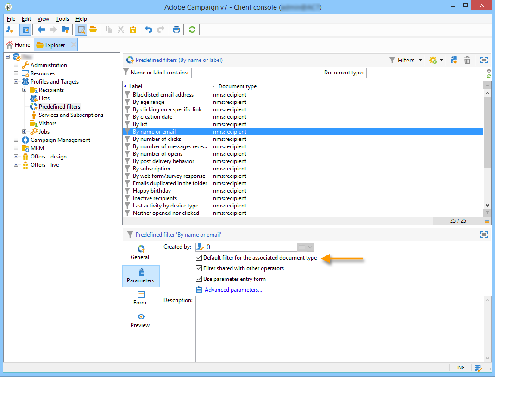

# 建立篩選{#creating-filters}

## 簡介 {#introduction}

當您在Adobe Campaign樹狀結構中導覽(從首頁的 **[!UICONTROL Explorer]** 功能表)時，資料庫中包含的資料會顯示在清單中。 這些清單可設定為只顯示運算子所需的資料。 然後可對篩選的資料啟動動作。 篩選設定可讓您從清單中選取資料 **[!UICONTROL dynamically]**。 如果修改了資料，則更新過濾的資料。

>[!NOTE]
>
>顯示配置在工作站級別本地定義。 它會儲存在隱藏的檔案中，有時可能需要清除此資料，尤其是在重新整理資料時發生問題時。 若要這麼做，請使用功 **[!UICONTROL File > Clear the local cache]** 能表。

## 可用篩選器的類型 {#typology-of-available-filters}

Adobe Campaign可讓您將篩選套用至資料清單。

這些篩選器可使用一次，或儲存以供日後使用。 您可以同時套用數個篩選。

Adobe Campaign提供下列篩選類型：

* 預設篩選

   您 **可透過清單上方的欄位** ，存取預設篩選。 它可讓您篩選預先定義的欄位（對於收件者描述檔，預設為姓名和電子郵件地址）。 您可以使用欄位輸入要篩選的字元，或從下拉式清單中選取篩選條件。

   
<!--
  >[!NOTE]
  >
  >The **%** character replaces any character string. For example, the string `%@yahoo.com` lets you display all the profiles with an e-mail address in the domain "yahoo.com".
-->
您可以變更清單的預設篩選。 如需詳細資訊，請參閱「變更 [預設篩選」](#altering-the-default-filter)。

* 簡單篩選

   **簡單篩選** ，是欄上的一次性篩選。 它們是在顯示的欄上使用一個或多個簡單的搜尋准則來定義。

   您可以在相同的資料清單上結合數個簡單篩選，以調整您的搜尋。 篩選欄位會顯示在另一個欄位下方。 可以相互獨立刪除。

   

   「建立簡單篩選」中 [詳述了簡單篩選](#creating-a-simple-filter)。

* 進階篩選

   **進階篩選** ，是使用資料的查詢或查詢組合來建立。

   如需建立進階篩選的詳細資訊，請參閱 [建立進階篩選](#creating-an-advanced-filter)。

   您可以使用函式來定義篩選器的內容。 有關詳細資訊，請參 [閱使用函式建立高級過濾器](#creating-an-advanced-filter-with-functions)。

   >[!NOTE]
   >
   >如需有關在Adobe Campaign中建立查詢的詳細資訊，請參 [閱本節](../../platform/using/about-queries-in-campaign.md)。

* 使用者篩選

   應用 **程式篩選** ，是已儲存的進階篩選，可與其他運算子使用及共用其設定。

   位於 **[!UICONTROL Filters]** 清單上方的按鈕提供一組應用程式篩選，可加以組合以調整篩選。 建立這些篩選的方法會顯示在「儲存 [篩選」中](#saving-a-filter)。

## 變更預設篩選 {#altering-the-default-filter}

要更改收件者清單的預設篩選器，請按一下 **[!UICONTROL Profiles and Targets > Pre-defined filters]** 樹的節點。

對於所有其他類型的資料，請透過節點設定預設篩 **[!UICONTROL Administration > Configuration > Predefined filters]** 選。

應用以下步驟：

1. 選取您要預設使用的篩選。
1. 按一下標 **[!UICONTROL Parameters]** 簽並選取 **[!UICONTROL Default filter for the associated document type]**。

   

   >[!CAUTION]
   >
   >如果預設篩選已套用至清單，您必須先停用該篩選，再套用新篩選。 若要這麼做，請按一下篩選欄位右側的紅十字。

1. 按一 **[!UICONTROL Save]** 下以套用篩選。

   >[!NOTE]
   >
   >「建立高級過濾器」和「保 [存過濾器」中對過濾器定義](#creating-an-advanced-filter)[窗口進行了詳細說明](#saving-a-filter)。

## 建立簡單篩選 {#creating-a-simple-filter}

若要建立簡 **單篩選**，請套用下列步驟：

1. 在您要篩選的欄位上按一下滑鼠右鍵，然後選取 **[!UICONTROL Filter on this field]**。

   

   預設篩選欄位會顯示在清單上方。

1. 從下拉式清單中選取篩選選項，或輸入要套用的篩選條件(選取或輸入准則的方法取決於欄位類型：文字、列舉等)。

   

1. 要激活過濾器，請按鍵盤上的Enter鍵，或按一下過濾器欄位右側的綠色箭頭。

如果要篩選資料的欄位未以描述檔的形式顯示，您可將其新增至顯示的欄，然後篩選該欄。 為此，

1. 按一下 **[!UICONTROL Configure the list]** 圖示。

   

1. 選擇要顯示的列，例如收件者的年齡。

   

1. 在收件者清單中 **按一下** 「年齡」欄，然後選取 **[!UICONTROL Filter on this column]**。

   

   然後，您可以選取年齡篩選選項。

   

## 建立進階篩選 {#creating-an-advanced-filter}

若要建立進 **階篩選**，請套用下列步驟：

1. Click the **[!UICONTROL Filters]** button and select **[!UICONTROL Advanced filter...]**.

   

   您也可以以滑鼠右鍵按一下資料清單，以篩選並選取 **[!UICONTROL Advanced filter...]**。

   將顯示過濾條件定義窗口。

1. 按一下 **[!UICONTROL Expression]** 欄以定義輸入值。
1. 按一 **[!UICONTROL Edit expression]** 下以選取要套用篩選的欄位。

   

1. 從清單中，選取要篩選資料的欄位。 Click **[!UICONTROL Finish]** to confirm.
1. 按一下 **[!UICONTROL Operator]** 欄，然後從下拉式清單中選取要套用的運算子。
1. 從欄中選取預期 **[!UICONTROL Value]** 值。 您可以結合數個篩選器來調整查詢。 若要新增篩選條件，請按一下 **[!UICONTROL Add]**。

   

1. 您可以為運算式指派階層，或使用工具列箭頭變更查詢運算式的順序。
1. 運算式之間的預設運算子 **是And**，但您可以按一下欄位來變更此運算子。 您可以選取 **Or運算** 子。

   

1. 按一 **[!UICONTROL OK]** 下以確認篩選器建立並套用至清單。

所套用的篩選會顯示在清單上方。

若要編輯或修改此篩選，請按一下其標籤。

若要取消此篩選，請按一 **[!UICONTROL Remove this filter]** 下篩選右側的圖示。

您可以儲存進階篩選，以保留它以供日後使用。 如需此類型篩選器的詳細資訊，請參閱 [儲存篩選器](#saving-a-filter)。

### 使用函式建立進階篩選 {#creating-an-advanced-filter-with-functions}

進階篩選器可使用函式；具有 **函式的篩選器是透過運算式編輯器建立** ，可讓您使用資料庫資料和進階函式來建立公式。 若要使用函式建立篩選，請重複進階篩選建立步驟1、2和3，然後依下列步驟進行：

1. 在欄位選擇視窗中，按一下 **[!UICONTROL Advanced selection]**。
1. 選擇要使用的公式類型：匯整、現有使用者篩選或運算式。

   

   可以使用以下選項：

   * **[!UICONTROL Field only]** 的雙曲餘切值。 這是預設模式。
   * **[!UICONTROL Aggregate]** 以選擇要使用的匯總公式（計數、總計、平均、最大、最小）。
   * **[!UICONTROL User filter]** 來選擇現有用戶篩選器之一。 「儲存篩選器」中會詳 [細說明使用者篩選](#saving-a-filter)。
   * **[!UICONTROL Expression]** 來訪問表達式編輯器。

      運算式編輯器可讓您定義進階篩選。 類似於：

      

      它可讓您選擇資料庫表格中的欄位，並附加進階函式至這些欄位：選擇要在中使用的函式 **[!UICONTROL List of functions]**。 可用的函式在函式列 [表中詳細說明](../../platform/using/defining-filter-conditions.md#list-of-functions)。 接著，選取函式所關注的欄位或欄位，然後按一 **[!UICONTROL OK]** 下以核准運算式。

      >[!NOTE]
      >
      >如需根據運算式建立篩選器的範例，請參閱「識 [別其生日的收件者」](../../workflow/using/sending-a-birthday-email.md#identifying-recipients-whose-birthday-it-is)。

## 儲存篩選 {#saving-a-filter}

篩選器是每個運算元專屬的，每當運算元清除其用戶端主控台的快取時，都會重新初始化篩選器。

您可以儲存進階 **篩選** ，以建立應用程式篩選：您可以在任何清單中按滑鼠右鍵，或透過清單上方的按 **[!UICONTROL Filters]** 鈕重新使用。

您也可以在目標選擇階段中，透過傳送精靈直接存取這些篩選器(如需建立傳送的詳 [細資訊](../../delivery/using/creating-an-email-delivery.md) ，請參閱本節)。 若要建立應用程式篩選，您可以：

* 將進階篩選轉換為應用程式篩選。 若要這麼做，請在關閉進 **[!UICONTROL Save]** 階篩選編輯器前按一下。

   

* 透過樹狀結構的(或收件 **[!UICONTROL Administration > Configuration > Predefined filters]** 者的 **[!UICONTROL Profiles and targets > Predefined filters]** )節點建立此應用程式篩選。 若要這麼做，請以滑鼠右鍵按一下篩選清單，然後選取 **[!UICONTROL New...]**。 此程式與建立進階篩選器的程式相同。

   欄位 **[!UICONTROL Label]** 可讓您命名此篩選器。 此名稱將出現在按鈕的組合框 **[!UICONTROL Filters...]** 中。

   

您可以透過滑鼠右鍵按一下並選取，或透過清單上方的圖示， **[!UICONTROL No filter]** 刪除目前清 **[!UICONTROL Filters]** 單上的所有篩選器。

您可以按一下按鈕並使用功 **[!UICONTROL Filters]** 能表來結合篩選 **[!UICONTROL And...]** 器。

## 篩選收件者 {#filtering-recipients}

預先定義的篩選器(請 [參閱儲存篩選器](#saving-a-filter))可讓您篩選資料庫中包含的收件者描述檔。 可以從樹的節點 **[!UICONTROL Profiles and Targets > Predefined filters]** 編輯篩選器。 篩選器會透過按鈕列在工作區的上 **[!UICONTROL Filters]** 方。

選取篩選以顯示其定義並存取篩選資料的預覽。

>[!NOTE]
>
>有關預定義篩選器建立的詳細示例，請參閱使 [用案例](../../platform/using/use-case.md)。

預先定義的篩選條件包括：

<table> 
 <tbody> 
  <tr> 
   <td> <strong>標籤</strong>  </td> 
   <td> <strong>查詢</strong>  </td> 
  </tr> 
  <tr> 
   <td> 已開啟  </td> 
   <td> 選擇已開啟交貨的收件人。  </td> 
  </tr> 
  <tr> 
   <td> 已開啟但未點按  </td> 
   <td> 選擇已開啟傳送但尚未點按連結的收件者。  </td> 
  </tr> 
  <tr> 
   <td> 非作用中收件者  </td> 
   <td> 選擇在X個月內未開啟傳送的收件者。  </td> 
  </tr> 
  <tr> 
   <td> 上次活動（依裝置類型）  </td> 
   <td> 選擇在最近Z天內使用裝置X點選或開啟傳送Y的收件者。  </td> 
  </tr> 
  <tr> 
   <td> 依裝置類型列出的上次活動（追蹤）  </td> 
   <td> 選擇在最近Z天內使用裝置X點選或開啟傳送Y的收件者。  </td> 
  </tr> 
  <tr> 
   <td> 未定位的收件者  </td> 
   <td> 在X個月內選擇從未透過渠道Y定位的收件者。  </td> 
  </tr> 
  <tr> 
   <td> 非常活躍的收件者  </td> 
   <td> 選取在過去Y個月中點按傳送至少X次的收件者。  </td> 
  </tr> 
  <tr> 
   <td> 黑名單電子郵件地址  </td> 
   <td> 選擇電子郵件地址已列入黑名單的收件人。  </td> 
  </tr> 
  <tr> 
   <td> 隔離的電子郵件地址  </td> 
   <td> 選擇電子郵件地址被隔離的收件人。  </td> 
  </tr> 
  <tr> 
   <td> 資料夾中複製的電子郵件地址  </td> 
   <td> 選擇在資料夾中複製其電子郵件地址的收件人。  </td> 
  </tr> 
  <tr> 
   <td> 未開啟或點按  </td> 
   <td> 選擇尚未開啟傳送或點選傳送的收件者。  </td> 
  </tr> 
  <tr> 
   <td> 新收件者（天）  </td> 
   <td> 選擇在最近X天內建立的收件人。  </td> 
  </tr> 
  <tr> 
   <td> 新收件者（分鐘）  </td> 
   <td> 選擇在最後X分鐘內建立的收件人。  </td> 
  </tr> 
  <tr> 
   <td> 新收件者（月）  </td> 
   <td> 選擇在最近X個月中建立的收件人。  </td> 
  </tr> 
  <tr> 
   <td> 依訂閱  </td> 
   <td> 依訂閱選擇收件者。  </td> 
  </tr> 
  <tr> 
   <td> 按一下特定連結  </td> 
   <td> 選擇在傳送中點選特定URL的收件者。  </td> 
  </tr> 
  <tr> 
   <td> 依貼文傳送行為  </td> 
   <td> 在收到傳送後，根據收件者的行為選擇收件者。  </td> 
  </tr> 
  <tr> 
   <td> 依建立日期  </td> 
   <td> 依建立日期，在X個月（目前日期減n個月）到Y個月（目前日期減n個月）的期間內，選取收件者。  </td> 
  </tr> 
  <tr> 
   <td> 按清單  </td> 
   <td> 依清單選取收件者。  </td> 
  </tr> 
  <tr> 
   <td> 依點按次數  </td> 
   <td> 選擇在過去X個月中點選傳送的收件者。  </td> 
  </tr> 
  <tr> 
   <td> 按收到的消息數  </td> 
   <td> 根據收件者收到的訊息數量，選擇收件者。  </td> 
  </tr> 
  <tr> 
   <td> 依開啟次數  </td> 
   <td> 選擇在X和Y傳送之間按Z時間開啟的收件者。  </td> 
  </tr> 
  <tr> 
   <td> 依姓名或電子郵件  </td> 
   <td> 根據收件人的姓名或電子郵件選擇收件人。  </td> 
  </tr> 
  <tr> 
   <td> 依年齡範圍  </td> 
   <td> 根據收件者的年齡選擇收件者。  </td> 
  </tr> 
 </tbody> 
</table>

>[!NOTE]
>
>所有與計數和期間有關的比較都將從更廣義的角度來理解（比較中包括與查詢限制相對應的接收者）。

資料的計算範例：

* 選擇30歲以下的收件者：

   

* 選擇18歲或以上的收件者：

   

* 選擇年齡在18到30歲之間的收件人：

   

## 資料篩選器的進階設定 {#advanced-settings-for-data-filters}

按一下 **[!UICONTROL Settings]** 標籤以存取下列選項：

* **[!UICONTROL Default filter for the associated document type]**:此選項可讓您在排序相關清單的編輯器中預設建議此篩選器。

   例如，篩選 **[!UICONTROL By name or login]** 器會套用至運算子。 此選項已選取，因此篩選器一律會提供在所有運算子清單上。

* **[!UICONTROL Filter shared with other operators]**:此選項可讓您將篩選器提供給目前資料庫上所有其他運算子使用。
* **[!UICONTROL Use parameter entry form]**:此選項可讓您定義選取此篩選時，要顯示在清單上方的篩選欄位。 這些欄位可讓您定義篩選設定。 此表單必須透過按鈕以XML格式 **[!UICONTROL Form]** 輸入。 例如，預先設定的篩 **[!UICONTROL Recipients who have opened]**&#x200B;選器（可從收件者清單取得）會顯示篩選欄位，讓您選取篩選器的目標傳送。

   按 **[!UICONTROL Preview]** 鈕會顯示選取篩選的結果。

* 連結 **[!UICONTROL Advanced parameters]** 可讓您定義其他設定。 尤其是，您可以將SQL表與篩選器關聯，使共用表的所有編輯器都能使用該篩選器。

   如果您 **[!UICONTROL Do not restrict the filter]** 想要停止使用者覆寫此篩選，請選取選項。

   此選項會針對無法超載的傳送精靈所提供的「傳送的收件者」和「屬於資料夾的傳送的收件者」篩選條件啟用。

   

