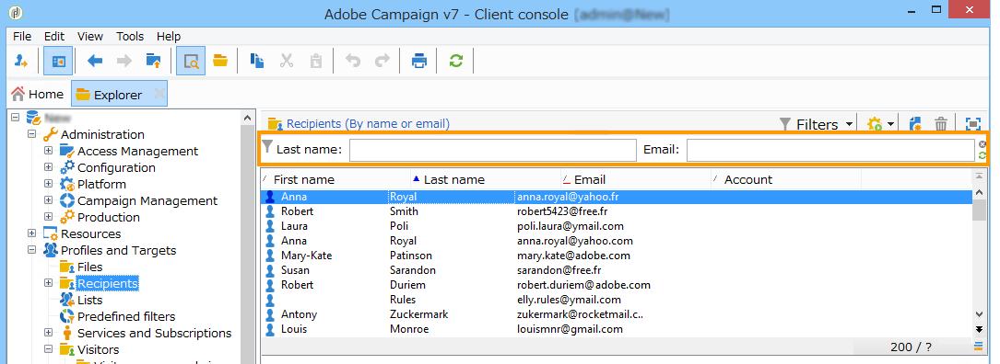
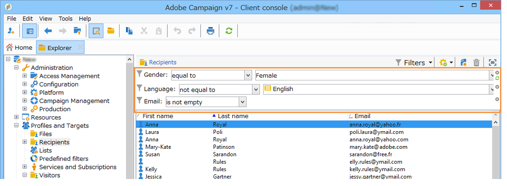
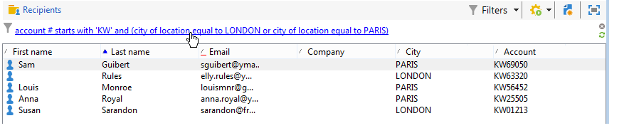

# 建立篩選器{#creating-filters}

在Adobe Campaign樹中導航時（從首頁的&#x200B;**[!UICONTROL Explorer]**&#x200B;菜單），資料庫中包含的資料將顯示在清單中。 這些清單可設定為只顯示運算子所需的資料。 接著，即可對篩選的資料啟動動作。 篩選器設定可讓您從清單&#x200B;**[!UICONTROL dynamically]**&#x200B;中選取資料。 如果修改了資料，則更新篩選的資料。

>[!NOTE]
>
>用戶介面配置設定是在本地設備級別定義的。 有時可能需要清除此資料，尤其是在重新整理資料時出現問題時。 要執行此操作，請使用&#x200B;**[!UICONTROL File > Clear the local cache]**&#x200B;功能表。

## 可用篩選器的類型{#typology-of-available-filters}

Adobe Campaign可讓您將篩選器套用至資料清單。

這些篩選器可以使用一次，或者您可以儲存以供日後使用。 您可以同時套用數個篩選器。

下列篩選類型適用於Adobe Campaign:

* **預設篩選**

   可透過清單上方的欄位存取&#x200B;**預設篩選器**。 它可讓您篩選預先定義的欄位（對於收件者設定檔，預設為名稱和電子郵件地址）。 您可以使用欄位輸入要篩選的字元，或從下拉式清單中選取篩選條件。

   
<!--
  >[!NOTE]
  >
  >The **%** character replaces any character string. For example, the string `%@yahoo.com` lets you display all the profiles with an e-mail address in the domain "yahoo.com".
-->
您可以變更清單的預設篩選。 有關詳細資訊，請參閱[更改預設篩選器](#altering-the-default-filter)。

* **簡單篩選**

   **簡單** 篩選器在欄上共用一次性篩選器。它們是以顯示欄上的一或多個簡單搜尋准則所定義。

   您可以將多個簡單篩選器合併至相同的資料清單，以縮小搜尋範圍。 篩選欄位會顯示在另一個下方。 可以相互獨立刪除。

   

   在[建立簡單篩選器](#creating-a-simple-filter)中詳細說明了簡單篩選器。

* **進階篩選**

   **使用** 查詢或資料查詢的組合來建立進階篩選器。

   如需建立進階篩選器的詳細資訊，請參閱[建立進階篩選器](#creating-an-advanced-filter)。

   您可以使用函式來定義篩選器的內容。 如需詳細資訊，請參閱[使用函式建立進階篩選器](#creating-an-advanced-filter-with-functions)。

   >[!NOTE]
   >
   >如需在Adobe Campaign中建立查詢的詳細資訊，請參閱[此區段](../../platform/using/about-queries-in-campaign.md)。

* **使用者篩選器**

   **應用程式篩選器**&#x200B;是已保存的高級篩選器，用於使用其配置並與其他運算子共用。

   清單上方的&#x200B;**[!UICONTROL Filters]**&#x200B;按鈕提供了一組應用程式篩選器，可以結合這些篩選器來調整篩選。 建立這些篩選器的方法顯示在[儲存篩選器](#saving-a-filter)中。

## 更改預設篩選器{#altering-the-default-filter}

要更改收件人清單的預設篩選器，請按一下樹的&#x200B;**[!UICONTROL Profiles and Targets > Pre-defined filters]**&#x200B;節點。

對於所有其他類型的資料，請透過&#x200B;**[!UICONTROL Administration > Configuration > Predefined filters]**&#x200B;節點設定預設篩選器。

應用以下步驟：

1. 選取您預設要使用的篩選器。
1. 按一下&#x200B;**[!UICONTROL Parameters]**&#x200B;標籤，然後選擇&#x200B;**[!UICONTROL Default filter for the associated document type]**。

   

   >[!CAUTION]
   >
   >如果預設篩選器已套用至清單，您必須在套用新篩選器前先停用該篩選器。 要執行此操作，請按一下篩選欄位右側的紅十字。

1. 按一下&#x200B;**[!UICONTROL Save]**&#x200B;以套用篩選器。

   >[!NOTE]
   >
   >在[建立進階篩選器](#creating-an-advanced-filter)和[儲存篩選器](#saving-a-filter)中詳細說明篩選器定義窗口。

## 建立簡單篩選器{#creating-a-simple-filter}

若要建立&#x200B;**簡單篩選器**，請套用下列步驟：

1. 按一下右鍵要篩選的欄位，然後選擇&#x200B;**[!UICONTROL Filter on this field]**。

   

   預設篩選欄位會顯示在清單上方。

1. 從下拉式清單中選取篩選選項，或輸入要套用的篩選條件(選取或輸入條件的方法取決於欄位類型：文字、列舉等)。

   

1. 要激活篩選器，請按鍵盤上的Enter，或按一下篩選欄位右側的綠色箭頭。

如果您要篩選資料的欄位未以設定檔的形式顯示，您可以將其新增至顯示的欄中，然後篩選該欄。 要做到，

1. 按一下&#x200B;**[!UICONTROL Configure the list]**&#x200B;圖示。

   

1. 選取要顯示的欄，例如收件者的年齡。

   

1. 按一下右鍵收件者清單中的&#x200B;**Age**&#x200B;列，然後選擇&#x200B;**[!UICONTROL Filter on this column]**。

   

   然後，您可以選取年齡篩選選項。

   

## 建立進階篩選器{#creating-an-advanced-filter}

若要建立&#x200B;**進階篩選器**，請套用下列步驟：

1. 按一下&#x200B;**[!UICONTROL Filters]**&#x200B;按鈕並選擇&#x200B;**[!UICONTROL Advanced filter...]**。

   

   也可以按一下右鍵要篩選的資料清單，然後選擇&#x200B;**[!UICONTROL Advanced filter...]**。

   將顯示篩選條件定義窗口。

1. 按一下&#x200B;**[!UICONTROL Expression]**&#x200B;欄以定義輸入值。
1. 按一下&#x200B;**[!UICONTROL Edit expression]**&#x200B;以選取要套用篩選器的欄位。

   

1. 從清單中，選取要篩選資料的欄位。 按一下&#x200B;**[!UICONTROL Finish]**&#x200B;以確認。
1. 按一下&#x200B;**[!UICONTROL Operator]**&#x200B;欄，然後從下拉式清單中選取要套用的運算子。
1. 從&#x200B;**[!UICONTROL Value]**&#x200B;欄中選取預期值。 您可以結合數個篩選器來調整查詢。 若要新增篩選條件，請按一下&#x200B;**[!UICONTROL Add]**。

   

1. 您可以為運算式指派階層，或使用工具列箭頭來變更查詢運算式的順序。
1. 運算式之間的預設運算子為&#x200B;**And**，但您可以按一下欄位來變更。 您可以選取&#x200B;**Or**&#x200B;運算子。

   

1. 按一下&#x200B;**[!UICONTROL OK]**&#x200B;以確認篩選器建立並將其套用至清單。

套用的篩選器會顯示在清單上方。

若要編輯或修改此篩選器，請按一下其標籤。

若要取消此篩選器，請按一下篩選器右側的&#x200B;**[!UICONTROL Remove this filter]**&#x200B;圖示。

您可以儲存進階篩選器以保留供日後使用。 有關此類型篩選器的詳細資訊，請參閱[保存篩選器](#saving-a-filter)。

### 使用函式{#creating-an-advanced-filter-with-functions}建立進階篩選器

進階篩選器可使用函式；**具有函式**&#x200B;的篩選器是透過運算式編輯器建立的，該編輯器可讓您使用資料庫資料和進階函式建立公式。 若要建立具有函式的篩選器，請重複進階篩選器建立步驟1、2和3，然後繼續如下：

1. 在欄位選擇窗口中，按一下&#x200B;**[!UICONTROL Advanced selection]**。
1. 選擇要使用的公式類型：匯總、現有用戶篩選器或表達式。

   

   可以使用以下選項：

   * **[!UICONTROL Field only]** 來選擇欄位。這是預設模式。
   * **[!UICONTROL Aggregate]** 選擇要使用的匯總公式（計數、總和、平均、最大、最小）。
   * **[!UICONTROL User filter]** ，以選擇現有用戶篩選器之一。在[儲存篩選器](#saving-a-filter)中會詳細說明使用者篩選器。
   * **[!UICONTROL Expression]** 存取運算式編輯器。

      運算式編輯器可讓您定義進階篩選器。 類似於：

      

      它可讓您選取資料庫表格中的欄位，並附加進階函式至這些欄位：選取要在&#x200B;**[!UICONTROL List of functions]**&#x200B;中使用的函式。 可用函式在[函式清單](../../platform/using/defining-filter-conditions.md#list-of-functions)中有詳細說明。 接下來，選擇函式相關的欄位或欄位，然後按一下&#x200B;**[!UICONTROL OK]**&#x200B;以批准運算式。

      >[!NOTE]
      >
      >如需根據運算式建立篩選器的範例，請參閱[此區段](../../workflow/using/sending-a-birthday-email.md#identifying-recipients-whose-birthday-it-is)。

## 儲存篩選器{#saving-a-filter}

篩選器是每個運算子專屬的，且每次運算子清除其用戶端主控台的快取時，都會重新初始化篩選器。

您可以儲存進階篩選器，以建立&#x200B;**應用程式篩選器**:您可以在任何清單中按一下滑鼠右鍵，或透過清單上方的&#x200B;**[!UICONTROL Filters]**&#x200B;按鈕重新使用。

這些篩選器也可以在目標選擇階段中，透過傳送精靈直接存取（如需建立傳送的詳細資訊，請參閱[此區段](../../delivery/using/creating-an-email-delivery.md)）。 若要建立應用程式篩選器，您可以：

* 將進階篩選器轉換為應用程式篩選器。 要執行此操作，請在關閉進階篩選器編輯器之前，按一下&#x200B;**[!UICONTROL Save]**。

   

* 透過樹狀結構的&#x200B;**[!UICONTROL Administration > Configuration > Predefined filters]**（或&#x200B;**[!UICONTROL Profiles and targets > Predefined filters]**，收件者）節點建立此應用程式篩選器。 要執行此操作，請按一下右鍵篩選器清單，然後選擇&#x200B;**[!UICONTROL New...]**。 此程式與建立進階篩選器的程式相同。

   **[!UICONTROL Label]**&#x200B;欄位可讓您為此篩選器命名。 此名稱將顯示在&#x200B;**[!UICONTROL Filters...]**&#x200B;按鈕的組合框中。

   

您可以按一下右鍵並選擇&#x200B;**[!UICONTROL No filter]**&#x200B;或通過清單上方的&#x200B;**[!UICONTROL Filters]**&#x200B;表徵圖刪除當前清單上的所有篩選器。

您可以按一下&#x200B;**[!UICONTROL Filters]**&#x200B;按鈕並使用&#x200B;**[!UICONTROL And...]**&#x200B;功能表來結合篩選器。

## 篩選收件者{#filtering-recipients}

預先定義的篩選器（請參閱[儲存篩選器](#saving-a-filter)）可讓您篩選資料庫中包含之收件者的設定檔。 您可以從樹的&#x200B;**[!UICONTROL Profiles and Targets > Predefined filters]**&#x200B;節點編輯篩選器。 篩選器會透過&#x200B;**[!UICONTROL Filters]**&#x200B;按鈕列在工作區的上方區段。

選取一個篩選器以顯示其定義並存取篩選資料的預覽。

>[!NOTE]
>
>如需預先定義篩選器建立的詳細範例，請參閱[使用案例](../../platform/using/use-case.md)。

預先定義的篩選包括：

<table> 
 <tbody> 
  <tr> 
   <td> <strong>標籤</strong>  </td> 
   <td> <strong>查詢</strong>  </td> 
  </tr> 
  <tr> 
   <td> 已開啟  </td> 
   <td> 選擇已開啟傳遞的收件人。  </td> 
  </tr> 
  <tr> 
   <td> 已開啟但未點按  </td> 
   <td> 選擇已開啟傳遞但未點按連結的收件者。  </td> 
  </tr> 
  <tr> 
   <td> 非活動收件者  </td> 
   <td> 選擇在X個月內未開啟傳遞的收件者。  </td> 
  </tr> 
  <tr> 
   <td> 按設備類型列出的上次活動  </td> 
   <td> 選擇在最近Z天內使用設備X按一下或開啟傳遞的收件人。  </td> 
  </tr> 
  <tr> 
   <td> 上次活動（依裝置類型）  </td> 
   <td> 選擇在最近Z天內使用設備X按一下或開啟傳遞的收件人。  </td> 
  </tr> 
  <tr> 
   <td> 非目標收件者  </td> 
   <td> 選擇在X個月中從未通過通道Y定位的收件人。  </td> 
  </tr> 
  <tr> 
   <td> 非常有效的收件人  </td> 
   <td> 選擇在過去Y個月中按一下傳遞至少X次的收件者。  </td> 
  </tr> 
  <tr> 
 <td> 已拒絕列出的電子郵件地址  </td> 
    <td> 選擇其電子郵件地址位於封鎖清單上的收件人。  </td>
  </tr> 
  <tr> 
   <td> 隔離的電子郵件地址  </td> 
   <td> 選擇被隔離的電子郵件地址的收件人。  </td> 
  </tr> 
  <tr> 
   <td> 資料夾 中重複的電子郵件地址 </td> 
   <td> 選擇資料夾中複製其電子郵件地址的收件人。  </td> 
  </tr> 
  <tr> 
   <td> 未開啟或未點擊  </td> 
   <td> 選擇未開啟傳遞或按一下傳遞的收件者。  </td> 
  </tr> 
  <tr> 
   <td> 新收件者（天）  </td> 
   <td> 選擇在最近X天內建立的收件人。  </td> 
  </tr> 
  <tr> 
   <td> 新收件者（分鐘）  </td> 
   <td> 選擇在最後X分鐘內建立的收件人。  </td> 
  </tr> 
  <tr> 
   <td> 新收件者（月）  </td> 
   <td> 選擇在最近X個月中建立的收件人。  </td> 
  </tr> 
  <tr> 
   <td> 通過訂閱  </td> 
   <td> 按訂閱選擇收件人。  </td> 
  </tr> 
  <tr> 
   <td> 按一下特定連結  </td> 
   <td> 選擇在傳送中按一下特定URL的收件者。  </td> 
  </tr> 
  <tr> 
   <td> 按郵件傳送行為  </td> 
   <td> 接收傳遞後，根據收件者的行為選擇收件者。  </td> 
  </tr> 
  <tr> 
   <td> 建立日期  </td> 
   <td> 按建立日期，在從X個月（當前日期減去n個月）到Y個月（當前日期減去n個月）的期間內選擇收件人。  </td> 
  </tr> 
  <tr> 
   <td> 按清單  </td> 
   <td> 按清單選擇收件人。  </td> 
  </tr> 
  <tr> 
   <td> 按點擊次數  </td> 
   <td> 選擇在最近X個月內按一下傳送的收件者。  </td> 
  </tr> 
  <tr> 
   <td> 按接收的消息數  </td> 
   <td> 根據接收的郵件數選擇收件人。  </td> 
  </tr> 
  <tr> 
   <td> 按開啟次數  </td> 
   <td> 選擇在X和Y之間按Z時間開啟的收件人。  </td> 
  </tr> 
  <tr> 
   <td> 按名稱或電子郵件  </td> 
   <td> 根據收件人的姓名或電子郵件選擇收件人。  </td> 
  </tr> 
  <tr> 
   <td> 依年齡範圍  </td> 
   <td> 根據其年齡選擇收件人。  </td> 
  </tr> 
 </tbody> 
</table>

>[!NOTE]
>
>與計數和期間相關的所有比較都將從更廣的意義理解（與查詢限制對應的收件者將包含在比較中）。

計算資料的範例：

* 選擇30歲以下的收件人：

   

* 選擇18歲或以上的收件人：

   

* 選擇年齡介於18至30歲之間的收件者：

   

## 資料篩選器{#advanced-settings-for-data-filters}的進階設定

按一下&#x200B;**[!UICONTROL Settings]**&#x200B;標籤以存取下列選項：

* **[!UICONTROL Default filter for the associated document type]**:此選項可讓您依預設在排序相關清單的編輯器中建議此篩選器。

   例如， **[!UICONTROL By name or login]**&#x200B;篩選器會套用至運算子。 已選取此選項，因此篩選器一律會提供於所有運算子清單中。

* **[!UICONTROL Filter shared with other operators]**:此選項可讓篩選器可供目前資料庫上的所有其他運算子使用。
* **[!UICONTROL Use parameter entry form]**:此選項可讓您定義選取此篩選時，要在清單上方顯示的篩選欄位。這些欄位可讓您定義篩選設定。 必須通過&#x200B;**[!UICONTROL Form]**&#x200B;按鈕以XML格式輸入此表單。 例如，預配置的過濾器&#x200B;**[!UICONTROL Recipients who have opened]**（從收件者清單中提供）顯示一個過濾器欄位，該欄位允許您選擇過濾器瞄準的傳送。

   **[!UICONTROL Preview]**&#x200B;按鈕顯示所選篩選器的結果。

* **[!UICONTROL Advanced parameters]**&#x200B;連結可讓您定義其他設定。 尤其是，您可以將SQL表與篩選器關聯，以使共用該表的所有編輯器通用該表。

   如果要阻止用戶覆蓋此篩選器，請選擇&#x200B;**[!UICONTROL Do not restrict the filter]**&#x200B;選項。

   在無法多載的傳遞精靈中，針對提供的「傳遞的收件者」和「屬於資料夾的傳遞的收件者」篩選條件，啟用此選項。

   
