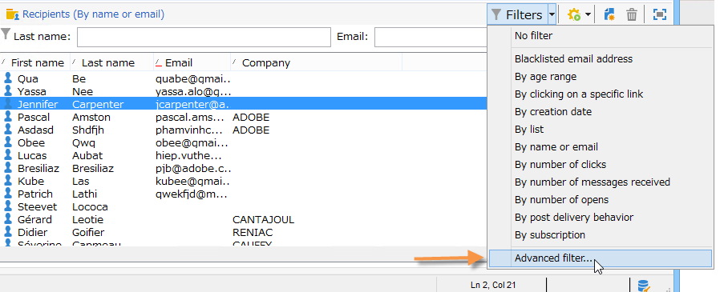

# 建立篩選器{#creating-filters}

在Adobe Campaign樹中導航（從首頁的&#x200B;**[!UICONTROL Explorer]**&#x200B;菜單）時，資料庫中包含的資料將顯示在清單中。 這些清單可設定為只顯示運算子所需的資料。 然後可對篩選的資料啟動動作。 篩選設定可讓您從清單&#x200B;**[!UICONTROL dynamically]**&#x200B;中選取資料。 如果修改了資料，則更新過濾的資料。

>[!NOTE]
>
>用戶介面配置設定在設備級別本地定義。 有時可能需要清除此資料，尤其是在刷新資料時出現問題時。 若要這麼做，請使用&#x200B;**[!UICONTROL File > Clear the local cache]**&#x200B;功能表。

## 可用篩選器的類型學{#typology-of-available-filters}

Adobe Campaign可讓您套用篩選至資料清單。

這些篩選器可使用一次，或儲存以供日後使用。 您可以同時套用數個篩選。

下列篩選類型適用於Adobe Campaign:

* **預設篩選**

   **預設篩選器**&#x200B;可透過清單上方的欄位存取。 它可讓您篩選預先定義的欄位（對於收件者描述檔，預設為姓名和電子郵件地址）。 您可以使用欄位輸入要篩選的字元，或從下拉式清單中選取篩選條件。

   
<!--
  >[!NOTE]
  >
  >The **%** character replaces any character string. For example, the string `%@yahoo.com` lets you display all the profiles with an e-mail address in the domain "yahoo.com".
-->
您可以變更清單的預設篩選。 有關詳細資訊，請參閱[更改預設篩選器](#altering-the-default-filter)。

* **簡單篩選**

   **簡單** 篩選器會在欄上共用一次性篩選器。它們是在顯示的欄上使用一個或多個簡單的搜尋准則來定義。

   您可以在相同的資料清單上結合數個簡單篩選，以調整您的搜尋。 篩選欄位會顯示在另一個欄位下方。 可以相互獨立刪除。

   

   [建立簡單篩選器](#creating-a-simple-filter)中詳細說明了簡單篩選器。

* **進階篩選**

   **進階** 篩選器是使用資料的查詢或查詢組合來建立。

   如需建立進階篩選的詳細資訊，請參閱[建立進階篩選](#creating-an-advanced-filter)。

   您可以使用函式來定義篩選器的內容。 有關詳細資訊，請參閱[建立帶有函式的高級過濾器。](#creating-an-advanced-filter-with-functions)

   >[!NOTE]
   >
   >有關在Adobe Campaign構建查詢的詳細資訊，請參閱[本節](../../platform/using/about-queries-in-campaign.md)。

* **使用者篩選**

   **應用程式篩選器**&#x200B;是已儲存的進階篩選器，可與其他運算子使用及共用其組態。

   位於清單上方的&#x200B;**[!UICONTROL Filters]**&#x200B;按鈕提供一組應用程式篩選器，可加以組合以調整篩選。 建立這些篩選器的方法顯示在「儲存篩選器」中。

## 變更預設篩選器{#altering-the-default-filter}

要更改收件者清單的預設篩選器，請按一下樹的&#x200B;**[!UICONTROL Profiles and Targets > Pre-defined filters]**&#x200B;節點。

對於所有其他類型的資料，請通過&#x200B;**[!UICONTROL Administration > Configuration > Predefined filters]**&#x200B;節點配置預設篩選器。

應用以下步驟：

1. 選取您要預設使用的篩選。
1. 按一下&#x200B;**[!UICONTROL Parameters]**&#x200B;頁籤並選擇&#x200B;**[!UICONTROL Default filter for the associated document type]**。

   

   >[!CAUTION]
   >
   >如果預設篩選已套用至清單，您必須先停用該篩選，再套用新篩選。 若要這麼做，請按一下篩選欄位右側的紅十字。

1. 按一下&#x200B;**[!UICONTROL Save]**&#x200B;以套用篩選。

   >[!NOTE]
   >
   >[建立高級過濾器](#creating-an-advanced-filter)和[保存過濾器](#saving-a-filter)中詳細介紹了過濾器定義窗口。

## 建立簡單篩選{#creating-a-simple-filter}

要建立&#x200B;**簡單過濾器**，請應用以下步驟：

1. 按一下右鍵要篩選的欄位，然後選擇&#x200B;**[!UICONTROL Filter on this field]**。

   

   預設篩選欄位會顯示在清單上方。

1. 從下拉式清單中選取篩選選項，或輸入要套用的篩選條件(選取或輸入准則的方法取決於欄位類型：文字、列舉等)。

   

1. 要激活過濾器，請按鍵盤上的Enter鍵，或按一下過濾器欄位右側的綠色箭頭。

如果要篩選資料的欄位未以描述檔的形式顯示，您可將其新增至顯示的欄，然後篩選該欄。 為此，

1. 按一下&#x200B;**[!UICONTROL Configure the list]**&#x200B;表徵圖。

   

1. 選擇要顯示的列，例如收件者的年齡。

   

1. 按一下右鍵收件人清單中的&#x200B;**Age**&#x200B;列，然後選擇&#x200B;**[!UICONTROL Filter on this column]**。

   

   然後，您可以選取年齡篩選選項。

   

## 建立進階篩選{#creating-an-advanced-filter}

若要建立&#x200B;**進階篩選**，請套用下列步驟：

1. 按一下&#x200B;**[!UICONTROL Filters]**&#x200B;按鈕並選擇&#x200B;**[!UICONTROL Advanced filter...]**。

   

   您也可以在要篩選的資料清單上按一下滑鼠右鍵，然後選取&#x200B;**[!UICONTROL Advanced filter...]**。

   將顯示過濾條件定義窗口。

1. 按一下&#x200B;**[!UICONTROL Expression]**&#x200B;列以定義輸入值。
1. 按一下&#x200B;**[!UICONTROL Edit expression]**&#x200B;以選取要套用篩選的欄位。

   

1. 從清單中，選取要篩選資料的欄位。 按一下&#x200B;**[!UICONTROL Finish]**&#x200B;進行確認。
1. 按一下&#x200B;**[!UICONTROL Operator]**&#x200B;欄，然後從下拉式清單中選取要套用的運算子。
1. 從&#x200B;**[!UICONTROL Value]**&#x200B;欄中選取預期值。 您可以結合數個篩選器來調整查詢。 若要新增篩選條件，請按一下&#x200B;**[!UICONTROL Add]**。

   

1. 您可以為運算式指派階層，或使用工具列箭頭變更查詢運算式的順序。
1. 運算式之間的預設運算子是&#x200B;**And**，但您可以按一下欄位來變更此運算子。 您可以選擇&#x200B;**Or**&#x200B;運算子。

   

1. 按一下&#x200B;**[!UICONTROL OK]**&#x200B;以確認建立篩選器並將其套用至清單。

所套用的篩選會顯示在清單上方。

若要編輯或修改此篩選，請按一下其標籤。

若要取消此篩選器，請按一下篩選器右側的&#x200B;**[!UICONTROL Remove this filter]**&#x200B;圖示。

您可以儲存進階篩選，以保留它以供日後使用。 有關此類型過濾器的詳細資訊，請參閱[保存過濾器](#saving-a-filter)。

### 使用函式{#creating-an-advanced-filter-with-functions}建立進階篩選

進階篩選器可使用函式；具有函式&#x200B;**的**&#x200B;篩選器是通過表達式編輯器建立的，該表達式編輯器允許您使用資料庫資料和高級函式建立公式。 若要使用函式建立篩選，請重複進階篩選建立步驟1、2和3，然後依下列步驟進行：

1. 在欄位選擇窗口中，按一下&#x200B;**[!UICONTROL Advanced selection]**。
1. 選擇要使用的公式類型：匯整、現有使用者篩選或運算式。

   

   可以使用以下選項：

   * **[!UICONTROL Field only]** 的雙曲餘切值。這是預設模式。
   * **[!UICONTROL Aggregate]** 以選擇要使用的匯總公式（計數、總計、平均、最大、最小）。
   * **[!UICONTROL User filter]** 來選擇現有用戶篩選器之一。[儲存篩選器](#saving-a-filter)中詳細說明使用者篩選器。
   * **[!UICONTROL Expression]** 來訪問表達式編輯器。

      運算式編輯器可讓您定義進階篩選。 類似於：

      

      它可讓您選擇資料庫表格中的欄位，並附加進階函式至這些欄位：在&#x200B;**[!UICONTROL List of functions]**&#x200B;中選擇要使用的函式。 可用函式在[函式清單](../../platform/using/defining-filter-conditions.md#list-of-functions)中有詳細說明。 接著，選擇函式相關的欄位，然後按一下&#x200B;**[!UICONTROL OK]**&#x200B;批准表達式。

      >[!NOTE]
      >
      >有關基於表達式建立篩選器的示例，請參閱[此部分](../../workflow/using/sending-a-birthday-email.md#identifying-recipients-whose-birthday-it-is)。

## 儲存篩選器{#saving-a-filter}

篩選器是每個運算元專屬的，每當運算元清除其用戶端主控台的快取時，都會重新初始化篩選器。

您可以儲存進階篩選，以建立&#x200B;**應用程式篩選**:您可以在任何清單中按滑鼠右鍵或透過清單上方的&#x200B;**[!UICONTROL Filters]**&#x200B;按鈕重新使用。

您也可以透過傳送精靈直接在目標選擇階段存取這些篩選器（請參閱[本節](../../delivery/using/creating-an-email-delivery.md)，以取得建立傳送的詳細資訊）。 若要建立應用程式篩選，您可以：

* 將進階篩選轉換為應用程式篩選。 若要這麼做，請在關閉進階篩選編輯器前按一下&#x200B;**[!UICONTROL Save]**。

   

* 通過樹的&#x200B;**[!UICONTROL Administration > Configuration > Predefined filters]**（或&#x200B;**[!UICONTROL Profiles and targets > Predefined filters]**&#x200B;收件者）節點建立此應用程式篩選器。 若要這麼做，請以滑鼠右鍵按一下篩選清單，然後選取&#x200B;**[!UICONTROL New...]**。 此程式與建立進階篩選器的程式相同。

   **[!UICONTROL Label]**&#x200B;欄位可讓您命名此篩選器。 此名稱將出現在&#x200B;**[!UICONTROL Filters...]**&#x200B;按鈕的組合框中。

   

您可以通過按一下右鍵並選擇&#x200B;**[!UICONTROL No filter]**&#x200B;或通過清單上方的&#x200B;**[!UICONTROL Filters]**&#x200B;表徵圖刪除當前清單上的所有篩選器。

您可以按一下&#x200B;**[!UICONTROL Filters]**&#x200B;按鈕並使用&#x200B;**[!UICONTROL And...]**&#x200B;功能表來結合篩選。

## 篩選收件者{#filtering-recipients}

預先定義的篩選器（請參閱[儲存篩選器](#saving-a-filter)）可讓您篩選資料庫中包含的收件者描述檔。 可以從樹的&#x200B;**[!UICONTROL Profiles and Targets > Predefined filters]**&#x200B;節點編輯篩選器。 這些篩選器會透過&#x200B;**[!UICONTROL Filters]**&#x200B;按鈕列在工作區的上方區段。

選取篩選以顯示其定義並存取篩選資料的預覽。

>[!NOTE]
>
>有關預定義過濾器建立的詳細示例，請參閱[使用案例](../../platform/using/use-case.md)。

預先定義的篩選條件包括：

<table> 
 <tbody> 
  <tr> 
   <td> <strong>標籤</strong>  </td> 
   <td> <strong>查詢</strong>  </td> 
  </tr> 
  <tr> 
   <td> 已開啟  </td> 
   <td> 選擇已開啟交貨的收件人。  </td> 
  </tr> 
  <tr> 
   <td> 已開啟但未按一下  </td> 
   <td> 選擇已開啟傳送但尚未點按連結的收件者。  </td> 
  </tr> 
  <tr> 
   <td> 非活動收件人  </td> 
   <td> 選擇未在X個月內開啟交貨的收件者。  </td> 
  </tr> 
  <tr> 
   <td> 按設備類型列出的上次活動  </td> 
   <td> 選擇在最近Z天內使用設備X按一下或開啟傳送Y的收件人。  </td> 
  </tr> 
  <tr> 
   <td> 依裝置類型列出的上次活動（追蹤）  </td> 
   <td> 選擇在最近Z天內使用設備X按一下或開啟傳送Y的收件人。  </td> 
  </tr> 
  <tr> 
   <td> 未定位的收件者  </td> 
   <td> 在X個月內選擇從未透過渠道Y定位的收件者。  </td> 
  </tr> 
  <tr> 
   <td> 非常有效的收件者  </td> 
   <td> 選擇在過去Y個月中點按傳送至少X次的收件者。  </td> 
  </tr> 
  <tr> 
 <td> 拒絕列出的電子郵件地址  </td> 
    <td> 選擇電子郵件地址位於登錄清單中的收件人。  </td>
  </tr> 
  <tr> 
   <td> 隔離的電子郵件地址  </td> 
   <td> 選擇電子郵件地址被隔離的收件人。  </td> 
  </tr> 
  <tr> 
   <td> 資料夾中複製的電子郵件地址  </td> 
   <td> 選擇在資料夾中複製其電子郵件地址的收件人。  </td> 
  </tr> 
  <tr> 
   <td> 未開啟或未按一下  </td> 
   <td> 選擇尚未開啟傳送或點選傳送的收件者。  </td> 
  </tr> 
  <tr> 
   <td> 新收件者（天）  </td> 
   <td> 選擇在最近X天建立的收件人。  </td> 
  </tr> 
  <tr> 
   <td> 新收件者（分鐘）  </td> 
   <td> 選擇在最後X分鐘內建立的收件人。  </td> 
  </tr> 
  <tr> 
   <td> 新收件者（月）  </td> 
   <td> 選擇在最近X個月中建立的收件人。  </td> 
  </tr> 
  <tr> 
   <td> 按訂閱  </td> 
   <td> 按訂閱選擇收件人。  </td> 
  </tr> 
  <tr> 
   <td> 按一下特定連結  </td> 
   <td> 選擇在傳送中點按特定URL的收件者。  </td> 
  </tr> 
  <tr> 
   <td> 依貼文傳送行為  </td> 
   <td> 在接收交貨後根據收件人的行為選擇收件人。  </td> 
  </tr> 
  <tr> 
   <td> 按建立日期  </td> 
   <td> 依建立日期，在X個月（目前日期減去n個月）到Y個月（目前日期減去n個月）的期間內選取收件者。  </td> 
  </tr> 
  <tr> 
   <td> 按清單  </td> 
   <td> 按清單選擇收件人。  </td> 
  </tr> 
  <tr> 
   <td> 按點按次數  </td> 
   <td> 選擇在最近X個月內點按傳送的收件者。  </td> 
  </tr> 
  <tr> 
   <td> 按收到的消息數  </td> 
   <td> 根據收件者收到的消息數選擇收件者。  </td> 
  </tr> 
  <tr> 
   <td> 按開啟次數  </td> 
   <td> 選擇在X和Y傳送之間按Z時間開啟的收件者。  </td> 
  </tr> 
  <tr> 
   <td> 按姓名或電子郵件  </td> 
   <td> 根據收件人的姓名或電子郵件選擇收件人。  </td> 
  </tr> 
  <tr> 
   <td> 依年齡範圍  </td> 
   <td> 根據收件者的年齡選擇收件者。  </td> 
  </tr> 
 </tbody> 
</table>

>[!NOTE]
>
>所有與計數和期間有關的比較都將從更廣義的角度來理解（比較中包括與查詢限制相對應的接收者）。

資料的計算範例：

* 選擇30歲以下的收件者：

   

* 選擇18歲或以上的收件者：

   

* 選擇年齡在18到30歲之間的收件人：

   

## 資料篩選器的進階設定{#advanced-settings-for-data-filters}

按一下&#x200B;**[!UICONTROL Settings]**&#x200B;頁籤以訪問以下選項：

* **[!UICONTROL Default filter for the associated document type]**:此選項可讓您在排序相關清單的編輯器中預設建議此篩選器。

   例如，**[!UICONTROL By name or login]**&#x200B;篩選器會套用至運算子。 此選項已選取，因此篩選器一律會提供在所有運算子清單上。

* **[!UICONTROL Filter shared with other operators]**:此選項可讓您將篩選器提供給目前資料庫上所有其他運算子使用。
* **[!UICONTROL Use parameter entry form]**:此選項可讓您定義選取此篩選時，要顯示在清單上方的篩選欄位。這些欄位可讓您定義篩選設定。 必須通過&#x200B;**[!UICONTROL Form]**&#x200B;按鈕以XML格式輸入此表單。 例如，預先設定的篩選器&#x200B;**[!UICONTROL Recipients who have opened]**（可從收件者清單取得）會顯示篩選欄位，讓您選取篩選器的目標傳送。

   **[!UICONTROL Preview]**&#x200B;按鈕會顯示所選篩選器的結果。

* **[!UICONTROL Advanced parameters]**&#x200B;連結可讓您定義其他設定。 尤其是，您可以將SQL表與篩選器關聯，使共用表的所有編輯器都能使用該篩選器。

   如果要停止用戶覆蓋此篩選器，請選擇&#x200B;**[!UICONTROL Do not restrict the filter]**&#x200B;選項。

   此選項會針對無法超載的傳送精靈所提供的「傳送的收件者」和「屬於資料夾的傳送的收件者」篩選條件啟用。

   

