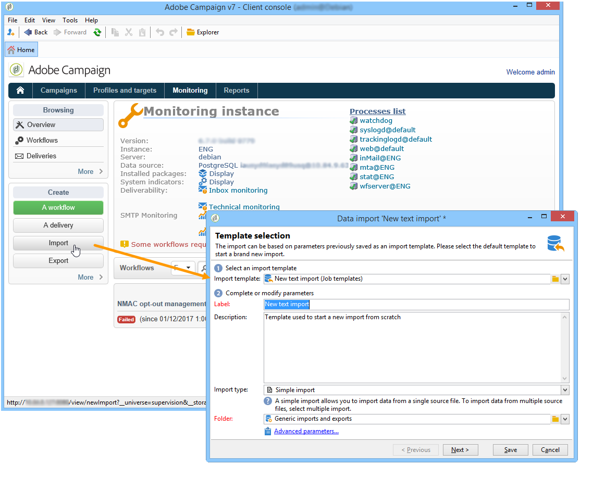

# 建立匯入和匯出作業 {#creating-import-export-jobs}

設定範本後，即可在Adobe Campaign的多個內容中啟動匯入和匯出作業。

* 在Adobe Campaign工作區的&#x200B;**[!UICONTROL Profiles and targets]**&#x200B;區段中，按一下&#x200B;**[!UICONTROL Jobs]**&#x200B;連結：這會將您導向至現有的匯入和匯出清單。

  按一下「**[!UICONTROL Create]**」按鈕，然後選取您要執行的工作型別。

  

* 您也可以從工作區的&#x200B;**[!UICONTROL Monitoring]**&#x200B;區段啟動匯入和匯出：兩個專用連結可讓您直接啟動匯入或匯出。

  

* 最後，可以從Adobe Campaign Explorer啟動匯入和匯出。

  

所有這些開啟的資料匯入或匯出精靈。 其會於下列章節中詳細說明：

* [設定匯入工作](../../platform/using/executing-import-jobs.md)
* [設定匯出作業](../../platform/using/executing-export-jobs.md)
