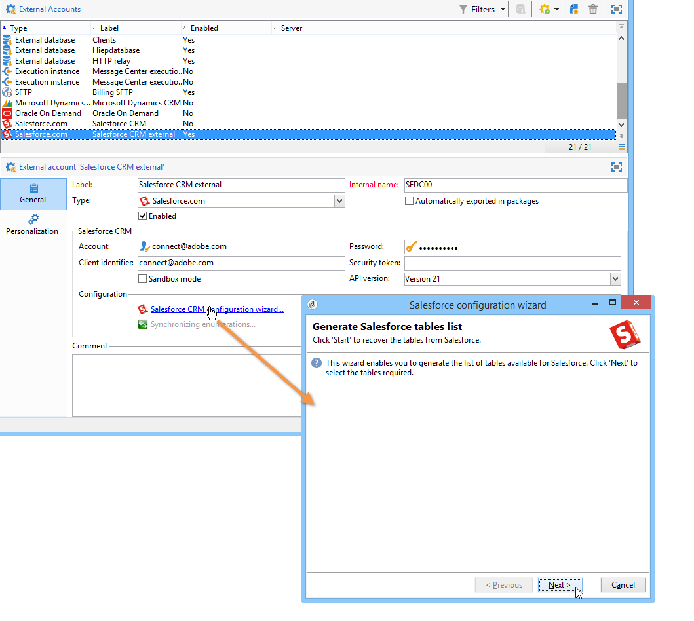

# CRM連接器{#crm-connectors}

## 關於CRM連接器 {#about-crm-connectors}

Adobe Campaign 提供各種 CRM 連接器，用於將您的 Adobe Campaign 平台連結至您的第三方系統。透過這些 CRM 連接器，您可同步處理連絡人、帳戶、購買等。有了這些 CRM 連接器，您可以將您的應用程式與各協力廠商和商務應用程式輕鬆整合。

透過這些連接器，可快速且輕鬆地整合資料：Adobe Campaign 提供專用的精靈，用於從 CRM 中提供的表格進行收集和選取。並且可確保雙向同步處理，讓整個系統中的資料隨時保持最新。

>[!NOTE]
>
>這項功能可透過 **CRM連接器專用套件在Adobe Campaign** 中取用。

連接到CRM是通過專用的工作流活動進行的。 本節中介紹的章節將詳述這些 [活動](../../workflow/using/crm-connector.md)。

### 相容的CRM系統與限制 {#compatible-crm-systems-and-limitations}

下列CRM可整合至Adobe Campaign。

Compatibility matrix中詳細說明了支 [持的版本](https://helpx.adobe.com/campaign/kb/compatibility-matrix.html)。

* **Salesforce.com**

   請參 [閱本節](#example-for-salesforce-com) ，瞭解如何設定與Salesforce.com的連線。

   >[!CAUTION]
   >
   >將Adobe Campaign與Salesforce.com連接時，限制如下：
   >
   >    
   >    
   >    * 支援測試生產執行個體。
   >    * 支援指派規則。
   >    * Adobe Campaign不支援多個選擇列舉。

* **Oracle On Demand**

   請參 [閱本節](#example-for-oracle-on-demand) ，瞭解如何設定與Oracle On Demand的連接。

   >[!CAUTION]
   >
   >將Adobe Campaign與Oracle On Demand連接時，限制如下：
   >
   >    
   >    
   >    * Adobe Campaign可以同步標準Oracle On Demand範本中的任何可用物件。 如果您已在Oracle On Demand中新增個人化表格，Adobe Campaign將無法復原這些表格。
   >    * API v1.0可讓您在查詢期間排序或篩選資料，但不允許您同時執行兩者。
   >    * Oracle On Demand發送的日期不包含時區資訊。
   >    * Adobe Campaign不支援多個選擇列舉。

* **MS Dynamics CRM** 和 **MS Dynamics Online**

   請參 [閱本節](#example-for-microsoft-dynamics) ，瞭解如何設定與Microsoft Dynamics的連線。

   在此影片中瞭解Adobe Campaign和Microsoft Dynamics整合使 [用案例](https://helpx.adobe.com/campaign/kt/acc/using/acc-integrate-dynamics365-with-acc-feature-video-set-up.html)。

   >[!CAUTION]
   >
   >將Adobe Campaign與Microsoft Dynamics連接時，限制如下：
   >
   >    
   >    
   >    * 安裝外掛程式可以變更CRM的行為，這可能導致與Adobe Campaign的相容性問題。
   >    * Adobe Campaign不支援多個選擇列舉。

## 設定連接 {#setting-up-the-connection}

若要在Adobe Campaign中使用CRM連接器，請套用下列步驟：

1. 建立外部帳戶
1. 收集CRM表格
1. 同步枚舉
1. 建立同步工作流

>[!NOTE]
>
>CRM連接器僅能與安全URL(https)搭配運作。

### Salesforce.com範例 {#example-for-salesforce-com}

若要使用 **Adobe Campaign設定Salesforce.com連接器** ，請遵循下列步驟：

1. 透過Adobe Campaign樹狀結構的節 **[!UICONTROL Administration > Platform > External accounts]** 點建立新的外部帳戶。
1. 運行配置嚮導以生成可用的CRM表。

   

   配置嚮導允許您收集表並建立匹配的架構。

   按一下 **[!UICONTROL Start]** 以運行執行。

   

   >[!NOTE]
   >
   >若要核准設定，您必須登出並返回Adobe Campaign主控台。

1. 在節點中檢查Adobe Campaign中產生的結 **[!UICONTROL Administration > Configuration > Data schemas]** 構。

   

1. 架構建立後，您就可以透過CRM自動同步枚舉至Adobe Campaign。

   若要這麼做，請按一下連 **[!UICONTROL Synchronizing enumerations...]** 結並選取符合CRM列舉的Adobe Campaign列舉。

   您可以將Adobe Campaign枚舉的所有值取代為CRM的值： 若要這麼做，請在 **[!UICONTROL Yes]** 欄中選 **[!UICONTROL Replace]** 取。

   

   按一 **[!UICONTROL Next]** 下，然 **[!UICONTROL Start]** 後開始匯入清單。

1. 檢查菜單中導入的 **[!UICONTROL Administration > Platform > Enumerations]** 值。

   

1. 若要匯入Salesforce資料或將Adobe Campaign資料匯出至Salesforce，您必須建立工作流程並使用活 **[!UICONTROL CRM connector]** 動。

   

### Oracle On Demand的示例 {#example-for-oracle-on-demand}

要配置 **Oracle On Demand** Connector以使其與Adobe Campaign一起使用，請應用以下步驟：

1. 透過Adobe Campaign樹狀結構的節 **[!UICONTROL Administration > Platform > External accounts]** 點建立新的外部帳戶。

   

1. 開啟配置嚮導： Adobe Campaign會自動顯示Oracle資料模型的表格。 選擇要收集的表。

   

1. 按一下 **[!UICONTROL Next]** 以開始建立匹配的方案。

   相符的資料結構可在Adobe Campaign中使用。

   

1. 開始同步Adobe Campaign和Oracle On Demand之間的枚舉。

   

1. 若要將Oracle On Demand資料匯入Adobe Campaign，請建立下列類型的工作流程：

   

   此工作流程會透過Oracle On Demand匯入連絡人、將連絡人與現有的Adobe Campaign資料同步化、刪除重複的連絡人，以及更新Adobe Campaign資料庫。

   活動 **[!UICONTROL CRM Connector]** 需要進行配置，如下所示：

   

1. 若要將Adobe Campaign資料匯出至Oracle On Demand，請建立下列工作流程：

   

   此工作流使用查詢收集相關資料，然後將其導出到Oracle On Demand聯繫人表中。

### Microsoft Dynamics的範例 {#example-for-microsoft-dynamics}

若要設定Microsoft Dynamics連接器以搭配Adobe Campaign運作，請套用下列步驟：

1. 透過Adobe Campaign樹狀結構的節 **[!UICONTROL Administration > Platform > External accounts]** 點建立新的外部帳戶。

   

1. 選擇部 **署類型**: **[!UICONTROL On-premise]**、 **[!UICONTROL Office 365]** 或 **[!UICONTROL Web API]**，視您要設定的連接器而定。

   Adobe Campaign Classic支援Dynamics 365 REST介面與OAuth通訊協定，以進行驗證。

   如果您選取部 **[!UICONTROL WebAPI]** 署，則需要在Azure目錄上註冊應用程式，並從Azure目錄 **取得clientId** 。 本頁記錄了此 [註冊](https://msdn.microsoft.com/en-us/library/mt622431.aspx)。

   >[!NOTE]
   >
   >Adobe Campaign Classic不需要redirectURL參數。

   clientId **值與username** /password一起使用，以使用授權類型密碼擷取承載Token。 這稱為「資 **源所有者密碼憑據授予」**。 有關詳細資訊，請參見[此頁面](https://blogs.msdn.microsoft.com/wushuai/2016/09/25/resource-owner-password-credentials-grant-in-azure-ad-oauth/)。

   

   有關CRM版本相容性的詳細資訊，請參閱「相容性 [清單」](https://helpx.adobe.com/campaign/kb/compatibility-matrix.html)。

1. 開啟配置嚮導。 Adobe Campaign會自動從Microsoft Dynamics資料範本中偵測表格。

   

1. 選擇要恢復的表。

   

1. 按一下 **[!UICONTROL Next]** 並開始建立相應的架構。

   

   >[!NOTE]
   >
   >若要核准設定，您必須中斷連線／重新連線至Adobe Campaign主控台。

   相符的資料結構可在Adobe Campaign中使用。

   

1. 開始同步Adobe Campaign和Microsoft Dynamics之間的枚舉。

   

1. 若要將Microsoft Dynamics資料匯入Adobe Campaign，請建立下列類型的工作流程：

   

   此工作流程會透過Microsoft Dynamics匯入連絡人、將連絡人與現有的Adobe Campaign資料同步化、刪除重複的連絡人，以及更新Adobe Campaign資料庫。

   活動 **[!UICONTROL CRM Connector]** 需要配置為：

   

## 資料同步 {#data-synchronization}

Adobe Campaign和CRM之間的同步化是透過專屬的工作流程活動進行： [CRM連接器](../../workflow/using/crm-connector.md)。

此活動可讓您：

* 從CRM匯入(請參閱從 [CRM匯入](#importing-from-the-crm)),
* 匯出至CRM(請參 [閱匯出至CRM](#exporting-to-the-crm)),
* 匯入在CRM中刪除的物件(請參 [閱匯入在CRM中刪除的物件](#importing-objects-deleted-in-the-crm)),
* 刪除CRM中的物件(請參 [閱刪除CRM中的物件](#deleting-objects-in-the-crm))。

選擇與要配置同步的CRM匹配的外部帳戶，然後選擇要同步的對象（帳戶、業務機會、銷售機會、聯繫人等）。

此活動的配置取決於要執行的進程。 以下詳細說明了各種配置。

### 從CRM匯入 {#importing-from-the-crm}

若要在Adobe Campaign中透過CRM匯入資料，您必須建立下列類型的工作流程：

對於匯入活動， **CRM Connector** 活動設定步驟為：

1. 選擇操 **[!UICONTROL Import from the CRM]** 作。
1. 轉至下拉 **[!UICONTROL Remote object]** 式清單，並選取程式所關注的物件。 此物件與連接器設定期間在Adobe Campaign中建立的其中一個表格一致。
1. 轉到該 **[!UICONTROL Remote fields]** 部分並輸入要導入的欄位。

   若要新增欄位，請按一下工 **[!UICONTROL Add]** 具列中的按鈕，然後按一下圖 **[!UICONTROL Edit expression]** 示。

   

   如有必要，請透過欄的下拉式清單變更資料格 **[!UICONTROL Conversion]** 式。 可能的轉換類型會以資料格式 [詳細說明](#data-format)。

   >[!CAUTION]
   >
   >CRM中記錄的識別碼是CRM和Adobe Campaign中連結物件的必備項。 當核准方塊時，會自動新增。
   >
   >對於增量資料匯入，CRM端的最後修改日期也是強制性的。

1. 您也可以根據需求篩選要匯入的資料。 若要這麼做，請按一下 **[!UICONTROL Edit the filter...]** 連結。

   在下列範例中，Adobe Campaign只會匯入自2012年11月1日起已記錄某些活動的連絡人。

   

   >[!CAUTION]
   >
   >與資料篩選模式連結的限制在篩選資料中 [有詳細說明](#filtering-data)。

1. 選 **[!UICONTROL Use automatic index...]** 項可讓您根據日期及其上次修改，自動管理CRM和Adobe Campaign之間的增量物件同步。

   For more on this, refer to [Variable management](#variable-management).

#### 變數管理 {#variable-management}

啟用選 **[!UICONTROL Automatic index]** 項可讓您僅收集自上次匯入後修改的物件。

預設情況下，上次同步的日期儲存在配置窗口中指定的選項中： **LASTIMPORT_&lt;%=instance.internalName%>_&lt;%=activityName%>**。

>[!NOTE]
>
>此注釋僅適用於一般活 **[!UICONTROL CRM Connector]** 動。 對於其他CRM活動，此程式是自動的。
>
>此選項必須手動建立並填入至 **[!UICONTROL Administration]** > **[!UICONTROL Platform]** >下 **[!UICONTROL Options]**。 它必須是文字選項，其值必須符合下列格式： **yyyy/MM/dd hh:mm:ss**。
> 
>您必須手動更新此選項，才能進一步匯入。

您可以指定要納入的遠端CRM欄位，以識別最近的變更。

依預設，會使用下列欄位（依指定順序）:

* 針對Microsoft Dynamics: **已修改**,
* 對於Oracle On Demand: **LastUpdated**、 **ModifiedDate**、 **LastLoggedIn**、
* 若是Salesforce.com: **LastModifiedDate**、 **SystemModstamp**。

啟用選 **[!UICONTROL Automatic index]** 項會產生三個變數，這些變數可透過類型活動用於同步 **[!UICONTROL JavaScript code]** 工作流程。 這些活動包括：

* **vars.crmOptionName**: 代表包含上次匯入日期的選項名稱。
* **vars.crmStartImport**: 表示上次資料恢復的開始日期（包括）。
* **vars.crmEndDate**: 代表上次資料復原的結束日期（已排除）。

   >[!NOTE]
   >
   >這些日期以下列格式顯示： **yyyy/MM/dd hh:mm:ss**。

#### 篩選資料 {#filtering-data}

為了確保使用各種CRM進行高效操作，需要使用以下規則建立篩選器：

* 每個篩選層級只能使用一種運算子類型。
* 不支援AND NOT運算子。
* 比較可能只涉及空值(&#39;is empty&#39;/&#39;is not empty&#39; type)或數字。 這表示會評估值（右側欄），此評估的結果必須是數字。 因此不支援JOIN類型比較。
* 右側欄中包含的值會以JavaScript進行評估。
* 不支援JOIN比較。
* 左欄中的運算式必須是欄位。 它不能是多個表達式、數字等的組合。

例如，下列篩選條件對CRM匯入無效，因為OR運算子與AND運算子位於相同層級：

* OR運算子與AND運算子位於相同的層級
* 對文本字串進行比較。

#### 訂購依據 {#order-by}

在Microsoft Dynamics和Salesforce.com中，您可以依遞增或遞減順序對要匯入的遠端欄位排序。

若要這麼做，請按一 **[!UICONTROL Order by]** 下連結並新增欄至清單。

清單中欄的順序是排序順序：

#### 記錄識別 {#record-identification}

您不需匯入CRM中包含（可能篩選）的元素，而是可以使用工作流程中預先計算的人口族群。

若要這麼做，請選取選 **[!UICONTROL Use the population calculated upstream]** 項並指定包含遠端識別碼的欄位。

然後選擇要導入的入站人口的欄位，如下所示：

### 匯出至CRM {#exporting-to-the-crm}

將Adobe Campaign資料匯出至CRM可讓您將整個內容複製到CRM資料庫。

若要將資料匯出至CRM，您需要建立下列類型的工作流程：

若是匯出，請套用下列設定至 **CRM Connector活動** :

1. 選擇操 **[!UICONTROL Export to CRM]** 作。
1. 轉至下拉 **[!UICONTROL Remote object]** 式清單，並選取程式所關注的物件。 此物件與連接器設定期間在Adobe Campaign中建立的其中一個表格一致。

   >[!CAUTION]
   >
   >「 **CRM連接器」活動的匯出功能** ，可插入或更新CRM端的欄位。 若要啟用CRM中的欄位更新，您必須指定遠端表格的主要索引鍵。 如果索引鍵遺失，則會插入資料（而非更新）。

1. 在該 **[!UICONTROL Mapping]** 節中，指定要導出的欄位及其在CRM中的映射。

   

   若要新增欄位，請按一下工 **[!UICONTROL Add]** 具列中的按鈕，然後按一下圖 **[!UICONTROL Edit expression]** 示。

   >[!NOTE]
   >
   >對於指定欄位，如果CRM端未定義相符項目，則無法更新值： 會直接插入CRM。

   如有必要，請透過欄的下拉式清單變更資料格 **[!UICONTROL Conversion]** 式。 可能的轉換類型會以資料格式 [詳細說明](#data-format)。

   >[!NOTE]
   >
   >要導出的記錄清單和導出結果將保存在臨時檔案中，該臨時檔案在工作流完成或重新啟動之前仍可訪問。 這可讓您在發生錯誤時重新啟動程式，而不會執行多次匯出相同記錄或遺失資料的風險。

### 其他配置 {#additional-configurations}

#### 資料格式 {#data-format}

將資料格式匯入CRM或從CRM匯入時，您可以即時轉換資料格式。

若要這麼做，請選取要套用至相符欄的轉換。

此模 **[!UICONTROL Default]** 式會套用自動資料轉換，在大多數情況下會等於資料的複製／貼上。 不過，會套用時區管理。

其他可能的轉換包括：

* **[!UICONTROL Date only]**: 此模式會刪除「日期+時間」類型欄位。
* **[!UICONTROL Without time offset]**: 此模式取消在預設模式下應用的時區管理。
* **[!UICONTROL Copy/Paste]**: 此模式使用原始資料，例如字串（無轉換）。

#### 錯誤處理 {#error-processing}

在資料匯入或匯出的架構中，您可以套用特定程式至錯誤和拒絕。 若要這麼做，請選取標 **[!UICONTROL Process rejects]** 簽中 **[!UICONTROL Process errors]** 的和 **[!UICONTROL Behavior]** 選項。

這些選項會放置相符的輸出轉場。

然後，放置與您要套用的程式相關的活動。

若要處理例項的錯誤，您可以新增等待方塊和排程重試。

拒絕會收集到其錯誤代碼和相關消息，這表示您可以設定拒絕跟蹤以優化同步過程。

>[!NOTE]
>
>即使未啟 **[!UICONTROL Process rejects]** 用此選項，也會針對每個已拒絕的欄產生警告，並顯示錯誤碼和訊息。

輸 **[!UICONTROL Reject]** 出轉換可讓您存取包含與錯誤訊息和程式碼相關的特定欄的輸出架構。 這些欄包括：

* 對於Oracle On Demand: **errorLogFilename** （Oracle端的日誌檔案名）、 **errorCode** （錯誤代碼）、 **errorSymbol** （錯誤符號，與錯誤代碼不同）、 **errorMessage** （錯誤上下文的說明）。
* 若是Salesforce.com: **errorSymbol** (error symbol **, different of the error code),** errorMessage(description of the error context)。

### 導入在CRM中刪除的對象 {#importing-objects-deleted-in-the-crm}

若要啟用廣泛的資料同步程式設定，您可以將CRM中刪除的物件匯入Adobe Campaign。

若要這麼做，請套用下列步驟：

1. 選擇操 **[!UICONTROL Import objects deleted in the CRM]** 作。
1. 轉至下拉 **[!UICONTROL Remote object]** 式清單，並選取程式所關注的物件。 此物件與連接器設定期間在Adobe Campaign中建立的其中一個表格一致。
1. 在和欄位中指定要考量的刪 **[!UICONTROL Start date]** 除期 **[!UICONTROL End date]** 間。 這些日期將包含在期間內。

   

   >[!CAUTION]
   >
   >元素刪除期間必須與CRM的特定限制相符。 例如，對於Salesforce.com,30天前刪除的元素無法復原。

### 刪除CRM中的對象 {#deleting-objects-in-the-crm}

若要刪除CRM端的物件，您必須指定要刪除之遠端元素的主要索引鍵。

此標 **[!UICONTROL Behavior]** 簽可讓您啟用拒絕的處理。 此選項會為活動產生第二個輸出轉 **[!UICONTROL CRM connector]** 換。 For more on this, refer to [Error processing](#error-processing).

>[!NOTE]
>
>即使停用選 **[!UICONTROL Process rejects]** 項，也會針對每個拒絕的欄產生警告。

