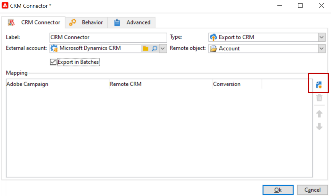

# 同步促銷活動與CRM {#data-synchronization}之間的資料

Adobe Campaign與CRM之間的資料同步是通過專用的工作流活動進行的：[CRM連接器](../../workflow/using/crm-connector.md)。

例如，若要將Microsoft Dynamics資料匯入Adobe Campaign，請建立下列工作流程類型：

此工作流程會透過Microsoft Dynamics匯入連絡人、將連絡人與現有的Adobe Campaign資料同步、刪除重複的連絡人，以及更新Adobe Campaign資料庫。

**[!UICONTROL CRM Connector]**&#x200B;活動必須配置為同步資料。

使用此活動，您可以：

* 從CRM匯入- [瞭解詳細內容](#importing-from-the-crm)
* 匯出至CRM - [瞭解詳細內容](#exporting-to-the-crm)
* 匯入在CRM中刪除的物件- [瞭解詳細內容](#importing-objects-deleted-in-the-crm)
* 刪除CRM中的對象- [瞭解詳情](#deleting-objects-in-the-crm)

選擇與要配置同步的CRM匹配的外部帳戶，然後選擇要同步的對象：客戶、機會、潛在客戶、聯繫人等。

此活動的配置取決於要執行的進程。 以下詳細說明了各種配置。

## 從CRM {#importing-from-the-crm}匯入

若要透過Adobe Campaign的CRM匯入資料，您必須建立下列類型的工作流程：

對於導入活動，**[!UICONTROL CRM Connector]**&#x200B;活動配置步驟為：

1. 選擇&#x200B;**[!UICONTROL Import from the CRM]**&#x200B;操作。
1. 轉至&#x200B;**[!UICONTROL Remote object]**&#x200B;下拉式清單，並選取程式所關注的物件。 此對象與在連接器配置期間在Adobe Campaign建立的一個表一致。
1. 轉到&#x200B;**[!UICONTROL Remote fields]**&#x200B;部分，然後輸入要導入的欄位。

   若要新增欄位，請按一下工具列中的&#x200B;**[!UICONTROL Add]**&#x200B;按鈕，然後按一下&#x200B;**[!UICONTROL Edit expression]**&#x200B;圖示。

   

   如有必要，請透過&#x200B;**[!UICONTROL Conversion]**&#x200B;欄的下拉式清單變更資料格式。 可能的轉換類型在[資料格式](#data-format)中詳細說明。

   >[!IMPORTANT]
   >
   >CRM中記錄的識別碼是CRM和Adobe Campaign中連結物件的必備項。 當核准方塊時，會自動新增。
   >
   >對於增量資料匯入，CRM端的最後修改日期也是強制性的。

1. 您也可以根據需求篩選要匯入的資料。 若要這麼做，請按一下&#x200B;**[!UICONTROL Edit the filter...]**&#x200B;連結。

   在下列範例中，Adobe Campaign將僅匯入自2012年11月1日起已記錄某些活動的連絡人。

   

   >[!IMPORTANT]
   >
   >[篩選資料](#filtering-data)中詳細說明連結至資料篩選模式的限制。

1. 使用&#x200B;**[!UICONTROL Use automatic index...]**&#x200B;選項，您可以根據日期及其上次修改，自動管理CRM和Adobe Campaign之間的增量對象同步。

   有關詳細資訊，請參閱[變數管理](#variable-management)。

### 管理變數{#variable-management}

啟用&#x200B;**[!UICONTROL Automatic index]**&#x200B;選項，僅收集自上次導入以來修改的對象。

預設情況下，上次同步的日期儲存在配置窗口中指定的選項中：**LASTIMPORT_&lt;%=instance.internalName%>_&lt;%=activityName%>**。

>[!NOTE]
>
>此注釋僅適用於一般&#x200B;**[!UICONTROL CRM Connector]**&#x200B;活動。 對於其他CRM活動，此程式是自動的。
>
>此選項必須手動建立並填充在&#x200B;**[!UICONTROL Administration]** > **[!UICONTROL Platform]** > **[!UICONTROL Options]**&#x200B;下。 它必須是文字選項，其值必須符合下列格式：**yyyy/MM/dd hh:mm:ss**。
> 
>您必須手動更新此選項，才能進一步匯入。

您可以指定要納入的遠端CRM欄位，以識別最近的變更。

依預設，會使用下列欄位（依指定順序）:

* 針對Microsoft Dynamics:**modified on**,
* 若是Salesforce.com:**LastModifiedDate**、**SystemModstamp**。

激活&#x200B;**[!UICONTROL Automatic index]**&#x200B;選項會生成三個變數，這些變數可通過&#x200B;**[!UICONTROL JavaScript code]**&#x200B;類型活動用於同步工作流。 這些活動包括：

* **vars.crmOptionName**:代表包含上次匯入日期的選項名稱。
* **vars.crmStartImport**:表示上次資料恢復的開始日期（包括）。
* **vars.crmEndDate**:代表上次資料復原的結束日期（已排除）。

   >[!NOTE]
   >
   >這些日期以下列格式顯示：**yyyy/MM/dd hh:mm:ss**。

### 篩選資料{#filtering-data}

為了確保使用各種CRM進行高效操作，需要使用以下規則建立篩選器：

* 每個篩選層級只能使用一種運算子類型。
* 不支援AND NOT運算子。
* 比較可能只涉及空值(&#39;is empty&#39;/&#39;is not empty&#39; type)或數字。 這表示會評估值（右側欄），此評估的結果必須是數字。 因此不支援JOIN類型比較。
* 右側欄中包含的值會以JavaScript進行評估。
* 不支援JOIN比較。
* 左欄中的運算式必須是欄位。 它不能是多個表達式、數字等的組合。

例如，下列篩選條件對CRM匯入無效，因為OR運算子與AND運算子位於相同層級：

* OR運算子與AND運算子位於相同的層級
* 對文本字串進行比較

### 按{#order-by}訂購

在Microsoft Dynamics和Salesforce.com中，您可以依遞增或遞減順序對要匯入的遠端欄位排序。

若要這麼做，請按一下&#x200B;**[!UICONTROL Order by]**&#x200B;連結，並將欄新增至清單。

清單中欄的順序是排序順序：

### 記錄標識{#record-identification}

您不需匯入CRM中包含（可能篩選）的元素，而是可以使用工作流程中預先計算的人口族群。

要執行此操作，請選擇&#x200B;**[!UICONTROL Use the population calculated upstream]**&#x200B;選項並指定包含遠程標識符的欄位。

然後選擇要導入的入站人口的欄位，如下所示：

## 導出到CRM {#exporting-to-the-crm}

將Adobe Campaign資料匯出至CRM可讓您將整個內容複製到CRM資料庫。

若要將資料匯出至CRM，您需要建立下列類型的工作流程：

對於導出，請將以下配置應用於&#x200B;**[!UICONTROL CRM Connector]**&#x200B;活動：

1. 選擇&#x200B;**[!UICONTROL Export to CRM]**&#x200B;操作。
1. 轉至&#x200B;**[!UICONTROL Remote object]**&#x200B;下拉式清單，並選取程式所關注的物件。 此對象與在連接器配置期間在Adobe Campaign建立的一個表一致。

   >[!IMPORTANT]
   >
   >**[!UICONTROL CRM Connector]**&#x200B;活動的導出函式可插入或更新CRM端的欄位。 若要啟用CRM中的欄位更新，您必須指定遠端表格的主要索引鍵。 如果索引鍵遺失，則會插入資料（而非更新）。

1. 在&#x200B;**[!UICONTROL Mapping]**&#x200B;區段中，指定要匯出的欄位及其在CRM中的對應。

   

   若要新增欄位，請按一下工具列中的&#x200B;**[!UICONTROL Add]**&#x200B;按鈕，然後按一下&#x200B;**[!UICONTROL Edit expression]**&#x200B;圖示。

   >[!NOTE]
   >
   >對於指定欄位，如果CRM端未定義相符項目，則無法更新值：會直接插入CRM。

   如有必要，請透過&#x200B;**[!UICONTROL Conversion]**&#x200B;欄的下拉式清單變更資料格式。 可能的轉換類型在[資料格式](#data-format)中詳細說明。

   >[!NOTE]
   >
   >要導出的記錄清單和導出結果將保存在臨時檔案中，該臨時檔案在工作流完成或重新啟動之前仍可訪問。 這可讓您在發生錯誤時重新啟動程式，而不會執行多次匯出相同記錄或遺失資料的風險。

## 其他配置 {#additional-configurations}

### 資料格式{#data-format}

將資料格式匯入CRM或從CRM匯入時，您可以即時轉換資料格式。

若要這麼做，請選取要套用至相符欄的轉換。

**[!UICONTROL Default]**&#x200B;模式會套用自動資料轉換，在大多數情況下會等於資料的複製／貼上。 不過，會套用時區管理。

其他可能的轉換包括：

* **[!UICONTROL Date only]**:此模式會刪除「日期+時間」類型欄位。
* **[!UICONTROL Without time offset]**:此模式取消在預設模式下應用的時區管理。
* **[!UICONTROL Copy/Paste]**:此模式使用原始資料，例如字串（無轉換）。

### 處理{#error-processing}時出錯

在資料匯入或匯出的架構中，您可以套用特定程式至錯誤和拒絕。 若要這麼做，請在&#x200B;**[!UICONTROL Behavior]**&#x200B;標籤中選取&#x200B;**[!UICONTROL Process rejects]**&#x200B;和&#x200B;**[!UICONTROL Process errors]**&#x200B;選項。

這些選項會放置相符的輸出轉場。

然後，放置與您要套用的程式相關的活動。

若要處理例項的錯誤，您可以新增等待方塊和排程重試。

拒絕會收集到其錯誤代碼和相關消息，這表示您可以設定拒絕跟蹤以優化同步過程。

>[!NOTE]
>
>即使未啟用&#x200B;**[!UICONTROL Process rejects]**&#x200B;選項，也會針對每個已拒絕的欄產生警告，並顯示錯誤碼和訊息。

**[!UICONTROL Reject]**&#x200B;輸出轉換可讓您存取包含與錯誤訊息和程式碼相關的特定欄的輸出架構。 對於Salesforce.com，此欄位為&#x200B;**errorSymbol**（錯誤符號，與錯誤代碼不同）、**errorMessage**（錯誤內容的說明）。

## 導入在CRM {#importing-objects-deleted-in-the-crm}中刪除的對象

若要啟用廣泛的資料同步程式設定，您可將CRM中刪除的物件匯入Adobe Campaign。

若要這麼做，請套用下列步驟：

1. 選擇&#x200B;**[!UICONTROL Import objects deleted in the CRM]**&#x200B;操作。
1. 轉至&#x200B;**[!UICONTROL Remote object]**&#x200B;下拉式清單，並選取程式所關注的物件。 此對象與在連接器配置期間在Adobe Campaign建立的一個表一致。
1. 在&#x200B;**[!UICONTROL Start date]**&#x200B;和&#x200B;**[!UICONTROL End date]**&#x200B;欄位中指定要考慮的刪除期間。 這些日期將包含在期間內。

   

   >[!IMPORTANT]
   >
   >元素刪除期間必須與CRM的特定限制相符。 例如，對於Salesforce.com,30天前刪除的元素無法復原。

## 刪除CRM {#deleting-objects-in-the-crm}中的對象

若要刪除CRM端的物件，您必須指定要刪除之遠端元素的主要索引鍵。

**[!UICONTROL Behavior]**&#x200B;標籤可讓您啟用拒絕的處理。 此選項為&#x200B;**[!UICONTROL CRM connector]**&#x200B;活動生成第二個輸出轉變。 有關詳細資訊，請參閱[錯誤處理](#error-processing)。

>[!NOTE]
>
>即使&#x200B;**[!UICONTROL Process rejects]**&#x200B;選項已停用，也會為每個已拒絕的欄產生警告。

