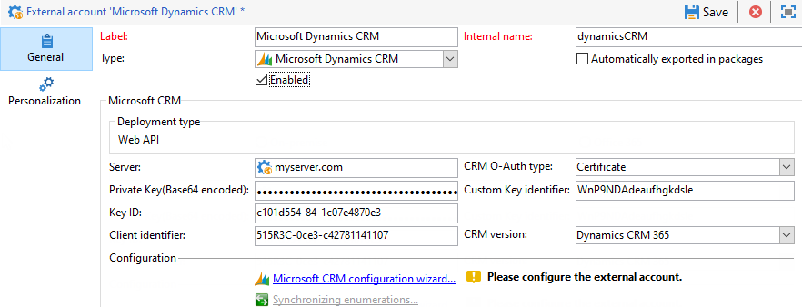

# 連接Campaign和Microsoft Dynamics 365{#connect-to-msdyn}

在本頁面中，您將學習如何將Campaign Classic連接到&#x200B;**Microsoft Dynamics CRM 365**。

可能的部署包括：

* 透過&#x200B;**Web API**（建議）。 請參閱[以下小節](#microsoft-dynamics-implementation-step)了解設定與Microsoft Dynamics連線的步驟。
* **Office 365**。 請參閱[此影片](#microsoft-dynamics-office-365)以了解設定此整合的關鍵步驟。
* 對於&#x200B;**內部部署**&#x200B;部署，請應用Office 365關鍵步驟。

資料同步是透過專用的工作流程活動執行。 [瞭解更多](../../platform/using/crm-data-sync.md)。

## 實施步驟{#microsoft-dynamics-implementation-steps}

若要連接Microsoft Dynamics 365以透過&#x200B;**Web API**&#x200B;與Adobe Campaign搭配使用，您必須套用下列步驟：

在Microsoft Dynamics CRM中：
1. 獲取Microsoft Dynamics客戶端ID
1. 生成Microsoft Dynamics客戶端密碼
1. 設定權限
1. 建立應用程式使用者
1. 為私密金鑰編碼

[了解更多資訊](#config-crm-microsoft)

Campaign Classic:
1. 建立新的外部帳戶
1. 使用Microsoft Dynamics設定配置外部帳戶
1. 使用配置嚮導映射表並同步枚舉
1. 建立同步工作流程

[了解更多資訊](#configure-acc-for-microsoft)


>[!CAUTION]
> 將Adobe Campaign與Microsoft Dynamics連接時，您不能：
> * 安裝可變更CRM行為並導致與Adobe Campaign相容問題的外掛程式
> * 選擇多個枚舉

>


## 配置Microsoft Dynamics CRM {#config-crm-microsoft}

若要產生存取權杖和金鑰以設定帳戶，您需使用&#x200B;**全域管理員**&#x200B;憑證登入[Microsoft Azure Directory](https://portal.azure.com)。 然後，請依照下列步驟操作。

### 獲取Microsoft Dynamics客戶端ID {#get-client-id-microsoft}

若要取得用戶端ID，您必須在Azure Active Directory中註冊應用程式。 用戶端ID與應用程式ID相同。

1. 導覽至&#x200B;**Azure Active Directory >應用程式註冊**，然後按一下&#x200B;**新應用程式註冊**。
1. 請提供可協助識別例項的唯一名稱，例如&#x200B;**adobecampaign`<instance identifier>`**。
1. 選擇&#x200B;**應用程式類型**&#x200B;作為&#x200B;**Web應用程式/ API**。
1. 對&#x200B;**登入URL**&#x200B;使用`http://localhost`。

儲存後，您會得到&#x200B;**應用程式ID**，此為促銷活動的用戶端識別碼。

在[本頁](https://docs.microsoft.com/en-us/powerapps/developer/common-data-service/walkthrough-register-app-azure-active-directory)中瞭解更多。

### 生成Microsoft Dynamics客戶端密碼{#config-client-secret-microsoft}

用戶端密碼是用戶端ID專屬的金鑰。 若要取得憑證金鑰識別碼，請遵循下列步驟：

1. 導航至&#x200B;**Azure Active Directory >應用註冊**&#x200B;並選擇先前建立的應用程式。
1. 按一下&#x200B;**憑證和密碼**。
1. 按一下「**上傳憑證**」，然後瀏覽並上傳產生的公開憑證。
1. 若要產生憑證，您可以使用openssl。

   例如：

   ```
   - openssl req -x509 -sha256 -nodes -days 365 -newkey rsa:2048 -keyout '<'private key name'>' -out '<'public certificate name'>
   ```

1. 按一下&#x200B;**manifest**&#x200B;連結以取得&#x200B;**憑證金鑰識別碼**&#x200B;和&#x200B;**金鑰ID**。

### 配置權限{#config-permissions-microsoft}

您必須為已建立的應用程式設定&#x200B;**必要權限**。

1. 導航至&#x200B;**Azure Active Directory >應用註冊**&#x200B;並選擇先前建立的應用程式。
1. 按一下左上角的&#x200B;**設定**。
1. 在&#x200B;**必要權限**&#x200B;上，按一下&#x200B;**Add**&#x200B;和&#x200B;**Select an API > Dynamics CRM Online**。
1. 然後按一下「**選擇**」，啟用「以組織用戶身份訪問Dynamics 365」複選框，然後按一下「**選擇**」。****

### 建立應用程式使用者{#create-app-user-microsoft}

應用程式使用者是上述註冊的應用程式將使用的使用者。 使用上述註冊的應用程式對Microsoft Dynamics所做的任何變更都將透過此使用者完成。

**步驟1**:在azure active directory上建立非互動用戶

1. 按一下「**Azure Active Directory >用戶**」，然後按一下「**新用戶**」。
1. 請指定您要使用的正確名稱，使用者名稱應為電子郵件格式。
1. 在&#x200B;**目錄角色**&#x200B;中選擇&#x200B;**Dynamics 365管理員**。

**步驟2**:為已建立的用戶分配適當的許可證

1. 在[Microsoft Azure](https://portal.azure.com)中，按一下&#x200B;**管理應用**。
1. 前往&#x200B;**使用者>作用中使用者**，然後按一下新建立的使用者。
1. 按一下&#x200B;**編輯產品許可證**&#x200B;並選擇&#x200B;**Dynamics 365客戶參與計畫**。
1. 按一下 **關閉**。

**步驟3**:在Dynamics CRM上建立應用程式使用者

1. 從[Microsoft Azure](https://portal.azure.com)，導覽至&#x200B;**設定>安全性>使用者**。
1. 按一下下拉式清單，選擇&#x200B;**應用程式用戶**，然後按一下&#x200B;**新建**。
1. 使用與上面在active directory上建立的用戶相同的用戶名

   >[!NOTE]
   >
   >使用相同名稱會擲回重複金鑰錯誤，因此在獲得是否需要此步驟的確認之前，請使用不同的使用者名稱並繼續。

1. 為[您先前建立的應用程式](#get-client-id-microsoft)分配&#x200B;**應用程式ID**。
1. 按一下&#x200B;**管理角色**&#x200B;並選擇用戶的&#x200B;**系統管理員**&#x200B;角色。

## 設定 Campaign {#configure-acc-for-microsoft}

若要連線Microsoft Dynamics 365和Campaign，您需要在Campaign中建立並設定專用的外部帳戶。

1. 導覽至&#x200B;**[!UICONTROL Administration > Platform > External accounts]**。

1. 建立新外部帳戶，選擇類型&#x200B;**[!UICONTROL Microsoft Dynamics CRM]**&#x200B;和&#x200B;**[!UICONTROL Enable]**&#x200B;選項。

1. 選擇&#x200B;**[!UICONTROL Web API]**&#x200B;部署類型：

   Adobe Campaign Classic支援具有OAuth通訊協定的Dynamics 365 REST介面，以使用&#x200B;**[!UICONTROL Certificate]**&#x200B;或&#x200B;**[!UICONTROL Password Credentials]**&#x200B;進行驗證。

   使用Azure目錄中先前定義的設定[來配置外部帳戶。](#get-client-id-microsoft)

   

   >[!NOTE]
   >
   >本節](../../installation/using/external-accounts.md#microsoft-dynamics-crm-external-account)中詳細說明了Microsoft Dynamics CRM外部帳戶配置。[

1. 按一下&#x200B;**[!UICONTROL Microsoft CRM configuration wizard...]**&#x200B;連結：Adobe Campaign會自動從Microsoft Dynamics資料範本中偵測表格。

   

1. 選擇要恢復的表。

   

1. 按一下&#x200B;**[!UICONTROL Next]**&#x200B;開始建立對應的架構。

   

   >[!NOTE]
   >
   >若要核准設定，您必須中斷連線/重新連線至Adobe Campaign主控台。

   您可以檢查相符的資料結構是否可在Adobe Campaign中使用。

   

1. 按一下&#x200B;**[!UICONTROL Synchronizing enumerations...]**&#x200B;連結以開始同步Adobe Campaign和Microsoft Dynamics之間的列舉。

   

Campaign與Microsoft Dynamics現已連線。 您可以在兩個系統之間設定資料同步。 了解更多[資料同步](../../platform/using/crm-data-sync.md)一節。

## 配置Microsoft Dynamics CRM Office 365整合{#microsoft-dynamics-office-365}

觀看此影片，了解如何在Office 365部署中整合Dynamics 365與Adobe Campaign Classic。

>[!VIDEO](https://video.tv.adobe.com/v/23837?quality=12)


## 支援的欄位資料類型{#ms-dyn-supported-types}

以下列出了Microsoft Dynamics 365支援/不支援的屬性類型：


| 屬性類型 | 支援 |
| --------------------------------------------------------------------------------- | --------- |
| 基本類型：布林值，日期時間，小數，浮點數，雙精度，整數， bigint，字串 | 是 |
| 貨幣（雙倍） | 是 |
| memo, entityname , primarykey, uniqueidentifier（作為字串） | 是 |
| 狀態、選擇清單（我們將可能的值儲存在枚舉中）、狀態（字串） | 是 |
| 擁有者（作為字串） | 是 |
| 查閱（僅單一實體參考查閱） | 是 |
| 客戶 | 否 |
| 關於 | 否 |
| PartyList | 否 |
| ManagedProperty | 否 |
