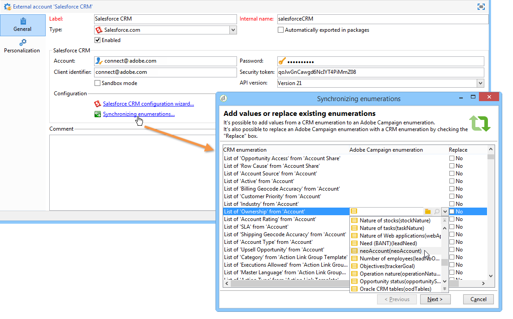
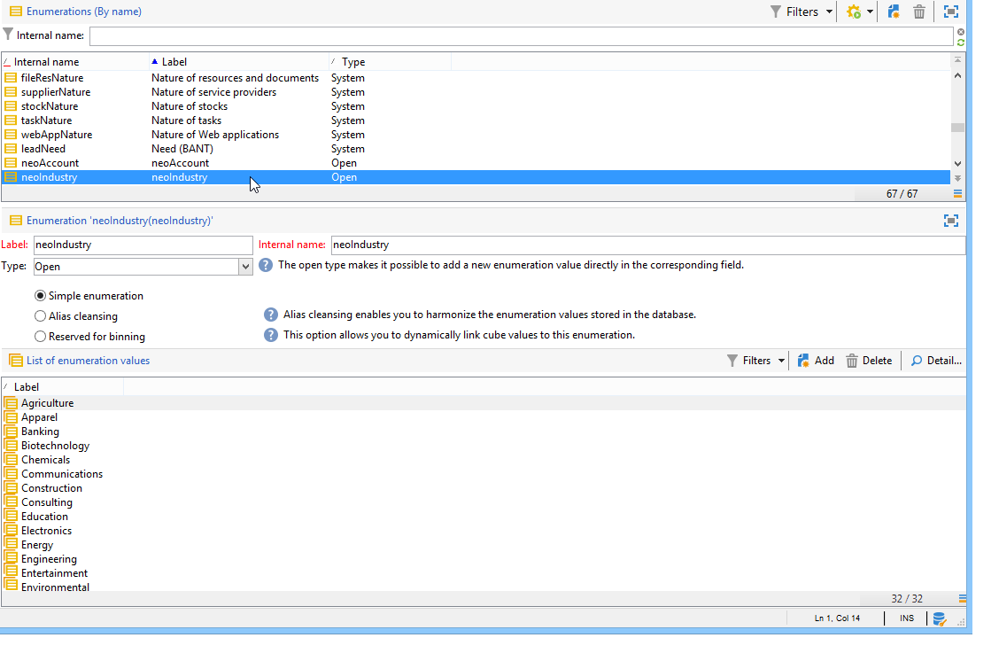

# 連線Campaign和Salesforce.com{#connect-to-sfdc}

在本頁中，您將瞭解如何將Campaign Classic連線至&#x200B;**Salesforce**。

資料同步是透過專屬的工作流程活動來執行。 [了解更多](../../platform/using/crm-data-sync.md)。

外部帳戶可讓您將Salesforce資料匯入和匯出至Adobe Campaign。
若要設定CRM Connector for Salesforce，請遵循下列步驟：

1. 透過Adobe Campaign樹狀結構的&#x200B;**[!UICONTROL Administration > Platform > External accounts]**&#x200B;節點建立新的外部帳戶。
1. 選取 **[!UICONTROL Salesforce.com]**。
1. 輸入設定以啟用連線。

   

   若要設定Salesforce CRM外部帳戶以搭配Adobe Campaign使用，您必須提供下列詳細資料：

   * **[!UICONTROL Account]**
用來登入Salesforce CRM的帳戶。

   * **[!UICONTROL Password]**
用來登入Salesforce CRM的密碼。

   * **[!UICONTROL Client identifier]**
若要瞭解在何處尋找您的使用者端識別碼，請參閱此[頁面](https://help.salesforce.com/articleView?id=000205876&amp;type=1)。

   * **[!UICONTROL Security token]**
若要瞭解在何處尋找您的安全性權杖，請參閱此[頁面](https://help.salesforce.com/articleView?id=000205876&amp;type=1)。

   * **[!UICONTROL API version]**
選取API的版本。
1. 執行Configuration Assistant以產生可用的CRM表格：Configuration Assistant可讓您收集表格並建立相符的結構描述。

   

   >[!NOTE]
   >
   >若要核准此設定，您必須登出並重新登入Adobe Campaign主控台。

1. 檢查&#x200B;**[!UICONTROL Administration > Configuration > Data schemas]**&#x200B;節點中Adobe Campaign產生的結構描述。

   **Salesforce**&#x200B;結構描述的範例：

   

1. 建立結構描述後，您就可以從Salesforce自動將分項清單同步到Adobe Campaign。

   若要這麼做，請按一下&#x200B;**[!UICONTROL Synchronizing enumerations...]**&#x200B;連結，然後選取符合Salesforce分項清單的Adobe Campaign分項清單。

   

   >[!NOTE]
   >
   >您可以將Adobe Campaign列舉的所有值取代為CRM的值：若要這麼做，請在&#x200B;**[!UICONTROL Replace]**&#x200B;欄中選取&#x200B;**[!UICONTROL Yes]**。

   按一下&#x200B;**[!UICONTROL Next]**，然後按&#x200B;**[!UICONTROL Start]**，開始匯入清單。

1. 檢查&#x200B;**[!UICONTROL Administration > Platform > Enumerations]**&#x200B;功能表中的匯入值。

   

   >[!NOTE]
   >
   > 不支援多重選取列舉。

Campaign和Salesforce.com現已連線。 您可以設定兩個系統之間的資料同步。

若要在Adobe Campaign資料和SFDC之間同步資料，您必須建立工作流程並使用&#x200B;**[!UICONTROL CRM connector]**&#x200B;活動。

在此頁面[&#128279;](../../platform/using/crm-data-sync.md)中進一步瞭解資料同步處理。
