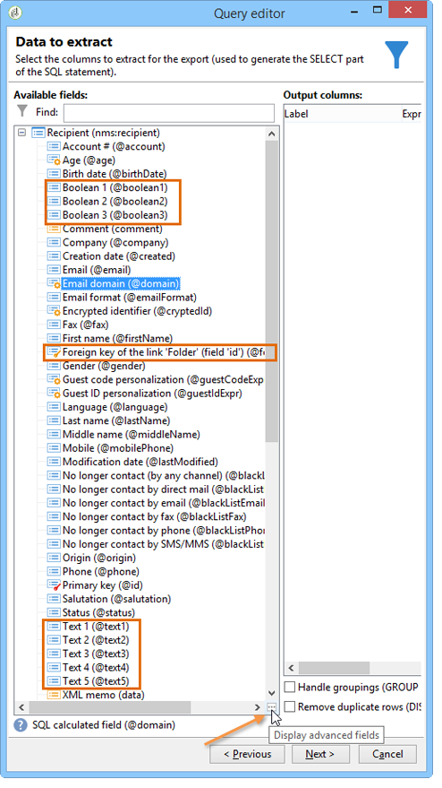

# 定義篩選條件{#defining-filter-conditions}

## 選擇運運算元 {#choosing-the-operator}

在篩選條件下，您需要使用運運算元將兩個值連結在一起。

以下是可用的運運算元清單：

<table> 
 <thead> 
  <tr> 
   <th> 運算元  </th> 
   <th> 用途  </th> 
   <th> 範例   </th> 
  </tr> 
 </thead> 
 <tbody> 
  <tr> 
   <td> Equal to   </td> 
   <td> 傳回與第二個「值」欄中所輸入資料相同的結果。  </td> 
   <td> <strong>姓氏(@lastName)等於'Jones'</strong>，只會傳回姓氏為Jones的收件者。  </td> 
  </tr> 
  <tr> 
   <td> Greater than   </td> 
   <td> 傳回大於輸入值的值。  </td> 
   <td> <strong>年齡(@age)大於50</strong>，會傳回所有大於'50'的值，即'51'、'52'等  </td> 
  </tr> 
  <tr> 
   <td> Less than   </td> 
   <td> 傳回小於輸入值的值。  </td> 
   <td> <strong>在「DaysAgo(100)」之前的建立日期(@created)</strong>，會傳回在100天前建立的所有收件者。  </td> 
  </tr> 
  <tr> 
   <td> Greater than or equal to   </td> 
   <td> 傳回等於或大於輸入值的所有值。  </td> 
   <td> <strong>年齡(@age)大於或等於「30」</strong>，會傳回年齡在30歲或以上的所有收件者。  </td> 
  </tr> 
  <tr> 
   <td> Less than or equal to   </td> 
   <td> 傳回等於或小於輸入值的所有值。  </td> 
   <td> <strong>年齡(@age)小於或等於「60」</strong>，會傳回年齡在60歲或以下的所有收件者。  </td> 
  </tr> 
  <tr> 
   <td> 不等於   </td> 
   <td> 傳回所有與輸入值不相同的值。  </td> 
   <td> <strong>等於'English'的語言(@language)</strong>.  </td> 
  </tr> 
  <tr> 
   <td> 開頭為   </td> 
   <td> 傳回以輸入值開頭的結果。  </td> 
   <td> <strong>帳戶# (@account)以「32010」開頭。</strong>  </td> 
  </tr> 
  <tr> 
   <td> 開頭不是   </td> 
   <td> 傳回不是以輸入值開頭的結果  </td> 
   <td> <strong>帳戶# (@account)的開頭不是「20」</strong>.  </td> 
  </tr> 
  <tr> 
   <td> Contains   </td> 
   <td> 傳回至少包含輸入值的結果。  </td> 
   <td> <strong>電子郵件網域(@domain)包含「郵件」</strong>，將會傳回所有包含'mail'的網域名稱。 所以也會傳回'gmail.com'網域。  </td> 
  </tr> 
  <tr> 
   <td> 不包含   </td> 
   <td> 傳回不包含輸入值的結果。  </td> 
   <td> <strong>電子郵件網域(@domain)不包含「vo」</strong>. 在此情況下，將不會傳回包含'vo'的網域名稱。 'voila.fr'網域名稱不會出現在結果中。  </td> 
  </tr> 
  <tr> 
   <td> Like   </td> 
   <td> Like 與　Contains　運算子非常類似。它可讓您插入 % 值中的萬用字元。  </td> 
   <td> <strong>姓氏(@lastName)，如'Jon%s'</strong>. 在此處，萬一運運算元忘了'n'與's'之間的遺漏字母，萬一使用萬用字元作為"joker"來尋找名稱"Jones"。  </td> 
  </tr> 
  <tr> 
   <td> Not like   </td> 
   <td> 類似 按讚 . 讓您不復原輸入的值。 在這裡，輸入的值也必須包含 % 萬用字元。  </td> 
   <td> <strong>姓氏(@lastName)不像'Smi%h'</strong>. 在此，將不會傳回姓氏為'Smi%h'的收件者。  </td> 
  </tr> 
  <tr> 
   <td> Is empty   </td> 
   <td> 在此案例中，我們要尋找的結果符合第二個「值」欄中的空白值。  </td> 
   <td> <strong>行動(@mobilePhone)是空的</strong> 傳回沒有行動電話號碼的所有收件者。  </td> 
  </tr> 
  <tr> 
   <td> 不是空的   </td> 
   <td> 與的作用相反 是空的 運運算元。 不需要在第二個「值」欄中輸入資料。  </td> 
   <td> <strong>電子郵件(@email)不是空的</strong>.  </td> 
  </tr> 
  <tr> 
   <td> 包含在   </td> 
   <td> 傳回指定值中包含的結果。 這些值必須以逗號分隔。  </td> 
   <td> <strong>出生日期(@birthDate)包含在'12/10/1979,12/10/1984'中</strong>，會傳回這些日期之間出生的收件者。   </td> 
  </tr> 
  <tr> 
   <td> 中未包含   </td> 
   <td> 運作方式如下 包含在 運運算元。 在此，我們要根據輸入的值排除收件者。  </td> 
   <td> <strong>出生日期(@birthDate)不包含在'12/10/1979,12/10/1984'中</strong>. 和上一個範例不同，系統不會傳回這些日期內出生的收件者。  </td> 
  </tr> 
 </tbody> 
</table>

## 使用AND、OR，但 {#using-and--or--except}

對於使用多個篩選條件的查詢，您需要定義條件之間的連結。 有三個可能的連結：

* **[!UICONTROL And]** 可讓您合併兩個篩選條件，
* **[!UICONTROL Or]** 可讓您提供替代方案，
* **[!UICONTROL Except]** 可讓您定義例外。

按一下 **[!UICONTROL And]** （預設會提供）並從下拉式清單中選擇。

* **[!UICONTROL And]**：新增條件並啟用過度篩選。
* **[!UICONTROL Or]**：新增條件並啟用過度篩選。

  下列範例可讓您尋找電子郵件網域包含「orange.co.uk」或其後置程式碼開頭為「NW」的收件者。

  

* **[!UICONTROL Except]**：如果您有兩個篩選器，且第一個篩選器未傳回值，則此型別的連結會建立例外狀況。

  在以下範例中，我們希望傳回其電子郵件網域包含「orange.co.uk」的收件者，但如果收件者的姓氏為「Smith」則除外。

  

此範例顯示一個篩選器，可讓您顯示：會說西班牙文的收件者，或者是擁有行動號碼的女性，或者是沒有帳號且其公司名稱以字母「N」開頭的收件者。

## 排定條件優先順序 {#prioritizing-conditions}

本節說明如何使用工具列中的藍色箭頭來排列條件的優先順序。

* 指向右側的箭頭可讓您在篩選器中加入一層括弧。
* 指向左側的箭頭可讓您從篩選器中刪除選取的括弧層級。

  

* 垂直箭頭可讓您移動條件，進而變更其執行順序。

此範例說明如何使用箭頭來刪除括弧層級。 從下列篩選條件開始： **[!UICONTROL City equal to London OR gender equal to male and mobile not indicated OR account # starts with "95" and company name starts with "A"]**.

將游標放在 **[!UICONTROL Gender (@gender) equal to Male]** 篩選條件並按一下 **[!UICONTROL Remove a parenthesis level]** 箭頭。

此 **[!UICONTROL Gender (@gender) equal to Male]** 條件已移出其括弧。 其等級已移至「倫敦等同城市」條件。 這些條件已連結在一起(**[!UICONTROL And]**)。

## 選取要擷取的資料 {#selecting-data-to-extract}

可用的欄位因表格而異。 所有欄位都儲存在稱為 **[!UICONTROL Main element]**. 在下列範例中，可用的欄位位於收件者表格中。 欄位一律依字母順序顯示。

所選欄位的詳細資訊會顯示在視窗底部。 例如， **[!UICONTROL Email domain]** 欄位是 **[!UICONTROL Calculated SQL field]** 其擴充功能為 **[!UICONTROL (@domain)]**.

>[!NOTE]
>
>使用 **[!UICONTROL Search]** 用於尋找可用欄位的工具。

連按兩下可用欄位，將其新增至輸出欄。 在查詢結束時，每個選取的欄位都會在 **[!UICONTROL Data preview]** 視窗。

預設不會顯示進階欄位。 按一下 **[!UICONTROL Display advanced fields]** 在可用欄位的右下角顯示所有內容。 再按一下可返回前一個檢視。

例如，在收件者表格中，進階欄位為 **布林值1**， **[!UICONTROL Boolean 2]**， **[!UICONTROL Boolean 3]**， **[!UICONTROL Foreign key of "Folder" link]**&#x200B;等

下列範例顯示收件者表格的進階欄位。

各種欄位類別：

<table> 
 <thead> 
  <tr> 
   <th> 圖示  </th> 
   <th> 說明  </th> 
   <th> 範例  </th> 
  </tr> 
 </thead> 
 <tbody> 
  <tr> 
   <td>  </td> 
   <td> 簡單欄位  </td> 
   <td> 電子郵件、性別等。  </td> 
  </tr> 
  <tr> 
   <td>  </td> 
   <td> 主索引鍵。 此SQL欄位是識別表格中記錄的一種方式。  </td> 
   <td> 識別碼收件者是主要金鑰，而且依定義識別碼是唯一的。  </td> 
  </tr> 
  <tr> 
   <td>  </td> 
   <td> 外部索引鍵。 用作另一個表格的連結。  </td> 
   <td> 收件者外部金鑰、服務外部金鑰等。  </td> 
  </tr> 
  <tr> 
   <td>  </td> 
   <td> 計算欄位。 根據請求，會使用資料庫中的值計算此型別的欄位。  </td> 
   <td> 年齡、電子郵件網域等  </td> 
  </tr> 
  <tr> 
   <td>  </td> 
   <td> 包含長文字的欄位。  </td> 
   <td> 評論、完整地址等。  </td> 
  </tr> 
  <tr> 
   <td>  </td> 
   <td> 已編制索引的SQL欄位。   </td> 
   <td> 完整名稱、ISO程式碼等。   </td> 
  </tr> 
 </tbody> 
</table>

表格與收集要素的連結：

<table> 
 <thead> 
  <tr> 
   <th> 圖示  </th> 
   <th> 說明  </th> 
   <th> 範例   </th> 
  </tr> 
 </thead> 
 <tbody> 
  <tr> 
   <td>  </td> 
   <td> 尤其是表格的連結。 這些與1-1型別關聯一致。 來源表格的某個專案只能與目標表格的某個專案一致。 例如，一個國家/地區只能連結一個收件者。  </td> 
   <td> 資料夾、州、國家/地區等。   </td> 
  </tr> 
  <tr> 
   <td>  </td> 
   <td> 特定表格的收集要素。 這些與1-N型別關聯一致。 一個來源表格出現次數可以與目標表格的多個出現次數一致，但目標表格出現次數可以只與目標表格出現次數一致。 例如，一位收件者可以訂閱'n'個訂閱字母。  </td> 
   <td> 訂閱、清單、排除記錄檔等。  </td> 
  </tr> 
 </tbody> 
</table>

>[!NOTE]
>
>* 使用 **[!UICONTROL Add]** 按鈕（側邊圖示列上方），新增我們想要編輯運算式的輸出欄。 有關編輯運算式的詳細資訊，請參閱 [本節](#building-expressions).
>* 按一下紅色的「x」(**刪除**)。
>* 使用箭頭變更輸出欄的順序。
>* 此 **[!UICONTROL Distribution of values]** 可做為檢視所選欄位值分佈的方式（例如，連結至收件者城鎮、收件者語言等的分佈）。

## 建立計算欄位 {#creating-calculated-fields}

如有必要，請在資料格式化期間新增欄。 計算欄位會將欄新增至資料預覽區段。 按一下&#x200B;**[!UICONTROL Add a calculated field]**。

有四種類型的計算欄位：

* **[!UICONTROL Fixed string]**：可讓您新增字元字串。

  

* **[!UICONTROL String with JavaScript tags]**：計算欄位的值會結合字元字串和JavaScript指令。

  

* **[!UICONTROL JavaScript expression]**：計算欄位的值是JavaScript函式評估的結果。 可輸入傳回的值（數字、日期等）。

  

* **[!UICONTROL Enumerations]**：此型別的欄位可讓您使用/修改新欄中其中一個輸出欄的內容。

  您可以使用欄的來源值，並為它指定目標值。 此目的地值將顯示在新的輸出欄中。

  新增計算欄位型別的範例 **[!UICONTROL Enumerations]** 可使用，請參閱 [本節](../../workflow/using/adding-enumeration-type-calculated-field.md).

  

  此 **[!UICONTROL Enumerations]** 型別計算欄位可包含4個條件：

   * **[!UICONTROL Keep the source value]** 將來源值還原到目標而不變更它。
   * **[!UICONTROL Use the following value]** 可讓您為未定義的來源值輸入預設目的地值。
   * **[!UICONTROL Generate a warning and continue]** 警告使用者無法變更來源值。
   * **[!UICONTROL Generate an error and reject the line]** 防止計算及匯入明細行。

按一下 **[!UICONTROL Detail of calculated field]** 以檢視插入欄位的詳細資訊。

若要移除此計算欄位，請按一下 **[!UICONTROL Remove the calculated field]** 交叉。

## 建立運算式 {#building-expressions}

運算式編輯工具可讓您使用運算式計算彙總、產生函式或編輯公式。

下列範例說明如何對主索引鍵執行計數。

應用以下步驟：

1. 按一下 **[!UICONTROL Add]** 在 **[!UICONTROL Data to extract]** 視窗。 在 **[!UICONTROL Formula type]** 視窗中，選取公式型別以輸入運算式。

   有數種公式可供使用： **[!UICONTROL Field only]**， **[!UICONTROL Aggregate]**， **[!UICONTROL Expression]**.

   選取 **[!UICONTROL Process on an aggregate function]**、和 **[!UICONTROL Count]**. 按一下&#x200B;**[!UICONTROL Next]**。

   

1. 主索引鍵已計算。

   

以下是中可用選項的詳細檢視 **[!UICONTROL Formula types]** 視窗：

1. **[!UICONTROL Field only]** 可讓您返回 **[!UICONTROL Field to select]** 視窗。
1. **[!UICONTROL Aggregate (Process on an aggregate function)]**. 以下是彙總使用的一些範例：

   * **[!UICONTROL Count]** 可讓您執行主索引鍵計數。
   * **[!UICONTROL Sum]** 可讓您加總客戶在一年以上的所有購買。
   * **[!UICONTROL Maximum value]** 可讓您找出購買最多「n」個產品的客戶。
   * **[!UICONTROL Minimum value]** 可讓您排序客戶，並尋找最近訂閱了優惠方案的客戶。
   * **[!UICONTROL Average]**. 此函式可讓您計算收件者的平均年齡。

     此 **[!UICONTROL Distinct]** 方塊可讓您復原欄的唯一和非零值。 例如，您可以復原所有收件者的追蹤記錄，而這些追蹤記錄會變更為值1，因為它們都與相同的收件者有關。

1. **[!UICONTROL Expression]** 開啟 **[!UICONTROL Edit the expression]** 視窗。 這可讓您偵測包含太多數字的電話號碼，可能是輸入錯誤。

   

   如需所有可用函式的清單，請參閱 [函式清單](#list-of-functions).

## 函式清單 {#list-of-functions}

如果 **[!UICONTROL Expression]** 選擇型別公式，您將被帶到「編輯運算式」視窗。 各種類別的函式可以與可用欄位相關聯： **[!UICONTROL Aggregates]**， **[!UICONTROL String]**， **[!UICONTROL Date]**， **[!UICONTROL Numerical]**， **[!UICONTROL Currency]**， **[!UICONTROL Geomarketing]**， **[!UICONTROL Windowing function]** 和 **[!UICONTROL Others]**.

運算式編輯器看起來像這樣：

它可讓您選取資料庫表格中的欄位，並將進階函式新增至這些欄位。 可使用下列函式：

**彙總**

<table> 
 <tbody> 
  <tr> 
   <td> <strong>名稱</strong>  </td> 
   <td> <strong>說明</strong>  </td> 
   <td> <strong>語法</strong>  </td> 
  </tr> 
  <tr> 
   <td> <strong>平均</strong>  </td> 
   <td> 傳回數字型別欄的平均值  </td> 
   <td> Avg(&lt;value&gt;) </td> 
  </tr> 
  <tr> 
   <td> <strong>計數</strong>  </td> 
   <td> 計算資料行的非空值  </td> 
   <td> Count(&lt;value&gt;) </td>  
  </tr> 
  <tr> 
   <td> <strong>全部計數</strong>  </td> 
   <td> 計算傳回的值（所有欄位）  </td> 
   <td> CountAll()  </td> 
  </tr> 
  <tr> 
   <td> <strong>Countdistinct</strong>  </td> 
   <td> 計算資料行的不同非空值  </td> 
   <td> Countdistinct(&lt;value&gt;) </td> 
  </tr> 
  <tr> 
   <td> <strong>最大</strong>  </td> 
   <td> 傳回數字、字串或日期型別欄的最大值  </td> 
   <td> Max(&lt;value&gt;) </td>  
  </tr> 
  <tr> 
   <td> <strong>最小值</strong>  </td> 
   <td> 傳回數字、字串或日期型別欄的最小值  </td> 
   <td> Min(&lt;value&gt;) </td> 
  </tr> 
  <tr> 
   <td> <strong>StdDev</strong>  </td> 
   <td> 傳回數字、字串或日期欄的標準差  </td> 
   <td> StdDev(&lt;value&gt;) </td> 
  </tr> 
  <tr> 
   <td> <strong>Sum</strong>  </td> 
   <td> 傳回數字、字串或日期型別欄的值總和  </td> 
   <td> Sum(&lt;value&gt;) </td> 
  </tr> 
 </tbody> 
</table>

**字串**

<table> 
 <tbody> 
  <tr> 
   <td> <strong>名稱</strong>  </td> 
   <td> <strong>說明</strong>  </td> 
   <td> <strong>語法</strong>  </td> 
  </tr> 
  <tr> 
   <td> <strong>AllNonNull2</strong>  </td> 
   <td> 指示所有參數是否為非空值且非空白  </td> 
   <td> AllNonNull2(&lt;string&gt;， &lt;string&gt;) </td> 
  </tr> 
  <tr> 
   <td> <strong>AllNonNull3</strong>  </td> 
   <td> 指示所有參數是否為非空值且非空白  </td> 
   <td> AllNonNull3(&lt;string&gt;， &lt;string&gt;， &lt;string&gt;) </td> 
  </tr> 
  <tr> 
   <td> <strong>Ascii</strong>  </td> 
   <td> 傳回字串中第一個字元的ASCII值。  </td> 
   <td> Ascii(&lt;string&gt;) </td> 
  </tr> 
  <tr> 
   <td> <strong>Char</strong>  </td> 
   <td> 傳回與　'n' ASCII　代碼對應的字元  </td> 
   <td> Char(&lt;number&gt;) </td>  
  </tr> 
  <tr> 
   <td> <strong>Charindex</strong>  </td> 
   <td> 傳回字串1中字串2的位置。  </td> 
   <td> Charindex(&lt;string&gt;， &lt;string&gt;) </td> 
  </tr> 
  <tr> 
   <td> <strong>GetLine</strong>  </td> 
   <td> 傳回字串的第　n　行（從　1　到　n）  </td> 
   <td> GetLine(&lt;string&gt;) </td> 
  </tr> 
  <tr> 
   <td> <strong>IfEquals</strong>  </td> 
   <td> 如果前兩個引數相等，則傳回第三個引數。 如果沒有，則傳回最後一個引數  </td> 
   <td> IfEquals(&lt;string&gt;， &lt;string&gt;， &lt;string&gt;， &lt;string&gt;) </td> 
  </tr> 
  <tr> 
   <td> <strong>IsMemoNull</strong>  </td> 
   <td> 指示作為參數傳遞的備忘錄是否為空  </td> 
   <td> IsMemoNull(&lt;memo&gt;) </td> 
  </tr> 
  <tr> 
   <td> <strong>JuxtWords</strong>  </td> 
   <td> 串連以引數形式傳遞的字串。 視需要在字串之間新增空格。  </td> 
   <td> JuxtWords(&lt;string&gt;， &lt;string&gt;) </td> 
  </tr> 
  <tr> 
   <td> <strong>JuxtWords3</strong>  </td> 
   <td> 串連以引數形式傳遞的字串。 如有必要，在字串之間新增空格  </td> 
   <td> JuxtWords3(&lt;string&gt;， &lt;string&gt;， &lt;string&gt;) </td>  
  </tr> 
  <tr> 
   <td> <strong>LPad</strong>  </td> 
   <td> 傳回左側的已完成字串  </td> 
   <td> LPad(&lt;string&gt;， &lt;number&gt;， &lt;character&gt;) </td> 
  </tr> 
  <tr> 
   <td> <strong>Left</strong>  </td> 
   <td> 傳回字串的前　n　個字元  </td> 
   <td> Left(&lt;string&gt;， &lt;number&gt;) </td> 
  </tr> 
  <tr> 
   <td> <strong>Length</strong>  </td> 
   <td> 傳回字串的長度  </td> 
   <td> Length(&lt;string&gt;) </td> 
  </tr> 
  <tr> 
   <td> <strong>Lower</strong>  </td> 
   <td> 傳回小寫字串  </td> 
   <td> Lower(&lt;string&gt;) </td> 
  </tr> 
  <tr> 
   <td> <strong>Ltrim</strong>  </td> 
   <td> 移除字串左側的空格  </td> 
   <td> Ltrim(&lt;string&gt;) </td> 
  </tr> 
  <tr> 
   <td> <strong>Md5Digest</strong>  </td> 
   <td> 返回字串　MD5　鍵的十六進位表示  </td> 
   <td> Md5Digest(&lt;string&gt;) </td> 
  </tr> 
  <tr> 
   <td> <strong>MemoContains</strong>  </td> 
   <td> 指定備忘錄是否包含作為參數傳遞的字串  </td> 
   <td> MemoContains(&lt;memo&gt;， &lt;string&gt;) </td> 
  </tr> 
  <tr> 
   <td> <strong>RPad</strong>  </td> 
   <td> 傳回右側的已完成字串  </td> 
   <td> RPad(&lt;string&gt;， &lt;number&gt;， &lt;character&gt;) </td> 
  </tr> 
  <tr> 
   <td> <strong>Right</strong>  </td> 
   <td> 傳回字串的最後　n　個字元  </td> 
   <td> Right(&lt;string&gt;)  </td> 
  </tr> 
  <tr> 
   <td> <strong>Rtrim</strong>  </td> 
   <td> 移除字串右側的空格  </td> 
   <td> Rtrim(&lt;string&gt;)  </td> 
  </tr> 
  <tr> 
   <td> <strong>Smart</strong>  </td> 
   <td> 傳回字串，每個字詞的首字母以大寫表示  </td> 
   <td> Smart(&lt;string&gt;)  </td> 
  </tr> 
  <tr> 
   <td> <strong>Substring</strong>  </td> 
   <td> 從字串的字元n1開始提取長度為n2的子字串  </td> 
   <td> Substring(&lt;string&gt;, &lt;offset&gt;, &lt;length&gt;)  </td>  
  </tr> 
  <tr> 
   <td> <strong>ToString</strong>  </td> 
   <td> 將數字轉換為字串  </td> 
   <td> ToString(&lt;number&gt;， &lt;number&gt;)  </td>  
  </tr> 
  <tr> 
   <td> <strong>Upper</strong>  </td> 
   <td> 以大寫傳回字串  </td> 
   <td> Upper(&lt;string&gt;)  </td>  
  </tr> 
  <tr> 
   <td> <strong>VirtualLink</strong>  </td> 
   <td> 傳回連結的外鍵，如果其他兩個參數相等，則傳遞為參數  </td> 
   <td> VirtualLink(&lt;number&gt;、&lt;number&gt;、&lt;number&gt;)  </td>  
  </tr> 
  <tr> 
   <td> <strong>VirtualLinkStr</strong>  </td> 
   <td> 傳回連結的外鍵（文字）索引鍵，如果其他兩個參數相等，則傳回該連結的外鍵　(text)　  </td> 
   <td> VirtualLinkStr(&lt;string&gt;, &lt;number&gt;, &lt;number&gt;)  </td>  
  </tr> 
  <tr> 
   <td> <strong>dataLength</strong>  </td> 
   <td> 傳回字串大小  </td> 
   <td> dataLength(&lt;string&gt;)  </td>  
  </tr> 
 </tbody> 
</table>

**日期**

<table> 
 <tbody> 
  <tr> 
   <td> <strong>名稱</strong>  </td> 
   <td> <strong>說明</strong>  </td> 
   <td> <strong>語法</strong>  </td> 
  </tr> 
  <tr> 
   <td> <strong>AddDays</strong>  </td> 
   <td> 新增日期的天數  </td> 
   <td> AddDays(&lt;date&gt;, &lt;number&gt;)  </td>  
  </tr> 
  <tr> 
   <td> <strong>AddHours</strong>  </td> 
   <td> 將小時數新增至日期  </td> 
   <td> AddHours(&lt;date&gt;, &lt;number&gt;)  </td>  
  </tr> 
  <tr> 
   <td> <strong>AddMinutes</strong>  </td> 
   <td> 將分鐘數新增至日期  </td> 
   <td> AddMinutes(&lt;date&gt;, &lt;number&gt;)  </td>  
  </tr> 
  <tr> 
   <td> <strong>AddMonths</strong>  </td> 
   <td> 新增月份至日期  </td> 
   <td> AddMonths(&lt;date&gt;, &lt;number&gt;)  </td>  
  </tr> 
  <tr> 
   <td> <strong>AddSeconds</strong>  </td> 
   <td> 新增秒數至日期  </td> 
   <td> AddSeconds(&lt;date&gt;, &lt;number&gt;)  </td>  
  </tr> 
  <tr> 
   <td> <strong>AddYears</strong>  </td> 
   <td> 在日期中新增多年  </td> 
   <td> AddYears(&lt;date&gt;, &lt;number&gt;)  </td>  
  </tr> 
  <tr> 
   <td> <strong>DateOnly</strong>  </td> 
   <td> 僅傳回日期（時間為00:00）*  </td> 
   <td> DateOnly(&lt;date&gt;)  </td>  
  </tr> 
  <tr> 
   <td> <strong>Day</strong>  </td> 
   <td> 傳回代表日期的數字  </td> 
   <td> Day(&lt;date&gt;)  </td>  
  </tr> 
  <tr> 
   <td> <strong>DayOfYear</strong>  </td> 
   <td> 傳回日期當年的日數  </td> 
   <td> DayOfYear(&lt;date&gt;)  </td>  
  </tr> 
  <tr> 
   <td> <strong>DaysAgo</strong>  </td> 
   <td> 傳回與目前日期對應的日期減去n天  </td> 
   <td> DaysAgo(&lt;number&gt;)  </td>  
  </tr> 
  <tr> 
   <td> <strong>DaysAgoInt</strong>  </td> 
   <td> 傳回與目前日期對應的日期（整數yyyymmdd）減去n天  </td> 
   <td> DaysAgoInt(&lt;number&gt;)  </td>  
  </tr> 
  <tr> 
   <td> <strong>DaysDiff</strong>  </td> 
   <td> 兩個日期之間的天數  </td> 
   <td> DaysDiff(&lt;end date&gt;, &lt;start date&gt;)  </td>  
  </tr> 
  <tr> 
   <td> <strong>DaysOld</strong>  </td> 
   <td> 傳回日期的年齡（以天為單位）  </td> 
   <td> DaysOld(&lt;date&gt;)  </td>  
  </tr> 
  <tr> 
   <td> <strong>GetDate</strong>  </td> 
   <td> 返回伺服器的目前系統日期  </td> 
   <td> GetDate()  </td> 
  </tr> 
  <tr> 
   <td> <strong>Hour</strong>  </td> 
   <td> 傳回日期的小時數  </td> 
   <td> Hour(&lt;date&gt;)  </td>  
  </tr> 
  <tr> 
   <td> <strong>HoursDiff</strong>  </td> 
   <td> 傳回兩個日期之間的小時數  </td> 
   <td> HoursDiff(&lt;end date&gt;, &lt;start date&gt;)  </td>  
  </tr> 
  <tr> 
   <td> <strong>Minute</strong>  </td> 
   <td> 傳回日期的分鐘數  </td> 
   <td> Minute(&lt;date&gt;)  </td>  
  </tr> 
  <tr> 
   <td> <strong>MinutesDiff</strong>  </td> 
   <td> 傳回兩個日期之間的分鐘數  </td> 
   <td> MinutesDiff(&lt;end date&gt;, &lt;start date&gt;)  </td>  
  </tr> 
  <tr> 
   <td> <strong>Month</strong>  </td> 
   <td> 傳回代表日期月份的數字  </td> 
   <td> Month(&lt;date&gt;)  </td>  
  </tr> 
  <tr> 
   <td> <strong>MonthsAgo</strong>  </td> 
   <td> 傳回與目前日期對應的日期減去n個月  </td> 
   <td> MonthsAgo(&lt;number&gt;)  </td>  
  </tr> 
  <tr> 
   <td> <strong>MonthsDiff</strong>  </td> 
   <td> 傳回兩個日期之間的月數  </td> 
   <td> MonthsDiff(&lt;end date&gt;, &lt;start date&gt;)  </td>  
  </tr> 
  <tr> 
   <td> <strong>MonthsOld</strong>  </td> 
   <td> 傳回日期的月份  </td> 
   <td> MonthsOld(&lt;date&gt;)  </td>  
  </tr> 
  <tr> 
   <td> <strong>Second</strong>  </td> 
   <td> 傳回日期的秒數  </td> 
   <td> Second(&lt;date&gt;)  </td>  
  </tr> 
  <tr> 
   <td> <strong>SecondsDiff</strong>  </td> 
   <td> 傳回兩個日期之間的秒數  </td> 
   <td> SecondsDiff(&lt;end date&gt;, &lt;start date&gt;)  </td>  
  </tr> 
  <tr> 
   <td> <strong>SubDays</strong>  </td> 
   <td> 從日期減去天數  </td> 
   <td> SubDays(&lt;date&gt;, &lt;number&gt;)  </td>  
  </tr> 
  <tr> 
   <td> <strong>SubHours</strong>  </td> 
   <td> 從日期減去數小時  </td> 
   <td> SubHours(&lt;date&gt;, &lt;number&gt;)  </td>  
  </tr> 
  <tr> 
   <td> <strong>SubMinutes</strong>  </td> 
   <td> 從日期減去分鐘數  </td> 
   <td> SubMinutes(&lt;date&gt;, &lt;number&gt;)  </td>  
  </tr> 
  <tr> 
   <td> <strong>SubMonths</strong>  </td> 
   <td> 從日期減去幾個月  </td> 
   <td> SubMonths(&lt;date&gt;, &lt;number&gt;)  </td>  
  </tr> 
  <tr> 
   <td> <strong>SubSeconds</strong>  </td> 
   <td> 從日期減去秒數  </td> 
   <td> SubSeconds(&lt;date&gt;, &lt;number&gt;)  </td>  
  </tr> 
  <tr> 
   <td> <strong>SubYears</strong>  </td> 
   <td> 從日期減去數年  </td> 
   <td> SubYears(&lt;date&gt;, &lt;number&gt;)  </td>  
  </tr> 
  <tr> 
   <td> <strong>ToDate</strong>  </td> 
   <td> 將日期　+　時間轉換為日期  </td> 
   <td> ToDate(&lt;date + time&gt;)  </td>  
  </tr> 
  <tr> 
   <td> <strong>ToDateTime</strong>  </td> 
   <td> 將字串轉換為日期+時間  </td> 
   <td> ToDateTime(&lt;string&gt;)  </td>  
  </tr> 
  <tr> 
   <td> <strong>TruncDate</strong>  </td> 
   <td> 將日期+時間四捨五入至最接近的秒數  </td> 
   <td> TruncDate(@lastModified, &lt;number of seconds&gt;)  </td> 
  </tr> 
  <tr> 
   <td> <strong>TruncDateTZ</strong>  </td> 
   <td> 將日期+時間四捨五入為以秒為單位的指定精確度  </td> 
   <td> TruncDateTZ(&lt;date&gt;, &lt;number of seconds&gt;, &lt;time zone&gt;)  </td> 
  </tr> 
  <tr> 
   <td> <strong>TruncQuarter</strong>  </td> 
   <td> 將日期捨入為季度  </td> 
   <td> TruncQuarter(&lt;date&gt;)  </td>  
  </tr> 
  <tr> 
   <td> <strong>TruncTime</strong>  </td> 
   <td> 將時間部分捨入到最接近的秒數  </td> 
   <td> TruncTim(e)&lt;date&gt;， &lt;number of="" seconds=""&gt;)  </td>  
  </tr> 
  <tr> 
   <td> <strong>TruncWeek</strong>  </td> 
   <td> 將日期捨入為一週  </td> 
   <td> TruncWeek(&lt;date&gt;)  </td>  
  </tr> 
  <tr> 
   <td> <strong>TruncYear</strong>  </td> 
   <td> 將日期+時間捨入至年度的　1　月　1　日  </td> 
   <td> TruncYear(&lt;date&gt;)  </td>  
  </tr> 
  <tr> 
   <td> <strong>TruncWeek</strong>  </td> 
   <td> 傳回代表日期當週中某天的數字  </td> 
   <td> WeekDay(&lt;date&gt;)  </td>  
  </tr> 
  <tr> 
   <td> <strong>年</strong>  </td> 
   <td> 傳回代表日期年份的數字  </td> 
   <td> Year(&lt;date&gt;)  </td>  
  </tr> 
  <tr> 
   <td> <strong>YearAnd Month</strong>  </td> 
   <td> 傳回代表日期的年份和月份的數字  </td> 
   <td> YearAndMonth(&lt;date&gt;)  </td>  
  </tr> 
  <tr> 
   <td> <strong>YearsDiff</strong>  </td> 
   <td> 傳回兩個日期之間的年數  </td> 
   <td> YearsDiff(&lt;end date&gt;, &lt;start date&gt;)  </td>  
  </tr> 
  <tr> 
   <td> <strong>YearsOld</strong>  </td> 
   <td> 傳回日期的年齡  </td> 
   <td> YearsOld(&lt;date&gt;)  </td>  
  </tr> 
 </tbody> 
</table>

>[!NOTE]
>
>請注意 **Dateonly** 函式會考量伺服器的時區，而非運運算元的時區。

**數值**

<table> 
 <tbody> 
  <tr> 
   <td> <strong>名稱</strong>  </td> 
   <td> <strong>說明</strong>  </td> 
   <td> <strong>語法</strong>  </td> 
  </tr> 
  <tr> 
   <td> <strong>Abs</strong>  </td> 
   <td> 返回數字的絕對值  </td> 
   <td> Abs(&lt;number&gt;)  </td>  
  </tr> 
  <tr> 
   <td> <strong>Ceil</strong>  </td> 
   <td> 傳回大於或等於數字的最小整數  </td> 
   <td> Ceil(&lt;number&gt;)  </td>  
  </tr> 
  <tr> 
   <td> <strong>Floor</strong>  </td> 
   <td> 傳回大於或等於數字的最大整數  </td> 
   <td> Floor(&lt;number&gt;)  </td>  
  </tr> 
  <tr> 
   <td> <strong>Greatest</strong>  </td> 
   <td> 傳回兩個數字中的較大值  </td> 
   <td> Greatest(&lt;number 1&gt;, &lt;number 2&gt;)  </td>  
  </tr> 
  <tr> 
   <td> <strong>Least</strong>  </td> 
   <td> 傳回兩個數字中的較小者  </td> 
   <td> Least(&lt;number 1&gt;, &lt;number 2&gt;)  </td>  
  </tr> 
  <tr> 
   <td> <strong>Mod</strong>  </td> 
   <td> 傳回n1除以n2的整數除餘數  </td> 
   <td> Mod(&lt;number 1&gt;, &lt;number 2&gt;)  </td>  
  </tr> 
  <tr> 
   <td> <strong>Percent</strong>  </td> 
   <td> 傳回兩個數字的比率，以百分比表示  </td> 
   <td> Percent(&lt;number 1&gt;, &lt;number 2&gt;)  </td>  
  </tr> 
  <tr> 
   <td> <strong>Random</strong>  </td> 
   <td> 傳回隨機值  </td> 
   <td> Random()  </td> 
  </tr> 
  <tr> 
   <td> <strong>Round</strong>  </td> 
   <td> 將數字四捨五入為n個小數  </td> 
   <td> Round(&lt;number&gt;, &lt;number of decimals&gt;)  </td>  
  </tr> 
  <tr> 
   <td> <strong>Sign</strong>  </td> 
   <td> 傳回數字元號  </td> 
   <td> Sign(&lt;number&gt;)  </td>  
  </tr> 
  <tr> 
   <td> <strong>ToDouble</strong>  </td> 
   <td> 將整數轉換為浮點數  </td> 
   <td> ToDouble(&lt;number&gt;)  </td>  
  </tr> 
  <tr> 
   <td> <strong>ToInt64</strong>  </td> 
   <td> 將浮點數轉換為　64　位整數  </td> 
   <td> ToInt64(&lt;number&gt;)  </td>  
  </tr> 
  <tr> 
   <td> <strong>ToInteger</strong>  </td> 
   <td> 將浮點數轉換為整數  </td> 
   <td> ToInteger(&lt;number&gt;)  </td>  
  </tr> 
  <tr> 
   <td> <strong>Trunc</strong>  </td> 
   <td> 截斷　n1　到　n2　小數  </td> 
   <td> Trunc(&lt;n1&gt;, &lt;n2&gt;)  </td>  
  </tr> 
 </tbody> 
</table>

1. 貨幣

<table> 
 <tbody> 
  <tr> 
   <td> <strong>名稱</strong>  </td> 
   <td> <strong>說明</strong>  </td> 
   <td> <strong>語法</strong>  </td> 
  </tr> 
  <tr> 
   <td> <strong>ConvertCurrency</strong>  </td> 
   <td> 將來源貨幣的金額轉換為目標貨幣的金額  </td> 
   <td> ConvertCurrency(&lt;amount&gt;， &lt;source currency=""&gt;， &lt;target currency=""&gt;， &lt;conversion date=""&gt;)  </td>  
  </tr> 
  <tr> 
   <td> <strong>格式貨幣</strong>  </td> 
   <td> 根據選取的貨幣設定來格式化顯示的金額  </td> 
   <td> FormatCurrency(&lt;amount&gt;， &lt;currency&gt;)  </td>  
  </tr> 
 </tbody> 
</table>

**地理行銷**

<table> 
 <tbody> 
  <tr> 
   <td> <strong>名稱</strong>  </td> 
   <td> <strong>說明</strong>  </td> 
   <td> <strong>語法</strong>  </td> 
  </tr> 
  <tr> 
   <td> <strong>距離</strong>  </td> 
   <td> 傳回由經度和緯度定義的兩點之間的距離，以度表示。  </td> 
   <td> 距離（&lt;Longitude A&gt;, &lt;Latitude A&gt;, &lt;Longitude B&gt;, &lt;Latitude B&gt;）  </td>  
  </tr> 
 </tbody> 
</table>

**其他**

<table> 
 <tbody> 
  <tr> 
   <td> <strong>名稱</strong>  </td> 
   <td> <strong>說明</strong>  </td> 
   <td> <strong>語法</strong>  </td> 
  </tr> 
  <tr> 
   <td> <strong>案例</strong>  </td> 
   <td> 若條件為true，則傳回值1。 如果沒有，則會傳回值2。  </td> 
   <td> Case(When(&lt;condition&gt;, &lt;value 1&gt;), Else(&lt;value 2&gt;))  </td> 
  </tr> 
  <tr> 
   <td> <strong>ClearBit</strong>  </td> 
   <td> 刪除值中的旗標  </td> 
   <td> ClearBit(&lt;identifier&gt;, &lt;flag&gt;)  </td>  
  </tr> 
  <tr> 
   <td> <strong>合併</strong>  </td> 
   <td> 如果值　1　為　零或　null，則傳回值　2，否則傳回值　1  </td> 
   <td> Coalesce(&lt;value 1&gt;, &lt;value 2&gt;)  </td>  
  </tr> 
  <tr> 
   <td> <strong>Decode</strong>  </td> 
   <td> 如果值1 =值2，則傳回值3。 如果不傳回值4。  </td> 
   <td> Decode(&lt;value 1&gt;, &lt;value 2&gt;, &lt;value 3&gt;, &lt;value 4&gt;)  </td>  
  </tr> 
  <tr> 
   <td> <strong>Else</strong>  </td> 
   <td> 傳回值　1（只能用作　case　函式的參數）  </td> 
   <td> Else(&lt;value&gt;， &lt;value&gt;)  </td>  
  </tr> 
  <tr> 
   <td> <strong>GetEmailDomain</strong>  </td> 
   <td> 從電子郵件地址中擷取網域  </td> 
   <td> GetEmailDomain(&lt;value&gt;)  </td>  
  </tr> 
  <tr> 
   <td> <strong>GetMirrorURL</strong>  </td> 
   <td> 檢索鏡像頁面伺服器的URL  </td> 
   <td> GetMirrorURL(&lt;value&gt;)  </td>  
  </tr> 
  <tr> 
   <td> <strong>Iif</strong>  </td> 
   <td> 如果運算式為true，則傳回值1。 如果沒有，則傳回值2  </td> 
   <td> Iif(&lt;condition&gt;, &lt;value 1&gt;, &lt;value 2&gt;)  </td>  
  </tr> 
  <tr> 
   <td> <strong>IsBitSet</strong>  </td> 
   <td> 指出旗標是否在值中  </td> 
   <td> IsBitSet(&lt;identifier&gt;, &lt;flag&gt;)  </td>  
  </tr> 
  <tr> 
   <td> <strong>IsEmptyString</strong>  </td> 
   <td> 如果字串1為空，則傳回值2，否則傳回值3  </td> 
   <td> IsEmptyString(&lt;value&gt;， &lt;value&gt;， &lt;value&gt;)  </td>  
  </tr> 
  <tr> 
   <td> <strong>NoNull</strong>  </td> 
   <td> 如果引數為　NULL，則返回空字串  </td> 
   <td> NoNull(&lt;value&gt;)  </td>   
  </tr> 
  <tr> 
   <td> <strong>RowId</strong>  </td> 
   <td> 返回行號  </td> 
   <td> RowId  </td> 
  </tr> 
  <tr> 
   <td> <strong>SetBit</strong>  </td> 
   <td> 強制值中的旗標  </td> 
   <td> SetBit(&lt;identifier&gt;, &lt;flag&gt;)  </td>  
  </tr> 
  <tr> 
   <td> <strong>ToBoolean</strong>  </td> 
   <td> 將數字轉換為布林值  </td> 
   <td> ToBoolean(&lt;number&gt;)  </td>   
  </tr> 
  <tr> 
   <td> <strong>When</strong>  </td> 
   <td> 如果運算式為true，則傳回值1。 如果沒有，則會傳回值2 （只能用作case函式的引數）  </td> 
   <td> When(&lt;condition&gt;, &lt;value 1&gt;)  </td>  
  </tr> 
 </tbody> 
</table>

**視窗函式**

<table> 
 <tbody> 
  <tr> 
   <td> <strong>名稱</strong>  </td> 
   <td> <strong>說明</strong>  </td> 
   <td> <strong>語法</strong>  </td> 
  </tr> 
  <tr> 
   <td> <strong>Desc</strong>  </td> 
   <td> 套用遞減排序  </td> 
   <td> Desc(&lt;value 1&gt;)  </td>  
  </tr> 
  <tr> 
   <td> <strong>OrderBy</strong>  </td> 
   <td> 對分區內的結果進行排序  </td> 
   <td> OrderBy(&lt;value 1&gt;)  </td>  
  </tr> 
  <tr> 
   <td> <strong>PartitionBy</strong>  </td> 
   <td> 對表上的查詢結果進行分區  </td> 
   <td> PartitionBy(&lt;value 1&gt;)  </td>  
  </tr> 
  <tr> 
   <td> <strong>RowNum</strong>  </td> 
   <td> 根據表格分割和排序順序產生行號。  </td> 
   <td> RowNum(PartitionBy(&lt;value 1&gt;), OrderBy(&lt;value 1&gt;))  </td> 
  </tr> 
 </tbody> 
</table>
