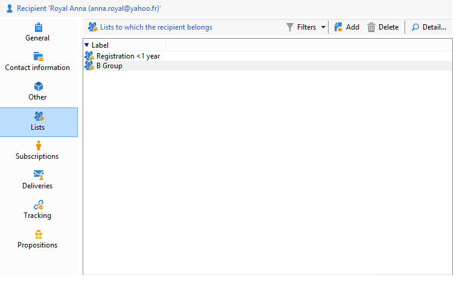

# 編輯設定檔{#editing-a-profile}

若要檢視與用戶檔案相關的資訊，請在用戶檔案清單中按一下其名稱。

用戶檔案的細節會顯示在新的索引標籤中。

用戶檔案相關的資料會被歸類在索引標籤中。

索引標籤及其內容取決於您的設定及安裝的套件。

>[!CAUTION]
>
>透過Adobe Campaign樹狀結構的&#x200B;**[!UICONTROL Administration > Configuration > Data schemas]**&#x200B;節點存取與設定檔表格中的欄位有關的XML結構描述和表單。 只有資深使用者可以變更這些結構描述。
>
>如需詳細資訊，請參閱[本頁面](../../configuration/using/about-schema-edition.md)。

## 一般索引標籤 {#general-tab}

此畫麵包含所選設定檔的所有一般資料。 特別是，它包含姓氏、名字、電子郵件地址、電子郵件接收格式等。其顯示如下：

>[!NOTE]
>
>選取&#x200B;**[!UICONTROL No longer contact (by any channel)]**&#x200B;選項時，表示設定檔位於封鎖清單中，亦即設定檔已表示不希望被連絡（例如，按一下電子報中的取消訂閱連結）。 任何頻道（電子郵件、直接郵件等）上的傳遞不再以他們為目標。 如需詳細資訊，請參閱[此頁面](../../delivery/using/understanding-quarantine-management.md)。

## 聯絡資訊索引標籤 {#contact-information-tab}

此畫麵包含所選設定檔的直接郵件地址。 類似於：

此畫面會顯示位址的品質索引，以及該位址包含多少錯誤。 此資訊是根據先前的傳遞過程中所找到的錯誤直接使用，且無法手動修改。

## 其他索引標籤 {#other-tab}

此畫麵包含使用者定義的欄位，可依需求進行個人化。 您也可以透過&#x200B;**[!UICONTROL Field properties...]**&#x200B;變更欄位名稱並定義其格式，如下所示：

>[!NOTE]
>
>如需欄位屬性和新增欄位的詳細資訊，請參閱[本頁面](../../configuration/using/new-field-wizard.md)。

## 清單索引標籤 {#lists-tab}

此畫面會顯示所選設定檔所屬的群組。 按一下&#x200B;**[!UICONTROL Add]**&#x200B;以訂閱設定檔至清單。 按一下「**[!UICONTROL Detail]**」以顯示說明和選取清單中的設定檔清單。

如需詳細資訊，請參閱[建立及管理清單](../../platform/using/creating-and-managing-lists.md)。

## 訂閱索引標籤 {#subscriptions-tab}

此畫面包含用戶檔案所訂閱的資訊服務。

**[!UICONTROL Detail]**&#x200B;按鈕會顯示所選訂閱的屬性。 **[!UICONTROL Add]**&#x200B;按鈕是用來手動新增訂閱。

如需詳細資訊，請參閱[此頁面](../../delivery/using/managing-subscriptions.md)。

## 傳遞索引標籤 {#deliveries-tab}

此畫面會顯示所選設定檔的傳送記錄。 您也可以顯示透過所有通路傳遞至用戶檔案的傳遞動作標籤、日期和狀態。

## 追蹤索引標籤 {#tracking-tab}

此畫面可讓您檢視所選設定檔的追蹤記錄。 此資訊用於追蹤歸檔用戶於傳遞後的活動。

此索引標籤顯示在傳遞中追蹤的所有 URL 累積數目。

清單的設定可調整，通常包含：點按的 URL、點按的日期與時間，以及包含 URL 的文件。

>[!NOTE]
>
>如需追蹤功能的詳細資訊，請參閱[本頁面](../../delivery/using/delivery-dashboard.md)。
