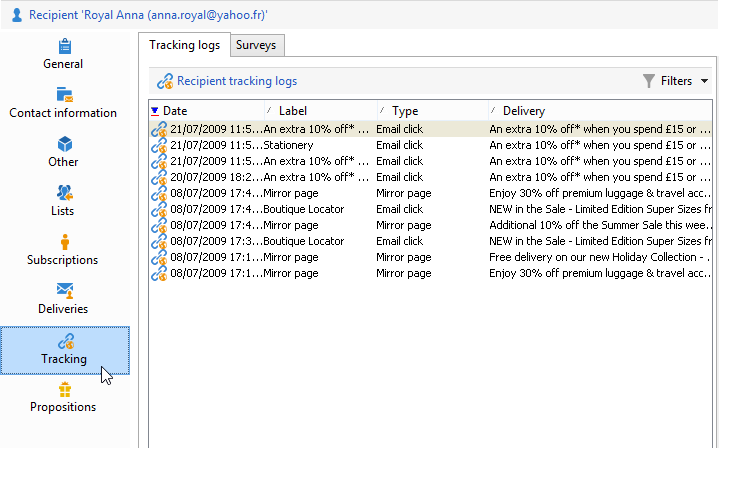

# 編輯配置式{#editing-a-profile}

若要檢視與用戶檔案相關的資訊，請在用戶檔案清單中按一下其名稱。

用戶檔案的細節會顯示在新的索引標籤中。

用戶檔案相關的資料會被歸類在索引標籤中。

索引標籤及其內容取決於您的設定及安裝的套件。

>[!CAUTION]
>
>您可以透過 Adobe Campaign 樹狀結構清單中的 **[!UICONTROL Administration > Configuration > Data schemas]** 節點存取用戶檔案中各欄位的 XML 綱要及表單。只有資深使用者可以變更這些結構描述。
>
>如需詳細資訊，請參閱[本頁面](../../configuration/using/about-schema-edition.md)。

## 一般索引標籤 {#general-tab}

此畫面包含關於所選用戶檔案的全部一般資料。特別是，它包含姓氏、名字、電子郵件地址、電子郵件接收格式等。其顯示如下：

>[!NOTE]
>
>當選取&#x200B;**[!UICONTROL No longer contact (by any channel)]**&#x200B;選項時，這表示描述檔已列在denylist上，亦即描述檔已表示不希望與其聯絡（例如，按一下電子報中的取消訂閱連結）。 我們將不再經由任何通路 (電子郵件、直郵廣告等) 提供傳遞項目。有關詳細資訊，請參見[此頁面](../../delivery/using/understanding-quarantine-management.md)。

## 聯絡資訊索引標籤 {#contact-information-tab}

此畫面包含所選取用戶檔案的直接郵遞地址。類似於：

此畫面顯示地址的品質索引，以及地址所包含的錯誤數目。此資訊是根據先前的傳遞過程中所找到的錯誤直接使用，且無法手動修改。

## 其他索引標籤 {#other-tab}

此畫面包含可根據需求進行個人化設定的使用者定義欄位。您也可以透過&#x200B;**[!UICONTROL Field properties...]**&#x200B;變更欄位名稱並定義其格式，如下所示：

>[!NOTE]
>
>如需欄位屬性和新增欄位的詳細資訊，請參閱[本頁面](../../configuration/using/new-field-wizard.md)。

## 清單索引標籤 {#lists-tab}

此畫面顯示所選用戶檔案所屬的群組。按一下 **[!UICONTROL Add]** 將用戶檔案訂閱至清單。按一下 **[!UICONTROL Detail]** 顯示所選清單中用戶檔案的描述和清單。

有關詳細資訊，請參閱[建立和管理清單](../../platform/using/creating-and-managing-lists.md)。

## 訂閱索引標籤 {#subscriptions-tab}

此畫面包含用戶檔案所訂閱的資訊服務。

**[!UICONTROL Detail]** 按鈕會顯示所選訂閱的屬性。**[!UICONTROL Add]** 按鈕可用來手動新增新訂閱。

有關詳細資訊，請參見[此頁面](../../delivery/using/managing-subscriptions.md)。

## 傳遞索引標籤 {#deliveries-tab}

此畫面顯示所選用戶檔案的傳遞記錄。您也可以顯示透過所有通路傳遞至用戶檔案的傳遞動作標籤、日期和狀態。

## 追蹤索引標籤 {#tracking-tab}

此畫面可讓您檢視所選歸檔用戶的追蹤記錄。此資訊用於追蹤歸檔用戶於傳遞後的活動。

此索引標籤顯示在傳遞中追蹤的所有 URL 累積數目。

清單的設定可調整，通常包含：點按的 URL、點按的日期與時間，以及包含 URL 的文件。

>[!NOTE]
>
>如需追蹤功能的詳細資訊，請參閱[本頁面](../../delivery/using/delivery-dashboard.md)。

