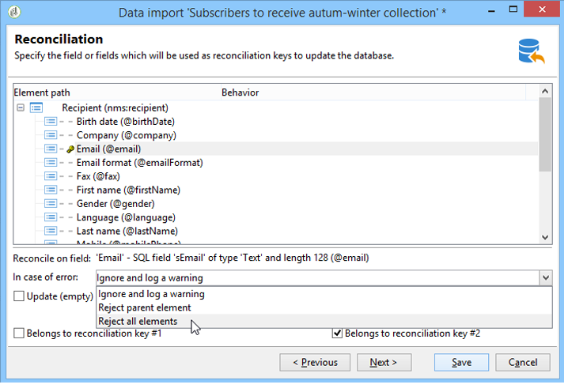
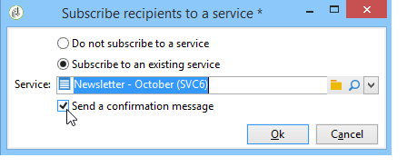

# 設定匯入作業 {#executing-import-jobs}

Adobe Campaign可讓您以文字、CSV、TAB或XML格式，從一或多個檔案將資料匯入資料庫。 這些檔案與表 (主要或連結) 相關聯，並且源檔的每個欄位與資料庫的欄位相關聯。

>[!NOTE]
>
>您可以匯入資料，而無須將其與資料庫資料對應，請使用 **[!UICONTROL Import a list]** 函式。 然後，資料便可透過 **[!UICONTROL Read list]** 物件。 如需詳細資訊，請參閱[此頁面](../../workflow/using/read-list.md)。

匯入精靈可讓您設定匯入、定義其選項（例如資料轉換），以及啟動執行。 它是一系列屏幕，其內容取決於匯入類型 (簡單或多個) 和操作員權限。

建立新的匯入作業後，會顯示匯入精靈(請參閱 [建立匯入和匯出作業](../../platform/using/creating-import-export-jobs.md).

>[!NOTE]
>
>如果使用 IIS Web 伺服器，則可能需要配置以授權上載大檔案 (> 28 MB)。如需詳細資訊，請參閱[本區段](../../installation/using/integration-into-a-web-server-for-windows.md#changing-the-upload-file-size-limit)。

## 來源檔案 {#source-file}

在源檔中，每行與記錄重合。記錄中的資料由分隔符 (空格、製表符、字符等) 分隔。這意味著以行的形式檢索資料，並且每行與資料庫的欄位相關聯。

## 步驟1 — 選擇匯入範本 {#step-1---choosing-the-import-template}

啟動匯入精靈時，首先必須選擇範本。例如，要配置收到簡報的收件者的匯入，請按照以下步驟操作：

1. 選取 **[!UICONTROL Profiles and Targets > Job > Generic imports and exports]** 檔案夾。
1. 點擊&#x200B;**新建**，然後點擊&#x200B;**匯入**&#x200B;以建立匯入範本。

   

1. 按一下 **[!UICONTROL Import template]** 欄位來選取範本，或按一下 **[!UICONTROL Select link]** 來瀏覽樹。

   原生範本為 **[!UICONTROL New text import]**. 不得修改此範本，但您可以根據您的要求復制它以配置新範本。依預設，匯入範本會儲存在 **[!UICONTROL Profiles and targets > Templates > Job templates]** 節點。

1. 在 **[!UICONTROL Label]** 欄位。 您可以添加描述。
1. 在相應欄位中選擇匯入類型。可能的匯入類型有兩種： **[!UICONTROL Simple import]** 僅匯入一個檔案和 **[!UICONTROL Multiple import]** 在單次執行中匯入多個檔案。

   對於多個匯入，請選取 **[!UICONTROL Multiple import]** 從 **[!UICONTROL Import type]** 下拉式清單（在匯入精靈的第一個畫面中）。

   

1. 按一下 **[!UICONTROL Add]**.

   

   每次新增檔案時，畫面會顯示 **[!UICONTROL File to import]** 嚮導。 請參閱區段 [步驟2 — 源檔案選擇](#step-2---source-file-selection) 並依照精靈中的步驟，將匯入選項定義為簡單匯入。

   >[!NOTE]
   >
   >多次匯入應僅滿足特定需求，不建議使用。

### 高級參數 {#advanced-parameters}

此 **[!UICONTROL Advanced parameters]** 連結可讓您存取下列選項：

* **[!UICONTROL General]** 標籤

   * **[!UICONTROL Stop execution if there are too many rejects]**

      按照預設選擇此選項。如果要繼續執行匯入而不考慮拒絕次數，可以取消選擇它。按照預設，如果拒絕前100行，則停止執行。

   * **[!UICONTROL Trace mode]**

      選擇此選項可追蹤每行的匯入執行情況。

   * **[!UICONTROL Start the job in a detached process]**

      按照預設選擇此選項。它允許您分離匯入的執行，以便它不會影響資料庫中正在進行的其他作業。

   * **[!UICONTROL Do not update enumerations]**

      選擇此選項可避免增補資料庫中的枚舉值清單。請參閱 [管理分項清單](../../platform/using/managing-enumerations.md).

* **[!UICONTROL Variables]** 標籤

   您可以定義與可在查詢編輯器和計算欄位中存取的作業關聯的變數。若要建立變數，請按一下 **[!UICONTROL Add]** 和使用變數編輯器。

   >[!IMPORTANT]
   >
   >此 **[!UICONTROL Variables]** 索引標籤僅供工作流程類型程式設計使用，且僅應由專家使用者設定。

## 第 2 步 - 源檔選擇 {#step-2---source-file-selection}

源檔可以是文字格式 (txt、csv、tab、固定行) 或 xml。

依預設， **[!UICONTROL Upload file on the server]** 中所有規則的URL。 按一下右側的資料夾 **[!UICONTROL Local file]** 欄位以瀏覽本機磁碟並選取要匯入的檔案。 您可以取消選擇此選項以輸入存取路徑以及要在伺服器上匯入的檔案名稱。

指定檔案後，可按一下，在視窗的下半部檢視其資料 **[!UICONTROL Auto-detect format]**. 此預覽顯示源檔案的前 200 行。

使用此視圖上方提供的選項配置匯入。通過這些選項定義的參數將傳輸到預覽中。可以使用以下選項：

* **[!UICONTROL Click here to change the file format...]** 可讓您檢查檔案格式並微調設定。
* **[!UICONTROL Update on server...]** 可讓您將本機檔案傳輸至伺服器。 只有在 **[!UICONTROL Upload file on the server]** 中所有規則的URL。
* **[!UICONTROL Download]** 只有在已在伺服器上傳檔案時才可用。
* **[!UICONTROL Auto-detect format]** 可用來重新初始化資料來源的格式。 此選項可讓您將原始格式重新套用至已透過 **[!UICONTROL Click here to change the file format...]** 選項。
* 此 **[!UICONTROL Advanced parameters]** 連結可讓您篩選來源資料及存取進階選項。 在此屏幕中，您可以選擇僅匯入部分檔案。您還可以定義篩選器，例如，根據相應行的值僅匯入「潛在客戶」或「客戶」類型的用戶。這些選項僅供專業 JavaScript 用戶使用。

### 變更檔案格式 {#changing-the-file-format}

此 **[!UICONTROL Click here to change the file format...]** 選項可讓您設定來源檔案的資料格式，尤其是指定欄分隔符號和每個欄位的資料類型。 此配置通過以下視窗執行：

此步驟允許您描述應如何讀取檔案欄位的值。例如，在日期的情況下，日期或日期+時間資料可以與某種格式 (dd/mm/yyyy、mm/dd/yy 等) 相關聯。如果輸入資料與預期格式不匹配，則在匯入期間將發生拒絕。

您可以在視窗下部的預覽區欄位中查看配置結果。

按一下 **[!UICONTROL OK]** 若要儲存格式，請按一下 **[!UICONTROL Next]** 來顯示下一個步驟。

## 第 3 步 - 欄位對應 {#step-3---field-mapping}

然後，您必須選擇目標架構並將每行的資料對應到資料庫中的欄位。

* 此 **[!UICONTROL Destination schema]** 欄位可讓您選取要匯入資料的架構。 此資訊是強制性的。按一下 **[!UICONTROL Select link]** 圖示來選取任何現有結構。 按一下 **[!UICONTROL Edit link]** 顯示所選表的內容。
* 中央表顯示源檔中定義的所有欄位。選擇要匯入的欄位以將目標檔案與它們相關聯。可以手動或自動對應這些欄位。

   要手動對應欄位，請點擊核取方塊以選擇源欄位，然後點擊第二行以激活與所選欄位對應的儲存格。下一步，按一下 **[!UICONTROL Edit expression]** 表徵圖，以顯示當前表的所有欄位。 選取目標欄位，然後按一下 **[!UICONTROL OK]** 以驗證對應。

   要自動關聯源欄位和目標欄位，請按一下 **[!UICONTROL Guess the destination fields]** 表徵圖。 如果需要，可以修改建議的欄位。

   >[!IMPORTANT]
   >
   >在繼續執行下一步之前，必須始終驗證此操作的結果。

* 您可以將轉換應用於匯入的欄位。若要這麼做，請按一下 **[!UICONTROL Transformation]** 欄，並選取要套用的轉換。

   

   >[!IMPORTANT]
   >
   >轉換在匯入時應用。但是，如果已定義了對目標欄位的約束 (在上面的示例中為 @lastname 欄位)，則這些約束優先。

* 您可以使用位於中央表右側的相應圖示添加計算欄位。通過計算欄位，您可以執行複雜的轉換，添加虛擬行或合併多行的資料。有關各種可能性的詳細資訊，請參見以下部分。

### 計算欄位 {#calculated-fields}

計算欄位是添加到源檔並從其他行計算所得到的新行。然後，計算欄位可以與 Adobe Campaign 資料庫的欄位相關聯。但是，在計算欄位中無法進行對帳操作。

有四種類型的計算欄位：

* **[!UICONTROL Fixed string]**:對於源檔案的所有行，計算欄位的值都相同。 允許您設置插入或更新的記錄的欄位值。例如，您可以為所有匯入的記錄將標記設置為「是」。
* **[!UICONTROL String with JavaScript tags]**:計算欄位的值是包含JavaScript命令的字串。
* **[!UICONTROL JavaScript expression]**:計算欄位的值是評估JavaScript函式的結果。 返回的值可以是數字、日期等。
* **[!UICONTROL Enumeration]**:根據源檔案中包含的值來歸因欄位的值。 編輯器允許您指定源行並輸入枚舉值清單，如以下示例所示：

   

   此 **[!UICONTROL Preview]** 索引標籤可讓您檢視定義設定的結果。 這裡， **[!UICONTROL Subscription]** 欄已新增。 該值計算自&#x200B;**狀態**&#x200B;欄位。

   

## 第 4 步 – 調解 {#step-4---reconciliation}

匯入精靈的調解步驟允許您定義將檔案中的資料與資料庫中的現有資料進行調解的模式，並設置檔案資料和資料庫資料之間的優先級規則。配置視窗如下所示：

屏幕的中央部分包含一個樹結構，其中包含要匯入資料的 Adobe Campaign 資料庫的欄位和表。

每個節點 (表或欄位) 都有特殊選項。點擊清單中的相關節點時，其參數和簡要說明將顯示在下方。為每個元素定義的行為會顯示在對應的 **[!UICONTROL Behavior]** 欄。

### 操作類型 {#types-of-operation}

對於匯入相關的每個表，必須定義操作類型。以下操作可用於資料庫的主要元素：

* **[!UICONTROL Update or insertion]**:如果記錄存在於資料庫中，則更新該記錄，如果不存在，則建立該記錄。
* **[!UICONTROL Insertion]**:將記錄插入資料庫。
* **[!UICONTROL Update]**:僅更新現有記錄（忽略其他記錄）。
* **[!UICONTROL Reconciliation only]**:在資料庫中查找記錄，但不執行更新。 例如，允許您根據檔案行關聯要匯入的收件者資料夾，而不更新資料夾中的資料。
* **[!UICONTROL Deletion]**:可讓您銷毀資料庫中的記錄。

匯入所涉及的表中的每個欄位都有以下選項：

* **[!UICONTROL Update (empty) if source value is empty]**:在更新事件中，如果源檔案中的欄位為空，則欄位中的值將刪除資料庫值。 否則，保留資料庫欄位。
* **[!UICONTROL Update only if destination is empty]**:除非資料庫欄位為空，否則源檔案中的值不會覆蓋資料庫欄位中的值。 在這種情況下，它採用源檔的值。
* **[!UICONTROL Update the field only when the record is inserted]**:在更新或插入操作期間，將只導入新的源檔案記錄。

>[!NOTE]
>
>除非在沒有重複資料刪除的情況下插入，否則調解金鑰的定義始終是&#x200B;**必需的**。

### 調解金鑰 {#reconciliation-keys}

必須至少填寫一個調解金鑰才能管理重複資料刪除。

調解金鑰是用於標識記錄的一組欄位。例如，若要匯入收件者，調解金鑰可以是帳號、「電子郵件」欄位或「姓氏、名字、公司」欄位等。

在這種情況下，要查明檔案的某一行是否與資料庫中的現有收件者匹配，匯入引擎會將該檔案的值與該鍵的所有欄位的資料庫值進行比較。當欄位特定於記錄時，可以執行源資料和目標資料之間的精細比較，從而保證匯入後資料的完整性。可以為同一個表填寫第二個調解金鑰；它用於第一個金鑰為空的行。

避免選擇在匯入期間可能被修改的欄位；如果發生這種情況，引擎可以建立其他記錄。

>[!NOTE]
>
>對於收件者匯入，所選資料夾的標識符將隱含地添加到金鑰中。
>
>因此，僅對此資料夾執行調解 (除非未選擇資料夾)。

### 去重複化 {#deduplication}

>[!NOTE]
>
>「兩次」是在要匯入的檔案中存在兩次或更多次的項目。
>
>「重複」是同時存在於要匯入的檔案和資料庫中的項目。

此 **[!UICONTROL Management of doubles]** 欄位可讓您設定重複資料刪除。 重複資料刪除涉及&#x200B;**在源檔中**&#x200B;多次出現的記錄 (或多檔案匯入時的源檔)，即調解金鑰的欄位相同的行。

* 在中複製管理 **[!UICONTROL Update]** 模式（預設模式）不執行重複資料刪除。 因此，最後一條記錄具有優先權 (因為它更新了先前記錄的資料)。在此模式下不執行重複計數。
* 在中複製管理 **[!UICONTROL Ignore]** 模式或 **[!UICONTROL Reject entity]** 從匯入中排除重複項目。 在這種情況下，不會匯入任何記錄。
* 在 **[!UICONTROL Reject entity]** 模式，則不會匯入元素，且匯入記錄中會產生錯誤。
* 在 **[!UICONTROL Ignore]** 模式，則不會匯入元素，但不會保留錯誤的追蹤。 此模式可讓您優化性能。

>[!IMPORTANT]
>
>重複資料刪除僅在內存中執行。因此，具有重複資料刪除的匯入的大小是有限的。限制取決於幾個參數 (應用程序伺服器的容量，活動，金鑰中的欄位數等)。重複資料刪除的最大大小為 1,000,000 行。

重複資料刪除涉及源檔和資料庫中都存在的記錄。它僅涉及更新的操作(即 **[!UICONTROL Update and insertion]** 或 **[!UICONTROL Update]**)。 此 **[!UICONTROL Duplicate management]** 選項允許更新或忽略記錄（如果記錄同時位於源檔案和資料庫中）。 此 **[!UICONTROL Update or insert based on origin]** 選項屬於選用模組，無法在標準內容中使用。

選項 **[!UICONTROL Reject]** 和 **[!UICONTROL Ignore]** 如上所述運作。

### 發生錯誤時 {#behavior-in-the-event-of-an-error}

大多數資料傳輸操作都會產生各種類型的錯誤（不相符的行格式、無效的電子郵件地址等）。 匯入引擎生成的所有錯誤和所有警告都將儲存並連結到匯入執行個體。

這些拒絕的詳細資訊可透過 **[!UICONTROL Rejects]** 標籤。

拒絕類型有兩種(類型會顯示在 **[!UICONTROL Connector]** 欄):

* 拒絕文字連接器涉及在處理檔案行時發生的錯誤 (計算欄位、資料分析等)。在這種情況下，如果發生錯誤，則始終拒絕整行。
* 資料庫連接器拒絕涉及資料調解或寫入資料庫期間發生的錯誤。在匯入到多個表的情況下，拒絕只涉及記錄的一部分 (例如，對於收件者和相關事件的匯入，錯誤可以阻止更新事件而不拒絕接收者)。

在資料調解頁面中，您可以按欄位和逐個表定義所需的錯誤管理類型欄位。

* **[!UICONTROL Ignore and log a warning]**:除了生成錯誤的欄位外，所有欄位都導入到資料庫中。
* **[!UICONTROL Reject parent element]**:記錄的整行被拒絕，而不僅是導致錯誤的欄位。
* **[!UICONTROL Reject all elements]**:導入停止，並拒絕記錄的所有元素。

   

匯入執行個體的拒絕屏幕中的樹結構指示哪些欄位被拒絕以及錯誤發生的位置。

您可以透過 **[!UICONTROL Export rejects]** 圖示：

## 第 5 步 - 匯入收件者時的附加步驟 {#step-5---additional-step-when-importing-recipients}

匯入精靈的下一步允許您選擇或建立將匯入資料的資料夾，自動將匯入的收件者對應於 (新的或現有的) 清單，並將收件者訂閱到服務。

>[!NOTE]
>
>在僅匯入收件者時以及使用預設的 Adobe Campaign 收件者表 (**nms:recipient**) 時，將顯示此步驟。

* 按一下 **[!UICONTROL Edit]** 連結以選擇要關聯或訂閱收件者的資料夾、清單或服務。

   1. 匯入到資料夾中

      此 **[!UICONTROL Edit...]** 連結 **[!UICONTROL Import into a folder]** 區段可讓您選取或建立要匯入收件者的資料夾。 按照預設，如果未定義分區，則會將資料匯入到操作員的預設資料夾中。

      >[!NOTE]
      >
      >操作員的預設資料夾是操作員具有寫存取權限的第一個資料夾。深入了解 [資料夾存取管理](../../platform/using/access-management-folders.md).

      若要選取匯入資料夾，請按一下 **[!UICONTROL Folder]** 欄位，然後選取相關資料夾。 您也可以使用 **[!UICONTROL Select link]** 表徵圖在新窗口中顯示樹或建立新資料夾。

      

      要建立新資料夾，請選擇要從中添加資料夾的節點，然後按滑鼠右鍵。選取 **[!UICONTROL Create a new 'Recipients' folder]**。

      

      該資料夾添加到當前節點下方。輸入新資料夾的名稱，按Enter以確認，然後按一下 **[!UICONTROL OK]**.

      

   1. 與清單相關聯

      此 **[!UICONTROL Edit...]** 連結 **[!UICONTROL Add recipients to a list]** 區段可讓您選取或建立要匯入收件者的清單。

      

      您可以按一下 **[!UICONTROL Select link]**，然後 **[!UICONTROL Create]**. 清單的建立及管理於 [本節](../../platform/using/creating-and-managing-lists.md).

      

      您可以決定將收件者添加到清單中已存在的收件者，或者使用新收件者重新建立清單。在這種情況下，如果清單已包含收件者，則它們將被刪除並由匯入的收件者替換。

   1. 訂閱服務

      若要將所有匯入的收件者訂閱至資訊服務，請按一下 **[!UICONTROL Edit...]** 連結 **[!UICONTROL Subscribe recipients to a service]** 區段，以選取或建立收件者將訂閱的資訊服務。 您可以選取 **[!UICONTROL Send a confirmation message]** 選項：此訊息的內容在與訂閱服務相關聯的傳遞範本中定義。

      

      您可以按一下 **[!UICONTROL Select link]** 然後 **[!UICONTROL Create]** 表徵圖。 [本節](../../delivery/using/managing-subscriptions.md)介紹了資訊服務的管理。

* 使用 **[!UICONTROL Origin]** 欄位，將收件者來源的相關資訊新增至其設定檔。 此資訊在多重匯入的框架內特別有用。

按一下 **[!UICONTROL Next]** 來驗證此步驟並顯示下列步驟。

## 步驟6 — 啟動匯入 {#step-6---launching-the-import}

精靈的最後一步允許您啟動資料匯入。若要這麼做，請按一下 **[!UICONTROL Start]** 按鈕。

然後，您可以監視匯入作業的執行(請參閱 [監視作業執行](../../platform/using/monitoring-jobs-execution.md).
