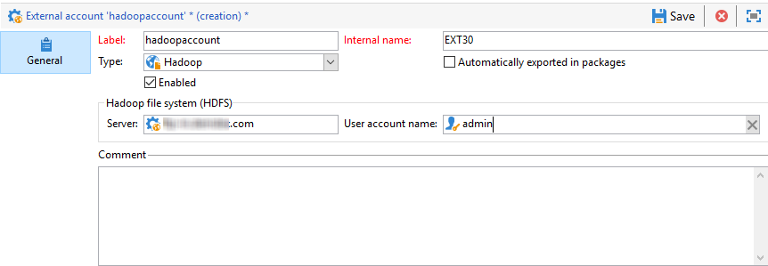

# 外部帳戶{#external-accounts}

外部帳戶是可讓您設定並測試對Adobe Campaign外部伺服器的存取權的設定。 這些外部帳戶可用於促銷活動工作流程，以存取和管理資料。

您可以設定下列外部帳戶類型：

* [傳送外部帳戶](#routing-external-account)
* [FTP外部帳戶](#ftp-external-account)
* [外部資料庫外部帳戶](#external-database-external-account)
* [Web Analytics外部帳戶](#web-analytics-external-account)
* [Facebook Connect外部帳戶](#facebook-connect-external-account)
* [執行實例外部帳戶](#execution-instance-external-account)
* [Adobe Experience Cloud外部帳戶](#adobe-experience-cloud-external-account)
* [SFTP外部帳戶](#sftp-external-account)
* [Adobe Experience Manager外部帳戶](#adobe-experience-manager-external-account)
* [Amazon Simple Storage Service(S3)外部帳戶](#amazon-simple-storage-service--s3--external-account)
* [Azure外部帳戶](#azure-external-account)
* [Hadoop外部帳戶](#hadoop-external-account)
* [Microsoft Dynamics CRM外部帳戶](#microsoft-dynamics-crm-external-account)
* [Oracle on demand外部帳戶](#oracle-on-demand-external-account)
* [Salesforce CRM外部帳戶](#salesforce-crm-external-account)

## 建立外部帳戶 {#creating-an-external-account}

Adobe Campaign隨附一組預先定義的外部帳戶。 若要設定與外部系統（例如用於檔案傳輸的FTP伺服器）的連線，您可以建立自己的外部帳戶。

技術流程（例如技術工作流程或宣傳工作流程）會使用外部帳戶。 在工作流程中或與任何其他應用程式（Adobe Target、Experience Manager等）進行資料交換時，您需要選取外部帳戶。

1. 從中 **[!UICONTROL Explorer]**&#x200B;展開菜 **[!UICONTROL Administration]** 單。
1. 展開功 **[!UICONTROL Platform]** 能表並按一下 **[!UICONTROL External accounts]**。

   

1. 按一下&#x200B;**[!UICONTROL New]**&#x200B;按鈕。

   

1. 輸入和 **[!UICONTROL Label]** 和 **[!UICONTROL Internal Name]**。 在工作流程中選取外部帳戶時，都會使用兩者。
1. 如 **[!UICONTROL Enabled]** 果希望啟用連接，請選中。
1. 選擇您要建 **[!UICONTROL Type]** 立的外部帳戶。
1. 根據所選的外部帳戶類型指定憑證，以設定帳戶的存取權。

   所需資訊通常由您所連接的伺服器提供商提供。

1. 按一下「**[!UICONTROL Save]**」。

外部帳戶會建立並新增至外部帳戶清單。 它現在可用於工作流活動和傳送屬性中的資料／檔案傳輸或路由配置。

## 彈回郵件外部帳戶 {#bounce-mails-external-account}

Bouncemails **外部帳戶** ，指定用來連線至電子郵件服務的外部POP3帳戶。 For more on this external account, refer to this [page](../../workflow/using/inbound-emails.md).

為POP3訪問配置的所有伺服器都可用於接收返回郵件。


要配置外部 **[!UICONTROL Bounce mails (defaultPopAccount)]** 帳戶：

* **[!UICONTROL Server]**

   POP3伺服器的URL。

* **[!UICONTROL Port]**

   POP3連接埠號。 預設埠為110。

* **[!UICONTROL Account]**

   用戶名。

* **[!UICONTROL Password]**

   使用者帳戶密碼。

* **[!UICONTROL Encryption]**

   在、或之間選擇的 **[!UICONTROL By default]**&#x200B;加密 **[!UICONTROL POP3 + STARTTLS]**&#x200B;類 **[!UICONTROL POP3]** 型 **[!UICONTROL POP3S]**。

## 傳送外部帳戶 {#routing-external-account}

外 **[!UICONTROL Routing]** 部帳戶可讓您根據所安裝的套件，設定Adobe Campaign中的每個可用渠道。


可以配置以下通道：

* [電子郵件](../../installation/using/deploying-an-instance.md#email-channel-parameters)
* [行動(SMS)](../../delivery/using/sms-channel.md#creating-an-smpp-external-account)
* [電話](../../delivery/using/other-channels.md)
* [直接郵件](../../delivery/using/about-direct-mail-channel.md)
* [代理商](../../delivery/using/other-channels.md)
* [Facebook](../../social/using/publishing-on-facebook-walls.md#delegating-write-access-to-adobe-campaign)
* [Twitter](../../social/using/configuring-publishing-on-twitter.md)
* [iOS頻道](../../delivery/using/configuring-the-mobile-application.md#configuring-the-mobile-application-ios)
* [Android頻道](../../delivery/using/configuring-the-mobile-application.md#configuring-the-mobile-application-android)

## FTP外部帳戶 {#ftp-external-account}

FTP外部帳戶可讓您設定並測試對Adobe Campaign以外伺服器的存取。 若要設定與外部系統（例如用於檔案傳輸的FTP伺服器898）的連線，您可以建立自己的外部帳戶。 For more on this, refer to this [page](../../workflow/using/file-transfer.md).

若要這麼做，請在此外部帳戶中指定用來建立與FTP伺服器連線的位址和認證


* **[!UICONTROL Server]**

   FTP伺服器的名稱。

* **[!UICONTROL Port]**

   FTP連接埠號。 預設埠為21。

* **[!UICONTROL Account]**

   用戶名。

* **[!UICONTROL Password]**

   使用者帳戶密碼。

* **[!UICONTROL Encryption]**

   或之間選擇的加密 **[!UICONTROL None]** 類型 **[!UICONTROL SSL]**。

要知道這些憑據的位置，請參閱此 [頁](https://help.dreamhost.com/hc/en-us/articles/115000675027-FTP-overview-and-credentials)。

## 外部資料庫外部帳戶 {#external-database-external-account}

Adobe Campaign提供數種連接器，可讓您與外部應用程式通訊並連接至資料庫引擎。


可以配置以下連接類型：

* Azure突觸。 For more information, refer to this [page](../../platform/using/specific-configuration-database.md#configure-access-to-azure-synapse).
* 甲骨文。 For more information, refer to this [page](../../platform/using/specific-configuration-database.md#configure-access-to-oracle).
* 內泰扎。 For more information, refer to this [page](../../platform/using/specific-configuration-database.md#configure-access-to-netezza).
* SAP HANA。 For more information, refer to this [page](../../platform/using/specific-configuration-database.md#configure-access-to-sap-hana).
* InfiniDB
* Microsoft SQL Server
* AsterData
* PostgreSQL
* Teradata
* DB2
* Amazon Redshift
* ODBC(Sybase ASE、Sybase IQ)
* HTTP中繼到遠程資料庫

### 雪花外部帳戶 {#snowflake-external-account}

Snowflake外 **** 部帳戶可讓您將Campaign例項連接至Snowflake外部資料庫。 如需如何使用Snowflake設定Campaign Classic的詳細資訊，請參閱此 [頁](../../platform/using/specific-configuration-database.md#configure-access-to-snowflake)。

若要設定此外部帳戶以搭配Adobe Campaign運作，您必須提供下列詳細資訊：

* **[!UICONTROL Server]**

       雪花伺服器的URL。
   
* **[!UICONTROL Account]**

       用戶名。
   
* **[!UICONTROL Password]**

       使用者帳戶密碼。
   
* **[!UICONTROL Database]**

       資料庫的名稱。
   


### Teradata外部帳戶 {#teradata-external-account}

Teradata外 **** 部帳戶可讓您將Campaign例項連線至Teradata外部資料庫。 如需如何使用Teradata設定Campaign Classic的詳細資訊，請參閱本 [頁](https://helpx.adobe.com/campaign/kb/campaign_fda_teradata.html) 或本 [節](../../platform/using/specific-configuration-database.md#configure-access-to-teradata)。


若要設定此外部帳戶以搭配Adobe Campaign運作，您必須提供下列詳細資訊：

* **[!UICONTROL Type]**

   選擇類 **[!UICONTROL Teradata]** 型。

* **[!UICONTROL Server]**

   Teradata伺服器的URL或名稱。

* **[!UICONTROL Account]**

   用於訪問Teradata資料庫的帳戶的名稱。

* **[!UICONTROL Password]**

   用於連接到Teradata資料庫的口令。

* **[!UICONTROL Database]**

   此欄位可留空。

* **[!UICONTROL Options]**

   要通過Teradata傳遞的選項。

* **[!UICONTROL Timezone]**

   Teradata中設定的時區。


當多個Adobe Campaign使用者連線至相同的FDA Teradata外部帳戶時，標籤可讓您在作業階段中設定查詢頻帶，即一組金鑰／值配對。 **[!UICONTROL Query banding]**

每次Campaign使用者對Teradata資料庫執行查詢時，Adobe Campaign都會傳送中繼資料，其中包含與此使用者相關的索引鍵清單。 然後Teradata管理員就可以將這些資料用於稽核或管理存取權限。

勾選方 **[!UICONTROL Active]** 塊以啟用此功能

此 **[!UICONTROL Default]** 欄位可讓您輸入預設查詢節區，當使用者沒有關聯的查詢節區時，將會使用此查詢節區。 如果此欄位留空，則沒有查詢節區的使用者將無法使用Teradata。

該 **[!UICONTROL Users]** 欄位允許您為每個用戶指定查詢節區。 您可以根據需要添加任意數量的鍵／值對，例如priority=1;workload=high。 如果用戶未分配查詢節區，則 **[!UICONTROL Default]** 將應用該欄位。

For more information on **[!UICONTROL Query banding]**, refer to the [Teradata documentation](https://docs.teradata.com/reader/cY5B~oeEUFWjgN2kBnH3Vw/a5G1iz~ve68yTMa24kVjVw).

## Web Analytics外部帳戶 {#web-analytics-external-account}

外 **[!UICONTROL Web Analytics (Adobe Analytics - Data connector)]** 部帳戶可讓您將資料從Adobe Analytics轉送至Adobe Campaign的區段形式。 相反地，它會將Adobe Campaign傳送的電子郵件促銷活動指標和屬性傳送至Adobe Analytics —— 資料連接器。


對於此外部帳戶，必須豐富追蹤URL的計算公式，並且必須核准兩個解決方案之間的連線。 For more on this, refer to this [page](../../platform/using/adobe-analytics-data-connector.md#step-2--create-the-external-account-in-campaign).

## Facebook Connect外部帳戶 {#facebook-connect-external-account}

外部 **[!UICONTROL Facebook Connect]** 帳戶可讓您在Facebook應用程式中顯示個人化內容，讓透過此社交網路取得潛在客戶變得更輕鬆。

對於每個Facebook應用程式，您都需要建立類 **[!UICONTROL Facebook Connect]** 型外部帳戶。 For more on this, refer to [page](../../social/using/creating-a-facebook-application.md#configuring-external-accounts).


* **[!UICONTROL Hosting mode]**

   或之間應用程式的代管 **[!UICONTROL hosted by a partner]** 模式 **[!UICONTROL hosted by this instance]**。

* **[!UICONTROL Application ID]**

   您Facebook應用程式的應用程式ID。

* **[!UICONTROL Application secret]**

   您Facebook應用程式的應用程式密碼。

如果您選擇由此例項模式代管，則「安全畫布URL」必須貼入Facebook上的 **Facebook網頁遊戲(https)** 欄位

要知道這些憑據的位置，請參閱此 [頁](https://developers.facebook.com/docs/facebook-login/access-tokens)。

## 執行實例外部帳戶 {#execution-instance-external-account}

如果您有劃分的架構，則需要指定連結至控制例項的執行例項，並加以連接。 事務性消息模板部署到執行實例


* **[!UICONTROL URL]**

   安裝執行實例的伺服器的URL。

* **[!UICONTROL Account]**

   帳戶名稱，它必須與在運算子資料夾中定義的「訊息中心代理」相符。

* **[!UICONTROL Password]**

   操作員資料夾中定義的帳戶密碼。

For more information on this configuration, refer to this [page](../../message-center/using/creating-a-shared-connection.md#control-instance).

## Adobe Experience Cloud外部帳戶 {#adobe-experience-cloud-external-account}

若要使用Adobe ID連線至Adobe Campaign主控台，您必須設定外 **[!UICONTROL Adobe Experience Cloud (MAC)]** 部帳戶。


* **[!UICONTROL IMS server]**

   IMS伺服器的URL。 請確定舞台和生產執行個體都指向相同的IMS生產端點。

* **[!UICONTROL IMS scope]**

   此處定義的範圍必須是IMS所布建範圍的子集。

* **[!UICONTROL IMS client identifier]**

   IMS用戶端的ID。

* **[!UICONTROL IMS client secret]**

   IMS用戶端機密的憑證。

* **[!UICONTROL Callback server]**

   存取Adobe Campaign例項的URL。

* **[!UICONTROL IMS organization ID]**

   IMS組織的ID。 若要尋找您的組織ID，請參 [閱此頁](https://marketing.adobe.com/resources/help/en_US/mcloud/faq.html) (我&#x200B;**可在何處找到我的IMS組織ID?**)。

* **[!UICONTROL Association mask]**

   可讓Enterprise Dashboard中的設定名稱與Adobe Campaign中的群組同步的語法。

* **[!UICONTROL Server]**

   Adobe Experience Cloud實例的URL。

* **[!UICONTROL Tenant]**

   您的Adobe Experience Cloud租用戶名稱。

For more information on this configuration, refer to this [page](../../integrations/using/configuring-ims.md).

## SFTP外部帳戶 {#sftp-external-account}

SFTP外部帳戶可讓您設定並測試對Adobe Campaign以外伺服器的存取。 若要設定與外部系統（例如用於檔案傳輸的SFTP）的連線，您可以建立自己的外部帳戶。 For more on this, refer to this [page](../../workflow/using/file-transfer.md).


* **[!UICONTROL Server]**

   SFTP伺服器的URL。

* **[!UICONTROL Port]**

   FTP連接埠號。 預設埠為22。

* **[!UICONTROL Account]**

   用來連線至SFTP伺服器的帳戶名稱。

* **[!UICONTROL Password]**

   用於連接到SFTP伺服器的口令。

## Adobe Experience Manager外部帳戶 {#adobe-experience-manager-external-account}

外 **[!UICONTROL AEM (AEM instance)]** 部帳戶可讓您直接在Adobe Experience Manager中管理電子郵件傳送內容以及表單。


* **[!UICONTROL Server]**

   Adobe Experience Manager伺服器的URL。

* **[!UICONTROL Port]**

   用來連線至Adobe Experience Manager製作例項的帳戶名稱。

* **[!UICONTROL Password]**

   用來連線至Adobe Experience Manager製作例項的密碼。

For more on this, refer to this [section](../../integrations/using/about-adobe-experience-manager.md).

## Amazon Simple Storage Service(S3)外部帳戶 {#amazon-simple-storage-service--s3--external-account}

Amazon Simple Storage Service(S3)連接器可用來匯入或匯出資料至Adobe Campaign。 可在工作流活動中設定。 For more on this, refer to this [page](../../workflow/using/file-transfer.md).


當您設定此新外部帳戶時，您必須提供下列詳細資訊：

* **[!UICONTROL AWS S3 Account Server]**

   伺服器的URL，應填入如下：

   ```
   <S3bucket name>.s3.amazonaws.com/<s3object path>
   ```

* **[!UICONTROL AWS access key ID]**

   要瞭解在何處查找您的AWS訪問密鑰ID，請參閱本 [頁](https://docs.aws.amazon.com/general/latest/gr/aws-sec-cred-types.html#access-keys-and-secret-access-keys) 。

* **[!UICONTROL Secret access key to AWS]**

   要瞭解在何處找到AWS的秘密訪問密鑰，請參閱本 [頁](https://aws.amazon.com/fr/blogs/security/wheres-my-secret-access-key/)。

* **[!UICONTROL AWS Region]**

   要瞭解有關AWS地區的更多資訊，請參閱本 [頁](https://aws.amazon.com/about-aws/global-infrastructure/regions_az/)。

* 核取 **[!UICONTROL Use server side encryption]** 方塊可讓您以S3加密模式儲存檔案。

要瞭解在何處查找訪問密鑰ID和秘密訪問密鑰，請參閱Amazon Web services文 [檔](https://docs.aws.amazon.com/general/latest/gr/aws-sec-cred-types.html#access-keys-and-secret-access-keys) 。

## Azure外部帳戶 {#azure-external-account}

外 **[!UICONTROL Azure]** 部帳戶可啟用與共用外部資料庫的連線，只要此連線是作用中的，您就可透過Adobe Campaign存取資料庫。


* **[!UICONTROL Server]**

   Azure伺服器的URL。

* **[!UICONTROL Encryption]**

   或之間選擇的加密 **[!UICONTROL None]** 類型 **[!UICONTROL SSL]**。

* **[!UICONTROL Access key]**

   要瞭解在何處查找訪問密鑰，請參閱此頁 [](https://docs.microsoft.com/en-us/azure/storage/common/storage-account-manage) (「查看」 **和複製訪問密鑰**)。

## Hadoop外部帳戶 {#hadoop-external-account}

外 **[!UICONTROL Hadoop]** 部帳戶可啟用與共用外部資料庫的連線，只要此連線是作用中的，您就可透過Adobe Campaign存取資料庫。 有關如何配置對Hadoop訪問的詳細資訊，請參 [閱](../../platform/using/specific-configuration-database.md#configure-access-to-hadoop)。



* **[!UICONTROL Server]**

   Hadoop伺服器的URL。

* **[!UICONTROL User account name]**

   用於訪問Hadoop的帳戶的名稱。

## Microsoft Dynamics CRM外部帳戶 {#microsoft-dynamics-crm-external-account}

外 **[!UICONTROL Microsoft Dynamics CRM]** 部帳戶可讓您將Microsoft Dynamics資料匯入並匯出至Adobe Campaign。

Microsoft Dynamics連接器搭配Adobe Campaign運作的設定視您的部署類型而定。
對於 **[!UICONTROL On-premise]** 和部 **[!UICONTROL Office 365]** 署類型，您需要提供下列詳細資訊：


* **[!UICONTROL Account]**

   用來登入Microsoft CRM的帳戶。

* **[!UICONTROL Server]**

   Microsoft CRM伺服器的URL。

* **[!UICONTROL Password]**

   用於登入Microsoft CRM的密碼。

* **[!UICONTROL Company name]** 針對內部部署和Office 365部署

   您的公司名稱。

* **[!UICONTROL Organization name]** 內部部署

   組織名稱。
可在Microsoft Dynamics的「開發人員資源」儀表板中找到的組織名稱，欄 **[!UICONTROL Unique Name]** 位。

* **[!UICONTROL CRM version]** 針對內部部署

   CRM的版本，介 **[!UICONTROL Dynamics CRM 2007]**&#x200B;於 **[!UICONTROL Dynamics CRM 2015]** 或 **[!UICONTROL Dynamics CRM 2016]**。

有了 **[!UICONTROL Web API]** 部署類型 **[!UICONTROL Password credentials]** 和驗證，您需要提供下列詳細資訊：


* **[!UICONTROL Account]**

   用來登入Microsoft CRM的帳戶。

* **[!UICONTROL Server]**

   Microsoft CRM伺服器的URL。

* **[!UICONTROL Client identifier]**

   可從類別欄位中的Microsoft Azure管理入口網站找到用戶 **[!UICONTROL Update your code]** 端ID **[!UICONTROL Client ID]** 。

* **[!UICONTROL CRM version]**

   CRM的版本，介 **[!UICONTROL Dynamics CRM 2007]**&#x200B;於 **[!UICONTROL Dynamics CRM 2015]** 或 **[!UICONTROL Dynamics CRM 2016]**。

有了 **[!UICONTROL Web API]** 部署類型 **[!UICONTROL Certificate]** 和驗證，您需要提供下列詳細資訊：


* **[!UICONTROL Server]**

   Microsoft CRM伺服器的URL。

* **[!UICONTROL Private Key (Base64 encoded)]**

   編碼為Base64的私密金鑰

* **[!UICONTROL Custom Key identifier]**

* **[!UICONTROL Key ID]**

* **[!UICONTROL Client identifier]**

   可從類別欄位中的Microsoft Azure管理入口網站找到用戶 **[!UICONTROL Update your code]** 端ID **[!UICONTROL Client ID]** 。

* **[!UICONTROL CRM version]**

   CRM的版本，介 **[!UICONTROL Dynamics CRM 2007]**&#x200B;於 **[!UICONTROL Dynamics CRM 2015]** 或 **[!UICONTROL Dynamics CRM 2016]**。

For more information on this configuration, refer to this [page](../../platform/using/crm-connectors.md#example-for-microsoft-dynamics).

## Oracle on demand外部帳戶 {#oracle-on-demand-external-account}

外部 **[!UICONTROL Oracle on demand]** 帳戶可讓您將Oracle資料匯入並匯出至Adobe Campaign。


要配置Oracle on demand外部帳戶以與Adobe Campaign一起使用，您需要提供以下詳細資訊：

* **[!UICONTROL Account]**

   用於按需登錄Oracle CRM的帳戶。

* **[!UICONTROL Server]**

   Oracle CRM on demand伺服器的URL。

* **[!UICONTROL Password]**

   用於按需登錄Oracle CRM的口令。

For more information on this configuration, refer to this [page](../../platform/using/crm-connectors.md#example-for-oracle-on-demand).

## Salesforce CRM外部帳戶 {#salesforce-crm-external-account}

外部 **[!UICONTROL Salesforce CRM]** 帳戶可讓您將Salesforce資料匯入並匯出至Adobe Campaign。


若要設定Salesforce CRM外部帳戶以搭配Adobe Campaign運作，您必須提供下列詳細資訊：

* **[!UICONTROL Account]**

   用來登入Salesforce CRM的帳戶。

* **[!UICONTROL Password]**

   用於登入Salesforce CRM的密碼。

* **[!UICONTROL Client identifier]**

   若要知道在何處找到您的客戶識別碼，請參閱本 [頁](https://help.salesforce.com/articleView?id=000205876&amp;type=1)。

* **[!UICONTROL Security token]**

   若要瞭解在何處找到您的安全Token，請參閱本 [頁](https://help.salesforce.com/articleView?id=000205876&amp;type=1)。

* **[!UICONTROL API version]**

   API的版本，介 **[!UICONTROL Version 37]**&#x200B;於 **[!UICONTROL Version 21]** 或 **[!UICONTROL Version 15]**。

對於此外部帳戶，您需要使用設定精靈來設定您的Salesforce CRM。

For more information on this configuration, refer to this [page](../../platform/using/crm-connectors.md#example-for-salesforce-com).
