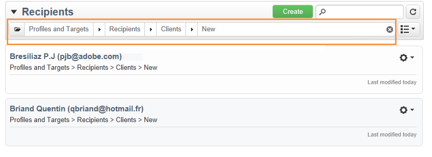

# 篩選選項{#filtering-options}

## 關於篩選 {#about-filtering}

依預設，Adobe Campaign會顯示相關運算子具有讀取權限的資料庫中的所有資料。

您可以透過瀏覽器視窗上方區段的選項來篩選此資料。

篩選要顯示的資料有數種方式。 如有必要，可搭配使用：

* 對資料夾進行篩選，請參閱[按資料夾篩選](#filter-by-folder),
* 依狀態篩選，請參閱[依狀態篩選](#filter-by-status),
* 資料排序，請參閱[依](#order-by)排序，
* 搜尋，請參閱[快速搜尋](#quick-search)。

## 依資料夾篩選 {#filter-by-folder}

按一下&#x200B;**[!UICONTROL Folder]**&#x200B;圖示，以選取包含要顯示之資料的資料夾。

只會顯示資料夾中的設定檔：

使用資料夾選取欄位右側的交叉點，返回預設顯示模式。

## 依狀態篩選 {#filter-by-status}

您可以依狀態或依狀態套用篩選，視顯示的資訊類型而定。 例如，對於傳送，您可以選擇只顯示已完成的傳送，如下所示：

## 訂購依據 {#order-by}

您可以透過「每個資料夾」篩選欄位右側的下拉式清單，選取頁面上提供資料的排序順序。 此欄位的內容取決於頁面上的資料類型。

例如，您可以按優先順序、建立日期或字母順序來排序任務。

## 快速搜尋 {#quick-search}

使用搜尋欄位來快速存取您要尋找的項目：輸入要顯示的項目的標籤或內部名稱中包含的字元，然後確認對頁面上的資料應用自動篩選。

若要再次顯示所有項目，請按一下交叉點以刪除搜尋欄位的內容。
