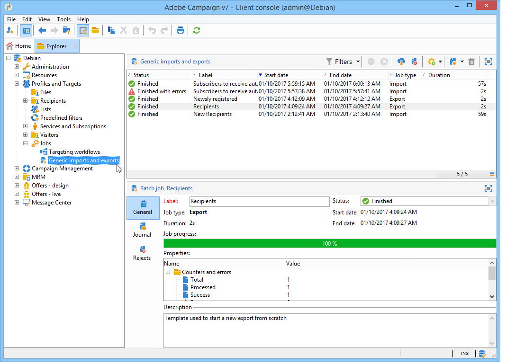

# 一般匯入和匯出{#generic-imports-and-exports}

Adobe Campaign 提供了一個資料匯出模組，可以輕鬆提取客戶或潛在客戶清單 (例如，在定位操作之后)，然後他們將成為目標人群的一部分。

Adobe Campaign 還提供了一個匯入模組，可讓您使用外部檔案為資料庫提供資料。

>[!NOTE]
>
>Exports and imports are configured in dedicated templates executed through workflows via the **[!UICONTROL Import]** and **[!UICONTROL Export]** activities. 它們可以根據時間表自動重複，例如多個資訊系統之間的自動化資料交換。If necessary, you can create an occasional import or export via the **[!UICONTROL Profiles and Targets > Jobs > Generic imports and exports]** node of the Adobe Campaign tree.

您可以：

* 建立匯入或匯出範本並對其進行配置 (參見下文)。
* 建立匯入或匯出：請參閱匯 [出資料](../../platform/using/exporting-data.md) 或匯 [入資料](../../platform/using/importing-data.md)。
* 啟動導入或導出並監視其執行。 請參閱執 [行追蹤](#execution-tracking)。

>[!CAUTION]
>
>Campaign 中的資料匯入應通過工作流程執行，以確保資料一致性並提高效率。有關詳細資訊，請參見[匯入資料](../../workflow/using/importing-data.md)、[匯入最佳實作](../../workflow/using/importing-data.md#best-practices-when-importing-data)和[匯入範本示例](../../workflow/using/importing-data.md#setting-up-a-recurring-import)部分。

## 建立作業範本 {#creating-a-job-template}

Import and export templates are stored in the **[!UICONTROL Resources > Templates > Job templates]** directory of the Adobe Campaign tree.

按照預設，此目錄中存在三個匯入範本和一個匯出範本。不得更改它們。You can duplicate them to create your own templates or create a new template via the **[!UICONTROL New > Import template]** / **[!UICONTROL Export template]** menu.

建立流程模板的過程在導出嚮導和導 [入嚮導](../../platform/using/exporting-data.md#export-wizard)[中顯示](../../platform/using/importing-data.md#import-wizard)。

>[!NOTE]
>
>The native template **[!UICONTROL Import blacklist]** is already configured to import a list of blacklisted e-mail addresses.
> 
>此 **[!UICONTROL New text import]** 和 **[!UICONTROL New text export]** 範本可讓您從頭開始設定匯入或匯出。

## 建立新的匯入/匯出 {#creating-a-new-import-export}

配置範本後，可以在 Adobe Campaign 中的不同內容中啟動匯入和匯出操作。

所有這些操作都打開了[匯入](../../platform/using/importing-data.md)或[匯出](../../platform/using/exporting-data.md#export-wizard)精靈。

* In the **[!UICONTROL Profiles and targets]** section of Adobe Campaign workspace, click the **[!UICONTROL Jobs]** link: this takes you to the list of existing imports and exports.

   Click the **[!UICONTROL Create]** button and select the type of job you want to perform.

   

* 您還可以從工作區的「監督」部分啟動匯入和匯出：兩個專用連結使您可以直接啟動匯入或匯出。

   

* 也可以從 Adobe Campaign Explorer 啟動匯入和匯出。

   若要匯出／匯入資料，請按一 **[!UICONTROL Profiles and Targets > Jobs > Generic imports and exports]** 下節點、圖 **[!UICONTROL New]** 示，然後選取 **[!UICONTROL Export]** 或 **[!UICONTROL Import]**。 這將打開相應的精靈。

   

## 執行追蹤 {#execution-tracking}

您可以在此編輯器的上半部分查看執行的追蹤。您可以通過匯入/匯出作業清單關閉匯出精靈並查看作業的執行情況。

* The **[!UICONTROL Log]** tab lets you look at log messages concerning execution.
* The **[!UICONTROL Rejects]** tab contains the rejected records. See [Behavior in the event of an error](../../platform/using/importing-data.md#behavior-in-the-event-of-an-error).

>[!NOTE]
>
>Import/export job statuses are presented in [Job statuses](../../platform/using/importing-data.md#job-statuses).

