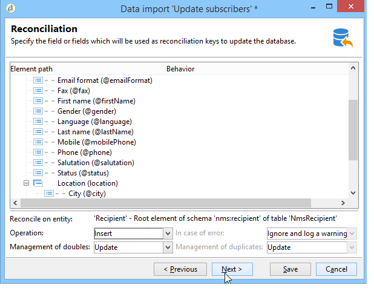

# 一般匯入範例 {#import-operations-samples}

## 從收件者清單匯入 {#example--import-from-a-list-of-recipients}

要從清單概述建立和提供收件者清單，請應用以下步驟：

1. 建立清單

   * 按一下 **[!UICONTROL Lists]** 連結 **[!UICONTROL Profiles and targets]** Adobe Campaign首頁的功能表。
   * 按一下 **[!UICONTROL Create]** 然後 **[!UICONTROL Import a list]** 按鈕。

1. 選擇要匯入的檔案

   按一下右側的資料夾 **[!UICONTROL Local file]** 欄位，並選取包含要匯入之清單的檔案。

   

1. 清單名稱和儲存

   輸入清單的名稱，然後選擇應保存的目錄。

   

1. 啟動匯入

   按一下 **[!UICONTROL Next]** 然後 **[!UICONTROL Start]** 以開始導入清單。

   

## 從文本檔案導入新記錄 {#example--import-new-records-from-a-text-file-}

要將儲存在文字檔中的新收件者設定檔匯入 Adobe Campaign 資料庫，請使用以下步驟：

1. 選擇範本

   * 從Adobe Campaign首頁，按一下 **[!UICONTROL Profiles and targets]** 連結，然後 **[!UICONTROL Jobs]**. 在作業清單上方，按一下 **[!UICONTROL New import]**.
   * 保留 **[!UICONTROL New text import]** 預設選取的範本。
   * 更改標籤和描述。
   * 選取 **[!UICONTROL Simple import]**。
   * 保留預設作業資料夾。
   * 按一下 **[!UICONTROL Advanced parameters]** ，然後選取 **[!UICONTROL Tracking mode]** 選項，以在執行期間檢視匯入的詳細資訊。

1. 選擇要匯入的檔案

   按一下右側的資料夾 **[!UICONTROL Local file]** 欄位，然後選取您要匯入的檔案。

   

1. 關聯欄位

   按一下 **[!UICONTROL Guess the destination fields]** 圖示來自動對應來源和目的地結構。 在按一下 **[!UICONTROL Next]**.

   

1. 調解

   * 轉到&#x200B;**收件者 (nms:recipient)** 表。
   * 選取 **[!UICONTROL Insertion]** 操作，並將預設值保留在其他欄位中。

      

1. 匯入收件者

   * 如有必要，請為要匯入的記錄指定一個資料夾。

      

1. 啟動匯入

   * 按一下&#x200B;**[!UICONTROL Start]**。

      在編輯器的中心區欄位，您可以檢查匯入操作是否成功並查看已處理的記錄數。

      

      此 **[!UICONTROL Tracking]** 模式可讓您追蹤來源檔案中每個記錄的匯入詳細資訊。 若要這麼做，請在首頁按一下 **[!UICONTROL Profiles and Targets]** then **[!UICONTROL Processes]**，請選取相關匯入，並查看 **[!UICONTROL General]**, **[!UICONTROL Journal]** 和 **[!UICONTROL Rejects]** 頁簽。

      * 檢查匯入進度

         

      * 處理每條記錄的查看

         

## 更新並插入收件者 {#example--update-and-insert-recipients}

我們希望更新資料庫中的現有記錄，並從文字檔中建立新記錄。以下是該過程的示例：

1. 選擇範本

   重複上面示例 2 中描述的步驟。

1. 要匯入的檔案

   選擇要匯入的檔案。

   在我們的示例中，檔案第一行的概述顯示該檔案包含三個記錄的更新和記錄的建立。

   

1. 關聯欄位

   應用上面示例 2 中的過程。

1. 調解

   * 保留 **[!UICONTROL Update or insert]** 預設選取。
   * 保留選項 **[!UICONTROL Management of duplicates]** in **[!UICONTROL Update]** 模式，以便使用文本檔案中的資料修改資料庫中的現有記錄。
   * 選取欄位 **[!UICONTROL Birth date]**, **[!UICONTROL Name]** 和 **[!UICONTROL Company]** 並指派調解金鑰給他們。

      

1. 啟動匯入

   * 按一下&#x200B;**[!UICONTROL Start]**。

      在追蹤視窗中，您可以檢查匯入是否成功並查看已處理的記錄數。

      

   * 查看收件者表以檢查此操作已修改記錄。

      

## 使用外部檔案的值增補該值 {#example--enrich-the-values-with-those-of-an-external-file}

我們希望從文字檔中修改資料庫表中的某些欄位，優先考慮資料庫中包含的值。

在此示例中，您可以看到文字檔中的某些欄位具有值，而資料庫中的相應欄位為空。其他欄位包含與資料庫中包含的值不同的值。

* 要匯入的文字檔的內容。

   

* 匯入前的資料庫狀態

   

應用以下步驟：

1. 選擇範本

   應用上面示例 2 中的過程。

1. 要匯入的檔案

   選擇要匯入的檔案。

1. 關聯欄位

   應用上面示例 2 中的過程。

   在預覽檔案的第一行時，您可以看到該檔案包含某些記錄的更新。

1. 調解

   * 移至表格並選取 **[!UICONTROL Update]** 操作。
   * 選取選項 **[!UICONTROL Reject entity]** 針對 **[!UICONTROL Management of doubles]** 欄位。
   * 保留選項 **[!UICONTROL Management of duplicates]** in **[!UICONTROL Update]** 模式，以便使用文本檔案中的資料修改資料庫中的現有記錄。
   * 將游標置於 **[!UICONTROL Last name (@lastName)]** 節點，然後選取 **[!UICONTROL Update only if destination is empty]** 選項。
   * 對 **[!UICONTROL Company (@company)]** 節點。
   * 將調解金鑰指派給欄位 **[!UICONTROL Birth date]**, **[!UICONTROL Email]** 和 **[!UICONTROL First name]**.

      

1. 啟動匯入

   按一下&#x200B;**[!UICONTROL Start]**。

   查看收件者表以檢查匯入已修改記錄。

   

   只有空值才被文字檔中的值替換，但資料庫中的現有值未被匯入檔案中的值覆寫。

## 使用外部檔案更新並增補值 {#example--update-and-enrich-the-values-from-those-in-an-external-file}

我們希望使用文字檔修改資料庫表中的某些欄位，優先套用文字檔中包含的值。

在此示例中，您將看到文字檔中的某些欄位具有空值，而資料庫中的相應欄位不為空。其他欄位包含與資料庫中的值不同的值。

* 要匯入的文字檔的內容。

   

* 匯入前的資料庫狀態

   

1. 選擇範本

   應用上面示例 2 中的過程。

1. 要匯入的檔案

   選擇要匯入的檔案。

   在預覽檔案的第一行時，您可以看到該檔案包含空欄位和某些記錄的更新。

1. 關聯欄位

   應用上面示例 2 中的過程。

1. 調解

   * 移至表格並選取 **[!UICONTROL Update]**.
   * 選取選項 **[!UICONTROL Reject entity]** 針對 **[!UICONTROL Management of doubles]** 欄位。
   * 保留選項 **[!UICONTROL Management of duplicates]** in **[!UICONTROL Update]** 模式，使用文本檔案中的資料修改資料庫中的現有記錄。
   * 將游標置於 **[!UICONTROL Account number (@account)]** 節點，然後選取選項 **[!UICONTROL Take empty values into account]**.
   * 選取欄位 **[!UICONTROL Birth date]**, **[!UICONTROL Email]** 和 **[!UICONTROL First name]** 並指派調解金鑰給他們。

      

1. 啟動匯入

   * 按一下&#x200B;**[!UICONTROL Start]**。
   * 查看收件者表以檢查操作已修改記錄。

      

      空文字檔的值已覆寫資料庫中的值。資料庫中的現有值已更新為匯入檔案中的值，以與 **[!UICONTROL Update]** 在步驟4中為重複項目選取的選項。
