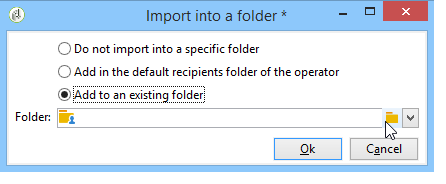

# 匯入資料{#importing-data}

Adobe Campaign 允許您以文字、CSV、TAB 或 XML 格式從一個或多個檔案將資料匯入資料庫。這些檔案與表 (主要或連結) 相關聯，並且源檔的每個欄位與資料庫的欄位相關聯。可以保存匯入配置以便重複使用，以便您可以計劃匯入任務以自動執行複制作業。

>[!NOTE]
>
>You can import data without mapping it with the database data using the **[!UICONTROL Import a list]** function.
> 
>The data can then be used exclusively in workflows via the **[!UICONTROL Read list]** object. 有關詳細資訊，請參見[此頁面](../../workflow/using/read-list.md)。
>
>有關詳細資訊，請觀看[匯入設定檔](https://docs.adobe.com/content/help/en/campaign-learn/campaign-classic-tutorials/getting-started/importing-profiles.html)視訊。

## 要匯入的資料的結構 {#structure-of-the-data-to-import}

在源檔中，每行與記錄重合。記錄中的資料由分隔符 (空格、製表符、字符等) 分隔。這意味著以行的形式檢索資料，並且每行與資料庫的欄位相關聯。

## 匯入精靈 {#import-wizard}

匯入精靈允許您配置匯入，定義其選項 (例如資料轉換) 和啟動執行。它是一系列屏幕，其內容取決於匯入類型 (簡單或多個) 和操作員權限。

>[!NOTE]
>
>如果使用 IIS Web 伺服器，則可能需要配置以授權上載大檔案 (> 28 MB)。
>
>有關更多資訊，請參見[本節](../../installation/using/integration-into-a-web-server-for-windows.md#changing-the-upload-file-size-limit)。

### 第 1 步 - 選擇匯入範本 {#step-1---choosing-the-import-template}

啟動匯入精靈時，首先必須選擇範本。例如，要配置收到簡報的收件者的匯入，請按照以下步驟操作：

1. 選擇文 **[!UICONTROL Profiles and Targets > Job > Generic imports and exports]** 件夾。
1. 點擊&#x200B;**新建**，然後點擊&#x200B;**匯入**&#x200B;以建立匯入範本。

   

1. Click the arrow to the right of the **[!UICONTROL Import template]** field to select your template, or click **[!UICONTROL Select link]** to browse the tree.

   原生範本為 **[!UICONTROL New text import]**。 不得修改此範本，但您可以根據您的要求復制它以配置新範本。預設情況下，導入模板將保存在節點 **[!UICONTROL Profiles and targets > Templates > Job templates]** 中。

1. Enter a name for this import in the **[!UICONTROL Label]** field. 您可以添加描述。
1. 在相應欄位中選擇匯入類型。匯入有兩種可能類型：只 **[!UICONTROL Simple import]** 要匯入一個檔案，並 **[!UICONTROL Multiple import]** 在單次執行中匯入多個檔案。

   For a multiple import, select **[!UICONTROL Multiple import]** from the **[!UICONTROL Import type]** drop-down list in the first screen of the import wizard.

   

1. Specify the fields you want to import by clicking **[!UICONTROL Add]**.

   

   Each time a file is added, the screen of the **[!UICONTROL File to import]** wizard is displayed. See section [Step 2 - Source file selection](#step-2---source-file-selection) and follow the steps in the wizard to define the import options as for a simple import.

   >[!NOTE]
   >
   >多次匯入應僅滿足特定需求，不建議使用。

#### 高級參數 {#advanced-parameters}

The **[!UICONTROL Advanced parameters]** link lets you access the following options:

* **[!UICONTROL General]** 頁籤

   * **[!UICONTROL Stop execution if there are too many rejects]**

      按照預設選擇此選項。如果要繼續執行匯入而不考慮拒絕次數，可以取消選擇它。按照預設，如果拒絕前100行，則停止執行。

   * **[!UICONTROL Trace mode]**

      選擇此選項可追蹤每行的匯入執行情況。

   * **[!UICONTROL Start the job in a detached process]**

      按照預設選擇此選項。它允許您分離匯入的執行，以便它不會影響資料庫中正在進行的其他作業。

   * **[!UICONTROL Do not update enumerations]**

      選擇此選項可避免增補資料庫中的枚舉值清單。請參 [閱管理枚舉](../../platform/using/managing-enumerations.md)。

* **[!UICONTROL Variables]** 頁籤

   您可以定義與可在查詢編輯器和計算欄位中存取的作業關聯的變數。To create a variable, click **[!UICONTROL Add]** and use the variable editor.

   >[!CAUTION]
   >
   >The **[!UICONTROL Variables]** tab is for Workflow-type programming use only, and should be configured by expert users only.

### 第 2 步 - 源檔選擇 {#step-2---source-file-selection}

源檔可以是文字格式 (txt、csv、tab、固定行) 或 xml。

依預設， **[!UICONTROL Upload file on the server]** 會選取。 Click the folder to the right of the **[!UICONTROL Local file]** field to browse the local disk and select the file to import. 您可以取消選擇此選項以輸入存取路徑以及要在伺服器上匯入的檔案名稱。

When the file has been specified, you can view its data in the lower section of the window by clicking **[!UICONTROL Auto-detect format]**. 此預覽顯示源檔案的前 200 行。

使用此視圖上方提供的選項配置匯入。通過這些選項定義的參數將傳輸到預覽中。可以使用以下選項：

* **[!UICONTROL Click here to change the file format...]** 可讓您檢查檔案格式並微調設定。
* **[!UICONTROL Update on server...]** 可讓您將本機檔案傳輸至伺服器。 此選項僅在選取時 **[!UICONTROL Upload file on the server]** 可用。
* **[!UICONTROL Download]** 只有在伺服器上已上傳檔案時，才可使用。
* **[!UICONTROL Auto-detect format]** 用於重新初始化資料源的格式。 This option lets you reapply the original formats to data that has been formatted via the **[!UICONTROL Click here to change the file format...]** option.
* The **[!UICONTROL Advanced parameters]** link lets you filter the source data and access advanced options. 在此屏幕中，您可以選擇僅匯入部分檔案。您還可以定義篩選器，例如，根據相應行的值僅匯入「潛在客戶」或「客戶」類型的用戶。這些選項僅供專業 JavaScript 用戶使用。

#### 更改檔案格式 {#changing-the-file-format}

The **[!UICONTROL Click here to change the file format...]** option lets you format the data of the source file, and in particular to specify the column separator and the type of data for each field. 此配置通過以下視窗執行：

此步驟允許您描述應如何讀取檔案欄位的值。例如，在日期的情況下，日期或日期+時間資料可以與某種格式 (dd/mm/yyyy、mm/dd/yy 等) 相關聯。如果輸入資料與預期格式不匹配，則在匯入期間將發生拒絕。

您可以在視窗下部的預覽區欄位中查看配置結果。

Click **[!UICONTROL OK]** to save the formatting, then click **[!UICONTROL Next]** to display the next step.

### 第 3 步 - 欄位對應 {#step-3---field-mapping}

然後，您必須選擇目標架構並將每行的資料對應到資料庫中的欄位。

* The **[!UICONTROL Destination schema]** field lets you select the schema in which the data will be imported. 此資訊是強制性的。Click the **[!UICONTROL Select link]** icon to select one of the existing schemas. Click **[!UICONTROL Edit link]** to display the content of the selected table.
* 中央表顯示源檔中定義的所有欄位。選擇要匯入的欄位以將目標檔案與它們相關聯。可以手動或自動對應這些欄位。

   要手動對應欄位，請點擊核取方塊以選擇源欄位，然後點擊第二行以激活與所選欄位對應的儲存格。Next, click the **[!UICONTROL Edit expression]** icon to display all the fields of the current table. Select the destination field and click **[!UICONTROL OK]** to validate the mapping.

   To associate the source fields and destination fields automatically, click the **[!UICONTROL Guess the destination fields]** icon to the right of the list of fields. 如果需要，可以修改建議的欄位。

   >[!CAUTION]
   >
   >在繼續執行下一步之前，必須始終驗證此操作的結果。

* 您可以將轉換應用於匯入的欄位。To do this, click in the cell of the **[!UICONTROL Transformation]** column that relates to the field concerned, and select the transformation to be applied.

   

   >[!CAUTION]
   >
   >轉換在匯入時應用。但是，如果已定義了對目標欄位的約束 (在上面的示例中為 @lastname 欄位)，則這些約束優先。

* 您可以使用位於中央表右側的相應圖示添加計算欄位。通過計算欄位，您可以執行複雜的轉換，添加虛擬行或合併多行的資料。有關各種可能性的詳細資訊，請參見以下部分。

#### 計算欄位 {#calculated-fields}

計算欄位是添加到源檔並從其他行計算所得到的新行。然後，計算欄位可以與 Adobe Campaign 資料庫的欄位相關聯。但是，在計算欄位中無法進行對帳操作。

有四種類型的計算欄位：

* **[!UICONTROL Fixed string]**:對於源檔案的所有行，計算欄位的值都相同。 允許您設置插入或更新的記錄的欄位值。例如，您可以為所有匯入的記錄將標記設置為「是」。
* **[!UICONTROL String with JavaScript tags]**:計算欄位的值是包含JavaScript指令的字元字串。
* **[!UICONTROL JavaScript expression]**:計算欄位的值是JavaScript函式評估的結果。 返回的值可以是數字、日期等。
* **[!UICONTROL Enumeration]**:欄位的值根據源檔案中包含的值來分配。 編輯器允許您指定源行並輸入枚舉值清單，如以下示例所示：

   

   The **[!UICONTROL Preview]** tab lets you view the result of the defined configuration. Here, the **[!UICONTROL Subscription]** column has been added. 該值計算自&#x200B;**狀態**&#x200B;欄位。

   

### 第 4 步 – 調解 {#step-4---reconciliation}

匯入精靈的調解步驟允許您定義將檔案中的資料與資料庫中的現有資料進行調解的模式，並設置檔案資料和資料庫資料之間的優先級規則。配置視窗如下所示：

屏幕的中央部分包含一個樹結構，其中包含要匯入資料的 Adobe Campaign 資料庫的欄位和表。

每個節點 (表或欄位) 都有特殊選項。點擊清單中的相關節點時，其參數和簡要說明將顯示在下方。The behavior defined for each element is displayed in the corresponding **[!UICONTROL Behavior]** column.

#### 操作類型 {#types-of-operation}

對於匯入相關的每個表，必須定義操作類型。以下操作可用於資料庫的主要元素：

* **[!UICONTROL Update or insertion]**:如果記錄存在於資料庫中，則更新該記錄，如果不存在，則建立該記錄。
* **[!UICONTROL Insertion]**:將記錄插入資料庫。
* **[!UICONTROL Update]**:僅更新現有記錄（忽略其他記錄）。
* **[!UICONTROL Reconciliation only]**:在資料庫中查找記錄，但不執行更新。 例如，允許您根據檔案行關聯要匯入的收件者資料夾，而不更新資料夾中的資料。
* **[!UICONTROL Deletion]**:可讓您銷毀資料庫中的記錄。

匯入所涉及的表中的每個欄位都有以下選項：

* **[!UICONTROL Update (empty) if source value is empty]**:如果源檔案中的欄位為空，則在更新時，欄位中的值將刪除資料庫值。 否則，保留資料庫欄位。
* **[!UICONTROL Update only if destination is empty]**:源檔案中的值不會覆蓋資料庫欄位中的值，除非資料庫欄位為空。 在這種情況下，它採用源檔的值。
* **[!UICONTROL Update the field only when the record is inserted]**:在更新或插入操作期間，將只導入新的源檔案記錄。

>[!NOTE]
>
>除非在沒有重複資料刪除的情況下插入，否則調解金鑰的定義始終是&#x200B;**必需的**。

#### 調解金鑰 {#reconciliation-keys}

必須至少填寫一個調解金鑰才能管理重複資料刪除。

調解金鑰是用於標識記錄的一組欄位。例如，要匯入收件者，調解金鑰可以是帳號，「電子郵件」欄位或「姓氏、名字、公司」欄位等。

在這種情況下，要查明檔案的某一行是否與資料庫中的現有收件者匹配，匯入引擎會將該檔案的值與該鍵的所有欄位的資料庫值進行比較。當欄位特定於記錄時，可以執行源資料和目標資料之間的精細比較，從而保證匯入後資料的完整性。可以為同一個表填寫第二個調解金鑰；它用於第一個金鑰為空的行。

避免選擇在匯入期間可能被修改的欄位；如果發生這種情況，引擎可以建立其他記錄。

>[!NOTE]
>
>對於收件者匯入，所選資料夾的標識符將隱含地添加到金鑰中。
>
>因此，僅對此資料夾執行調解 (除非未選擇資料夾)。

#### 重複資料刪除 {#deduplication}

>[!NOTE]
>
>「兩次」是在要匯入的檔案中存在兩次或更多次的項目。
>
>「重複」是同時存在於要匯入的檔案和資料庫中的項目。

The **[!UICONTROL Management of doubles]** field lets you configure the deduplication of data. 重複資料刪除涉及&#x200B;**在源檔中**&#x200B;多次出現的記錄 (或多檔案匯入時的源檔)，即調解金鑰的欄位相同的行。

* Duplicate management in **[!UICONTROL Update]** mode (the default mode) does not perform deduplication. 因此，最後一條記錄具有優先權 (因為它更新了先前記錄的資料)。在此模式下不執行重複計數。
* 在模式中復 **[!UICONTROL Ignore]** 制管理， **[!UICONTROL Reject entity]** 或從導入中排除複製。 在這種情況下，不會匯入任何記錄。
* In **[!UICONTROL Reject entity]** mode, the element is not imported, and an error is generated in the import logs.
* In **[!UICONTROL Ignore]** mode, the element is not imported, but no trace of the error is kept. 此模式可讓您優化性能。

>[!CAUTION]
>
>重複資料刪除僅在內存中執行。因此，具有重複資料刪除的匯入的大小是有限的。限制取決於幾個參數 (應用程序伺服器的容量，活動，金鑰中的欄位數等)。重複資料刪除的最大大小為 1,000,000 行。

重複資料刪除涉及源檔和資料庫中都存在的記錄。它僅涉及更新操作(即 **[!UICONTROL Update and insertion]** 或 **[!UICONTROL Update]**)。 The **[!UICONTROL Duplicate management]** option lets you update or ignore the record if it is in both the source file and the database. The **[!UICONTROL Update or insert based on origin]** option belongs to the optional module and cannot be used in a standard context.

購股權 **[!UICONTROL Reject]** 及運 **[!UICONTROL Ignore]** 作如上文所述。

#### 發生錯誤時的行為 {#behavior-in-the-event-of-an-error}

大多數資料傳輸操作會產生各種類型的錯誤 (不一致的行格式，無效的電子郵件地址等)。匯入引擎生成的所有錯誤和所有警告都將儲存並連結到匯入執行個體。

Details of these rejects can be viewed via the **[!UICONTROL Rejects]** tab.

There are two types of rejects (the type is displayed in the **[!UICONTROL Connector]** column):

* 拒絕文字連接器涉及在處理檔案行時發生的錯誤 (計算欄位、資料分析等)。在這種情況下，如果發生錯誤，則始終拒絕整行。
* 資料庫連接器拒絕涉及資料調解或寫入資料庫期間發生的錯誤。在匯入到多個表的情況下，拒絕只涉及記錄的一部分 (例如，對於收件者和相關事件的匯入，錯誤可以阻止更新事件而不拒絕接收者)。

在資料調解頁面中，您可以按欄位和逐個表定義所需的錯誤管理類型欄位。

* **[!UICONTROL Ignore and log a warning]**:除了生成錯誤的欄位外，所有欄位都將導入資料庫。
* **[!UICONTROL Reject parent element]**:記錄的整行被拒絕，不僅是導致錯誤的欄位。
* **[!UICONTROL Reject all elements]**:導入停止，並拒絕記錄的所有元素。

   

匯入執行個體的拒絕屏幕中的樹結構指示哪些欄位被拒絕以及錯誤發生的位置。

You can generate a file containing these records via the **[!UICONTROL Export rejects]** icon:

### 第 5 步 - 匯入收件者時的附加步驟 {#step-5---additional-step-when-importing-recipients}

匯入精靈的下一步允許您選擇或建立將匯入資料的資料夾，自動將匯入的收件者對應於 (新的或現有的) 清單，並將收件者訂閱到服務。

>[!NOTE]
>
>在僅匯入收件者時以及使用預設的 Adobe Campaign 收件者表 (**nms:recipient**) 時，將顯示此步驟。

* Click the **[!UICONTROL Edit]** links to select the folder, the list, or the service to which you want to associate or subscribe the recipients.

   1. 匯入到資料夾中

      The **[!UICONTROL Edit...]** link of the **[!UICONTROL Import into a folder]** section lets you select or create the folder into which the recipients will be imported. 按照預設，如果未定義分區，則會將資料匯入到操作員的預設資料夾中。

      >[!NOTE]
      >
      >操作員的預設資料夾是操作員具有寫存取權限的第一個資料夾。請參閱 [資料夾存取管理](../../platform/using/access-management.md#folder-access-management)。

      To select the import folder, click the arrow to the right of the **[!UICONTROL Folder]** field and select the folder concerned. You can also use the **[!UICONTROL Select link]** icon to display the tree in a new window or create a new folder.

      

      要建立新資料夾，請選擇要從中添加資料夾的節點，然後按滑鼠右鍵。Select **[!UICONTROL Create a new 'Recipients' folder]**.

      

      該資料夾添加到當前節點下方。Enter the name of the new folder, hit Enter to confirm, and then click **[!UICONTROL OK]**.

      

   1. 與清單相關聯

      The **[!UICONTROL Edit...]** link in the **[!UICONTROL Add recipients to a list]** section lets you select or create a list into which the recipients will be imported.

      

      You can create a new list for these recipients by clicking **[!UICONTROL Select link]**, then **[!UICONTROL Create]**. 建立和管理清單時，清單的創 [建和管理會顯示](../../platform/using/creating-and-managing-lists.md)。

      

      您可以決定將收件者添加到清單中已存在的收件者，或者使用新收件者重新建立清單。在這種情況下，如果清單已包含收件者，則它們將被刪除並由匯入的收件者替換。

   1. 訂閱服務

      To subscribe all imported recipients to an information service, click the **[!UICONTROL Edit...]** link of the **[!UICONTROL Subscribe recipients to a service]** section in order to select or create the information service which the recipients will be subscribed to. You can select the **[!UICONTROL Send a confirmation message]** option: The content of this message is defined in the delivery template associated with the subscription service.

      

      You can create a new service for these recipients by clicking **[!UICONTROL Select link]** and then the **[!UICONTROL Create]** icon. [本節](../../delivery/using/managing-subscriptions.md)介紹了資訊服務的管理。

* Use the **[!UICONTROL Origin]** field to add information about the origin of recipients to their profiles. 此資訊在多重匯入的框架內特別有用。

Click **[!UICONTROL Next]** to validate this step and display the following step.

### 第 6 步 - 啟動匯入 {#step-6---launching-the-import}

精靈的最後一步允許您啟動資料匯入。To do this, click the **[!UICONTROL Start]** button.

### 工作狀態 {#job-statuses}

作業狀態表示作業的當前狀態。每個狀態都由一個特殊的圖示和標籤表示。此資訊顯示在作業清單中。狀態及其圖示如下：

* **正在編輯**

   正在建立工作。

* **正在執行**

   這項工作正在執行。

* **取消**

   Click the **[!UICONTROL Cancel]** button: the job in progress is cancelled.

* **取消正在進行中**

   取消命令已接收並且作業正在取消。

* **暫停進行中**

   Click **[!UICONTROL Pause]**: the job is being suspended.

* **已暫停**

   按一 **[!UICONTROL Pause]**&#x200B;下：工作暫停。 It can be restarted by clicking **[!UICONTROL Start]**.

* **已完成**

   執行作業已完成。

* **完成出現錯誤**

   由於技術錯誤，該作業未執行。

* **伺服器正在關閉**

   正在進行的作業因 Adobe Campaign 伺服器已關閉而中斷。

## 一般匯入示例 {#generic-import-samples}

### Example: Import from a list of recipients {#example--import-from-a-list-of-recipients}

要從清單概述建立和提供收件者清單，請應用以下步驟：

1. 建立清單

   * 按一下 **[!UICONTROL Lists]** Adobe Campaign首頁 **[!UICONTROL Profiles and targets]** 功能表中的連結。
   * 按一下 **[!UICONTROL Create]** 按鈕，然後按 **[!UICONTROL Import a list]** 鈕。

1. 選擇要匯入的檔案

   Click the folder to the right of the **[!UICONTROL Local file]** field and select the file containing the list to import.

   

1. 清單名稱和儲存

   輸入清單的名稱，然後選擇應保存的目錄。

   

1. 啟動匯入

   按一 **[!UICONTROL Next]** 下，然 **[!UICONTROL Start]** 後開始匯入清單。

   

### 示例：從文字檔中匯入新記錄 {#example--import-new-records-from-a-text-file-}

要將儲存在文字檔中的新收件者設定檔匯入 Adobe Campaign 資料庫，請使用以下步驟：

1. 選擇範本

   * 從Adobe Campaign首頁，按一下連 **[!UICONTROL Profiles and targets]** 結，然後 **[!UICONTROL Jobs]**。 Above the list of jobs, click **[!UICONTROL New import]**.
   * 依預設 **[!UICONTROL New text import]** 保留範本選取。
   * 更改標籤和描述。
   * Select **[!UICONTROL Simple import]**.
   * 保留預設作業資料夾。
   * Click **[!UICONTROL Advanced parameters]** and select the **[!UICONTROL Tracking mode]** option to view the details of your import during execution.

1. 選擇要匯入的檔案

   Click the folder to the right of the **[!UICONTROL Local file]** field and select the file you want to import.

   

1. 關聯欄位

   Click the **[!UICONTROL Guess the destination fields]** icon to map the source and destination schemas automatically. Check the information in this window before clicking **[!UICONTROL Next]**.

   

1. 調解

   * 轉到&#x200B;**收件者 (nms:recipient)** 表。
   * Select the **[!UICONTROL Insertion]** operation and leave the default values in the other fields.

      

1. 匯入收件者

   * 如有必要，請為要匯入的記錄指定一個資料夾。

      

1. 啟動匯入

   * 按一下 **[!UICONTROL Start]**.

      在編輯器的中心區欄位，您可以檢查匯入操作是否成功並查看已處理的記錄數。

      

      The **[!UICONTROL Tracking]** mode lets you track the details of the import for each record in the source file. 若要這麼做，請在首頁按一 **[!UICONTROL Profiles and Targets]** 下， **[!UICONTROL Processes]**&#x200B;然後選取相關的匯入，並查 **[!UICONTROL General]**&#x200B;看和 **[!UICONTROL Journal]** 標籤 **[!UICONTROL Rejects]** 。

      * 檢查匯入進度

         

      * 處理每條記錄的查看

         

### Example: Update and insert recipients {#example--update-and-insert-recipients}

我們希望更新資料庫中的現有記錄，並從文字檔中建立新記錄。以下是該過程的示例：

1. 選擇範本

   重複上面示例 2 中描述的步驟。

1. 要匯入的檔案

   選擇要匯入的檔案。

   在我們的示例中，檔案第一行的概述顯示該檔案包含三個記錄的更新和記錄的建立。

   

1. 關聯欄位

   應用上面示例 2 中的過程。

1. 調解

   * 依預 **[!UICONTROL Update or insert]** 設保留選取。
   * Keep the option **[!UICONTROL Management of duplicates]** in **[!UICONTROL Update]** mode so that existing records in the database will be modified with data from the text file.
   * 選擇欄位 **[!UICONTROL Birth date]**, **[!UICONTROL Name]** 並為 **[!UICONTROL Company]** 其分配協調密鑰。

      

1. 啟動匯入

   * 按一下 **[!UICONTROL Start]**.

      在追蹤視窗中，您可以檢查匯入是否成功並查看已處理的記錄數。

      

   * 查看收件者表以檢查此操作已修改記錄。

      

### Example: Enrich the values with those of an external file {#example--enrich-the-values-with-those-of-an-external-file}

我們希望從文字檔中修改資料庫表中的某些欄位，優先考慮資料庫中包含的值。

在此示例中，您可以看到文字檔中的某些欄位具有值，而資料庫中的相應欄位為空。其他欄位包含與資料庫中包含的值不同的值。

* 要匯入的文字檔的內容。

   

* 匯入前的資料庫狀態

   

應用以下步驟：

1. 選擇範本

   應用上面示例 2 中的過程。

1. 要匯入的檔案

   選擇要匯入的檔案。

1. 關聯欄位

   應用上面示例 2 中的過程。

   在預覽檔案的第一行時，您可以看到該檔案包含某些記錄的更新。

1. 調解

   * Go to the table and select the **[!UICONTROL Update]** operation.
   * 選取欄位 **[!UICONTROL Reject entity]** 的選 **[!UICONTROL Management of doubles]** 項。
   * Keep the option **[!UICONTROL Management of duplicates]** in **[!UICONTROL Update]** mode so that existing records in the database will be modified with data from the text file.
   * 將游標置於節 **[!UICONTROL Last name (@lastName)]** 點上並選擇選 **[!UICONTROL Update only if destination is empty]** 項。
   * 對節點重複此操 **[!UICONTROL Company (@company)]** 作。
   * 為欄位分配協調 **[!UICONTROL Birth date]**&#x200B;鍵 **[!UICONTROL E-mail]** 和 **[!UICONTROL First name]**。

      

1. 啟動匯入

   按一下 **[!UICONTROL Start]**.

   查看收件者表以檢查匯入已修改記錄。

   

   只有空值才被文字檔中的值替換，但資料庫中的現有值未被匯入檔案中的值覆寫。

### Example: Update and enrich the values from those in an external file {#example--update-and-enrich-the-values-from-those-in-an-external-file}

我們希望使用文字檔修改資料庫表中的某些欄位，優先套用文字檔中包含的值。

在此示例中，您將看到文字檔中的某些欄位具有空值，而資料庫中的相應欄位不為空。其他欄位包含與資料庫中的值不同的值。

* 要匯入的文字檔的內容。

   

* 匯入前的資料庫狀態

   

1. 選擇範本

   應用上面示例 2 中的過程。

1. 要匯入的檔案

   選擇要匯入的檔案。

   在預覽檔案的第一行時，您可以看到該檔案包含空欄位和某些記錄的更新。

1. 關聯欄位

   應用上面示例 2 中的過程。

1. 調解

   * Go to the table and select **[!UICONTROL Update]**.
   * 選取欄位 **[!UICONTROL Reject entity]** 的選 **[!UICONTROL Management of doubles]** 項。
   * Leave the option **[!UICONTROL Management of duplicates]** in **[!UICONTROL Update]** mode for existing records in the database to be modified with data from the text file.
   * 將游標置於節 **[!UICONTROL Account number (@account)]** 點上並選擇選項 **[!UICONTROL Take empty values into account]**。
   * 選擇欄位 **[!UICONTROL Birth date]**, **[!UICONTROL E-mail]** 並為 **[!UICONTROL First name]** 其分配協調密鑰。

      

1. 啟動匯入

   * 按一下 **[!UICONTROL Start]**.
   * 查看收件者表以檢查操作已修改記錄。

      

      空文字檔的值已覆寫資料庫中的值。The existing values in the database were updated with those in the import file in keeping with the **[!UICONTROL Update]** option selected for duplicates in step 4.

## 從工作流程匯入資料 {#importing-data-from-a-workflow}

工作流程可以用來自動執行某些匯入過程。無論是從本地檔案還是從 SFTP 匯入資料，都可以使用工作流程來標準化資料管理過程。

要了解有關從工作流程匯入資料的更多資訊，請參見[本節](../../workflow/using/importing-data.md)。
