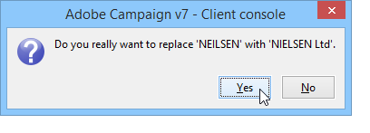

# 管理分項清單{#managing-enumerations}

分項清單（也稱為「分項清單」）是系統建議用來填入特定欄位的值清單。 列舉可讓這些欄位的值標準化，並有助於資料輸入或在查詢中使用。

值清單會以下拉式清單的形式顯示，您可以從中選取要在欄位中輸入的值。 下拉式清單也會啟用預測性輸入，運運算元會在此輸入前幾個字母，而應用程式會填入其餘字母。

有些主控台欄位已定義成這種型別的列舉。 如果您可以透過在對應欄位中直接輸入來新增值，則列舉稱為「開啟」。

## 存取值 {#access-to-values}

此型別欄位的值已定義，這些欄位的整體管理（新增/刪除值）是透過樹狀結構的&#x200B;**[!UICONTROL Administration > Platform > Enumerations]**&#x200B;節點執行的。

* 上方區段提供已定義分項清單的欄位清單。
* 下方的區段會列出建議的值。 這些值將在使用此欄位的編輯器中重複。

  

  若要建立新的列舉值，請按一下&#x200B;**[!UICONTROL Add]**。

  

  如果選取了&#x200B;**[!UICONTROL Open]**&#x200B;選項，使用者可以直接在對應欄位中新增專案清單值。 確認訊息可讓您建立此值。

  

* 如果選取&#x200B;**[!UICONTROL Closed]**&#x200B;選項，使用者將無法建立新值，而只能從可用的值中選擇。

## 標準化資料 {#standardizing-data}

### 關於別名清除 {#about-alias-cleansing}

在逐項清單欄位中，您可以輸入列舉值以外的值。 這些檔案可依原樣儲存，也可加以清除。

>[!CAUTION]
>
>資料清除是影響資料庫中資料的重要程式。 Adobe Campaign會執行大量資料更新，這可能會導致某些值被刪除。 因此，這項作業將保留給專家使用者。

然後輸入的值會是：

* 已新增至專案清單值：在此情況下，必須選取&#x200B;**[!UICONTROL Open]**&#x200B;選項，
* 或自動取代為其對應的別名：在此情況下，必須在專案清單的&#x200B;**[!UICONTROL Alias]**&#x200B;索引標籤中定義此案例，
* 或會儲存在別名清單中：稍後會指派別名。

  >[!NOTE]
  >
  >如果您需要使用資料清除功能，請選取專案清單中的&#x200B;**[!UICONTROL Alias cleansing]**&#x200B;選項。

### 使用別名 {#using-aliases}

選項&#x200B;**[!UICONTROL Alias cleansing]**&#x200B;可以針對選取的逐項清單使用別名。 選取此選項時，**[!UICONTROL Alias]**&#x200B;索引標籤會顯示在視窗底部。

#### 建立別名 {#creating-an-alias}

若要建立別名，請按一下&#x200B;**[!UICONTROL Add]**。

輸入您要轉換的別名以及要套用的值，然後按一下&#x200B;**[!UICONTROL Ok]**。

確認此作業之前請先檢查引數。

>[!CAUTION]
>
>確認此階段後，可能無法復原先前輸入的值：已取代這些值。

因此，當使用者在「公司」欄位(在Adobe Campaign主控台或表單中)中輸入&#x200B;**NEILSEN**&#x200B;值時，該值將自動被&#x200B;**NIELSEN Ltd**&#x200B;值取代。 值取代是由&#x200B;**別名清除**&#x200B;工作流程執行。 請參閱[執行資料清除](#running-data-cleansing)。

#### 將值轉換為別名 {#converting-values-into-aliases}

若要將列舉值轉換為別名，請在值清單中按一下滑鼠右鍵，然後選擇&#x200B;**[!UICONTROL Convert values into aliases...]**。

選擇您要轉換的值，然後按一下&#x200B;**[!UICONTROL Next]**。

按一下&#x200B;**[!UICONTROL Start]**&#x200B;以執行轉換。

執行完成後，別名會新增至別名清單中。

#### 擷取別名點選 {#retrieving-alias-hits}

使用者輸入的值可以轉換為別名。 實際上，當使用者輸入的值未包含在逐項清單中時，該值會儲存在&#x200B;**[!UICONTROL Alias]**&#x200B;索引標籤中。

**別名清理**&#x200B;技術工作流程每晚都會復原這些值，以更新逐項清單。 請參閱[執行資料清除](#running-data-cleansing)

如有必要，**[!UICONTROL Hits]**&#x200B;欄會顯示輸入此值的次數。 計算這個值既耗時，又耗用記憶體。 如需詳細資訊，請參閱[計算專案發生次數](#calculating-entry-occurrences)。

### 執行資料清除 {#running-data-cleansing}

資料清除是由&#x200B;**[!UICONTROL Alias cleansing]**&#x200B;技術工作流程執行。 為執行期間會套用為列舉定義的設定。 請參閱[別名清除工作流程](#alias-cleansing-workflow)。

可透過&#x200B;**[!UICONTROL Cleanse values...]**&#x200B;連結觸發清除。

**[!UICONTROL Advanced parameters...]**&#x200B;連結可讓您設定開始考慮所收集值的日期。

按一下&#x200B;**[!UICONTROL Start]**&#x200B;按鈕以執行資料清除。

#### 計算專案發生次數 {#calculating-entry-occurrences}

逐項清單的&#x200B;**[!UICONTROL Alias]**&#x200B;子索引標籤可顯示輸入的所有值中別名的發生次數。 此資訊為預估值，會顯示在&#x200B;**[!UICONTROL Hits]**&#x200B;欄中。

>[!CAUTION]
>
>計算別名專案發生次數可能需要很長的時間。 因此使用此函式時請務必謹慎。

您可以透過&#x200B;**[!UICONTROL Cleanse values...]**&#x200B;連結手動執行點選計算。 若要這麼做，請按一下&#x200B;**[!UICONTROL Advanced parameters...]**&#x200B;連結，然後選取所要的選項。

* **[!UICONTROL Update the number of alias hits]**：這可讓您根據輸入的日期，更新已計算的點選。
* **[!UICONTROL Recalculate the number of alias hits from the start]**：可讓您在整個Adobe Campaign平台上執行計算。

您也可以建立專屬的工作流程，讓計算在指定的期間內自動執行（例如每週執行一次）。

若要這麼做，請建立&#x200B;**[!UICONTROL Alias cleansing]**&#x200B;工作流程的復本、變更排程器，並在&#x200B;**[!UICONTROL Enumeration value cleansing]**&#x200B;活動中使用下列設定：

* **-updateHits**&#x200B;以更新別名點選數，
* **-updateHits：full**&#x200B;以重新計算所有別名點選。

#### 別名清除工作流程 {#alias-cleansing-workflow}

**別名清除**&#x200B;工作流程會執行列舉值清除。 預設會每天執行。

可透過&#x200B;**[!UICONTROL Administration > Production > Technical workflows]**&#x200B;節點存取它。

