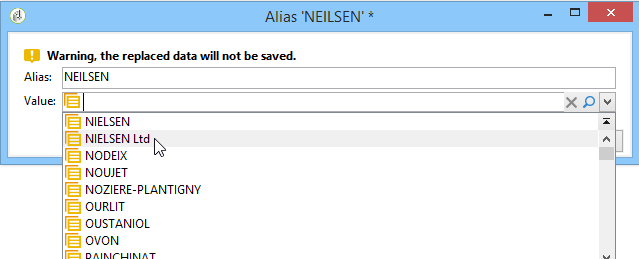

# 管理分項清單{#managing-enumerations}

分項清單（也稱為「分項清單」）是系統建議用來填入特定欄位的值清單。 列舉可讓這些欄位的值標準化，並有助於資料輸入或在查詢中使用。

值清單會以下拉式清單的形式顯示，您可以從中選取要在欄位中輸入的值。 下拉式清單也會啟用預測性輸入，運運算元會在此輸入前幾個字母，而應用程式會填入其餘字母。

有些主控台欄位已定義成這種型別的列舉。 如果您可以透過在對應欄位中直接輸入來新增值，則列舉稱為「開啟」。

## 存取值 {#access-to-values}

此類欄位的值已定義，透過 **[!UICONTROL Administration > Platform > Enumerations]** 樹狀結構的節點。

* 上方區段提供已定義分項清單的欄位清單。
* 下方的區段會列出建議的值。 這些值將在使用此欄位的編輯器中重複。

  

  若要建立新的分項清單，請按一下 **[!UICONTROL Add]**.

  

  如果 **[!UICONTROL Open]** 選項時，使用者可以直接在對應欄位中新增分項清單值。 確認訊息可讓您建立此值。

  

* 如果 **[!UICONTROL Closed]** 選項，使用者將無法建立新值，而只能從可用的值中選擇。

## 標準化資料 {#standardizing-data}

### 關於別名清除 {#about-alias-cleansing}

在逐項清單欄位中，您可以輸入列舉值以外的值。 這些檔案可依原樣儲存，也可加以清除。

>[!CAUTION]
>
>資料清除是影響資料庫中資料的重要程式。 Adobe Campaign會執行大量資料更新，這可能會導致某些值被刪除。 因此，這項作業將保留給專家使用者。

然後輸入的值會是：

* 新增至專案清單值：在此案例中， **[!UICONTROL Open]** 必須選取選項，
* 或自動取代為其對應別名：在此情況下，您必須在以下欄位中定義此案例： **[!UICONTROL Alias]** 專案清單的索引標籤，
* 或會儲存在別名清單中：稍後會指派別名。

  >[!NOTE]
  >
  >如果您需要使用資料清除功能，請選取 **[!UICONTROL Alias cleansing]** 選項。

### 使用別名 {#using-aliases}

選項 **[!UICONTROL Alias cleansing]** 讓選取的逐項清單可以使用別名。 選取此選項時， **[!UICONTROL Alias]** 標籤會顯示在視窗底部。

#### 建立別名 {#creating-an-alias}

若要建立別名，請按一下 **[!UICONTROL Add]**.

輸入要轉換的別名以及要套用的值，然後按一下 **[!UICONTROL Ok]**.

確認此作業之前請先檢查引數。

>[!CAUTION]
>
>確認此階段後，可能無法復原先前輸入的值：已取代這些值。

因此，當使用者輸入值時 **NEILSEN** 在「公司」欄位(在Adobe Campaign主控台或表單中)中，該值會自動被取代 **NIELSEN有限公司**. 值取代是由 **別名清除** 工作流程。 請參閱 [執行資料清除](#running-data-cleansing).

#### 將值轉換為別名 {#converting-values-into-aliases}

若要將列舉值轉換為別名，請在值清單中按一下滑鼠右鍵，然後選擇 **[!UICONTROL Convert values into aliases...]**.

選擇要轉換的值，然後按一下 **[!UICONTROL Next]**.

按一下 **[!UICONTROL Start]** 執行轉換。

執行完成後，別名會新增至別名清單中。

#### 擷取別名點選 {#retrieving-alias-hits}

使用者輸入的值可以轉換為別名。 實際上，當使用者輸入的值未包含在逐項清單中時，該值會儲存在 **[!UICONTROL Alias]** 標籤。

此 **別名清除** 技術工作流程會每晚復原這些值，以更新逐項清單。 請參閱 [執行資料清除](#running-data-cleansing)

如有需要， **[!UICONTROL Hits]** 欄會顯示輸入此值的次數。 計算這個值既耗時，又耗用記憶體。 有關詳細資訊，請參閱 [計算專案發生次數](#calculating-entry-occurrences).

### 執行資料清除 {#running-data-cleansing}

資料清除是由 **[!UICONTROL Alias cleansing]** 技術工作流程。 為執行期間會套用為列舉定義的設定。 請參閱 [別名清除工作流程](#alias-cleansing-workflow).

可透過以下方式觸發清除 **[!UICONTROL Cleanse values...]** 連結。

此 **[!UICONTROL Advanced parameters...]** 連結可讓您設定開始考慮所收集值的日期。

按一下 **[!UICONTROL Start]** 按鈕以執行資料清除。

#### 計算專案發生次數 {#calculating-entry-occurrences}

此 **[!UICONTROL Alias]** 專案清單的子頁簽可顯示輸入的所有值中別名的發生次數。 此資訊為預估值，會顯示在 **[!UICONTROL Hits]** 欄。

>[!CAUTION]
>
>計算別名專案發生次數可能需要很長的時間。 因此使用此函式時請務必謹慎。

您可以透過手動執行點選計算 **[!UICONTROL Cleanse values...]** 連結。 若要這麼做，請按一下 **[!UICONTROL Advanced parameters...]** 連結並選取所需的選項。

* **[!UICONTROL Update the number of alias hits]**：這可讓您根據輸入的日期更新已計算的點選。
* **[!UICONTROL Recalculate the number of alias hits from the start]**：可讓您在整個Adobe Campaign平台上執行計算。

您也可以建立專屬的工作流程，讓計算在指定的期間內自動執行（例如每週執行一次）。

若要這麼做，請建立 **[!UICONTROL Alias cleansing]** 工作流程，變更排程器，並在 **[!UICONTROL Enumeration value cleansing]** 活動：

* **-updateHits** 若要更新別名點選數，
* **-updateHits：full** 以重新計算所有別名點選。

#### 別名清除工作流程 {#alias-cleansing-workflow}

此 **別名清除** 工作流程會執行列舉值清除。 預設會每天執行。

可透過 **[!UICONTROL Administration > Production > Technical workflows]** 節點。

