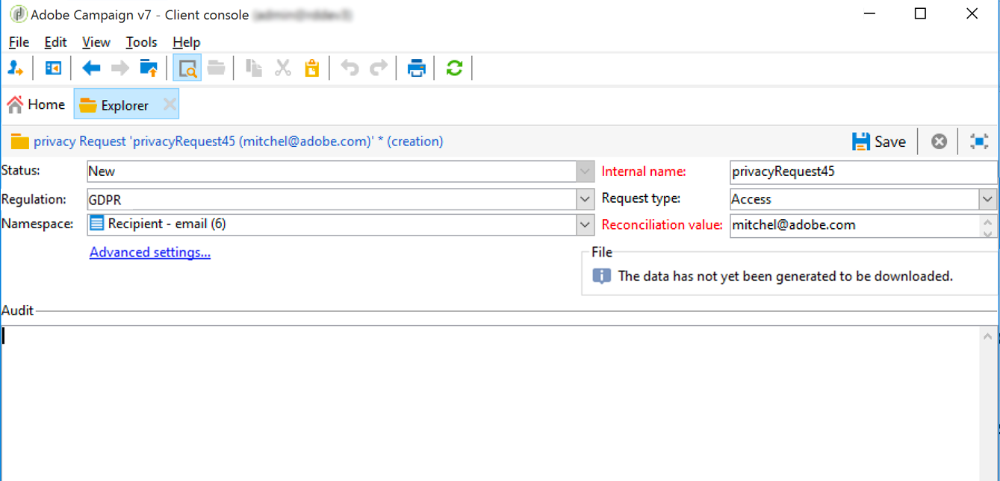

# 建立及管理隱私權請求 {#privacy-request-ui}


本章節介紹如何建立存取權限及刪除請求，以及 Adobe Campaign 如何處理這些請求。

## 建立隱私權請求 {#create-privacy-request-ui}

**Adobe Campaign 介面**&#x200B;允許您建立您的隱私權請求並跟蹤其演進。 若要建立新的隱私權請求，請依照下列指示：

1. 存取&#x200B;**[!UICONTROL Administration]** > **[!UICONTROL Platform]** > **[!UICONTROL Privacy Requests]**&#x200B;下的「隱私權請求」資料夾。

   

1. 此畫面可讓您檢視所有目前的隱私權請求、其狀態和記錄檔。 按一下 **[!UICONTROL New]** 以建立隱私權請求。

   

1. 選擇&#x200B;**[!UICONTROL Regulation]** (GDPR、CCPA、PDPA 或 LGPD)、**[!UICONTROL Request type]** (存取或刪除)，選擇&#x200B;**[!UICONTROL Namespace]**&#x200B;並輸入&#x200B;**[!UICONTROL Reconciliation value]**。 如果您使用電子郵件作為命名空間，請輸入「資料主體」的電子郵件。

   

隱私權技術工作流程每天執行一次，並處理每個新請求：

* 刪除請求：收件者儲存在 Adobe Campaign 的資料被清除。
* 存取請求：收件者儲存在 Adobe Campaign 的資料已產生，並可在請求畫面的左側以 XML 檔案形式使用。


## 表格清單 {#list-of-tables}

執行刪除或存取隱私權要求時，Adobe Campaign 會根據所有包含收件者表格連結 (自有類型) 之表格中的&#x200B;**[!UICONTROL Reconciliation value]**，以搜尋所有資料主體的資料。

執行隱私權請求時，以下是可列入考量的現成可用表格清單：

* 收件者 (recipient)
* 收件者傳遞記錄 (broadLogRcp)
* 收件者追蹤記錄 (trackingLogRcp)
* 封存的事件傳遞記錄 (broadLogEventHisto)
* 收件者清單內容 (rcpGrpRel)
* 訪客優惠方案主張 (propositionVisitor)
* 訪客 (visitor)
* 訂閱歷史記錄 (subHisto)
* 訂閱 (subscription)
* 收件者優惠方案主張 (propositionRcp)

如果您建立的自訂資源具有收件者表格 (自有類型) 的連結，也會將這些帳戶列入考量。例如，如果您有連結至收件者表格的交易表格和連結至交易表格的交易詳細資料，則會同時將這些帳戶列入考量。

>[!IMPORTANT]
>
>如果您使用設定檔刪除工作流程來執行隱私權批次要求，請考慮下列備註：
>* 透過工作流程刪除設定檔時，不會處理子表格。
>* 您需要處理所有子表格的刪除。
>* Adobe 建議您建立 ETL 工作流程，在「隱私權存取」表格中新增要刪除的行，讓 **[!UICONTROL Delete privacy requests data]** 工作流程執行刪除。 出於效能方面的因素，我們建議每天限制刪除 200 個設定檔。

## 隱私權請求狀態 {#privacy-request-statuses}

隱私權要求的不同狀態如下：

* **[!UICONTROL New]** / **[!UICONTROL Retry pending]**：進行中，工作流程尚未處理要求。
* **[!UICONTROL Processing]** / **[!UICONTROL Retry in progress]**：工作流程正在處理要求。
* **[!UICONTROL Delete pending]**：工作流程已識別所有要刪除的收件者資料。
* **[!UICONTROL Delete in progress]**：工作流程正在處理刪除。
* **[!UICONTROL Delete Confirmation Pending]** (在兩步驟處理模式中刪除請求)：工作流程已處理存取請求。已請求手動確認以執行刪除。 此按鈕可使用 15 天。
* **[!UICONTROL Complete]**：要求處理已完成，並未發生錯誤。
* **[!UICONTROL Error]**：工作流程發生錯誤。原因會顯示在 **[!UICONTROL Request status]** 欄位的「隱私權要求」清單中。例如，**[!UICONTROL Error data not found]** 代表在資料庫中找不到與資料主體 **[!UICONTROL Reconciliation value]** 相符的收件者資料。

## 兩步驟流程 {#two-step-process}

依照預設，會啟動&#x200B;**兩步驟流程**。當您使用此模式建立新的刪除請求時，Adobe Campaign 一律會先執行存取請求。 這可讓您在確認刪除之前先檢查資料。

您可以從隱私權請求版本畫面變更此模式。 按一下 **[!UICONTROL Advanced settings]**。


在啟動兩步驟模式時，新刪除請求的狀態會變更為 **[!UICONTROL Confirm Delete Pending]**。 從隱私權請求畫面下載產生的 XML 檔案並檢查資料。 如要確認清除資料，請按一下 **[!UICONTROL Confirm delete data]** 按鈕。


## JSSP URL {#jspp-url}

在處理「存取」請求時，Adobe Campaign 會產生 JSSP，從資料庫擷取收件者的資料，並將其匯出至儲存在本機電腦上的 XML 檔案。 JSSP URL 的定義如下：

```
"$(serverUrl)+'/nms/gdpr.jssp?id='+@id"
```

其中 @id 是隱私權要求 ID。

此 URL 儲存在 **[!UICONTROL Privacy Requests (gdprRequest)]** 架構的 **[!UICONTROL "File location" (@urlFile)]** 欄位中。

該資訊在資料庫中可用 90 天。 一旦技術工作流程清除請求後，資訊就會從資料庫中移除，而 URL 就會過時。 請在從網頁下載資料之前，先檢查 URL 是否仍然有效。

以下是資料主體資料檔案的範例：


資料控制方可輕鬆建立包含對應 JSSP URL 的網站應用程式，讓資料主體的資料檔案可從網頁取得。


以下是程式碼片段，您可當成網站應用程式 **[!UICONTROL Page]** 活動中的範例。


```
<!DOCTYPE html PUBLIC "-//W3C//DTD XHTML 1.0 Transitional//EN" "http://www.w3.org/TR/xhtml1/DTD/xhtml1-transitional.dtd"> <html xmlns="http://www.w3.org/1999/xhtml"> <head> <meta http-equiv="Content-Language" content="en"> <meta http-equiv="Content-Type" content="text/html; charset=utf-8" /> <link rel="stylesheet" type="text/css" href="/nl/webForms/landingPage.css"/> <title>Clickthrough</title> <style type="text/css" media="all"> /* override formulary area */ .formulary { top: 200px; position: absolute; left: 0; } </style> </head> <body style="" class="">
<center>
<div id="wrap">
<div id="header">
<div class="header-title center-title">DOWNLOAD GDPR DATA</div>
<div class="formulary center-formulary"><form>
<div class="button large-button"><a href=[SERVER_URL]/nms/gdpr.jssp?id=13000" data-nl-type="externalLink">CLICK TO DOWNLOAD</a></div>
</form></div>
</div>
<div id="content">
<div class="row">
<div class="info">
<div class="desc">
<div class="title">EFFICIENCY</div>
<div class="desc">Our service is guaranteed to improve your efficiency. Increase performance and use our high-technology service to implement even the most ambitious of projects.</div>
</div>
</div>
</div>
</div>
<div id="footer">
<div style="text-align: center;">
<div style="float: left;"><a href="#">Contact us</a></div>
<div style="float: right;">&copy; Copyrights</div>
<div><a href="#"></a> <a href="#"></a> <a href="#"></a> <a href="#"></a></div>
</div>
</div>
</div>
</center>
</body> </html>
```

由於資料主體資料檔案的存取權限受到限制，因此必須停用網頁匿名存取。 只有&#x200B;**[!UICONTROL Privacy Data Right]**&#x200B;已命名權限的操作者才能登入頁面並下載資料。
