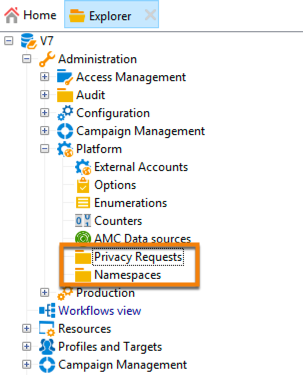
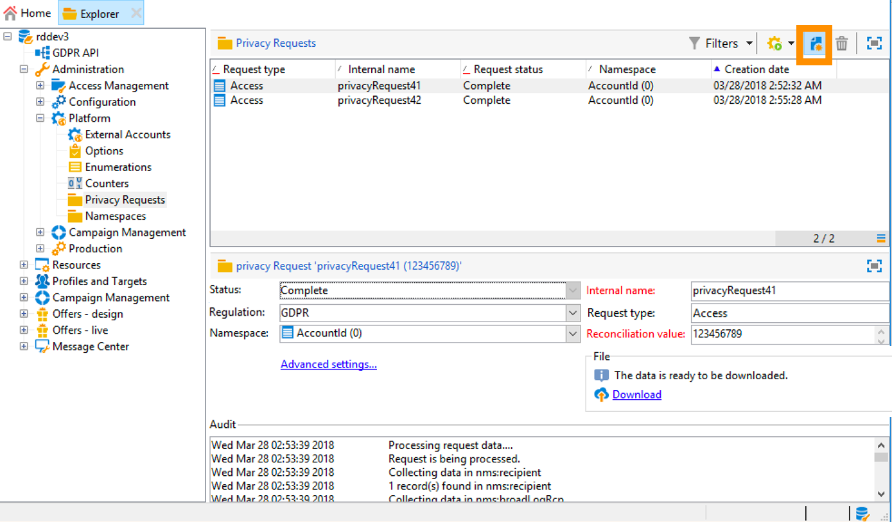
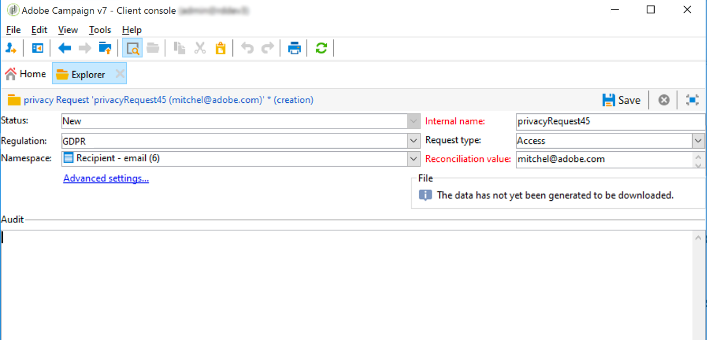
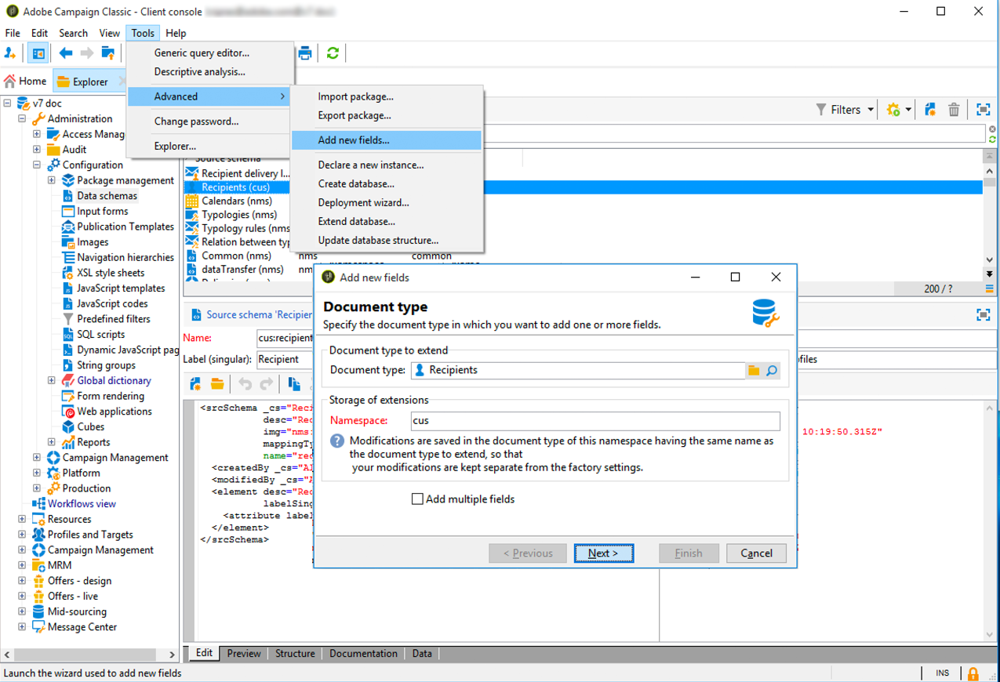

# 管理隱私權請求 {#privacy-requests}


如需隱私權管理的一般簡報，請參閱[本節](../../platform/using/privacy-management.md)。

此資訊適用於 GDPR、CCPA、PDPA 及 LGPD。如需這些法規的詳細資訊，請參閱[本節](../../platform/using/privacy-management.md#privacy-management-regulations)。

[本節](#sale-of-personal-information-ccpa)會詳細說明專屬於 CCPA 的選擇退出個人資訊銷售。

<!--Installation procedures described in this document are applicable starting Campaign Classic 18.4 (build 8931+). If you are running on a previous version, refer to this [technote](https://helpx.adobe.com/campaign/kb/how-to-install-gdpr-package-on-legacy-versions.html).-->

## 關於隱私權請求 {#about-privacy-requests}

為協助您加速隱私權準備，Adobe Campaign 可讓您處理存取和刪除要求。[本節](../../platform/using/privacy-management.md#right-access-forgotten)說明&#x200B;**存取權限**&#x200B;及&#x200B;**被遺忘的權利**（刪除要求）。

一起瞭解您能如何建立存取和刪除請求，以及 Adobe Campaign 如何處理這些請求。

### 原則 {#principles}

Adobe Campaign 為資料控制方執行隱私權存取和刪除請求提供兩種可能性：

* 透過 **Adobe Campaign 介面**：針對每個隱私權請求，資料控制方會在 Adobe Campaign 建立新的隱私權請求。請參閱[本節](#create-privacy-request-ui)。
* 透過&#x200B;**API**：Adobe Campaign 提供 API允許使用 SOAP 自動處理隱私權請求。請參閱[本節](#automatic-privacy-request-api)。

>[!NOTE]
>
>如需關於個人資料及管理資料之不同實體 (資料控制方、資料處理方和資料主體) 的詳細資訊，請參閱[個人資料和人員](../../platform/using/privacy-and-recommendations.md#personal-data)。

### 先決條件 {#prerequesites}

Adobe Campaign 提供資料控制方工具，可針對儲存在 Adobe Campaign 中的資料而建立和處理隱私權要求。然而，資料控制方有責任處理與資料主體（電子郵件、客戶服務或 Web 入口網站）的關係。

因此，身為資料控制方的您，應負責確認提出要求之資料主體的身份，並確認傳回給要求者的資料與資料主體有關。

### 安裝隱私權套件 {#install-privacy-package}

為了使用此功能，您需要透過&#x200B;**[!UICONTROL Tools]** > **[!UICONTROL Advanced]** > **[!UICONTROL Import package]** > **[!UICONTROL Adobe Campaign Package]**&#x200B;功能表安裝&#x200B;**[!UICONTROL Privacy Data Protection Regulation]**&#x200B;套件。 有關如何安裝軟體套件的詳細資訊，請參閱[詳細文件](../../installation/using/installing-campaign-standard-packages.md)。

在&#x200B;**[!UICONTROL Administration]** > **[!UICONTROL Platform]**&#x200B;下建立了兩個專屬於隱私權的新資料夾：

* **[!UICONTROL Privacy Requests]**：您可在此建立您的隱私權請求並追蹤其演進。
* **[!UICONTROL Namespaces]**：您將在這裡定義用於識別 Adobe Campaign 資料庫中資料主體的欄位。



在&#x200B;**[!UICONTROL Administration]** > **[!UICONTROL Production]** > **[!UICONTROL Technical workflows]**&#x200B;中，每天會執行三個技術工作流程來處理隱私權請求。


* **[!UICONTROL Collect privacy requests]**：此工作流程會產生儲存在 Adobe Campaign 的收件者資料，並讓該資料可在隱私權請求的畫面中下載。
* **[!UICONTROL Delete privacy requests data]**：此工作流程會刪除收件者儲存在 Adobe Campaign 的資料。
* **[!UICONTROL Privacy request cleanup]**：此工作流程會清除 90 天以前的存取請求檔案。

在&#x200B;**[!UICONTROL Administration]** > **[!UICONTROL Access Management]** > **[!UICONTROL Named rights]**&#x200B;中，已新增了&#x200B;**[!UICONTROL Privacy Data Right]**&#x200B;已命名的權限。 資料控制方若要使用隱私權工具，必須具備此已命名的權限。 這可讓他們建立新請求、追蹤其演進、使用 API 等。


### 命名空間 {#namesspaces}

在建立隱私權要求之前，您必須先定義要使用的命名空間。這是將用於識別 Adobe Campaign 資料庫中資料主體的金鑰。

三個現成可用命名空間：電子郵件、手機和行動電話。 如果您需要不同的命名空間 (例如收件者自訂欄位)，您可以從&#x200B;**[!UICONTROL Administration]** > **[!UICONTROL Platform]** > **[!UICONTROL Namespaces]**&#x200B;建立新的命名空間。

## 建立隱私權請求 {#create-privacy-request-ui}

**Adobe Campaign 介面**&#x200B;允許您建立您的隱私權請求並跟蹤其演進。 若要建立新的隱私權請求，請依照下列指示：

1. 存取&#x200B;**[!UICONTROL Administration]** > **[!UICONTROL Platform]** > **[!UICONTROL Privacy Requests]**&#x200B;下的「隱私權請求」資料夾。

   

1. 此畫面可讓您檢視所有目前的隱私權請求、其狀態和記錄檔。 按一下 **[!UICONTROL New]** 以建立隱私權請求。

   

1. 選擇&#x200B;**[!UICONTROL Regulation]** (GDPR、CCPA、PDPA 或 LGPD)、**[!UICONTROL Request type]** (存取或刪除)，選擇&#x200B;**[!UICONTROL Namespace]**&#x200B;並輸入&#x200B;**[!UICONTROL Reconciliation value]**。 如果您使用電子郵件作為命名空間，請輸入「資料主體」的電子郵件。

   

隱私權技術工作流程每天執行一次，並處理每個新請求：

* 刪除請求：收件者儲存在 Adobe Campaign 的資料被清除。
* 存取請求：收件者儲存在 Adobe Campaign 的資料已產生，並可在請求畫面的左側以 XML 檔案形式使用。


### 表格清單 {#list-of-tables}

執行刪除或存取隱私權要求時，Adobe Campaign 會根據所有包含收件者表格連結 (自有類型) 之表格中的&#x200B;**[!UICONTROL Reconciliation value]**，以搜尋所有資料主體的資料。

執行隱私權請求時，以下是可列入考量的現成可用表格清單：

* 收件者 (recipient)
* 收件者傳遞記錄 (broadLogRcp)
* 收件者追蹤記錄 (trackingLogRcp)
* 封存的事件傳遞記錄 (broadLogEventHisto)
* 收件者清單內容 (rcpGrpRel)
* 訪客優惠方案主張 (propositionVisitor)
* 訪客 (visitor)
* 訂閱歷史記錄 (subHisto)
* 訂閱 (subscription)
* 收件者優惠方案主張 (propositionRcp)

如果您建立的自訂資源具有收件者表格 (自有類型) 的連結，也會將這些帳戶列入考量。例如，如果您有連結至收件者表格的交易表格和連結至交易表格的交易詳細資料，則會同時將這些帳戶列入考量。

>[!IMPORTANT]
>
>如果您使用設定檔刪除工作流程來執行隱私權批次要求，請考慮下列備註：
>* 透過工作流程刪除設定檔時，不會處理子表格。
>* 您需要處理所有子表格的刪除。
>* Adobe 建議您建立 ETL 工作流程，在「隱私權存取」表格中新增要刪除的行，讓 **[!UICONTROL Delete privacy requests data]** 工作流程執行刪除。 出於效能方面的因素，我們建議每天限制刪除 200 個設定檔。


### 隱私權請求狀態 {#privacy-request-statuses}

隱私權要求的不同狀態如下：

* **[!UICONTROL New]** / **[!UICONTROL Retry pending]**：進行中，工作流程尚未處理要求。
* **[!UICONTROL Processing]** / **[!UICONTROL Retry in progress]**：工作流程正在處理要求。
* **[!UICONTROL Delete pending]**：工作流程已識別所有要刪除的收件者資料。
* **[!UICONTROL Delete in progress]**：工作流程正在處理刪除。
* **[!UICONTROL Delete Confirmation Pending]** (在兩步驟處理模式中刪除請求)：工作流程已處理存取請求。已請求手動確認以執行刪除。 此按鈕可使用 15 天。
* **[!UICONTROL Complete]**：要求處理已完成，並未發生錯誤。
* **[!UICONTROL Error]**：工作流程發生錯誤。原因會顯示在 **[!UICONTROL Request status]** 欄位的「隱私權要求」清單中。例如，**[!UICONTROL Error data not found]** 代表在資料庫中找不到與資料主體 **[!UICONTROL Reconciliation value]** 相符的收件者資料。

### 兩步驟流程 {#two-step-process}

依照預設，會啟動&#x200B;**兩步驟流程**。當您使用此模式建立新的刪除請求時，Adobe Campaign 一律會先執行存取請求。 這可讓您在確認刪除之前先檢查資料。

您可以從隱私權請求版本畫面變更此模式。 按一下 **[!UICONTROL Advanced settings]**。


在啟動兩步驟模式時，新刪除請求的狀態會變更為 **[!UICONTROL Confirm Delete Pending]**。 從隱私權請求畫面下載產生的 XML 檔案並檢查資料。 如要確認清除資料，請按一下 **[!UICONTROL Confirm delete data]** 按鈕。


### JSSP URL {#jspp-url}

在處理「存取」請求時，Adobe Campaign 會產生 JSSP，從資料庫擷取收件者的資料，並將其匯出至儲存在本機電腦上的 XML 檔案。 JSSP URL 的定義如下：

```
"$(serverUrl)+'/nms/gdpr.jssp?id='+@id"
```

其中 @id 是隱私權要求 ID。

此 URL 儲存在 **[!UICONTROL Privacy Requests (gdprRequest)]** 架構的 **[!UICONTROL "File location" (@urlFile)]** 欄位中。

該資訊在資料庫中可用 90 天。 一旦技術工作流程清除請求後，資訊就會從資料庫中移除，而 URL 就會過時。 請在從網頁下載資料之前，先檢查 URL 是否仍然有效。

以下是資料主體資料檔案的範例：


資料控制方可輕鬆建立包含對應 JSSP URL 的網站應用程式，讓資料主體的資料檔案可從網頁取得。


以下是程式碼片段，您可當成網站應用程式 **[!UICONTROL Page]** 活動中的範例。


```
<!DOCTYPE html PUBLIC "-//W3C//DTD XHTML 1.0 Transitional//EN" "http://www.w3.org/TR/xhtml1/DTD/xhtml1-transitional.dtd"> <html xmlns="http://www.w3.org/1999/xhtml"> <head> <meta http-equiv="Content-Language" content="en"> <meta http-equiv="Content-Type" content="text/html; charset=utf-8" /> <link rel="stylesheet" type="text/css" href="/nl/webForms/landingPage.css"/> <title>Clickthrough</title> <style type="text/css" media="all"> /* override formulary area */ .formulary { top: 200px; position: absolute; left: 0; } </style> </head> <body style="" class="">
<center>
<div id="wrap">
<div id="header">
<div class="header-title center-title">DOWNLOAD GDPR DATA</div>
<div class="formulary center-formulary"><form>
<div class="button large-button"><a href=[SERVER_URL]/nms/gdpr.jssp?id=13000" data-nl-type="externalLink">CLICK TO DOWNLOAD</a></div>
</form></div>
</div>
<div id="content">
<div class="row">
<div class="info">
<div class="desc">
<div class="title">EFFICIENCY</div>
<div class="desc">Our service is guaranteed to improve your efficiency. Increase performance and use our high-technology service to implement even the most ambitious of projects.</div>
</div>
</div>
</div>
</div>
<div id="footer">
<div style="text-align: center;">
<div style="float: left;"><a href="#">Contact us</a></div>
<div style="float: right;">&copy; Copyrights</div>
<div><a href="#"></a> <a href="#"></a> <a href="#"></a> <a href="#"></a></div>
</div>
</div>
</div>
</center>
</body> </html>
```

由於資料主體資料檔案的存取權限受到限制，因此必須停用網頁匿名存取。 只有&#x200B;**[!UICONTROL Privacy Data Right]**&#x200B;已命名權限的操作者才能登入頁面並下載資料。

## 自動隱私權請求流程 {#automatic-privacy-request-api}

Adobe Campaign 提供&#x200B;**API**，可讓您設定自動隱私權請求流程。

使用 API 時，一般的隱私權流程與使用介面](#create-privacy-request-ui)的[流程相同。 唯一的不同是隱私權請求的建立。系統不會在 Adobe Campaign 建立請求，而會傳送包含請求資訊的 POST 至 Campaign。 對於每個請求，都會在 **[!UICONTROL Privacy Requests]** 畫面中新增一個項目。 然後，隱私權技術工作流程會處理請求，與使用介面新增請求的方式相同。

如果您使用 API 來提交隱私權請求，建議您保留針對第一個刪除請求啟動的&#x200B;**兩步驟流程**，以測試傳回的資料。 測試完成後，您可以停用兩步驟流程，讓刪除請求流程自動執行。

**[!UICONTROL CreateRequestByName]** JS API 的定義如下。

>[!NOTE]
>
>如果您使用 **gdprRequest** API，您仍可使用它，但建議使用新的 **privacyRequest** API。

>[!IMPORTANT]
>
>**[!UICONTROL Privacy Data Right]** 已命名權限是使用 API 的必要條件。

```
<method library="nms:gdpr.js" name="CreateRequestByName" static="true">
 <help>Create a new GDPR Request using namespace internal name</help>
 <parameters>
  <param name="namespaceName" type="string" desc="Namespace internal name"/>
  <param name="reconciliationValue" type="string" desc="Reconciliation value"/>
  <param name="type" type="long" desc="Reconciliation value"/>
  <param name="confirmDeletePending" type="boolean" desc="Request confirm before deleting data"/>
  <param name="regulation" type="long" desc="regulation of newly created request"/>
  <param name="id" type="long" inout="out" desc="ID of newly created request"/>
 </parameters>
</method>
```

>[!NOTE]
>
>只有當您使用 Campaign Classic 20.2 (build 9178+) 時，「規則」欄位才可用。
>
>如果您要移轉至 20.2，而且已使用 API，則必須新增「規則」欄位，如上所示。 如果您使用先前的建置版本，則可繼續使用 API，而不使用「規則」欄位。

### 在外部叫用 API {#invoking-api-externally}

以下是如何從外部叫用 API 的範例 (特別透過 API 以及隱私權 API 的詳細資訊進行驗證)。 如需隱私權 API 的詳細資訊，請參閱 [API 文件](https://docs.adobe.com/content/help/en/campaign-classic/technicalresources/api/s-nms-privacyRequest.html)。 您也可以參閱 [Web 服務呼叫文件](../../configuration/using/web-service-calls.md)。

首先，您需要透過 API 執行驗證：

1. 透過此 URL 下載 **xtk:session** WSDL：**`<server url>`/nl/jsp/schemawsdl.jsp?schema=xtk:session**。

1. 使用「登入」方法，並將使用者名稱和密碼傳入請求中作為參數。 您將會收到包含工作階段權杖的回應。 以下是使用 SoapUI 的範例。

   

1. 使用回傳的工作階段權杖作為所有後續 API 呼叫的驗證。 24 小時後過期。

接著叫用隱私權 API：

1. 從此 URL 下載WSDL：**`<server url>`/nl/jsp/schemawsdl.jsp?schema=nms:privacyRequest**。

1. 使用 **[!UICONTROL CreateRequestByName]** 建立特定的隱私權請求。

   以下是使用 **[!UICONTROL CreateRequestByName]** 的範例。 請注意我們使用上述的工作階段權杖做為驗證的方法。 回應是已建立請求的 ID。

   

   若要協助您執行上述步驟，請考慮下列事項：

   * 您可以在 **nms:gdprRequest** 架構上使用 **queryDef** 來檢查存取請求的狀態。
   * 您可以在 **nms:gdprRequestData** 架構上使用 **queryDef** 來取得存取請求的結果。
   * 若要能夠從 **「$(serverUrl)&#39;/nms/gdpr.jssp?id=&#39;@id」**&#x200B;下載 XML 檔案，您必須登入並從已允許加入清單 IP 進行存取。 為此，請建立網站應用程式，讓您存取 JSSP 產生的檔案。

### 從 JS 叫用 API {#invoking-api-from-js}

以下範例說明如何從 Campaign Classic 內的 JS 叫用 API。

>[!NOTE]
>
>只有當您使用 Campaign Classic 20.2 (build 9178+) 時，「規則」欄位才可用。
>
>如果您要移轉至 20.2，而且已使用 API，則必須新增「規則」欄位。 如果您使用先前的建置版本，則可繼續使用 API，而不使用「規則」欄位。

* 如果您&#x200B;**使用先前的組建版本 (含 GDPR 套件)**，則可繼續使用 API 而不使用「規則」欄位，如下所示：

   ```
   loadLibrary("nms:gdpr.js");
   /**************************** 
   This code calls an API to create new Privay request on the DB.
   It requires 4 parameters below.
   Feel free to change parameter values.
   ****************************/
   // 1. Namespace internal name
   var namespaceName = "defaultNamespace1";
   // 2. Reconciliation value for privacy request
   var reconciliationValue = "example@adobe.com";
   // 3. Privacy request type
   // GDPR_REQUEST_TYPE_ACCESS = 1;
   // GDPR_REQUEST_TYPE_DELETE = 2;
   var requestType = GDPR_REQUEST_TYPE_ACCESS;
   // 4. Confirm deleting data required.
   // value : true or false
   var ConfirmDeletePending = true;
   // BEGIN
   var requestId = nms.privacyRequest.CreateRequestByName(namespaceName, reconciliationValue, requestType, ConfirmDeletePending);
   // User can use a simple queryDef with requestID as a parameter to check request status.
   ```

* 如果您正在&#x200B;**移轉至 20.2，且您已使用 API，則必須新增「規則」欄位，如下所示：**

   ```
   loadLibrary("nms:gdpr.js");
   /**************************** 
   This code calls an API to create new Privay request on the DB.
   It requires 5 parameters below.
   Feel free to change parameter values.
   ****************************/
   // 1. Namespace internal name
   var namespaceName = "defaultNamespace1";
   // 2. Reconciliation value for privacy request
   var reconciliationValue = "example@adobe.com";
   // 3. Privacy request type
   // PRIVACY_REQUEST_TYPE_ACCESS = 1;
   // PRIVACY_REQUEST_TYPE_DELETE = 2;
   var requestType = PRIVACY_REQUEST_TYPE_ACCESS;
   // 4. Confirm deleting data required.
   // value : true or false
   var ConfirmDeletePending = true;
   // 5. Specify which regulation applies to newly created request. This is mandatory parameter.
   // GDPR = 1
   // CCPA = 2
   // PDPA = 3
   // LGPD = 4
   var regulation = 1;
   // BEGIN
   var requestId = nms.privacyRequest.CreateRequestByName(namespaceName, reconciliationValue, requestType, ConfirmDeletePending, regulation);
   // User can use a simple queryDef with requestID as a parameter to check request status.
   ```

* 如果您&#x200B;**正在使用 Campaign Classic 20.2 (build 9178+) 或更高版本**，可自行選擇是否使用「規則」欄位，如下所示：

   ```
   loadLibrary("nms:gdpr.js");
   /**************************** 
   This code calls an API to create new Privay request on the DB.
   It requires 5 parameters below.
   Feel free to change parameter values 
   ****************************/
   // 1. Namespace internal name
   var namespaceName = "defaultNamespace1";
   // 2. Reconciliation value for privacy request
   var reconciliationValue = "example@adobe.com";
   // 3. Privacy request type
   // PRIVACY_REQUEST_TYPE_ACCESS = 1;
   // PRIVACY_REQUEST_TYPE_DELETE = 2;
   var requestType = PRIVACY_REQUEST_TYPE_ACCESS;
   // 4. Confirm deleting data required.
   // value : true or false
   var ConfirmDeletePending = true;
   // 5. Specify which regulation applies to newly created request. This is optional parameter.
   // GDPR = 1
   // CCPA = 2
   // PDPA = 3
   // LGPD = 4
   var regulation = 1;
   // BEGIN
   var requestId = nms.privacyRequest.CreateRequestByName(namespaceName, reconciliationValue, requestType, ConfirmDeletePending, regulation);
   // User can use a simple queryDef with requestID as a parameter to check request status.
   ```

## 選擇退出個人資訊銷售 (CCPA) {#sale-of-personal-information-ccpa}

**加州消費者隱私保護法 (CCPA)** 為加州居民提供新的個資權利，並對在加州經營業務的特定實體賦予資料保護責任。

GDPR 和 CCPA 都很常使用存取及刪除要求的設定與使用情況。本節說明專屬於 CCPA 的選擇退出個人資訊銷售。

除了 Adobe Campaign 提供的[同意管理](../../platform/using/privacy-management.md#consent-management)工具以外，您還可以追蹤消費者是否選擇退出個人資訊銷售。

聯絡人可以透過您的系統決定不允許將其個人資訊銷售給第三方。 在 Adobe Campaign 中，您將能儲存及追蹤此資訊。

為了達到此目的，您需要延伸「設定檔」表格並新增&#x200B;**[!UICONTROL Opt-Out for CCPA]**&#x200B;欄位。

>[!IMPORTANT]
>
>您身為資料控制方，有責任接收資料主體的要求並追蹤 CCPA 的要求日期。身為技術提供者，我們只提供選擇退出的方式。有關您擔任資料控制方的詳細資訊，請參閱[個人資料和角色](../../platform/using/privacy-and-recommendations.md#personal-data)。

### 先決條件 {#ccpa-prerequisite}

您需要在 Adobe Campaign Classic 中建立此欄位，才能善用此資訊。為此，您將向 **[!UICONTROL Recipient]** 表格新增一個布林欄位。 建立新欄位時，Campaign API 會自動支援該欄位。

如果您使用自訂收件者表格，您也需要執行此作業。

有關如何建立新欄位的詳細資訊，請參閱[架構版本文件](../../configuration/using/about-schema-edition.md)。

>[!IMPORTANT]
>
>修改架構是敏感性作業，僅能由專家用戶執行。

1. 前往&#x200B;**[!UICONTROL Tools]** > **[!UICONTROL Advanced]** > **[!UICONTROL Add new fields]**，選擇&#x200B;**[!UICONTROL Recipients]**&#x200B;作為&#x200B;**[!UICONTROL Document type]**，然後按一下&#x200B;**[!UICONTROL Next]**。 如需了解將欄位新增到表格的詳細資訊，請參閱[本節](../../configuration/using/new-field-wizard.md)。

   

1. 對於&#x200B;**[!UICONTROL Field type]**，選擇&#x200B;**[!UICONTROL SQL field]**。 對於標籤，請使用&#x200B;**[!UICONTROL Opt-Out for CCPA]**。 選擇 **[!UICONTROL 8-bit integer (boolean)]** 類型並定義以下唯一&#x200B;**[!UICONTROL Relative path]**：@OPTOUCCPA。 按一下 **[!UICONTROL Finish]**。

   

   這將擴充或建立 **[!UICONTROL Recipient (cus)]** 架構。 按一下以驗證欄位，確認欄位已正確新增。

   

1. 按一下瀏覽器的&#x200B;**[!UICONTROL Configuration]** > **[!UICONTROL Input forms]**&#x200B;節點。 在&#x200B;**[!UICONTROL Recipient (nms)]**&#x200B;的「一般套件」下，新增 `<input>` 元素，並使用步驟 2 中定義的相對路徑作為 xpath 值。 如需定義表格的詳細資訊，請參閱[本節](../../configuration/using/identifying-a-form.md)。

   ```
   <input  colspan="2" type="checkbox" xpath="@OPTOUTCCPA"/>
   ```

   

1. 斷開連線並重新連線。 請依照下一節所述的步驟，確認收件者的詳細資料上有該欄位。

### 使用情況 {#usage}

資料控制方應負責填入欄位的值，並遵循關於資料銷售的 CCPA 準則和規則。

若要填入值，可使用數種方法：

* 編輯收件者的詳細資料，以使用 Campaign 的介面
* 使用 API
* 透過資料匯入工作流程

之後，您應該確保您絕對不會向已選擇退出之任何第三方銷售設定檔的個人資訊。

1. 若要變更選擇退出的狀態，請前往 **[!UICONTROL Profiles and Target]** > **[!UICONTROL Recipients]**&#x200B;並選取收件者。 在 **[!UICONTROL General]** 標籤中，您會看到在上一節中設定的欄位。

   

1. 設定收件者清單以顯示選擇退出欄位。 如要瞭解如何設定清單，請參閱[詳細文件](../../platform/using/adobe-campaign-workspace.md#configuring-lists)。

   

1. 您可以按一下該欄位，以依據選擇退出資訊來排序收件者。您也可以建立篩選，只顯示已選擇退出的收件者。 如需建立篩選的詳細資訊，請參閱[本節](../../platform/using/creating-filters.md)。

   
