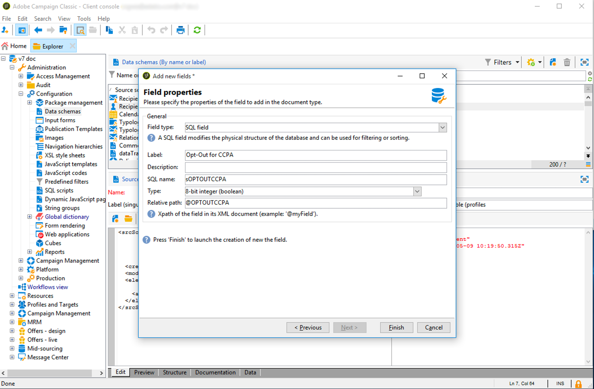

# 管理隱私權要求 {#privacy-requests}

有關隱私權管理的一般簡報，請參閱 [本節](../../platform/using/privacy-management.md)。

此資訊適用於GDPR、CCPA、PDPA和LGPD。 For more on these regulations, see [this section](../../platform/using/privacy-management.md#privacy-management-regulations).

CCPA專屬的個人資訊銷售選擇退出說明請見本 [節](#sale-of-personal-information-ccpa)。

>[!IMPORTANT]
>
>本檔案所述的安裝程式適用於啟動Campaign Classic 18.4(build 8931+)的程式。 如果您使用舊版執行，請參閱此 [技術](https://helpx.adobe.com/tw/campaign/kb/how-to-install-gdpr-package-on-legacy-versions.html)。

## 關於隱私權要求 {#about-privacy-requests}

為協助您做好隱私權準備，Adobe Campaign可讓您處理存取和刪除要求。 本 **節將說明** 「存取權 **」和「忘記權** （刪除請求）」 [等](../../platform/using/privacy-management.md#right-access-forgotten)。

讓我們看看您如何建立存取和刪除請求，以及Adobe Campaign如何處理這些請求。

### 原則 {#principles}

Adobe Campaign為資料掌控者提供兩種執行隱私權存取和刪除要求的可能：

* 透過 **Adobe Campaign介面**:對於每個隱私權要求，資料控制者會在Adobe Campaign中建立新的隱私權要求。 請參閱[本區段](#create-privacy-request-ui)。
* 透過 **API**:Adobe Campaign提供API，允許使用SOAP自動處理隱私權要求。 請參閱[本區段](#automatic-privacy-request-api)。

>[!NOTE]
>
>如需有關個人資料以及管理資料的不同實體（資料控制者、資料處理者和資料主體）的詳細資訊，請參 [閱個人資料和人員](../../platform/using/privacy-and-recommendations.md#personal-data)。

### 必要條件 {#prerequesites}

Adobe Campaign提供資料掌控者工具，可針對儲存在Adobe Campaign中的資料建立和處理隱私權要求。 不過，資料掌控者有責任處理與資料主體（電子郵件、客戶服務或入口網站）的關係。

因此，您身為資料掌控者的責任是確認提出請求的資料主體的身分，並確認傳回給請求者的資料與資料主體有關。

### 安裝隱私包 {#install-privacy-package}

若要使用此功能，您必須透過> **[!UICONTROL Privacy Data Protection Regulation]** > **[!UICONTROL Tools]** >選單安裝套件 **[!UICONTROL Advanced]****[!UICONTROL Import package]****[!UICONTROL Adobe Campaign Package]** 。 有關如何安裝軟體包的詳細資訊，請參閱詳 [細文檔](../../installation/using/installing-campaign-standard-packages.md)。

「隱私權」專屬的兩個新資料夾會建立在 **[!UICONTROL Administration]** >下 **[!UICONTROL Platform]**&#x200B;方：

* **[!UICONTROL Privacy Requests]**:您可在此建立您的隱私權要求並追蹤其演變。
* **[!UICONTROL Namespaces]**:這是您用來定義欄位的位置，此欄位將用來識別Adobe Campaign資料庫中的資料主體。


在 **[!UICONTROL Administration]** > **[!UICONTROL Production]** > **[!UICONTROL Technical workflows]**&#x200B;中，每天執行三個技術工作流程來處理隱私權要求。


* **[!UICONTROL Collect privacy requests]**:此工作流程會產生儲存在Adobe Campaign中的收件者資料，並讓該資料可在隱私權要求的畫面中下載。
* **[!UICONTROL Delete privacy requests data]**:此工作流程會刪除Adobe Campaign中儲存的收件者資料。
* **[!UICONTROL Privacy request cleanup]**:此工作流程會清除90天以前的存取要求檔案。

在 **[!UICONTROL Administration]** > **[!UICONTROL Access Management]** > **[!UICONTROL Named rights]**&#x200B;中，已 **[!UICONTROL Privacy Data Right]** 新增命名權限。 資料控制者若要使用隱私權工具，必須具備此指名權限。 這可讓他們建立新請求、追蹤其演變、使用API等。


### 名稱空間 {#namesspaces}

在建立隱私權要求之前，您必須先定義要使用的命名空間。 這是用來識別Adobe Campaign資料庫中資料主體的索引鍵。

3個可用的現成可用名稱空間：電子郵件、手機和行動電話。 如果您需要不同的命名空間（例如收件者自訂欄位），您可以從> **[!UICONTROL Administration]****[!UICONTROL Platform]** >建立新的 **[!UICONTROL Namespaces]**。

## 建立隱私權請求 {#create-privacy-request-ui}

Adobe **Campaign介面可讓您建立您的隱私權要求** ，並追蹤其演變。 若要建立新的隱私權要求，請依照下列指示：

1. 存取「 > > >」下的「隱私權 **[!UICONTROL Administration]** 要求 **[!UICONTROL Platform]** 」資料 **[!UICONTROL Privacy Requests]**&#x200B;夾。

   

1. 此螢幕可讓您檢視所有目前的隱私權要求、其狀態和記錄檔。 按一 **[!UICONTROL New]** 下以建立隱私權要求。

   

1. 選擇 **[!UICONTROL Regulation]** （GDPR、CCPA、PDPA或LGPD）、 **[!UICONTROL Request type]** （訪問或刪除），選擇 **[!UICONTROL Namespace]** 並輸入 **[!UICONTROL Reconciliation value]**。 如果您使用電子郵件作為命名空間，請輸入「資料主體」的電子郵件。

   

隱私權技術工作流程每天執行一次，並處理每個新要求：

* 刪除請求：儲存在Adobe Campaign中的收件者資料會遭到清除。
* 存取要求：收件者儲存在Adobe Campaign中的資料會產生，並以XML檔案形式提供在請求畫面的左側。


### 表清單 {#list-of-tables}

執行刪除或存取隱私權要求時，Adobe Campaign會根據所有具有收件者表格連結的表格（自有類型），搜尋所有資料主體的資料。 **[!UICONTROL Reconciliation value]**

以下是執行隱私權要求時會考量的現成可用表格清單：

* 收件者（收件者）
* 收件者傳送記錄(broadLogRcp)
* 收件者追蹤記錄檔(trackingLogRcp)
* 封存的事件傳送記錄(broadLogEventHisto)
* 收件者清單內容(rcpGrpRel)
* 訪客優惠提案（提案訪客）
* 訪客（訪客）
* 訂閱歷史記錄(subHisto)
* 訂閱（訂閱）
* 收件者選件提案（提案Rcp）

如果您建立的自訂表格具有與收件者表格（自有類型）的連結，也會考量這些表格。 例如，如果您有一個與收件人表連結的事務處理表和一個與事務處理表連結的事務處理詳細資訊表，則會同時考慮這些表。

>[!IMPORTANT]
>
>如果您使用描述檔刪除工作流程來執行隱私權批次要求，請考慮下列注釋：
>* 透過工作流程刪除描述檔時，不會處理子表格。
>* 您需要處理所有子表格的刪除。
>* Adobe建議您建立ETL工作流程，在「隱私權存取」表格中新增要刪除的行，並讓 **[!UICONTROL Delete privacy requests data]** 執行刪除。 我們建議限制每天200個設定檔，以便因效能而刪除。


### 隱私權要求狀態 {#privacy-request-statuses}

隱私權要求的不同狀態如下：

* **[!UICONTROL New]** / **[!UICONTROL Retry pending]**:進行中時，工作流尚未處理請求。
* **[!UICONTROL Processing]** / **[!UICONTROL Retry in progress]**:工作流正在處理請求。
* **[!UICONTROL Delete pending]**:工作流程已識別所有要刪除的收件者資料。
* **[!UICONTROL Delete in progress]**:工作流正在處理刪除。
* **[!UICONTROL Delete Confirmation Pending]** （在2步驟處理模式中刪除請求）:工作流已處理訪問請求。 請求手動確認以執行刪除。 此按鈕可使用15天。
* **[!UICONTROL Complete]**:請求處理完成，無錯誤。
* **[!UICONTROL Error]**:工作流程遇到錯誤。 原因會出現在欄中的隱私權要求清 **[!UICONTROL Request status]** 單中。 例如，表 **[!UICONTROL Error data not found]** 示資料庫中找不到與資料主體相符 **[!UICONTROL Reconciliation value]** 的收件者資料。

### 2步驟流程 {#two-step-process}

依預設，會 **啟動2步驟的程式** 。 當您使用此模式建立新的刪除請求時，Adobe Campaign一律會先執行存取請求。 這可讓您在確認刪除之前先檢查資料。

您可以從隱私權要求版本畫面變更此模式。 按一下 **[!UICONTROL Advanced settings]**。


在啟動2步驟模式後，新刪除請求的狀態會變更為 **[!UICONTROL Confirm Delete Pending]**。 從隱私權要求畫面下載產生的XML檔案並檢查資料。 要確認清除資料，請按一下 **[!UICONTROL Confirm delete data]** 按鈕。


### JSSP URL {#jspp-url}

處理存取請求時，Adobe Campaign會產生JSSP，從資料庫擷取收件者的資料，並將其匯出至儲存在本機電腦上的XML檔案。 JSSP URL的定義如下：

```
"$(serverUrl)+'/nms/gdpr.jssp?id='+@id"
```

其中@id是隱私權要求ID。

此URL儲存在架 **[!UICONTROL "File location" (@urlFile)]** 構欄位 **[!UICONTROL Privacy Requests (gdprRequest)]** 中。

該資訊在資料庫中可用90天。 一旦技術工作流程清除請求後，資訊就會從資料庫中移除，而URL就會過時。 請在從網頁下載資料之前，先檢查URL是否仍然有效。

以下是資料主體資料檔案的範例：


資料掌控者可輕鬆建立包含對應JSSP URL的Web應用程式，讓資料主體的資料檔案可從網頁取得。


以下是程式碼片段，您可做為Web應用程式活動的 **[!UICONTROL Page]** 範例。


```
<!DOCTYPE html PUBLIC "-//W3C//DTD XHTML 1.0 Transitional//EN" "http://www.w3.org/TR/xhtml1/DTD/xhtml1-transitional.dtd"> <html xmlns="http://www.w3.org/1999/xhtml"> <head> <meta http-equiv="Content-Language" content="en"> <meta http-equiv="Content-Type" content="text/html; charset=utf-8" /> <link rel="stylesheet" type="text/css" href="/nl/webForms/landingPage.css"/> <title>Clickthrough</title> <style type="text/css" media="all"> /* override formulary area */ .formulary { top: 200px; position: absolute; left: 0; } </style> </head> <body style="" class="">
<center>
<div id="wrap">
<div id="header">
<div class="header-title center-title">DOWNLOAD GDPR DATA</div>
<div class="formulary center-formulary"><form>
<div class="button large-button"><a href=[SERVER_URL]/nms/gdpr.jssp?id=13000" data-nl-type="externalLink">CLICK TO DOWNLOAD</a></div>
</form></div>
</div>
<div id="content">
<div class="row">
<div class="info">
<div class="desc">
<div class="title">EFFICIENCY</div>
<div class="desc">Our service is guaranteed to improve your efficiency. Increase performance and use our high-technology service to implement even the most ambitious of projects.</div>
</div>
</div>
</div>
</div>
<div id="footer">
<div style="text-align: center;">
<div style="float: left;"><a href="#">Contact us</a></div>
<div style="float: right;">&copy; Copyrights</div>
<div><a href="#"></a> <a href="#"></a> <a href="#"></a> <a href="#"></a></div>
</div>
</div>
</div>
</center>
</body> </html>
```

由於資料主體資料檔案的存取權限受到限制，因此必須停用網頁匿名存取。 只有具有命 **[!UICONTROL Privacy Data Right]** 名權限的運算子才能登入頁面並下載資料。

## 自動隱私權要求程式 {#automatic-privacy-request-api}

Adobe Campaign提供 **API** ，可讓您設定自動隱私權要求程式。

使用API時，一般的隱私權程式與使用介 [面相同](#create-privacy-request-ui)。 唯一的不同是建立隱私權要求。 Adobe Campaign中不會建立請求，而是會傳送包含請求資訊的POST給Campaign。 對於每個請求，螢幕中都會新增一個 **[!UICONTROL Privacy Requests]** 項目。 然後，隱私權技術工作流程會處理要求，與使用介面新增的要求相同。

如果您使用API來提交隱私權要求，我們建議您保留針對第一個刪除要求啟動 **2步驟的程式** ，以測試傳回的資料。 測試完成後，您可以停用2步驟程式，讓刪除請求程式自動執行。

JS **[!UICONTROL CreateRequestByName]** API的定義如下。

>[!NOTE]
>
>如果您使用 **gdprRequest** API，仍可使用它，但建議使用新的 **privacyRequest** API。

>[!IMPORTANT]
>
>使 **[!UICONTROL Privacy Data Right]** 用API需要具名權限。

```
<method library="nms:gdpr.js" name="CreateRequestByName" static="true">
 <help>Create a new GDPR Request using namespace internal name</help>
 <parameters>
  <param name="namespaceName" type="string" desc="Namespace internal name"/>
  <param name="reconciliationValue" type="string" desc="Reconciliation value"/>
  <param name="type" type="long" desc="Reconciliation value"/>
  <param name="confirmDeletePending" type="boolean" desc="Request confirm before deleting data"/>
  <param name="regulation" type="long" desc="regulation of newly created request"/>
  <param name="id" type="long" inout="out" desc="ID of newly created request"/>
 </parameters>
</method>
```

>[!NOTE]
>
>只有在您使用Campaign Classic 20.2(build 9178+)時，「規則」欄位才可用。
>
>如果您要移轉至20.2，而且已使用API，則必須新增「規則」欄位，如上所示。 如果您使用先前的組建版本，則可繼續使用API，而不使用「規則」欄位。

### 在外部叫用API {#invoking-api-externally}

以下是如何從外部叫用API的範例（透過API進行驗證，以及隱私權API的詳細資訊）。 如需隱私權API的詳細資訊，請參閱 [API檔案](https://docs.adobe.com/content/help/en/campaign-classic/technicalresources/api/s-nms-privacyRequest.html)。 您也可以參閱 [Web service呼叫檔案](../../configuration/using/web-service-calls.md)。

首先，您需要透過API執行驗證：

1. 透過 **此URL下載xtk:session** WSDL: **`<server url>`/nl/jsp/schemawsdl.jsp?schema=xtk:session**。

1. 使用「登入」方法，並將使用者名稱和密碼傳入請求中作為參數。 您將會收到包含工作階段Token的回應。 以下是使用SoapUI的範例。

   

1. 使用傳回的作業Token作為所有後續API呼叫的驗證。 24小時後到期。

然後叫用隱私權API:

1. 從此URL下載WSDL: **`<server url>`/nl/jsp/schemawsdl.jsp?schema=nms:privacyRequest**。

1. 使用 **[!UICONTROL CreateRequestByName]** 來建立特定的隱私權要求。

   以下是使用的範例 **[!UICONTROL CreateRequestByName]**。 請注意我們如何使用上述的作業Token做為驗證。 回應是已建立請求的ID。

   

   若要協助您執行上述步驟，請考慮下列事項：

   * 您可以在 **nms:gdprRequest架構上使** 用queryDef **** ，以檢查Access請求的狀態。
   * 您可以在 **nms:gdprRequestData****** 架構上使用queryDef來取得存取要求的結果。
   * 若要從 **&quot;$(serverUrl)&#39;/nms/gdpr.jssp?id=&#39;@id&quot;下載XML檔案**，您必須登入並從白名單IP存取它。 若要這麼做，請建立Web應用程式，讓您存取JSSP產生的檔案。

### 從JS叫用API {#invoking-api-from-js}

以下範例說明如何從Campaign Classic中的JS叫用API。

>[!NOTE]
>
>只有在您使用Campaign Classic 20.2(build 9178+)時，「規則」欄位才可用。
>
>如果您要移轉至20.2，而且已使用API，則必須新增「規則」欄位。 如果您使用先前的組建版本，則可繼續使用API，而不使用「規則」欄位。

* 如果您使 **用舊版（含GDPR套件）**，則可繼續使用API而不使用「規則」欄位，如下所示：

   ```
   loadLibrary("nms:gdpr.js");
   /**************************** 
   This code calls an API to create new Privay request on the DB.
   It requires 4 parameters below.
   Feel free to change parameter values.
   ****************************/
   // 1. Namespace internal name
   var namespaceName = "defaultNamespace1";
   // 2. Reconciliation value for privacy request
   var reconciliationValue = "example@adobe.com";
   // 3. Privacy request type
   // GDPR_REQUEST_TYPE_ACCESS = 1;
   // GDPR_REQUEST_TYPE_DELETE = 2;
   var requestType = GDPR_REQUEST_TYPE_ACCESS;
   // 4. Confirm deleting data required.
   // value : true or false
   var ConfirmDeletePending = true;
   // BEGIN
   var requestId = nms.privacyRequest.CreateRequestByName(namespaceName, reconciliationValue, requestType, ConfirmDeletePending);
   // User can use a simple queryDef with requestID as a parameter to check request status.
   ```

* 如果您要 **移轉至20.2** ，而且您已使用API，則必須新增「規則」欄位，如下所示：

   ```
   loadLibrary("nms:gdpr.js");
   /**************************** 
   This code calls an API to create new Privay request on the DB.
   It requires 5 parameters below.
   Feel free to change parameter values.
   ****************************/
   // 1. Namespace internal name
   var namespaceName = "defaultNamespace1";
   // 2. Reconciliation value for privacy request
   var reconciliationValue = "example@adobe.com";
   // 3. Privacy request type
   // PRIVACY_REQUEST_TYPE_ACCESS = 1;
   // PRIVACY_REQUEST_TYPE_DELETE = 2;
   var requestType = PRIVACY_REQUEST_TYPE_ACCESS;
   // 4. Confirm deleting data required.
   // value : true or false
   var ConfirmDeletePending = true;
   // 5. Specify which regulation applies to newly created request. This is mandatory parameter.
   // GDPR = 1
   // CCPA = 2
   // PDPA = 3
   // LGPD = 4
   var regulation = 1;
   // BEGIN
   var requestId = nms.privacyRequest.CreateRequestByName(namespaceName, reconciliationValue, requestType, ConfirmDeletePending, regulation);
   // User can use a simple queryDef with requestID as a parameter to check request status.
   ```

* 如果您使 **用Campaign Classic 20.2(build 9178+)或更高版本**，則「規則」欄位為選擇性，如下所示：

   ```
   loadLibrary("nms:gdpr.js");
   /**************************** 
   This code calls an API to create new Privay request on the DB.
   It requires 5 parameters below.
   Feel free to change parameter values 
   ****************************/
   // 1. Namespace internal name
   var namespaceName = "defaultNamespace1";
   // 2. Reconciliation value for privacy request
   var reconciliationValue = "example@adobe.com";
   // 3. Privacy request type
   // PRIVACY_REQUEST_TYPE_ACCESS = 1;
   // PRIVACY_REQUEST_TYPE_DELETE = 2;
   var requestType = PRIVACY_REQUEST_TYPE_ACCESS;
   // 4. Confirm deleting data required.
   // value : true or false
   var ConfirmDeletePending = true;
   // 5. Specify which regulation applies to newly created request. This is optional parameter.
   // GDPR = 1
   // CCPA = 2
   // PDPA = 3
   // LGPD = 4
   var regulation = 1;
   // BEGIN
   var requestId = nms.privacyRequest.CreateRequestByName(namespaceName, reconciliationValue, requestType, ConfirmDeletePending, regulation);
   // User can use a simple queryDef with requestID as a parameter to check request status.
   ```

## 選擇退出個人資訊銷售 (CCPA) {#sale-of-personal-information-ccpa}

The **California Consumer Privacy Act** (CCPA) provides California residents new rights in regards to their personal information and imposes data protection responsibilities on certain entities whom conduct business in California.

GDPR和CCPA都常使用存取與刪除請求的設定與使用。 本節說明CCPA專屬的個人資料銷售選擇。

除了Adobe Campaign提供的 [「同意管理](../../platform/using/privacy-management.md#consent-management) 」工具外，您還可以追蹤消費者是否選擇退出個人資訊的銷售。

消費者透過您的系統決定，他／她不允許將個人資訊賣給第三方。 在Adobe Campaign中，您將可儲存及追蹤此資訊。

為了使此功能發揮作用，您需要擴展「配置式」(Profiles)表格並添加一 **[!UICONTROL Opt-Out for CCPA]** 個欄位。

>[!IMPORTANT]
>
>您身為資料掌控者，有責任接收資料主體的要求並追蹤CCPA的要求日期。 身為技術供應商，我們只提供選擇退出的方式。 有關您擔任資料掌控者的詳細資訊，請參 [閱個人資料和角色](../../platform/using/privacy-and-recommendations.md#personal-data)。

### 先決條件 {#ccpa-prerequisite}

若要運用此資訊，您必須在Adobe Campaign Classic中建立此欄位。 為此，您將向表中添加一個布爾 **[!UICONTROL Recipient]** 欄位。 建立新欄位時，促銷活動API會自動支援該欄位。

如果您使用自訂收件者表格，您也需要執行此作業。

有關如何建立新欄位的詳細資訊，請參閱方案版 [文檔](../../configuration/using/about-schema-edition.md)。

>[!IMPORTANT]
>
>修改方案是敏感操作，只能由專家用戶執行。

1. 前往 **[!UICONTROL Tools]** > **[!UICONTROL Advanced]** > **[!UICONTROL Add new fields]**，選 **[!UICONTROL Recipients]** 取為並 **[!UICONTROL Document type]** 按一下 **[!UICONTROL Next]**。 有關將欄位添加到表的詳細資訊，請參 [閱此部分](../../configuration/using/new-field-wizard.md)。

   

1. 對於 **[!UICONTROL Field type]**，選擇 **[!UICONTROL SQL field]**。 對於「標籤」，請使用 **[!UICONTROL Opt-Out for CCPA]**。 選擇類 **[!UICONTROL 8-bit integer (boolean)]** 型並定義以下唯一 **[!UICONTROL Relative path]**:@OPTOUCCPA。 按一下 **[!UICONTROL Finish]**。

   

   這將擴展或建立模 **[!UICONTROL Recipient (cus)]** 式。 按一下該欄位，確認欄位已正確新增。

   

1. 按一下瀏 **[!UICONTROL Configuration]** 覽器 **[!UICONTROL Input forms]** 的>節點。 在「 **[!UICONTROL Recipient (nms)]**&#x200B;一般套件」下方，新增元素 `<input>` ，並使用步驟2中定義的相對路徑作為xpath值。 如需識別表單的詳細資訊，請參 [閱本節](../../configuration/using/identifying-a-form.md)。

   ```
   <input  colspan="2" type="checkbox" xpath="@OPTOUTCCPA"/>
   ```

   

1. 斷開連接並重新連接。 請依照下一節所述的步驟，確認收件者的詳細資料上有該欄位。

### 使用狀況 {#usage}

資料掌控者有責任填入欄位的值，並遵循CCPA有關資料銷售的准則和規則。

若要填入值，可使用數種方法：

* 編輯收件者的詳細資料，以使用促銷活動的介面
* 使用API
* 透過資料匯入工作流程

然後，您應確保您絕不會向任何第三方銷售已選擇退出之個人資料。

若要變更退出狀態，請前往 **[!UICONTROL Profiles and Target]** > **[!UICONTROL Recipients]** 並選取收件者。 在標籤 **[!UICONTROL General]** 中，您會看到在上一節中設定的欄位。


設定收件者清單以顯示輸出欄。 要瞭解如何配置清單，請參閱詳細 [文檔](../../platform/using/adobe-campaign-workspace.md#configuring-lists)。


您可以按一下欄，根據退出資訊對收件者排序。 您也可以建立篩選，只顯示已選擇退出的收件者。 For more on creating filters, see [this section](../../platform/using/creating-filters.md).


