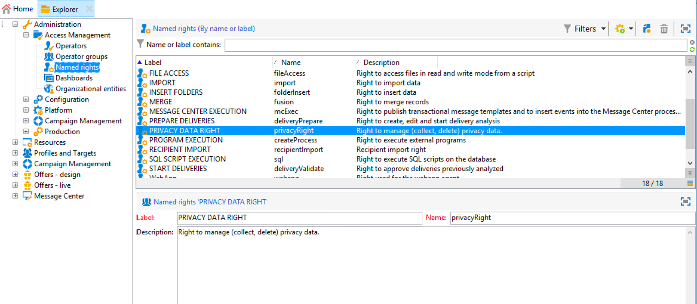

# 關於隱私權請求 {#privacy-requests}

如需隱私權管理的一般簡報，請參閱[本節](privacy-management.md)。

此資訊適用於 GDPR、CCPA、PDPA 及 LGPD。如需這些法規的詳細資訊，請參閱[本節](privacy-management.md#privacy-management-regulations)。

>[!NOTE]
>
>[本節](#sale-of-personal-information-ccpa)會詳細說明專屬於 CCPA 的選擇退出個人資訊銷售。

<!--Installation procedures described in this document are applicable starting Campaign Classic 18.4 (build 8931+). If you are running on a previous version, refer to this [technote](https://helpx.adobe.com/campaign/kb/how-to-install-gdpr-package-on-legacy-versions.html).-->

為協助您加速隱私權準備，Adobe Campaign 可讓您處理存取和刪除要求。[本節](privacy-management.md#right-access-forgotten)說明&#x200B;**存取權限**&#x200B;及&#x200B;**被遺忘的權利**（刪除要求）。

Adobe Campaign 為資料控制方執行隱私權存取和刪除請求提供兩種可能性：

* 透過 **Adobe Campaign 介面**：針對每個隱私權請求，資料控制方會在 Adobe Campaign 建立新的隱私權請求。請參閱[本節](privacy-requests-ui.md)。
* 透過&#x200B;**API**：Adobe Campaign 提供 API允許使用 SOAP 自動處理隱私權請求。請參閱[本節](privacy-requests-api.md)。

>[!NOTE]
>
>* 如需關於個人資料及管理資料之不同實體 (資料控制方、資料處理方和資料主體) 的詳細資訊，請參閱[個人資料和人員](privacy-and-recommendations.md#personal-data)。
>* 若要深入瞭解隱私權要求，請參閱[Campaign v8檔案](https://experienceleague.adobe.com/zh-hant/docs/campaign/campaign-v8/privacy/privacy){target=_blank}。

<!--
## Prerequisites {#prerequesites}

Adobe Campaign offers Data Controllers tools to create and process Privacy requests for data stored in Adobe Campaign. However, it is the Data Controller's responsibility to handle the relationship with the Data Subject (email, customer care or a web portal).

It is therefore your responsibility as a Data Controller to confirm the identity of the Data Subject making the request and to confirm that the data returned to the requester is about the Data Subject.

## Installing the Privacy package {#install-privacy-package}

In order to use this feature, you need to install the **[!UICONTROL Privacy Data Protection Regulation]** package via the **[!UICONTROL Tools]** > **[!UICONTROL Advanced]** > **[!UICONTROL Import package]** > **[!UICONTROL Adobe Campaign Package]** menu. For more information on how to install packages, refer to the [detailed documentation](../../installation/using/installing-campaign-standard-packages.md).

Two new folders, specific to Privacy, are created under **[!UICONTROL Administration]** > **[!UICONTROL Platform]**:

* **[!UICONTROL Privacy Requests]**: this is where you will create your Privacy requests and track their evolution.
* **[!UICONTROL Namespaces]**: this is where you will define the field that will be used to identify the Data Subject in the Adobe Campaign database.

In **[!UICONTROL Administration]** > **[!UICONTROL Production]** > **[!UICONTROL Technical workflows]**, three technical workflows run every day to process Privacy requests.

* **[!UICONTROL Collect privacy requests]**: this workflow generates the recipient's data stored in Adobe Campaign and makes it available for download in the privacy request's screen.
* **[!UICONTROL Delete privacy requests data]**: this workflow deletes the recipient's data stored in Adobe Campaign.
* **[!UICONTROL Privacy request cleanup]**: this workflow erases the access request files that are older than 90 days.

In **[!UICONTROL Administration]** > **[!UICONTROL Access Management]** > **[!UICONTROL Named rights]**, the **[!UICONTROL Privacy Data Right]** named right has been added. This named right is required for Data Controllers in order for them to use privacy tools. This allows them to create new requests, track their evolution, use the API, etc.

## Namespaces {#namesspaces}

Before creating Privacy requests, you need to define the namespace you will use. This is the key that will be used to identify the Data Subject in the Adobe Campaign database.

Three namespaces are available out-of-the-box: email, phone and mobile phone. If you need a different namespace (a recipient custom field, for example), you can create a new one from **[!UICONTROL Administration]** > **[!UICONTROL Platform]** > **[!UICONTROL Namespaces]**.

>[!NOTE]
>
>For optimal performance, it is recommended to use out-of-the-box namespaces.
-->