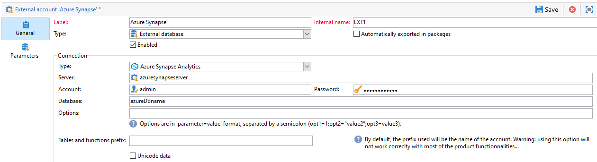

# 按資料庫類型列出的特定配置 {#specific-configurations-by-database-type}

根據您想要能夠從Adobe Campaign存取的外部資料庫，您需要執行特定的組態。 這些配置實際上涉及在Adobe Campaign伺服器上安裝驅動程式並聲明屬於每個RDBMS的環境變數。

一般而言，您必須在Adobe Campaign伺服器的外部資料庫上安裝對應的用戶端層。

>[!NOTE]
>
>相容版本會列在「促銷活動相 [容性矩陣」中](https://helpx.adobe.com/campaign/kb/compatibility-matrix.html#FederatedDataAccessFDA)。

## 配置對Azure突觸的訪問 {#configure-access-to-azure-synapse}

### Azure突觸外部帳戶 {#azure-external}

外部 [!DNL Azure] 帳戶可讓您將Campaign例項連接至Azure Synapse外部資料庫。
要建立外部 [!DNL Azure Synapse] 帳戶外部帳戶，請：

1. 在Campaign Classic中，設定您的 [!DNL Azure Synapse] 外部帳戶。 在中 **[!UICONTROL Explorer]**&#x200B;按一下 **[!UICONTROL Administration]** / **[!UICONTROL Platform]** / **[!UICONTROL External accounts]**。

1. 按一下「**[!UICONTROL Create]**」。

1. 設定外 [!DNL Azure Synapse] 部帳戶，您必須指定：

   * **[!UICONTROL Type]**: Azure突觸分析

   * **[!UICONTROL Server]**: Azure Synapse伺服器的URL

   * **[!UICONTROL Account]**: 用戶名稱

   * **[!UICONTROL Password]**: 使用者帳戶密碼

   * **[!UICONTROL Database]**: 資料庫的名稱
   

### CentOS上的Azure突觸 {#azure-centos}

**必要條件：**

* 安裝ODBC驅動程式時需要根權限。
* Microsoft提供的Red Hat Enterprise ODBC驅動程式也可與CentOS一起使用以連接到SQL Server。
* 13.0版將適用於Red Hat 6和7。

在CentOS上配置Azure突觸：

1. 首先，安裝ODBC驅動程式。 您可在本頁找到 [它](https://www.microsoft.com/en-us/download/details.aspx?id=50420)。

   >[!NOTE]
   >
   >這是ODBC驅動程式第13版的獨有內容。

   ```
   sudo su
   curl https://packages.microsoft.com/config/rhel/6/prod.repo > /etc/yum.repos.d/mssql-release.repo
   exit
   # Uninstall if already installed Unix ODBC driver
   sudo yum remove unixODBC-utf16 unixODBC-utf16-devel #to avoid conflicts
   
   sudo ACCEPT_EULA=Y yum install msodbcsql
   
   sudo ACCEPT_EULA=Y yum install mssql-tools
   echo 'export PATH="$PATH:/opt/mssql-tools/bin"' >> ~/.bash_profile
   echo 'export PATH="$PATH:/opt/mssql-tools/bin"' >> ~/.bashrc
   source ~/.bashrc
   
   # the Microsoft driver expects unixODBC to be here /usr/lib64/libodbc.so.1, so add soft links to the '.so.2' files
   cd /usr/lib64
   sudo ln -s libodbccr.so.2   libodbccr.so.1
   sudo ln -s libodbcinst.so.2 libodbcinst.so.1
   sudo ln -s libodbc.so.2     libodbc.so.1
   
   # Set the path for unixODBC
   export ODBCINI=/usr/local/etc/odbc.ini
   export ODBCSYSINI=/usr/local/etc
   source ~/.bashrc
   
   #Add a DSN information to /etc/odbc.ini
   sudo vi /etc/odbc.ini
   
   #Add the following:
   [Azure Synapse Analytics]
   Driver      = ODBC Driver 13 for SQL Server
   Description = Azure Synapse Analytics DSN
   Trace       = No
   Server      = [insert your server here]
   ```

1. 如果需要，可以通過運行以下命令來安裝unixODBC開發標頭：

   ```
   sudo yum install unixODBC-devel
   ```

1. 安裝驅動程式後，您可以測試並驗證ODBC驅動程式，並根據需要查詢資料庫。 運行以下命令：

   ```
   /opt/mssql-tools/bin/sqlcmd -S yourServer -U yourUserName -P yourPassword -q "your query" # for example -q "select 1"
   ```

1. 在Campaign Classic中，您接著可以設定您的 [!DNL Azure Synapse] 外部帳戶。 如需如何設定外部帳戶的詳細資訊，請參閱此 [節](../../platform/using/specific-configuration-database.md#azure-external)。

1. 由於Azure Synapse Analytics通過TCP 1433埠進行通信，因此您需要在防火牆上開啟此埠。 使用下列命令：

   ```
   firewall-cmd --permanent --add-rich-rule='rule family="ipv4" source address="[server_ip_here]/32" port port="1433" protocol="tcp" accept'
   # you can ping your hostname and the ping command will translate the hostname to IP address which you can use here
   ```

   >[!NOTE]
   >
   >若要允許來自Azure Synapse Analytics的通訊，您可能需要將公共IP加入白名單。 若要這麼做，請參閱 [Azure檔案](https://docs.microsoft.com/en-us/azure/sql-database/sql-database-firewall-configure#use-the-azure-portal-to-manage-server-level-ip-firewall-rules)。

1. 如果是iptables，請運行以下命令：

   ```
   iptables -A OUTPUT -p tcp -d [server_hostname_here] --dport 1433 -j ACCEPT
   ```

### Windows上的Azure突觸 {#azure-windows}

>[!NOTE]
>
>這是ODBC驅動程式第13版的獨有內容，但Adobe Campaign Classic也可以使用SQL Server Native Client驅動程式11.0和10.0。

要在Windows上配置Azure突觸：

1. 首先，安裝Microsoft ODBC驅動程式。 您可在本頁找到 [它](https://www.microsoft.com/en-us/download/details.aspx?id=50420)。

1. 選擇要安裝的以下檔案：

   ```
   your_language\your_architecture\msodbcsql.msi (i.e: English\X64\msodbcsql.msi)
   ```

1. 在安裝ODBC驅動程式後，您可以根據需要對其進行測試。 For more on this, refer to this [page](https://docs.microsoft.com/en-us/sql/connect/odbc/windows/system-requirements-installation-and-driver-files?view=sql-server-ver15#installing-microsoft-odbc-driver-for-sql-server).

1. 在Campaign Classic中，您接著可以設定您的 [!DNL Azure Synapse] 外部帳戶。 如需如何設定外部帳戶的詳細資訊，請參閱此 [節](../../platform/using/specific-configuration-database.md#azure-external)。

1. 由於Azure Synapse Analytics通過TCP 1433埠進行通信，因此您需要在Windows Defender Firewall上開啟此埠。 For more on this, refer to [Windows documentation](https://docs.microsoft.com/en-us/windows/security/threat-protection/windows-firewall/create-an-outbound-program-or-service-rule).

### Debian上的Azure突觸 {#azure-debian}

**必要條件：**

* 安裝ODBC驅動程式時需要根權限。
* 需要Curl才能安裝msodbcsql軟體包。 如果尚未安裝，請運行以下命令：

   ```
   sudo apt-get install curl
   ```

要在Debian上配置Azure突觸：

1. 首先，安裝SQL Server的Microsoft ODBC驅動程式。 使用以下命令來安裝SQL Server的ODBC驅動程式13.1:

   ```
   sudo su
   curl https://packages.microsoft.com/keys/microsoft.asc | apt-key add -
   curl https://packages.microsoft.com/config/debian/8/prod.list > /etc/apt/sources.list.d/mssql-release.list
   exit
   sudo apt-get update
   sudo ACCEPT_EULA=Y apt-get install msodbcsql
   ```

1. 如果您在呼叫 **sudo apt-get update時遇到以下錯誤：** 「The method driver /usr/lib/apt/methods/https could not be found」（方法驅動程式/usr/lib/apt/methods/https找不到） ****，您應該運行該命令：

   ```
   sudo apt-get install apt-transport-https ca-certificates
   ```

1. 您現在需要使用下列命令安裝mssql-tools。 需要Mssq-tools才能使用批量復製程式（或BCP）實用程式並運行查詢。

   ```
   sudo ACCEPT_EULA=Y apt-get install mssql-tools
   echo 'export PATH="$PATH:/opt/mssql-tools/bin"' >> ~/.bash_profile
   echo 'export PATH="$PATH:/opt/mssql-tools/bin"' >> ~/.bashrc
   source ~/.bashrc
   ```

1. 如果需要，可以通過運行以下命令來安裝unixODBC開發標頭：

   ```
   sudo yum install unixODBC-devel
   ```

1. 安裝驅動程式後，您可以測試並驗證ODBC驅動程式，並根據需要查詢資料庫。 運行以下命令：

   ```
   /opt/mssql-tools/bin/sqlcmd -S yourServer -U yourUserName -P yourPassword -q "your query" # for example -q "select 1"
   ```

1. 在Campaign Classic中，您現在可以設定您的 [!DNL Azure Synapse] 外部帳戶。 如需如何設定外部帳戶的詳細資訊，請參閱此 [節](../../platform/using/specific-configuration-database.md#azure-external)。

1. 若要在Debian上配置iptables以確保與Azure Synapse Analytics的連接，請使用下列命令為您的主機名啟用出站TCP 1433埠：

   ```
   iptables -A OUTPUT -p tcp -d [server_hostname_here] --dport 1433 -j ACCEPT
   ```

   >[!NOTE]
   >
   >若要允許來自Azure Synapse Analytics的通訊，您可能需要將公共IP加入白名單。 若要這麼做，請參閱 [Azure檔案](https://docs.microsoft.com/en-us/azure/sql-database/sql-database-firewall-configure#use-the-azure-portal-to-manage-server-level-ip-firewall-rules)。

## 配置對雪花的訪問 {#configure-access-to-snowflake}

>[!NOTE]
>
>[!DNL Snowflake] connector適用於代管和內部部署。 For more on this, refer to [this article](https://helpx.adobe.com/campaign/kb/acc-on-prem-vs-hosted.html).


### 雪花外部帳戶 {#snowflake-external}

外部 [!DNL Snowflake] 帳戶可讓您將促銷活動實例連接至Snowflake外部資料庫。

1. 在Campaign Classic中，設定您的 [!DNL Snowflake] 外部帳戶。 在中 **[!UICONTROL Explorer]**&#x200B;按一下 **[!UICONTROL Administration]** / **[!UICONTROL Platform]** / **[!UICONTROL External accounts]**。

1. 選擇內建外部 **[!UICONTROL Snowflake]** 帳戶。

1. 設定外 **[!UICONTROL Snowflake]** 部帳戶，您必須指定：

   * **[!UICONTROL Server]**: 伺服器的URL [!DNL Snowflake]

   * **[!UICONTROL Account]**: 用戶名稱

   * **[!UICONTROL Password]**: 使用者帳戶密碼

   * **[!UICONTROL Database]**: 資料庫的名稱
   

1. 按一下標 **[!UICONTROL Parameters]** 簽，然後按一 **[!UICONTROL Deploy functions]** 下按鈕以建立函式。

   

連接器支援以下選項：

| 選項 | 說明 |
|---|---|
| 工作架構 | 用於工作表的資料庫模式 |
| 倉庫 | 要使用的預設倉庫名稱。 它會覆寫使用者的預設值。 |
| 時區名稱 | 預設為空，這表示使用Campaign Classic應用程式伺服器的系統時區。 此選項可用於強制TIMEZONE會話參數。 <br>有關詳細資訊，請參見[此頁面](https://docs.snowflake.net/manuals/sql-reference/parameters.html#timezone)。 |
| WeekStart | WEEK_START會話參數。 依預設設為0。 <br>有關詳細資訊，請參見[此頁面](https://docs.snowflake.com/en/sql-reference/parameters.html#week-start)。 |
| UseCachedResult | USE_CACHED_RESULTS會話參數。 預設設定為TRUE。 此選項可用於禁用雪花快取結果。 <br>有關詳細資訊，請參見[此頁面](https://docs.snowflake.net/manuals/user-guide/querying-persisted-results.html)。 |

### CentOS上的雪花 {#snowflake-centos}

1. 下載的ODBC驅動程式 [!DNL Snowflake]。 [按一下這裡](https://sfc-repo.snowflakecomputing.com/odbc/linux/latest/snowflake-odbc-2.20.2.x86_64.rpm) ，開始下載。
1. 然後，您需要使用以下命令在CentOs上安裝ODBC驅動程式：

   ```
   rpm -Uvh unixodbc
   rpm -Uvh snowflake-odbc-2.20.2.x86_64.rpm
   ```

1. 在下載並安裝ODBC驅動程式後，您需要重新啟動Campaign Classic。 要執行此操作，請運行以下命令：

   ```
   /etc/init.d/nlserver6 stop
   /etc/init.d/nlserver6 start
   ```

1. 在Campaign Classic中，您接著可以設定您的 [!DNL Snowflake] 外部帳戶。 如需如何設定外部帳戶的詳細資訊，請參閱此 [節](../../platform/using/specific-configuration-database.md#snowflake-external)。

### 德比安雪花 {#snowflake-debian}

1. 下載的ODBC驅動程式 [!DNL Snowflake]。 [按一下這裡](https://sfc-repo.snowflakecomputing.com/odbc/linux/latest/index.html) ，開始下載。

1. 然後，您需要使用以下命令在Debian上安裝ODBC驅動程式：

   ```
   apt-get install unixodbc
   apt-get install snowflake-odbc-x.xx.x.x86_64.deb
   ```

1. 在下載並安裝ODBC驅動程式後，您需要重新啟動Campaign Classic。 要執行此操作，請運行以下命令：

   ```
   systemctl stop nlserver.service
   systemctl start nlserver.service
   ```

1. 在Campaign Classic中，您接著可以設定您的 [!DNL Snowflake] 外部帳戶。 如需如何設定外部帳戶的詳細資訊，請參閱此 [節](../../platform/using/specific-configuration-database.md#snowflake-external)。

### 窗戶上的雪花 {#snowflake-windows}

1. 下載Windows [版ODBC驅動程式](https://docs.snowflake.net/manuals/user-guide/odbc-download.html)。 請注意，您需要管理員級權限才能安裝驅動程式。 For more on this, refer to [this page](https://docs.snowflake.net/manuals/user-guide/admin-user-management.html)

1. 配置ODBC驅動程式。 For more on this, refer to [this page](https://docs.snowflake.net/manuals/user-guide/odbc-windows.html#step-2-configure-the-odbc-driver)

1. 在Campaign Classic中，您接著可以設定您的 [!DNL Snowflake] 外部帳戶。 如需如何設定外部帳戶的詳細資訊，請參閱此 [節](../../platform/using/specific-configuration-database.md#snowflake-external)。

## 配置對Hadoop 3.0的訪問 {#configure-access-to-hadoop-3}

在FDA中連線至Hadoop外部資料庫需要Adobe Campaign伺服器上的下列組態。 請注意，此配置適用於Windows和Linux。

1. 根據您的OS版本下載Hadoop的ODBC驅動程式。 此頁上可找到驅 [動程式](https://www.cloudera.com/downloads.html)。

1. 然後，您需要安裝ODBC驅動程式並為Hive連接建立DSN。 本頁提供說 [明](https://docs.cloudera.com/documentation/other/connectors/hive-odbc/2-6-5/Cloudera-ODBC-Driver-for-Apache-Hive-Install-Guide.pdf)

1. 在下載並安裝ODBC驅動程式後，您需要重新啟動Campaign Classic。 要執行此操作，請運行以下命令：

   ```
   systemctl stop nlserver.service
   systemctl start nlserver.service
   ```

1. 在Campaign Classic中，您接著可以設定Snowflake外部帳戶。 在中 **[!UICONTROL Explorer]**&#x200B;按一下 **[!UICONTROL Administration]** / **[!UICONTROL Platform]** / **[!UICONTROL External accounts]**。

1. 按一 **[!UICONTROL Create]** 下並選 **[!UICONTROL External database]** 取為帳戶類型。

1. 若要設定 **[!UICONTROL  Hadoop]** 外部帳戶，您必須指定：

   * **[!UICONTROL Type]**: ODBC(Sybase ASE、Sybase IQ)

   * **[!UICONTROL Server]**: DNS的名稱

   * **[!UICONTROL Account]**: 用戶名稱

   * **[!UICONTROL Password]**: 使用者帳戶密碼

   * **[!UICONTROL Database]**: DSN中未指定的資料庫名稱。 如果在DSN中指定，則可保留為空

   * **[!UICONTROL Time zone]**: 伺服器時區
   

連接器支援以下ODBC選項：

| 名稱 | 值 |
|---|---|
| ODBCMgr | iODBC |
| 倉庫 | 1/2/4 |

連接器還支援以下Hive選項：

| 名稱 | 值 | 說明 |
|---|---|---|
| bulkKey | Azure blob或DataLake存取金鑰 | 對於wasb://或wasbs://大量載入器(即，如果批量載入工具以wasb://或wasbs://開頭)。 <br>它是blob或DataLake儲存貯體的存取金鑰，以進行大量載入。 |
| hdfsPort | 埠 <br>號預設設定為8020 | 對於HDFS批量載入(即，如果批量載入工具以webhdfs://或webhdfss://開頭)。 |
| burketsNumber | 20 | 建立聚簇表時的桶數。 |
| fileFormat | 鑲木 | 工作表的預設檔案格式。 |

## 配置對Hadoop 2.1的訪問 {#configure-access-to-hadoop}

### 適用於Windows {#for-windows}

1. 安裝Windows版 [ODBC和Azure HD Insight](https://www.microsoft.com/en-us/download/details.aspx?id=40886) 驅動程式。
1. 通過運行ODBC資料源管理工具建立DSN（資料源名稱）。 Hive的系統DSN示例供您修改。

   ```
   Description: vorac (or any name you like)
   Host: vorac.azurehdinsight.net
   Port: 443
   Database: sm_tst611 (or your database name)
   Mechanism: Azure HDInsight Service
   User/Password: admin/<your password here>
   ```

1. 建立Hadoop外部帳戶，如本頁 [部分所述](../../platform/using/external-accounts.md#hadoop-external-account) 。

### Linux版 {#for-linux}

1. 安裝unixodbc for Linux。

   ```
   apt-get install unixodbc
   ```

1. 從HortonWorks下載並安裝Apache Hive的ODBC驅動程式： [https://www.hortonworks.com/downloads/](https://www.hortonworks.com/downloads/).

   ```
   dpkg -i hive-odbc-native_2.1.10.1014-2_amd64.deb
   ```

1. 檢查ODBC檔案位置。

   ```
   root@campadpac71:/tmp# odbcinst -j
   unixODBC 2.3.1
   DRIVERS............: /etc/odbcinst.ini
   SYSTEM DATA SOURCES: /etc/odbc.ini
   FILE DATA SOURCES..: /etc/ODBCDataSources
   USER DATA SOURCES..: /root/.odbc.ini
   SQLULEN Size.......: 8
   SQLLEN Size........: 8
   SQLSETPOSIROW Size.: 8
   ```

1. 建立DSN（資料源名稱）並編輯odbc.ini檔案。 然後，為Hive連接建立DSN。

   以下是HDInsight設定名為「病毒式」連線的範例：

   ```
   [ODBC Data Sources]
   vorac 
   
   [vorac]
   Driver=/usr/lib/hive/lib/native/Linux-amd64-64/libhortonworkshiveodbc64.so
   HOST=vorac.azurehdinsight.net
   PORT=443
   Schema=sm_tst611
   HiveServerType=2
   AuthMech=6
   UID=admin
   PWD=<your password here>
   HTTPPath=
   UseNativeQuery=1
   ```

   >[!NOTE]
   >
   >此處 **的UseNativeQuery** 參數非常重要。 促銷活動會感知蜂窩，除非設定UseNativeQuery，否則無法正常運作。 通常，驅動程式或Hive SQL連接器將重寫查詢並篡改列順序。

   驗證設定取決於Hive/Hadoop配置。 例如，對於HD Insight，請使用AuthMech=6進行使用者／密碼驗證，如 [此說](https://www.simba.com/products/Spark/doc/ODBC_InstallGuide/unix/content/odbc/hi/configuring/authenticating/azuresvc.htm)。

1. 匯出變數。

   ```
   export ODBCINI=/etc/myodbc.ini
   export ODBCSYSINI=/etc/myodbcinst.ini
   ```

1. 通過/usr/lib/hive/lib/native/Linux-amd64-64/hortonworks.hiveodbc.ini設定Hortonworks驅動程式。

   您必須使用UTF-16才能連線Campaign和unix-odbc(libodbcinst)。

   ```
   [Driver]
   
   DriverManagerEncoding=UTF-16
   ErrorMessagesPath=/usr/lib/hive/lib/native/hiveodbc/ErrorMessages/
   LogLevel=0
   LogPath=/tmp/hive
   SwapFilePath=/tmp
   
   ODBCInstLib=libodbcinst.so
   ```

1. 您現在可以使用isql測試連線。

   ```
   isql vorac
   isql vorac -v
   ```

1. 建立Hadoop外部帳戶，如本頁 [部分所述](../../platform/using/external-accounts.md#hadoop-external-account) 。

## 配置對Netezza的訪問 {#configure-access-to-netezza}

在FDA中連線至Netezza外部資料庫需要Adobe Campaign伺服器下的其他設定：

1. 根據您使用的作業系統，安裝Netezza的ODBC驅動程式：

   * **nz-linuxclient-v7.2.0.0.tar.gz** for Linux。 選擇與作業系統（linux或linux64）對應的資料夾，然後啟動unpack命令。 您可以保留在預設情況下建議的儲存庫中執行的安裝： &quot;/usr/local/nz&quot;。
   * **nz-winclient-v7.2.0.0.zip** for Windows。 解壓縮檔案並啟動與您的作業系統對應的可執行指令碼： nzodbcsetup.exe或nzodbcsetup64.exe。 按照嚮導說明完成驅動程式的安裝。

1. 配置ODBC驅動程式。 配置可在標準檔案中執行： **/etc/odbc.ini** ，用於一般參數， **/etc/odbcinst.ini** ，用於聲明驅動程式。

   * **/etc/odbc.ini**

      ```
      [ODBC]
      InstallDir=/etc/
      ```

      &quot;InstallDir&quot;與odbcinst.ini檔案的位置相對應。

   * **/etc/odbcinst.ini**

      ```
      [ODBC Drivers]
      NetezzaSQL = Installed
      
      [NetezzaSQL]
      Driver           = /usr/local/nz/lib/libnzsqlodbc3.so
      Setup            = /usr/local/nz/lib/libnzsqlodbc3.so
      APILevel         = 1
      ConnectFunctions = YYN
      Description      = Netezza ODBC driver
      DriverODBCVer    = 03.51
      DebugLogging     = false
      LogPath          = /tmp
      UnicodeTranslationOption = utf8
      CharacterTranslationOption = all
      PreFetch         = 256
      Socket           = 16384
      ```

1. 指定Adobe Campaign伺服器的環境變數：

   * **LD_LIBRARY_PATH**: /usr/local/nz/lib和/usr/local/nz/lib64。 &quot;/usr/local/nz&quot;與安裝驅動程式時預設提供的安裝儲存庫相對應。 您需要在此處指定已為安裝選擇的儲存庫。
   * **ODBCINI**: odbc.ini檔案的位置(例如/etc/odbc.ini)。
   * **NZ_ODBC_INI_PATH**: odbc.ini檔案的位置。 Netezza還需要此第二個變數來使用odbc.ini檔案。

1. 在Campaign Classic中，您接著可以設定Netezza外部帳戶。 在中 **[!UICONTROL Explorer]**&#x200B;按一下 **[!UICONTROL Administration]** / **[!UICONTROL Platform]** / **[!UICONTROL External accounts]**。

1. 按一 **[!UICONTROL New]** 下並選 **[!UICONTROL External database]** 擇為 **[!UICONTROL Type]**。

1. 若要設定外 **[!UICONTROL Netezza]** 部帳戶，您必須指定：

   * **[!UICONTROL Type]**: 內泰扎

   * **[!UICONTROL Server]**: Netezza伺服器的URL

   * **[!UICONTROL Account]**: 用戶名稱

   * **[!UICONTROL Password]**: 使用者帳戶密碼

   * **[!UICONTROL Database]**: 資料庫的名稱

>[!NOTE]
>
>不考慮對包含自動生成的主鍵的方案的操作。
>
>表將在模式中定義的第 **一個索引上使用** Organize on子句。 由於此子句限制為1到4個Netezza列，因此此索引不能包含4個以上的列。

## 配置對Oracle的訪問 {#configure-access-to-oracle}

在FDA中連線至Oracle外部資料庫需要Adobe Campaign伺服器下方的其他設定。

### Linux版 {#for-linux-1}

1. 安裝與Oracle版本對應的Oracle完整客戶端。
1. 將您的TNS定義新增至安裝。 要執行此操作，請在/etc/oracle儲存庫 **的tnsnames.ora** 檔案中指定它們。 如果此儲存庫不存在，請建立它。

   然後建立新的TNS_ADMIN環境變數： 導出TNS_ADMIN=/etc/oracle並重新啟動電腦。

1. 將Oracle整合到您的Adobe Campaign伺服器(nlserver)。 若要這麼做，請檢查 **customer.sh** 檔案是否位於Adobe Campaign伺服器樹狀結構的「nl6」資料夾中，且其中包含Oracle程式庫的連結。

   例如，對於11.2版的客戶：

   ```
   export ORACLE_HOME=/usr/lib/oracle/11.2
   export TNS_ADMIN=/etc/oracle
   export LD_LIBRARY_PATH=$ORACLE_HOME/client64/lib:$LD_LIBRARY_PATH
   ```

   >[!NOTE]
   >
   >這些值（尤其是ORACLE_HOME）取決於您的安裝儲存庫。 請務必先檢查樹結構，然後再參照這些值。

1. 安裝Oracle所需的庫：

   * **libclntsh.so**

      ```
      cd /usr/lib/oracle/<version>/client<architecture>/lib
      ln -s libclntsh.so.<version> libclntsh.so
      ```

   * **libaio1**

      ```
      aptitude install libaio1
      or
      yum install libaio1
      ```

### 適用於Windows {#for-windows-1}

1. 安裝Oracle客戶端。
1. 在C:Oracle資料夾中，建立包含 **TNS定義的tnsnames.ora** 檔案。

   以C:Oracle為值添加TNS_ADMIN環境變數並重新啟動電腦。

## 配置對Sybase IQ的訪問 {#configure-access-to-sybase-iq}

在FDA中連接到Sybase IQ外部資料庫需要在Adobe Campaign伺服器上進行下列其他配置：

1. 確保unixodbc包位於伺服器上。
1. 安裝 **iq_odbc**。 安裝結束時可能會發生錯誤。 此錯誤可以忽略。
1. 安 **裝iq_client_common**。 安裝結束時可能會發生Java錯誤。 此錯誤可以忽略。
1. 配置ODBC驅動程式。 配置可在標準檔案中執行： /etc/odbc.ini，用於常規參數，/etc/odbcinst.ini，用於聲明驅動程式：

   * **/etc/odbc.ini** (以您自己的方式取 `<server_alias>` 代字元等值):

      ```
      [ODBC Data Sources]
      <server_alias>=libdbodbc.so
      
      [<server_alias>]
      Driver=/opt/sybase/IQ-16_0/lib64/libdbodbc16.so
      Description=<description>
      Username=<username>
      Password=<password>
      ServerName=<server_name>
      CommLinks=tcpip(host=<host>)
      ```

   * **/etc/odbcinst.ini**

      ```
      [ODBC DRIVERS]
      SAP SybaseIQ=Installed
      
      [SAP SybaseIQ]
      Driver=/opt/sybase/IQ-16_0/lib64/libdbodbc16.so
      ```

1. 在LD_LIBRARY_PATH變數中添加新libodbc16.so庫的路徑。 若要這麼做：

   * 如果您使用customer.sh檔案來宣告您的路徑： 為LD_LIBRARY_PATH變數添加路徑/opt/sybase/IQ-16_0/lib64。
   * 否則，請使用Unix命令。

1. 在Campaign Classic中，您可以配置Sybase IQ外部帳戶。 在中 **[!UICONTROL Explorer]**&#x200B;按一下 **[!UICONTROL Administration]** / **[!UICONTROL Platform]** / **[!UICONTROL External accounts]**。

1. 按一 **[!UICONTROL New]** 下並選 **[!UICONTROL External database]** 擇為 **[!UICONTROL Type]**。

1. 若要設定外 **[!UICONTROL Sybase IQ]** 部帳戶，您必須指定：

   * **[!UICONTROL Type]**: ODBC(Sybase ASE、Sybase IQ)

   * **[!UICONTROL Server]**: 與步驟5中定義的ODBC`<server_alias>`連接()相對應。 不一定是伺服器本身的名稱。

   * **[!UICONTROL Account]**: 用戶名稱

   * **[!UICONTROL Password]**: 使用者帳戶密碼

   * **[!UICONTROL Database]**: 資料庫的名稱

>[!NOTE]
>
>對於Windows，必須在Adobe Campaign伺服器上安裝Sybase IQ客戶端並建立ODBC連接。 請確定您在Windows中以服務的形式執行Adobe Campaign伺服器(nlserver)時建立系統資料來源。

## 配置對Teradata的訪問 {#configure-access-to-teradata}

在FDA中連線至Teradata外部資料庫需要Adobe Campaign伺服器上的某些額外設定。 有關如何配置Teradata資料庫的詳細資訊，請參閱本 [文](https://helpx.adobe.com/campaign/kb/campaign_fda_teradata.html)。

1. 安裝Teradata [的ODBC驅動程式](https://downloads.teradata.com/download/connectivity/odbc-driver/linux)。

   它由三個軟體包組成，可以按以下順序安裝在Red Hat（或CentOS）/Suse上：

   * TeraGSS
   * tdicu1510（使用setup_wrapper.sh安裝）
   * tdobc1510（使用setup_wrapper.sh安裝）

1. 配置ODBC驅動程式。 配置可在標準檔案中執行： **/etc/odbc.ini** for general parameters and /etc/odbcinst.ini for sclariting drivers:

   * **/etc/odbc.ini**

      ```
      [ODBC]
      InstallDir=/etc/
      ```

      &quot;InstallDir&quot;與 **odbcinst.ini檔案的位置對應** 。

   * **/etc/odbcinst.ini**

      ```
      [ODBC DRIVERS]
      teradata=Installed
      
      [teradata]
      Driver=/opt/teradata/client/15.10/lib64/tdata.so
      APILevel=CORE
      ConnectFunctions=YYY
      DriverODBCVer=3.51
      SQLLevel=1
      ```

1. 指定Adobe Campaign伺服器的環境變數：

   * **LD_LIBRARY_PATH**: /opt/teradata/client/15.10/lib64和/opt/teradata/client/15.10/odbc_64/lib。
   * **ODBCINI**: odbc.ini檔案的位置(例如/etc/odbc.ini)。
   * **NLSPATH**: opermsgs.cat檔案的位置(/opt/teradata/client/15.10/msg/opermsgs.cat)

1. 在Campaign Classic中，您接著可以設定您的Teradata外部帳戶。 在中 **[!UICONTROL Explorer]**&#x200B;按一下 **[!UICONTROL Administration]** / **[!UICONTROL Platform]** / **[!UICONTROL External accounts]**。

1. 按一 **[!UICONTROL New]** 下並選 **[!UICONTROL External database]** 擇為 **[!UICONTROL Type]**。

1. 若要設定外 **[!UICONTROL Teradata]** 部帳戶，您必須指定：

   * **[!UICONTROL Type]**: Teradata

   * **[!UICONTROL Server]**: Teradata伺服器的URL

   * **[!UICONTROL Account]**: 用戶名稱

   * **[!UICONTROL Password]**: 使用者帳戶密碼

   * **[!UICONTROL Database]**: 資料庫的名稱

## 配置對SAP HANA的訪問 {#configure-access-to-sap-hana}

在FDA中連線至SAP HANA外部資料庫需要Adobe Campaign伺服器上的某些額外設定：

1. 根據您使用的作業系統，安裝SAP HANA的ODBC驅動程式：

   * **hdb_client_linux.tgz** for Linux。 解壓縮後，啟動hdbinst命令並按照說明完成驅動程式安裝。
   * **hdb_client_windows.zip** for Windows。 解壓縮檔案並啟動可執行檔： **hdbinst.exe**。 按照嚮導說明完成驅動程式的安裝。

1. 配置ODBC驅動程式。 配置可在標準檔案中執行： /etc/odbc.ini代表一般參數，/etc/odbcinst.ini代表聲明驅動程式。

   * **/etc/odbc.ini**

      ```
      [ODBC]
      InstallDir=/etc/
      
      [HDB]
      Driver=HDBODBC
      servernode=localhost:39013 (this value depend of your server)
      User:SYSTEM
      ```

      &quot;InstallDir&quot;與 **odbcinst.ini檔案的位置對應** 。

   * **/etc/odbcinst.ini**

      ```
      [HDBODBC]
      Description = "SmartCloudPT HANA"
      Driver = /usr/sap/hdbclient/libodbcHDB.so
      ```

1. 指定Adobe Campaign伺服器的環境變數：

   * **LD_LIBRARY_PATH**: 依預設，應包含SAP Hana用戶端(/usr/sap/hdbclient/libodbcHDB.so)的連結。
   * **ODBCINI**: odbc.ini檔案的位置(例如/etc/odbc.ini)。

1. 在Campaign Classic中，您可以設定SAP Hana外部帳戶。 在中 **[!UICONTROL Explorer]**&#x200B;按一下 **[!UICONTROL Administration]** / **[!UICONTROL Platform]** / **[!UICONTROL External accounts]**。

1. 按一 **[!UICONTROL New]** 下並選 **[!UICONTROL External database]** 擇為 **[!UICONTROL Type]**。

1. 若要設定外 **[!UICONTROL SAP Hana]** 部帳戶，您必須指定：

   * **[!UICONTROL Type]**: SAP Hana

   * **[!UICONTROL Server]**: SAP Hana伺服器的URL

   * **[!UICONTROL Account]**: 用戶名稱

   * **[!UICONTROL Password]**: 使用者帳戶密碼
