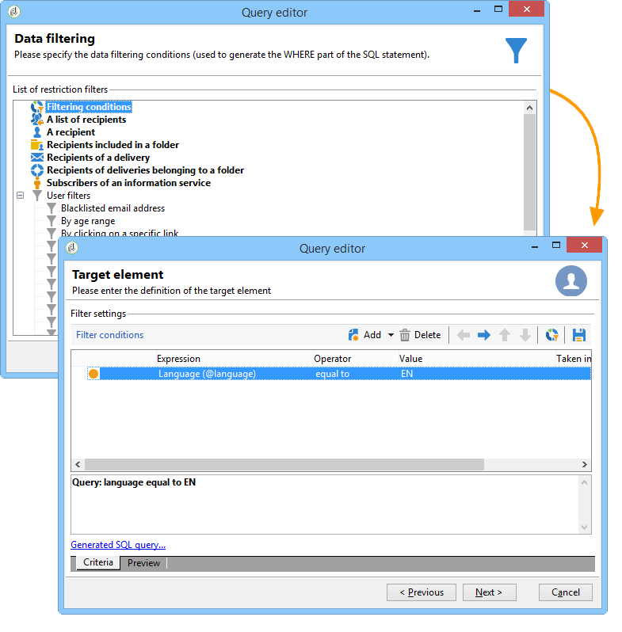
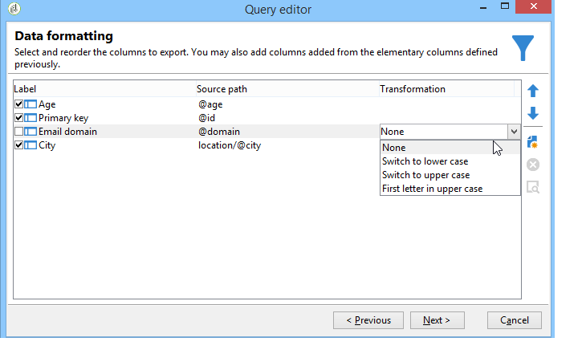

# 建立查詢的步驟{#steps-to-create-a-query}

在Adobe Campaign中建立查詢的步驟如下：

1. 選擇工作表。 請參閱 [步驟1 — 選擇表格](#step-1---choose-a-table).
1. 選取要擷取的資料。 請參閱 [步驟2 — 選擇要擷取的資料](#step-2---choose-data-to-extract).
1. 定義資料排序順序。 請參閱 [步驟3 — 排序資料](#step-3---sort-data).
1. 篩選資料。 請參閱 [步驟4 — 篩選資料](#step-4---filter-data).
1. 設定資料格式。 請參閱 [步驟5 — 設定資料格式](#step-5---format-data).
1. 顯示結果。 請參閱 [步驟6 — 預覽資料](#step-6---preview-data).

>[!NOTE]
>
>所有這些步驟都可在一般查詢編輯器中使用。 在另一個上下文中建立查詢時，可遺漏一些步驟。\
>「查詢」活動顯示在 [本節](../../workflow/using/query.md).

## 步驟1 — 選擇表格 {#step-1---choose-a-table}

選取包含您要在 **[!UICONTROL Document type]** 窗口。 如有必要，請使用篩選欄位或 **[!UICONTROL Filters]** 按鈕。

## 步驟2 — 選擇要擷取的資料 {#step-2---choose-data-to-extract}

在 **[!UICONTROL Data to extract]** ，選擇要顯示的資料：這些欄位將構成輸出欄。

例如，選取 **[!UICONTROL Age]**, **[!UICONTROL Primary key]**, **[!UICONTROL Email domain]** 和 **[!UICONTROL City]**. 將根據此選擇來組織結果。 使用視窗右側的藍色箭頭來變更欄順序。

可以通過在表達式中插入公式或對聚合函式運行進程來編輯表達式。 若要這麼做，請按一下 **[!UICONTROL Expression]** 欄欄位，然後選取 **[!UICONTROL Edit expression]**.

可以將輸出列資料分組：要執行此操作，請檢查 **[!UICONTROL Yes]** 在 **[!UICONTROL Group]** 欄 **[!UICONTROL Data to extract]** 窗口。 此函式將圍繞選定的分組軸生成結果。 具有分組的查詢的範例可在 [本節](../../workflow/using/querying-delivery-information.md).

* 此 **[!UICONTROL Handle groupings (GROUP BY + HAVING)]** 函式可讓您「依」分組，並選取已分組的項目（「有」）。 此函式會套用至輸出欄中的所有欄位。 例如，此選項可讓您將輸出欄的所有選項分組，並復原特定類型的資訊，例如介於35和50之間的收件者。

   如需詳細資訊，請參閱[本章節](../../workflow/using/querying-using-grouping-management.md)。

* 此 **[!UICONTROL Remove duplicate rows (DISTINCT)]** 函式可讓您刪除在輸出欄中取得的重複相同結果。 例如，如果您在輸出列中選擇姓氏、名字和電子郵件欄位進行人口普查，則具有相同資料的欄位將被刪除，因為這意味著在資料庫中已多次輸入同一聯繫人：只考慮一個結果。

## 步驟3 — 排序資料 {#step-3---sort-data}

此 **[!UICONTROL Sorting]** 視窗中，您可以排序欄內容。 使用箭頭更改列順序：

* 此 **[!UICONTROL Sorting]** 欄可啟用簡單排序，並按升序排列從A到Z的列內容。
* 此 **[!UICONTROL Descending sort]** 將內容從Z排列至A，然後依遞減順序排列。 這對於查看記錄銷售很有用，例如：最高的數字會顯示在清單頂端。

在此範例中，資料會根據收件者年齡而遞增排序。

## 步驟4 — 篩選資料 {#step-4---filter-data}

查詢編輯器可讓您篩選資料以調整搜尋範圍。

提供的篩選器取決於查詢所關注的表格。

選取 **[!UICONTROL Filtering conditions]** 您將存取 **[!UICONTROL Target elements]** 小節：這可讓您定義如何篩選要收集的資料。

* 要建立新篩選器，請選擇建立要驗證的公式以便選擇資料所需的欄位、運算子和值。 您可以結合數個條件(如需詳細資訊，請參閱 [定義篩選條件](../../platform/using/defining-filter-conditions.md))。
* 若要使用先前儲存的篩選器，請按一下 **[!UICONTROL Add]** 按一下 **[!UICONTROL Predefined filter]** 然後選擇想要的。

   

* 在 **[!UICONTROL Generic query editor]** 可用於其他查詢應用程式，反之亦然。 若要儲存篩選器，請按一下 **[!UICONTROL Save]** 表徵圖。

   >[!NOTE]
   >
   >如需建立和使用篩選器的詳細資訊，請參閱 [篩選選項](../../platform/using/filtering-options.md).

如以下示例所示，要恢復所有講英語的收件人，請選擇：「收件人語言」 **等於** EN」。

>[!NOTE]
>
>您可以在 **值** 欄位： **$(options:OPTION_NAME)**.

按一下 **[!UICONTROL Preview]** 頁簽，查看篩選條件的結果。 在這種情況下，所有講英語的收件者都會顯示其姓名、名字和電子郵件地址。

熟悉SQL語言的用戶可以按一下 **[!UICONTROL Generate SQL query]** 以在SQL中查看查詢。

## 步驟5 — 設定資料格式 {#step-5---format-data}

設定限制篩選器後，您將存取 **[!UICONTROL Data formatting]** 窗口。 此視窗可讓您重新排列輸出欄、轉換資料，以及變更欄標籤的上/下大小寫。 它也可讓您使用計算欄位將公式套用至最終結果。

>[!NOTE]
>
>如需計算欄位類型的詳細資訊，請參閱 [建立計算欄位](../../platform/using/defining-filter-conditions.md#creating-calculated-fields).

未勾選的欄不會顯示在資料預覽視窗中。

此 **[!UICONTROL Transformation]** 欄可讓您將欄標籤變更為大寫或小寫。 選取欄，然後按一下 **[!UICONTROL Transformation]** 欄。 您可以選擇：

* **[!UICONTROL Switch to lower case]**,
* **[!UICONTROL Switch to upper case]**,
* **[!UICONTROL First letter in upper case]**.

## 步驟6 — 預覽資料 {#step-6---preview-data}

此 **[!UICONTROL Data preview]** 窗口是最後一個階段。 按一下 **[!UICONTROL Start the preview of the data]** 來獲取查詢結果。 它以列或XML格式提供。 按一下 **[!UICONTROL Generated SQL queries]** 頁簽，以查看SQL格式的查詢。

在此範例中，資料會根據收件者年齡而遞增排序。

>[!NOTE]
>
>依預設，只有前200行會顯示在 **[!UICONTROL Data preview]** 窗口。 若要變更此項目，請在 **[!UICONTROL Lines to display]** 框，按一下 **[!UICONTROL Start the preview of the data]**.
