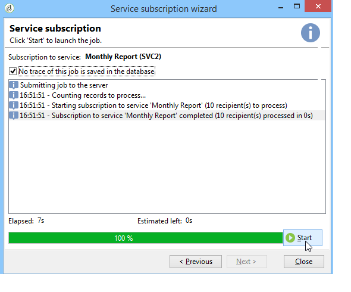

# 更新資料{#updating-data}

>[!NOTE]
>
>此頁面僅適用於使用原生驗證連線至Campaign的運運算元。

可以手動或自動更新連結至收件者用戶檔案的資料。

## 設定自動更新 {#setting-up-an-automatic-update}

可透過工作流程設定自動更新。 如需詳細資訊，請參閱[本章節](../../workflow/using/update-data.md)。

## 執行大量更新 {#performing-a-mass-update}

若要執行手動更新，請在選取的收件者上按一下滑鼠右鍵以使用&#x200B;**[!UICONTROL Actions]**&#x200B;捷徑功能表，或使用&#x200B;**[!UICONTROL Actions]**&#x200B;圖示。

有兩種型別的更新：大量更新一組收件者，以及兩個設定檔之間的資料合併。 針對每個動作，使用精靈可協助您設定更新。

### 大量更新 {#mass-update}

若要大量更新，請使用&#x200B;**[!UICONTROL Action > Mass update of selected lines...]**。 此精靈可協助您設定並執行更新。

精靈的第一步驟是指定要更新的欄位。

精靈的左側區段會顯示可用欄位清單。 使用&#x200B;**[!UICONTROL Find]**&#x200B;欄位來執行這些欄位的搜尋。 按&#x200B;**Enter**&#x200B;鍵瀏覽清單。 符合您輸入內容的欄位名稱會以粗體顯示，如下所示。

連按兩下要更新的欄位，以在精靈的右側區域顯示它們。

發生錯誤時，請使用&#x200B;**[!UICONTROL Delete]**&#x200B;按鈕，從要更新的欄位清單中刪除欄位。

選取或輸入值以套用至要更新之用戶檔案。

您可以按一下&#x200B;**[!UICONTROL Distribution of values]**&#x200B;來針對目前資料夾中存在的收件者（不僅限於受更新影響的收件者），顯示所選欄位的值分佈。

您可以定義篩選器以顯示此視窗中的值分佈，或修改目前檔案夾以顯示另一個檔案夾中的值分佈。 這些操作是唯讀動作，不影義所定義的更新設定。

關閉此視窗並按一下&#x200B;**[!UICONTROL Next]**&#x200B;以顯示第二個更新精靈步驟。 在此步驟中，您可以按一下&#x200B;**[!UICONTROL Start]**&#x200B;來啟動更新。

更新執行的相關資訊會顯示在精靈的上方區域中。

**[!UICONTROL Stop]**&#x200B;可讓您取消更新，但某些記錄可能已更新，停止程式將不會取消這些更新。 進度列會顯示操作目前的進度。

### 合併資料 {#merge-data}

選取&#x200B;**[!UICONTROL Merge selected lines...]**&#x200B;以啟動兩個收件者設定檔的合併。 在選取選項之前，必須先選取要合併的設定檔。 使用精靈來設定和開始合併。

精靈會顯示要針對在一個或其他來源設定檔中完成的每個欄位擷取的值。 如果要合併的設定檔中的一或多個欄位有不同的值，則會顯示在&#x200B;**[!UICONTROL List of conflicts]**&#x200B;區段中。 然後，您可以使用清單下方的選項按鈕來選取預設用戶檔案，如下列範例所示：

按一下&#x200B;**[!UICONTROL Compute]**&#x200B;以顯示您選擇的結果。

檢查視窗兩個區段的&#x200B;**[!UICONTROL Result]**&#x200B;欄，然後按一下&#x200B;**[!UICONTROL Finish]**&#x200B;以執行合併。

## 匯出資料 {#exporting-data}

清單的內容可以匯出。 若要設定並執行匯出：

1. 選取要匯出的記錄。
1. 按一下滑鼠右鍵並選取&#x200B;**[!UICONTROL Export...]**。

   

1. 然後選取要擷取的資料。 根據預設，所有顯示的欄會新增至輸出欄。

   

   如需如何設定匯出精靈的詳細資訊，請參閱[本節](../../platform/using/executing-export-jobs.md)。

## 訂閱服務 {#subscribing-to-a-service}

大多數情況下，收件者會透過專屬的登陸頁面訂閱電子報，如[本節](../../delivery/using/managing-subscriptions.md)所述。 不過，篩選的收件者的設定檔可以手動訂閱服務（電子報或病毒式服務）。 操作步驟：

1. 選取您想要訂閱服務的收件者，然後按一下滑鼠右鍵。
1. 選取 **[!UICONTROL Actions > Subscribe selection to a service]**。

   

1. 選取想要的服務，然後按一下&#x200B;**[!UICONTROL Next]**：

   

   >[!NOTE]
   >
   >此編輯器可讓您建立新服務：按一下&#x200B;**[!UICONTROL Create]**&#x200B;按鈕。

1. 您可以&#x200B;**[!UICONTROL Send a confirmation message]**&#x200B;給收件者。 可在與所選服務相連結的訂閱場景中設定此訊息的內容。
1. 按一下&#x200B;**[!UICONTROL Start]**&#x200B;按鈕以執行訂閱程式。

   

視窗的上半段可讓您監視執行流程。 **[!UICONTROL Stop]**&#x200B;按鈕可讓您停止程式。 不過，已處理之收件者將訂閱服務。

如果取消核取&#x200B;**[!UICONTROL Do not keep a trace of this job in the database]**&#x200B;選項，您可以選取（或建立）執行資料夾，以儲存此處理序的資訊。

若要檢查此程式，請移至此作業相關收件者設定檔上的&#x200B;**[!UICONTROL Subscriptions]**&#x200B;標籤，或移至透過&#x200B;**[!UICONTROL Profiles and Targets > Services and Subscriptions]**&#x200B;節點存取的&#x200B;**[!UICONTROL Subscriptions]**&#x200B;標籤。

>[!NOTE]
>
>如需建立和設定資訊服務的詳細資訊，請參閱[本頁面](../../delivery/using/managing-subscriptions.md)。
