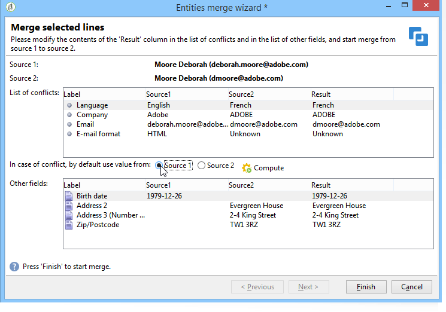

# 更新資料{#updating-data}

可以手動或自動更新連結至收件者用戶檔案的資料。

## 設定自動更新 {#setting-up-an-automatic-update}

可透過工作流程設定自動更新。如需詳細資訊，請參閱[本章節](../../workflow/using/update-data.md)。

## 執行成批更新 {#performing-a-mass-update}

若要執行手動更新，請在所選收件者上按一下滑鼠右鍵，以使用 **[!UICONTROL Actions]** 快捷選單，或使用 **[!UICONTROL Actions]** 圖示。

更新類型有兩種：一組收件者的大量更新，以及兩個用戶檔案之間的資料合併。針對每個動作，使用精靈可協助您設定更新。

### 大量更新 {#mass-update}

若要進行大量更新，請使用 **[!UICONTROL Action > Mass update of selected lines...]**. 此精靈可協助您設定並執行更新。

精靈的第一步驟是指定要更新的欄位。

精靈的左側區域會顯示可用欄位的清單。使用 **[!UICONTROL Find]** 欄位搜尋這些欄位。按下 **Enter** 鍵以瀏覽清單。符合您輸入內容的欄位名稱會以粗體顯示，如下所示。

連按兩下要更新的欄位，以在精靈的右側區域顯示它們。

如果發生錯誤，請使用 **[!UICONTROL Delete]** 按鈕，從要更新的欄位清單中刪除欄位。

選取或輸入值以套用至要更新之用戶檔案。

您可以按一下 **[!UICONTROL Distribution of values]** 以顯示在目前資料夾中顯示的收件者 (不只是受更新影響的收件者) 的所選取欄位的內容分佈。

您可以定義篩選器來顯示此視窗中的內容分佈，或修改目前的資料夾以顯示另一個資料夾中的內容分佈。這些操作是唯讀動作，不影義所定義的更新設定。

關閉此視窗，然後按一下 **[!UICONTROL Next]** 以顯示第二個更新精靈步驟。在此步驟中，您可以按一下 **[!UICONTROL Start]** 以開始更新。

更新執行的相關資訊會顯示在精靈的上方區域中。

您可以使用 **[!UICONTROL Stop]** 取消更新，但某些記錄可能已更新，而且停止流程並不會取消這些更新。進度列會顯示操作目前的進度。

### 合併資料 {#merge-data}

選擇 **[!UICONTROL Merge selected lines...]** 啟動合併兩個收件者設定檔。 選取該選項之前，必須選取要合併的用戶檔案。使用精靈來設定和開始合併。

精靈會顯示一或多個來源用戶檔案中每個已填充欄位的擷取內容。如果用戶檔案中要合併的一或多個欄位具有不同的值，則會顯示在 **[!UICONTROL List of conflicts]** 區段中。然後，您可以使用清單下方的選項按鈕來選取預設用戶檔案，如下列範例所示：

按一下 **[!UICONTROL Compute]** 以顯示您選擇的結果。

檢查視窗兩個區域中的 **[!UICONTROL Result]** 欄，然後按一下 **[!UICONTROL Finish]** 執行合併。

## 匯出資料 {#exporting-data}

清單內容可以匯出。若要設定並執行匯出：

1. 選取要匯出的記錄。
1. 按一下滑鼠右鍵並選取 **[!UICONTROL Export...]**.

   

1. 然後選取要擷取的資料。根據預設，所有顯示的欄會新增至輸出欄。

   

   有關如何配置導出嚮導的詳細資訊，請參閱 [本節](../../platform/using/executing-export-jobs.md).

## 訂閱服務 {#subscribing-to-a-service}

在大多數情況下，收件者可以透過專用登陸頁面訂閱新聞稿，如[本節](../../delivery/using/managing-subscriptions.md)所述。不過，已篩選之收件者的用戶檔案可以手動設定訂閱服務 (電子報或病毒服務)。操作步驟：

1. 選取您想要訂閱服務的收件者，然後按一下滑鼠右鍵。
1. 選取 **[!UICONTROL Actions > Subscribe selection to a service]**。

   

1. 選取所需的服務，然後按 **[!UICONTROL Next]**：

   

   >[!NOTE]
   >
   >此編輯器可讓您建立新的服務：按一下 **[!UICONTROL Create]** 按鈕。

1. 您可以 **[!UICONTROL Send a confirmation message]** 收件人。 可在與所選服務相連結的訂閱場景中設定此訊息的內容。
1. 按一下 **[!UICONTROL Start]** 按鈕執行訂閱程序。

   

使用視窗的上方區域可監視執行程序。使用 **[!UICONTROL Stop]** 按鈕可停止程序。不過，已處理之收件者將訂閱服務。

如果您取消核取 **[!UICONTROL Do not keep a trace of this job in the database]** 選項，可以選擇（或建立）將儲存有關此進程的資訊的執行資料夾。

若要檢查程式，請前往 **[!UICONTROL Subscriptions]** 頁簽，以查看此操作所關注的收件人的配置檔案，或 **[!UICONTROL Subscriptions]** 標籤 **[!UICONTROL Profiles and Targets > Services and Subscriptions]** 節點。

>[!NOTE]
>
>如需建立和設定資訊服務的詳細資訊，請參閱[本頁面](../../delivery/using/managing-subscriptions.md)。
