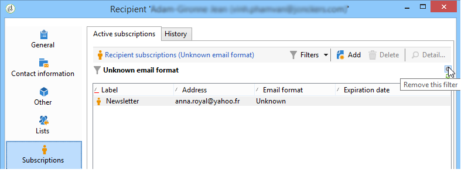

# 使用案例{#use-case}

## 對訂閱者的電子郵件格式建立篩選 {#creating-a-filter-on-the-email-format-of-subscribers}

此使用案例將示範如何建立篩選器，以根據收件者電子郵件格式來排序電子報訂閱。

為此，我們需要使用預定義的檔案管理器：這些篩選器連結到文檔類型，並通過&#x200B;**[!UICONTROL Administration > Configuration > Predefined filters]**&#x200B;節點訪問。 這些資料篩選器可用於應用程式中的每種編輯器（或檔案）類型。

資料篩選器的建立方式與預定義篩選器相同，但有一個附加欄位可選擇要應用篩選器的文檔類型。

應用以下步驟：

1. 透過&#x200B;**[!UICONTROL Administration > Configuration > Predefined filters]**&#x200B;節點建立新篩選器。
1. 按一下&#x200B;**[!UICONTROL Select link]**&#x200B;圖示以選取相關檔案：

   

1. 選擇訂閱方案(nms:subscription)，然後按一下&#x200B;**[!UICONTROL OK]**。

   

1. 按一下&#x200B;**[!UICONTROL Edit link]**&#x200B;以查看所選文檔的欄位。

   

   然後，您可以查看所選文檔的內容：

   

   您可以存取這些欄位，以在篩選器編輯器內文中定義篩選條件。 應用程式篩選器的定義方式與進階篩選器完全相同。 請參閱[建立進階篩選器](../../platform/using/creating-filters.md#creating-an-advanced-filter)。

1. 對訂閱建立新篩選器，以僅顯示未定義電子郵件格式的訂閱：

   

1. 按一下&#x200B;**[!UICONTROL Save]**&#x200B;將篩選器新增至此類型清單的預先定義篩選器。
1. 您現在可以在收件者設定檔的&#x200B;**[!UICONTROL Subscriptions]**&#x200B;標籤中使用此篩選器；您可以按一下&#x200B;**[!UICONTROL Filters]**&#x200B;按鈕，以存取「未知電子郵件格式」篩選器。

   

   目前篩選器的名稱會顯示在清單上方。 若要取消篩選，請按一下&#x200B;**[!UICONTROL Delete this filter]**&#x200B;圖示。

   
