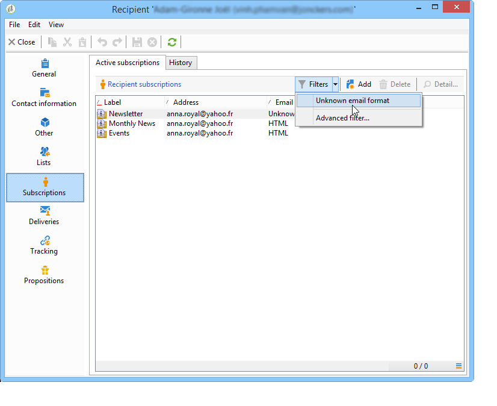

# 使用案例{#use-case}

## 建立訂閱者電子郵件格式的篩選 {#creating-a-filter-on-the-email-format-of-subscribers}

此使用案例將示範如何建立篩選，以根據收件者電子郵件格式來排序電子報訂閱。

為此，我們需要使用預定義的檔案管理器：這些篩選器會連結至檔案類型，並可透過節點存 **[!UICONTROL Administration > Configuration > Predefined filters]** 取。 這些資料篩選器可用於應用程式中的每種編輯器（或檔案）類型。

資料篩選的建立方式與預先定義的篩選相同，但是還有一個欄位可供選取要套用篩選的檔案類型。

應用以下步驟：

1. 透過節點建立新的篩 **[!UICONTROL Administration > Configuration > Predefined filters]** 選器。
1. 按一下圖 **[!UICONTROL Select link]** 標以選擇相關文檔：

   

1. 選擇訂閱模式(nms:subscription)，然後按一下 **[!UICONTROL OK]**。

   

1. 單 **[!UICONTROL Edit link]** 擊可查看所選文檔的欄位。

   

   然後，您可以檢視所選檔案的內容：

   

   您可以存取這些欄位，在篩選編輯器的正文中定義篩選條件。 應用程式篩選的定義方式與進階篩選完全相同。 請參 [閱建立進階篩選](../../platform/using/creating-filters.md#creating-an-advanced-filter)。

1. 針對訂閱建立新的篩選，以僅顯示未定義電子郵件格式的訂閱：

   

1. 按一 **[!UICONTROL Save]** 下，將篩選新增至此類型清單的預先定義篩選。
1. 您現在可以在收件者描述檔的標 **[!UICONTROL Subscriptions]** 簽中使用此篩選器；您可以按一下按鈕，存取「未知的電子郵件格式」 **[!UICONTROL Filters]** 篩選。

   

   目前篩選器的名稱會顯示在清單上方。 若要取消篩選，請按一下 **[!UICONTROL Delete this filter]** 圖示。

   

