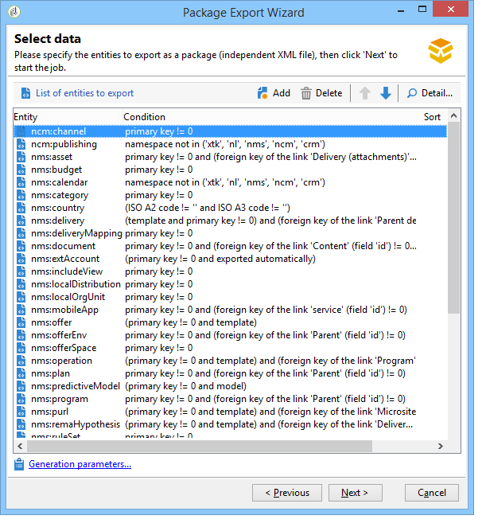

# 使用資料包{#working-with-data-packages}


## 關於資料包 {#about-data-packages}

使用 Adobe Campaign，您可以透過資料包系統匯出或匯入平台配置和資料。包可以包含不同類型的配置、元素、篩選或不篩選。

資料包可以 XML 格式檔案的形式顯示 Adobe Campaign 資料庫的實體。資料包中包含的每個實體都會以其所有資料表示。

**資料包**&#x200B;的原則是導出資料配置並將其整合到另一個Adobe Campaign系統。 了解如何在此[節](#data-package-best-practices)中維護一組一致的資料包。

### 套件類型 {#types-of-packages}

可匯出套件有三種類型：使用者套件、平台套件和管理套件。

* **使用者套件**:它可讓您選取要匯出的實體清單。此類包管理依賴項並驗證錯誤。
* **平台套件**:包括所有新增的技術資源（非標準）:結構、JavaScript程式碼等

   

* **管理套件**:它包括所有添加的模板和業務對象（非標準）:範本、程式庫等。

   

>[!CAUTION]
>
>**platform**&#x200B;和&#x200B;**admin**&#x200B;類型包含要導出的預定義實體清單。 每個實體都連結到篩選條件，這些條件可讓您移除已建立套件的現成資源。

## 資料結構 {#data-structure}

資料包的描述是符合&#x200B;**xrk:navtree**&#x200B;資料架構的文法的結構化XML文檔。

資料包示例：

```
<package>
  <entities schema="nms:recipient">
    <recipient email="john.smith@adobe.com" lastName="Smith" firstName="John">      
      <folder _operation="none" name="nmsRootFolder"/>      
      <company _operation="none" name="Adobe"/>
    </recipient>
  </entities>
  <entities schema="sfa:company">
    <company name="Adobe">
      location city="London" zipCode="W11 2BQ"/>
    </company>
  </entities>
</package>
```

XML文檔必須以&#x200B;**`<package>`**&#x200B;元素開頭和結尾。 隨後的任何&#x200B;**`<entities>`**&#x200B;元素按文檔類型分發資料。

**`<entities>`**&#x200B;元素包含在&#x200B;**schema**&#x200B;屬性中輸入的資料架構格式的包資料。

套件中的資料不得包含不相容於基之間的內部密鑰，例如自動生成的密鑰（**autopk**&#x200B;選項）。

在我們的範例中，「資料夾」和「公司」連結上的連接已由目的地表格上所謂的「高階」索引鍵取代：

```
<recipient>
  <folder _operation="none" name="nmsRootFolder"/>
  <company _operation="none" name="Adobe"/>
</recipient>
```

值為「none」的&#x200B;**`operation`**&#x200B;屬性定義調解連結。

可從任何文字編輯器手動建構資料套件。 只需確保XML文檔的結構符合「xtk:navtree」資料架構。 Adobe Campaign主控台具有資料套件匯出和匯入模組。

## 匯出套件 {#exporting-packages}

### 關於套件匯出 {#about-package-export}

可以以三種不同的方式匯出套件：

* **[!UICONTROL Package Export Wizard]**&#x200B;允許您導出單個包中的一組對象。 有關詳細資訊，請參閱[導出包](#exporting-a-set-of-objects-in-a-package)中的一組對象
* 通過按一下右鍵並選擇&#x200B;**[!UICONTROL Actions > Export in a package]**，可以直接將&#x200B;**單個對象**&#x200B;導出到包中。
* **包** 定義可讓您建立包結構，在其中添加將在以後在包中導出的對象。有關詳細資訊，請參閱[管理包定義](#managing-package-definitions)

匯出套件後，您就能將其及所有新增的實體匯入另一個Campaign執行個體。

### 導出包中的一組對象 {#exporting-a-set-of-objects-in-a-package}

可透過Adobe Campaign用戶端主控台的&#x200B;**[!UICONTROL Tools > Advanced > Export package...]**&#x200B;功能表存取套件匯出精靈。


對於三種類型的套件，精靈提供下列步驟：

1. 按文檔類型列出要導出的實體：

   

   >[!CAUTION]
   >
   >如果導出&#x200B;**[!UICONTROL Offer category]**、**[!UICONTROL Offer environment]**、**[!UICONTROL Program]**&#x200B;或&#x200B;**[!UICONTROL Plan]**&#x200B;類型資料夾，則不要選擇&#x200B;**xtk:folder**，因為您可能會丟失某些資料。 選擇與資料夾對應的實體：**nms:offerCategory**&#x200B;適用於選件類別，**nms:offerEnv**&#x200B;適用於選件環境，**nms:program**&#x200B;適用於程式，**nms:plan**&#x200B;適用於計畫。

   清單管理可讓您新增或刪除要從設定中匯出的實體。 按一下&#x200B;**[!UICONTROL Add]**&#x200B;以選取新實體。

   **[!UICONTROL Detail]**&#x200B;按鈕可編輯所選配置。

   >[!NOTE]
   >
   >依賴關係機制控制實體導出序列。 有關詳細資訊，請參閱[管理相依性](#managing-dependencies)。

1. 實體配置螢幕定義要提取的文檔類型的篩選器查詢。

   必須配置過濾子句以提取資料。

   

   >[!NOTE]
   >
   >查詢編輯器顯示在[此部分](../../platform/using/about-queries-in-campaign.md)中。

1. 按一下&#x200B;**[!UICONTROL Next]**&#x200B;並選取排序欄，以在擷取期間排序資料：

   

1. 在執行匯出之前，先預覽要擷取的資料。

   

1. 套件匯出精靈的最後一頁可讓您啟動匯出。 資料將儲存在&#x200B;**[!UICONTROL File]**&#x200B;欄位中指示的檔案中。

   

### 管理相依性 {#managing-dependencies}

匯出機制可讓Adobe Campaign追蹤各種匯出元素之間的連結。

此機制由兩個規則定義：

* 連結到具有&#x200B;**own**&#x200B;或&#x200B;**owncopy**&#x200B;類型完整性的連結的對象與導出的對象在相同的包中導出。
* 連結到具有&#x200B;**netural**&#x200B;或&#x200B;**define**&#x200B;類型完整性（已定義連結）的連結的對象必須單獨導出。

>[!NOTE]
>
>連結到架構元素的完整性類型在[此部分](../../configuration/using/database-mapping.md#links--relation-between-tables)中定義。

#### 匯出促銷活動 {#exporting-a-campaign}

以下是如何匯出促銷活動的範例。 要匯出的行銷活動包含任務(標籤：「MyTask」)和工作流程(標籤：「MyWorkflow」資料夾(節點：管理/生產/技術工作流程/行銷活動流程/ MyWorkflow)。

任務和工作流程會匯出至與促銷活動相同的套件中，因為相符的結構會由具有「自有」類型完整性的連結連結連結。

包內容：

```
<?xml version='1.0'?>
<package author="Administrator (admin)" buildNumber="7974" buildVersion="6.1" img=""
label="" name="" namespace="" vendor="">
 <desc></desc>
 <version buildDate="2013-01-09 10:30:18.954Z"/>
 <entities schema="nms:operation">
  <operation duration="432000" end="2013-01-14" internalName="OP1" label="MyCampaign"
  modelName="opEmpty" start="2013-01-09">
   <controlGroup>
    <where filteringSchema=""/>
   </controlGroup>
   <seedList>
    <where filteringSchema="nms:seedMember"></where>
    <seedMember internalName="SDM1"></seedMember>
   </seedList>
   <parameter useAsset="1" useBudget="1" useControlGroup="1" useDeliveryOutline="1"
   useDocument="1" useFCPValidation="0" useSeedMember="1" useTask="1"
   useValidation="1" useWorkflow="1"></parameter>
   <fcpSeed>
    <where filteringSchema="nms:seedMember"></where>
   </fcpSeed>
   <owner _operation="none" name="admin" type="0"/>
   <program _operation="none" name="nmsOperations"/>
   <task end="2013-01-17 10:07:51.000Z" label="MyTask" name="TSK2" start="2013-01-16 10:07:51.000Z"
   status="1">
    <owner _operation="none" name="admin" type="0"/>
    <operation _operation="none" internalName="OP1"/>
    <folder _operation="none" name="nmsTask"/>
   </task>
   <workflow internalName="WKF12" label="CampaignWorkflow" modelName="newOpEmpty"
   order="8982" scenario-cs="Notification of the workflow supervisor (notifySupervisor)"
   schema="nms:recipient">
    <scenario internalName="notifySupervisor"/>
    <desc></desc>
    <folder _operation="none" name="Folder4"/>
    <operation _operation="none" internalName="OP1"/>
   </workflow>
  </operation>
 </entities>
</package>   
```

與類型包的關聯在具有&#x200B;**@pkgAdmin和@pkgPlatform**&#x200B;屬性的架構中定義。 這兩個屬性都接收定義與包關聯的條件的XTK表達式。

```
<element name="offerEnv" img="nms:offerEnv.png" 
template="xtk:folder" pkgAdmin="@id != 0">
```

最後， **@pkgStatus**&#x200B;屬性可讓您定義這些元素或屬性的匯出規則。 根據屬性的值，元素或屬性將在匯出的套件中找到。 此屬性的三個可能值為：

* **從不**:不會匯出欄位/連結
* **一律**:向該領域出口
* **preCreate**:授權建立連結的實體

>[!NOTE]
>
>**preCreate**&#x200B;值僅允許用於連結類型事件。 它授權您建立或指向尚未在匯出套件中載入的實體。

## 管理套件定義 {#managing-package-definitions}

套件定義可讓您建立套件結構，在其中新增要稍後在單一套件中匯出的實體。 然後，您就能將此套件和所有新增的實體匯入另一個Campaign執行個體。

**相關主題：**

* [建立套件定義](#creating-a-package-definition)
* [將實體添加到包定義](#adding-entities-to-a-package-definition)
* [配置包定義生成](#configuring-package-definitions-generation)
* [從包定義導出包](#exporting-packages-from-a-package-definition)

### 建立套件定義 {#creating-a-package-definition}

可從&#x200B;**[!UICONTROL Administration > Configuration > Package management > Package definitions]**&#x200B;菜單訪問包定義。

要建立包定義，請按一下&#x200B;**[!UICONTROL New]**&#x200B;按鈕，然後填寫包定義一般資訊。


然後，您可以將實體添加到包定義，並將其導出到XML檔案包。

**相關主題：**

* [將實體添加到包定義](#adding-entities-to-a-package-definition)
* [配置包定義生成](#configuring-package-definitions-generation)
* [從包定義導出包](#exporting-packages-from-a-package-definition)

### 將實體添加到包定義 {#adding-entities-to-a-package-definition}

在&#x200B;**[!UICONTROL Content]**&#x200B;標籤中，按一下&#x200B;**[!UICONTROL Add]**&#x200B;按鈕以選擇要與包一起導出的實體。 在[此區段](#exporting-a-set-of-objects-in-a-package)中會顯示選取實體的最佳實務。


實體可直接從其在例項中的位置新增至套件定義。 要執行此操作，請遵循下列步驟：

1. 以滑鼠右鍵按一下所需的實體，然後選取&#x200B;**[!UICONTROL Actions > Export in a package]**。

   

1. 選擇&#x200B;**[!UICONTROL Add to a package definition]**，然後選擇要添加實體的包定義。

   

1. 實體會新增至套件定義，並會與套件一併匯出（請參閱[此區段](#exporting-packages-from-a-package-definition)）。

   

### 配置包定義生成 {#configuring-package-definitions-generation}

可以從包定義&#x200B;**[!UICONTROL Content]**&#x200B;頁簽配置包生成。 要執行此操作，請按一下&#x200B;**[!UICONTROL Generation parameters]**&#x200B;連結。


* **[!UICONTROL Include the definition]**:包括當前在包定義中使用的定義。
* **[!UICONTROL Include an installation script]**:可讓您新增要在套件匯入時執行的javascript指令碼。選取後，在套件定義畫面中會新增&#x200B;**[!UICONTROL Script]**&#x200B;標籤。
* **[!UICONTROL Include default values]**:將所有實體屬性的值添加到包中。

   預設不會選取此選項，以避免長時間匯出。 這表示具有預設值（「空白字串」、「0」和「false」，若未在架構中另行定義）的實體屬性不會新增至套件，因此不會匯出。

   >[!CAUTION]
   >
   >取消選取此選項可能會合併本機和匯入的版本。
   >
   >如果導入包的實例包含與包的實體相同的實體（例如，具有相同的外部ID），則不會更新其屬性。 如果來自舊例項的屬性具有預設值，則會發生此情況，因為這些值未包含在套件中。
   >
   >在這種情況下，選取&#x200B;**[!UICONTROL Include default values]**&#x200B;選項會防止版本合併，因為來自前例項的所有屬性都會與套件一起匯出。

### 從包定義導出包 {#exporting-packages-from-a-package-definition}

要從包定義導出包，請執行以下步驟：

1. 選擇要導出的包定義，然後按一下&#x200B;**[!UICONTROL Actions]**&#x200B;按鈕並選擇&#x200B;**[!UICONTROL Export the package]**。
1. 預設情況下，將選擇與導出包對應的XML檔案。 會根據套件定義命名空間和名稱來命名。
1. 定義包名稱和位置後，按一下&#x200B;**[!UICONTROL Start]**&#x200B;按鈕以啟動導出。

   

## 匯入套件 {#importing-packages}

可透過Adobe Campaign用戶端主控台的主功能表&#x200B;**[!UICONTROL Tools > Advanced > Import package]**&#x200B;存取套件匯入精靈。

您可以根據您的授權條款，從先前執行的匯出匯入套件，例如從其他Adobe Campaign例項匯入，或從[內建套件](../../installation/using/installing-campaign-standard-packages.md)匯入。


### 從檔案安裝套件 {#installing-a-package-from-a-file}

要導入現有資料包，請選擇XML檔案，然後按一下&#x200B;**[!UICONTROL Open]**。


接著，要匯入的套件內容會顯示在編輯器的中間區段中。

按一下&#x200B;**[!UICONTROL Next]**&#x200B;和&#x200B;**[!UICONTROL Start]**&#x200B;啟動匯入。


### 安裝內建套件 {#installing-a-standard-package}

標準套件是內建套件，在設定Adobe Campaign時安裝。 根據您的權限和部署模式，如果您獲得新選項或附加元件，或升級為新選件，則可以導入新的標準包。

請參閱您的授權合約，以檢查您可以安裝哪些套件。

有關內建包的詳細資訊，請參閱[本頁](../../installation/using/installing-campaign-standard-packages.md)。

## 資料包最佳實務 {#data-package-best-practices}

本節說明如何在專案的整個生命週期中以一致的方式組織資料套件。

包可以包含不同類型的配置和元素，無論是否篩選。 如果您遺漏了某些元素或未以正確順序匯入元素/套件，平台設定可能會中斷。

另外，由於同一平台上有多人工作，具有許多不同的功能，因此封裝規範資料夾可以迅速變得複雜。

雖然並非強制性，本節提供的解決方案可協助組織及使用Adobe Campaign中的套件，以用於大型專案。

主要限制如下：
* 組織套件，並追蹤變更項目及變更時間
* 如果更新了設定，將破壞未直接連結至更新的項目的風險降至最低

>[!NOTE]
>
>有關設定工作流以自動導出包的詳細資訊，請參閱[此頁](https://helpx.adobe.com/campaign/kb/export-packages-automatically.html)。

### 建議 {#data-package-recommendations}

請一律匯入相同版本的平台。 您必須檢查是否在具有相同組建的兩個執行個體之間部署套件。 切勿強制匯入，且一律先更新平台（如果組建不同）。

>[!IMPORTANT]
>
>Adobe不支援在不同版本之間匯入。
<!--This is not allowed. Importing from 6.02 to 6.1, for example, is prohibited. If you do so, R&D won’t be able to help you resolve any issues you encounter.-->

應注意架構和資料庫結構。 導入具有架構的包後必須生成架構。

### 解決方案 {#data-package-solution}

#### 套件類型 {#package-types}

首先，定義不同類型的套件。 只使用四種類型：

**實體**
* Adobe Campaign中的所有「xtk」和「nms」特定元素，例如結構、表單、資料夾、傳送範本等。
* 您可以將實體視為「管理員」和「平台」元素。
* 在Campaign執行個體上傳套件時，您不應在套件中包含多個實體。

<!--Nothing “works” alone. An entity package does not have a specific role or objective.-->

如果您需要在新執行個體上部署設定，則可匯入所有實體套件。

**功能**

此類包：
* 滿足客戶需求/規格。
* 包含一或多個功能。
* 應包含所有相依性，才能在沒有其他套件的情況下執行功能。

**行銷活動**

此包不是強制包。 為所有促銷活動建立特定類型有時很實用，即使促銷活動可被視為功能亦然。

**更新**

設定後，可將功能匯出至其他環境。 例如，套件可從開發環境匯出至測試環境。 在本試驗中，發現了缺陷。 首先，需要在開發環境中加以修正。 接著，應將修補程式套用至測試平台。

第一個解決方案是再次匯出整個功能。 但是，為了避免任何風險（更新不需要的元素），更安全的做法是只包含更正的包。

這就是為什麼我們建議建立「更新」套件，僅包含功能的一個實體類型。

更新不僅可以是修正，也可以是實體/功能/促銷活動套件的新元素。 若要避免部署整個套件，您可以匯出更新套件。

### 命名慣例 {#data-package-naming}

現在已定義類型，我們應指定命名慣例。 Adobe Campaign不允許針對套件規格建立子資料夾，這表示數字是維持井然有序的最佳解決方案。 數字前置詞包名稱。 您可以使用下列慣例：

* 實體：從1到99
* 功能：從100到199
* 促銷活動：從200到299
* 更新：從5000到5999

### 套件 {#data-packages}

>[!NOTE]
>
>最好設定規則來定義正確的套件數目。

#### 實體包順序 {#entity-packages-order}

為幫助導入，應按照要導入的實體包的順序進行排序。 例如：
* 001 — 結構
* 002 — 表單
* 003 — 影像
* 等。

>[!NOTE]
>
>只有在進行架構更新後，才應匯入Forms。

#### 包200 {#package-200}

套件號「200」不應用於特定促銷活動：此數字將用於更新與所有促銷活動相關的項目。

#### 更新套件 {#update-package}

最後一點涉及更新包編號。 前置詞為「5」的是您的封裝號碼（實體、功能或促銷活動）。 例如：
* 5001更新一個架構
* 5200以更新所有促銷活動
* 5101更新101功能

更新套件應僅包含一個特定實體，以便可輕鬆重複使用。 若要分割，請新增新數字（從1開始）。 這些包沒有特定的排序規則。 為了更好地理解，想像一下我們有101個功能，一個社交應用：
* 它包含webApp和外部帳戶。
   * 包標籤為：101 — 社交應用(socialApplication)。
* webApp有缺陷。
   * 已更正wepApp。
   * 需要建立修正套件，且名稱如下：5101 - 1 — 社交應用程式webApp(socialApplication_webApp)。
* 需要為社交功能新增外部帳戶。
   * 已建立外部帳戶。
   * 新套件為：5101 - 2 — 社交應用程式外部帳戶(socialApplication_extAccount)。
   * 101套件會同時更新以新增至外部帳戶，但不會部署。
      

#### 套件檔案 {#package-documentation}

更新套件時，您應一律在說明欄位中放入註解，以詳細說明任何修改和原因（例如「新增新結構」或「修正缺陷」）。


您也應該在留言的日期進行。 請一律將您對更新套件的評論報告給「parent」（不含5首碼的套件）。

>[!IMPORTANT]
>
>說明欄位最多只能包含2.000個字元。
