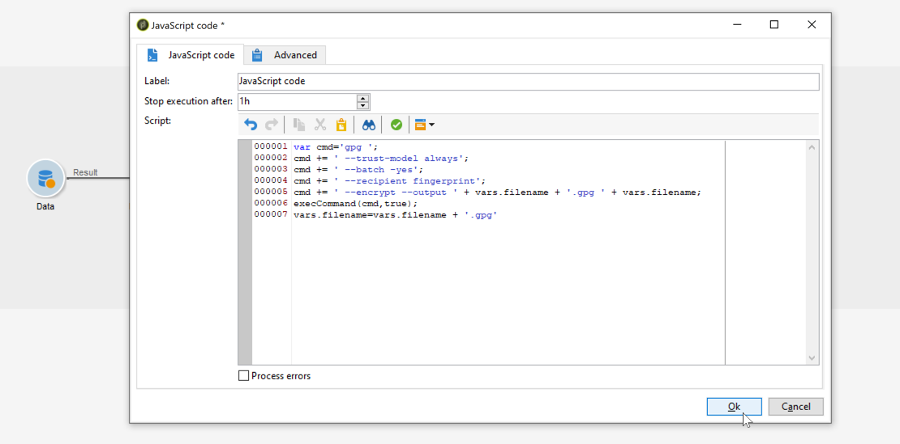

# 壓縮或加密檔案{#zipping-or-encrypting-a-file}

Adobe Campaign可讓您匯出壓縮或加密的檔案。 透過&#x200B;**[!UICONTROL Data extraction (file)]**&#x200B;活動定義匯出時，您可以定義要壓縮或加密檔案的後置處理。

若要這麼做：

1. 使用[控制面板](https://experienceleague.adobe.com/docs/control-panel/using/instances-settings/gpg-keys-management.html?lang=en#encrypting-data)為您的執行個體安裝GPG金鑰組。

   >[!NOTE]
   >
   >「控制面板」僅限管理員使用者使用，僅適用於特定Campaign版本。 [瞭解更多](https://experienceleague.adobe.com/docs/control-panel/using/discover-control-panel/key-features.html?lang=zh-Hant)

1. 如果您的Adobe Campaign安裝是由Adobe托管，請連絡[Adobe客戶服務](https://helpx.adobe.com/tw/enterprise/admin-guide.html/enterprise/using/support-for-experience-cloud.ug.html)以在伺服器上安裝必要的公用程式。
1. 如果您安裝的Adobe Campaign為內部部署，請安裝您要使用的公用程式(例如：GPG、GZIP)以及應用程式伺服器上的必要金鑰（加密金鑰）。

然後，您可以在活動的&#x200B;**[!UICONTROL Script]**&#x200B;索引標籤或&#x200B;**[!UICONTROL JavaScript code]**&#x200B;活動中使用命令或代碼。 下方的使用案例提供範例。

**相關主題：**

* [在處理前先解壓縮或解密檔案](../../platform/using/unzip-decrypt.md)
* [資料擷取（檔案）活動](../../workflow/using/extraction--file-.md)。

## 使用案例：使用安裝在控制面板{#use-case-gpg-encrypt}上的金鑰加密和匯出資料

在此使用案例中，我們將建置工作流程，使用「控制面板」上安裝的金鑰來加密和匯出資料。

 [在影片中探索此功能](#video)

執行此使用案例的步驟如下：

1. 使用GPG公用程式產生GPG金鑰組（公開/私用），然後將公開金鑰安裝至「控制面板」。 如需詳細步驟，請參閱[控制面板檔案](https://experienceleague.adobe.com/docs/control-panel/using/instances-settings/gpg-keys-management.html?lang=en#encrypting-data)。

1. 在Campaign Classic中，建立工作流程以匯出資料，並使用透過「控制面板」安裝的私密金鑰加密。 為此，我們將建立以下工作流程：

   

   * **[!UICONTROL Query]** 活動：在此示例中，我們要執行查詢以定位要從要導出的資料庫中的資料。
   * **[!UICONTROL Data extraction (file)]** 活動：將資料擷取至檔案中。
   * **[!UICONTROL JavaScript code]** 活動：加密要擷取的資料。
   * **[!UICONTROL File transfer]** 活動：傳送資料至外部來源（在此範例中為SFTP伺服器）。

1. 配置&#x200B;**[!UICONTROL Query]**&#x200B;活動以從資料庫中定位所需資料。 如需詳細資訊，請參閱[本章節](../../workflow/using/query.md)。

1. 開啟&#x200B;**[!UICONTROL Data extraction (file)]**&#x200B;活動，然後根據您的需求進行設定。 [此區段](../../workflow/using/extraction--file-.md)提供如何設定活動的全域概念。

   

1. 開啟&#x200B;**[!UICONTROL JavaScript code]**&#x200B;活動，然後複製並貼上下方的命令以加密要提取的資料。

   >[!IMPORTANT]
   >
   >請務必將命令中的&#x200B;**fingrinet**&#x200B;值替換為「控制面板」上安裝的公開密鑰的指紋。

   ```
   var cmd='gpg ';
   cmd += ' --trust-model always';
   cmd += ' --batch --yes';
   cmd += ' --recipient fingerprint';
   cmd += ' --encrypt --output ' + vars.filename + '.gpg ' + vars.filename;
   execCommand(cmd,true);
   vars.filename=vars.filename + '.gpg'
   ```

   

1. 開啟&#x200B;**[!UICONTROL File transfer]**&#x200B;活動，然後指定您要將檔案傳送至哪個SFTP伺服器。 [此區段](../../workflow/using/file-transfer.md)提供如何設定活動的全域概念。

   

1. 您現在可以執行工作流程。 執行後，查詢的資料目標會匯出至SFTP伺服器，並轉換為加密的.gpg檔案。

## 教學課程影片 {#video}

此影片說明如何使用GPG金鑰加密資料，也可在

>[!VIDEO](https://video.tv.adobe.com/v/36399?quality=12)

其他Campaign Classic操作說明影片可在[此處](https://experienceleague.adobe.com/docs/campaign-classic-learn/tutorials/overview.html?lang=zh-Hant)取得。
