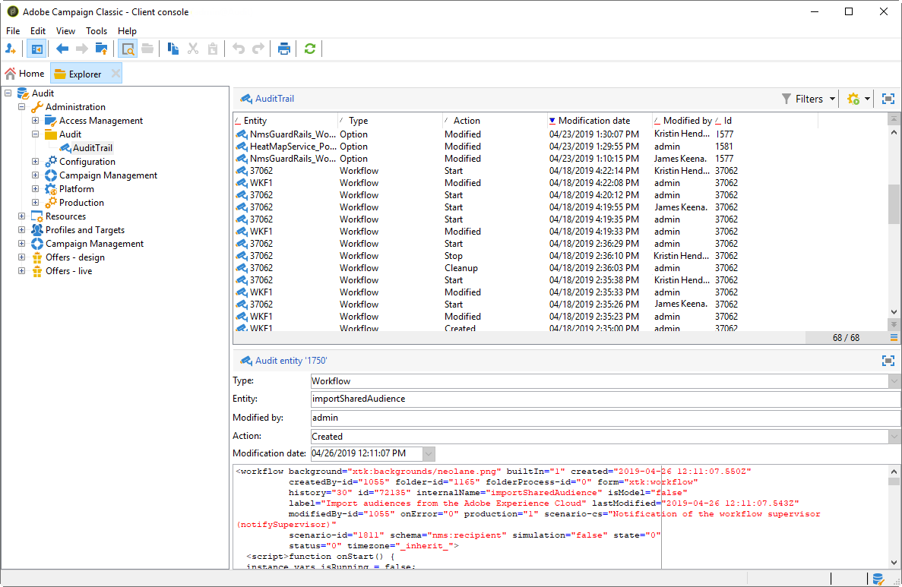

# 稽核軌跡{#audit-trail}

在Adobe Campaign中，**[!UICONTROL Audit trail]**&#x200B;可讓您存取在執行個體中所做變更的完整記錄。

**[!UICONTROL Audit trail]** 即時擷取在Adobe Campaign例項中發生的動作和事件的完整清單。它包含自助式方式，可存取資料記錄，以協助回答下列問題：您的工作流程發生了什麼，以及誰上次更新了工作流程，或您的使用者在執行個體中做了什麼。

>[!NOTE]
>
>Adobe Campaign不會審核在使用者權限、範本、個人化或促銷活動中所做的變更。\
>稽核記錄只能由執行個體的管理員管理。

稽核記錄包含三個元件：

* **結構審計線索**:檢查活動和對方案所做的最後修改。

   有關方案的詳細資訊，請參閱此[頁](../../configuration/using/data-schemas.md)。

* **工作流程稽核記錄**:檢查對工作流所做的活動和最後修改，另外，檢查工作流的狀態，例如：

   * 開始
   * 暫停
   * 停止
   * 重新啟動
   * 清理 等於「清除」歷史記錄
   * 在模擬模式中模擬與動作相等的啟動
   * 喚醒與操作相等立即執行暫掛任務
   * 無條件停止

   有關工作流的詳細資訊，請參閱此[頁](../../workflow/using/about-workflows.md)。

   有關如何監控工作流的詳細資訊，請參閱[專用部分](../../workflow/using/monitoring-workflow-execution.md)。

* **選項審核跟蹤**:檢查活動和對選項所做的最後修改。

   有關選項的詳細資訊，請參閱此[頁](../../installation/using/configuring-campaign-options.md)。

## 訪問審核跟蹤{#accessing-audit-trail}

要訪問實例的&#x200B;**[!UICONTROL Audit trail]** :

1. 訪問實例的&#x200B;**[!UICONTROL Explorer]**&#x200B;菜單。
1. 在&#x200B;**[!UICONTROL Administration]**&#x200B;菜單下，選擇&#x200B;**[!UICONTROL Audit]**。

   

1. 將開啟&#x200B;**[!UICONTROL Audit trail]**&#x200B;窗口，其中顯示實體清單。 Adobe Campaign會稽核工作流程、選項和結構描述的建立、編輯和刪除動作。

   選取其中一個實體，以進一步瞭解最後修改。

   

1. **[!UICONTROL Audit entity]**&#x200B;視窗會提供您有關所選實體的詳細資訊，例如：

   * **[!UICONTROL Type]** :工作流、選項或結構。
   * **[!UICONTROL Entity]** :活動的內部名稱。
   * **[!UICONTROL Modified by]** :上次修改此實體的最後一個人員的使用者名稱。
   * **[!UICONTROL Action]** :上次對此實體執行的動作為「已建立」、「已編輯」或「已刪除」。
   * **[!UICONTROL Modification date]** :上次對此實體執行動作的日期。

   程式碼區塊會提供您實體中確切變更內容的詳細資訊。

   

>[!NOTE]
>
>預設情況下，**[!UICONTROL Audit logs]**&#x200B;的保留期間設定為180天。 有關如何更改保留期的詳細資訊，請參閱此[頁](../../production/using/database-cleanup-workflow.md#deployment-wizard)。

## 啟用／禁用審核跟蹤{#enable-disable-audit-trail}

例如，如果您想要在資料庫中儲存一些空間，您就可以針對特定活動輕鬆啟用或停用稽核記錄。

若要這麼做：

1. 訪問實例的&#x200B;**[!UICONTROL Explorer]**&#x200B;菜單。
1. 在&#x200B;**[!UICONTROL Administration]**&#x200B;菜單下，選擇&#x200B;**[!UICONTROL Platform]** ，然後選擇&#x200B;**[!UICONTROL Options]**。

   

1. 根據要激活／停用的圖元，選擇以下選項之一：

   * 對於工作流：**[!UICONTROL XtkAudit_Workflows]**
   * 對於結構：**[!UICONTROL XtkAudit_DataSchema]**
   * 對於選項：**[!UICONTROL XtkAudit_Option]**
   * 針對每個實體：**[!UICONTROL XtkAudit_Enable_All]**

   

1. 如果要啟用實體，請將&#x200B;**[!UICONTROL Value]**&#x200B;變更為1；如果要停用實體，則變更為0。

   

1. 按一下 **[!UICONTROL Save]**。

