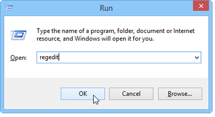

# 控制台更新{#console-update}

如果您已選取&#x200B;**[!UICONTROL Do not request console update]**&#x200B;選項，且您想要重新啟用更新要求，請套用下列程式：

1. 使用Windows **[!UICONTROL Start > Execute]**&#x200B;功能表中的&#x200B;**regedit**&#x200B;命令開啟登入資料庫編輯器。

   

1. 在樹狀結構中，顯示&#x200B;**[!UICONTROL HKEY_CURRENT_USERSoftwareneolaneNL_6nlclient]**&#x200B;節點的選項。
1. 刪除&#x200B;**[!UICONTROL confAdvisedUpgrade]**&#x200B;專案並關閉登入編輯程式。

   
