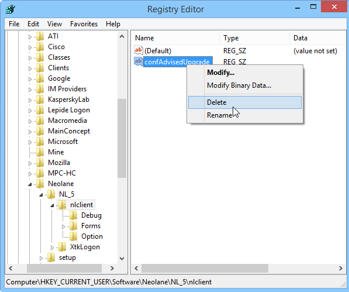

# 控制台更新{#console-update}

如果您已選取 **[!UICONTROL Do not request console update]** 選項，而且您想要重新啟用更新請求，請套用下列程式：

1. 使用開啟登入資料庫的編輯器 **regedit** Windows中的命令 **[!UICONTROL Start > Execute]** 功能表。

   

1. 在樹狀結構中，顯示 **[!UICONTROL HKEY_CURRENT_USERSoftwareneolaneNL_6nlclient]** 節點。
1. 刪除 **[!UICONTROL confAdvisedUpgrade]** 輸入並關閉登入編輯程式。

   
