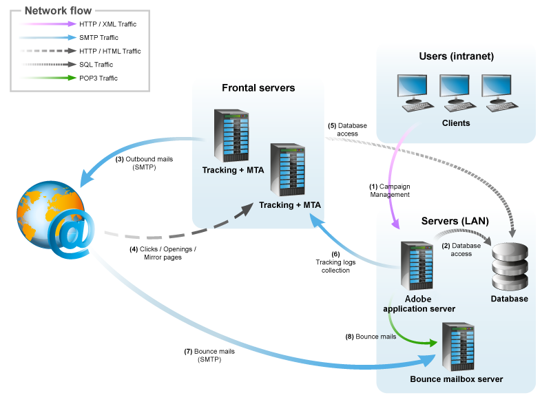

# 一般架構{#general-architecture}

## 最低架構 {#minimum-architecture}

在最低設定下，Adobe Campaign的運作方式為：

* Adobe Campaign應用程式伺服器，
* 資料庫。

  

此圖表顯示最低架構內容中唯一涉及的流量是：

1. 透過網際網路與Adobe Campaign伺服器的HTTP通訊協定流量，
1. 透過網際網路從Adobe Campaign伺服器傳入和傳入SMTP通訊協定流量。

## 分散式架構 {#distributed-architecture}

Adobe Campaign由多個模組組成，這些模組可在多部機器上劃分。 此作業模式具備數個優點：

* 負載平衡，
* 設定模組備援，
* 建置在數個服務提供者之間劃分的架構（所提供服務的細分）。

將模組分佈於多部機器上，可提供極大的使用彈性並改善適應性。

>[!NOTE]
>
>如需各種架構的詳細資訊，請參閱[本節](../../installation/using/general-architecture.md)。

## 開啟的連線埠清單 {#list-of-open-ports}

| 連線埠號碼 | 涉及Adobe Campaign模組或應用程式 | 可設定 |
|---|---|---|
| 443/tcp或80/tcp | 網頁伺服器(Apache/IIS) | 是 |
| 6666/udp （本機） | Adobe Campaign： Syslogd | 是 |
| 8005/tcp （本機） | Adobe Campaign：網頁模組 | 是 |
| 8080/tcp | Adobe Campaign：網頁模組(tomcat) | 是 |
| 7777 | 統計伺服器（stat伺服器） | 是 |
