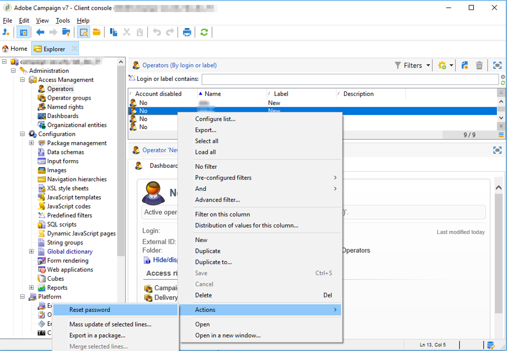

# 遺失密碼{#lost-password}


您可以更改或恢復丟失的密碼。
有兩種可能的情形：

* [密碼丟失，由Adobe Campaign操作員](#password-lost-by-campaign-operator)
* [內部密碼丟失](#internal-password-lost) （僅限本地客戶）

## 市場活動操作員丟失密碼 {#password-lost-by-campaign-operator}

如果Adobe Campaign操作員丟失了密碼，您可以更改密碼。
要執行此操作，請遵循下列步驟：

1. 通過具有管理員權限的操作員連接。
1. 按一下右鍵運算子。
1. 選取 **[!UICONTROL Actions]** > **[!UICONTROL Reset password]**.

   

1. 設定操作員的新密碼。 我們建議操作員在首次重新連接時更改其密碼。

## 內部密碼丟失 {#internal-password-lost}

>[!NOTE]
>
>本部分僅適用於本地客戶。

如果內部密碼丟失，則必須重新初始化它。
要執行此操作，請應用以下過程：

1. 編輯 **/usr/local/neolane/nl6/conf/serverConf.xml** 的子菜單。

1. 轉到 **內部密碼** 。

   ```
   <!-- XTK authentication mode internalPassword : Password of internal account -->
   <xtk internalPassword="myPassword"/>
   ```

1. 刪除引號中的字串，在此情況下： **我的密碼**

   因此，您可以獲得以下行：

   ```
   !-- XTK authentication mode internalPassword : Password of internal account -->
   <xtk internalPassword=""/
   ```

1. 保存更改並關閉檔案。

1. 配置新密碼。 為此，請輸入以下命令：

   ```
   nlserver config -internalpassword
   HH:MM:SS > Application server for Adobe Campaign Classic (7.X YY.R build XXX@SHA1) of DD/MM/YYYY
   Enter current password.
   Password: (empty)
   Enter the new password.
   Password: 
   Confirmation 
   ```

1. 您現在可以使用新密碼連接 **內部** 的子菜單。
