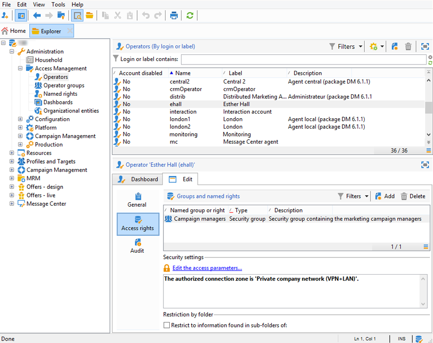

# 監控流程{#monitoring-processes}


應用程式伺服器和重定向伺服器(**追蹤**)可以手動或自動監控。

## 手動監控 {#manual-monitoring}

前往 **[!UICONTROL Monitoring]** 並按一下 **[!UICONTROL Overview]** 連結以顯示Adobe Campaign程式監控頁面。


顯示的頁面可讓您檢視已連線執行個體的狀態，例如：

* 執行個體的相關資訊：版本，名稱，資料庫引擎，已安裝的軟體包，伺服器系統指示器，
* 缺少進程和執行資訊的清單（開始日期、PID等）,
* 工作流程和傳送的檢視。

監控不同促銷活動程式的其他方式，請參閱 [本頁](../../production/using/monitoring-guidelines.md).

### 日誌日誌 {#log-journal}

可以顯示與進程相關的日誌日誌。 要執行此操作，請按一下程式， **mta** 例如，然後按一下 **[!UICONTROL Open the log journal]** .


### 系統指標 {#system-indicators}

系統指示器清單使您能夠顯示有關電腦的資訊，如其物理和虛擬記憶體、活動進程和可用磁碟空間。 Linux和Windows作業系統的指標不同。 前往 **[!UICONTROL Instance Monitoring]** 頁面，然後按一下 **[!UICONTROL Display]** 連結以開啟指標清單

#### Windows {#in-windows}

* **[!UICONTROL Pending events queued]** :特定指標 **訊息中心**. 請參閱 [本節](../../message-center/using/additional-configurations.md#monitoring-thresholds) 以取得更多資訊。

* **[!UICONTROL Memory]** :有關物理儲存器(RAM)的資訊。

   **[!UICONTROL Current value]** :實際記憶體消耗。

   **[!UICONTROL Max Value]** :已安裝的記憶體總量。

   **[!UICONTROL Available]** :可用記憶體量。

   **[!UICONTROL Warning]** :當記憶體消耗達到總量的80%時，將顯示此指示器。

   **[!UICONTROL Alert]** :當記憶體消耗達到總量的90%時，將顯示此指示器。

   當 **[!UICONTROL Warning]** 和 **[!UICONTROL Alert]** 指示符，則可通過向安裝了Adobe Campaign伺服器的電腦添加RAM來解決問題。 您也可以決定將Adobe Campaign伺服器安裝在專用電腦上。

* **[!UICONTROL Swap Memory]** :與匹配分頁檔案的虛擬記憶體相關的資訊：硬碟上的一個區域，Windows使用它就像是RAM。

   **[!UICONTROL Current value]** :實際記憶體消耗。

   **[!UICONTROL Max Value]** :記憶體總量。

   **[!UICONTROL Available]** :可用記憶體量。

   **[!UICONTROL Warning]** :當記憶體消耗達到總量的80%時，將顯示此指示器。

   **[!UICONTROL Alert]** :當記憶體消耗達到總量的90%時，將顯示此指示器。

   當 **[!UICONTROL Warning]** 和 **[!UICONTROL Alert]** 指示符，您可以通過增加高級Windows設定中的exchange檔案大小來解決問題。

* **[!UICONTROL Disk XXX]** :有關機器閱讀器的資訊。

   **[!UICONTROL Current value]** :實際使用的磁碟空間。

   **[!UICONTROL Max Value]** :磁碟總容量。

   **[!UICONTROL Available]** :可用磁碟空間

   **[!UICONTROL Used]** :使用的磁碟百分比。

   **[!UICONTROL Warning]** :當可用磁碟空間達到總容量的80%時，將顯示此指示器。

   **[!UICONTROL Alert]** :當可用磁碟空間達到總容量的90%時，將顯示此指示器。

* **[!UICONTROL Number of processes too old]** :已生效超過一天之Adobe Campaign程式的相關資訊。

   **[!UICONTROL Current value]** :當前活動的進程數。

   **[!UICONTROL Max Value]** :授權進程的最大數量(1)。

   **[!UICONTROL Alert]** :如果進程數等於1，則顯示此指示器。

   當 **[!UICONTROL Alert]** 指示符被顯示，可能是相關進程被SQL資料庫引擎鎖定，或者它被卡在無限循環中。 此 **監視** Adobe Campaign提供的程式會每天自動重新啟動所有程式，讓您解決此問題。 但您也可以自行停止相關程式以強制重新啟動。

#### Linux {#in-linux}


* **[!UICONTROL Pending events queued]** :特定指標 **訊息中心**. 請參閱 [本節](../../message-center/using/additional-configurations.md#monitoring-thresholds) 以取得更多資訊。

* **[!UICONTROL Load average (1/5/15 minutes)]** :有關負載的資訊，即在最後一分鐘、五分鐘或十五分鐘內在電腦上運行的進程對處理器的使用率

   **[!UICONTROL Current value]** :機器的實際負載。

   **[!UICONTROL Max value]** :機器上進程的最大使用負荷

   **[!UICONTROL Warning]** :當負載在最後一分鐘、五分鐘或十五分鐘內達到最大授權值的80%時，將顯示此指示器。

   **[!UICONTROL Alert]** :當負載達到最後一分鐘、五分鐘或十五分鐘的最大授權值的90%時，將顯示此指示器。

* **[!UICONTROL Memory]** :有關物理儲存器(RAM)的資訊。

   **[!UICONTROL Current value]** :實際記憶體消耗。

   **[!UICONTROL Max Value]** :已安裝的記憶體總量。

   **[!UICONTROL Available]** :可用記憶體量。

   **[!UICONTROL Warning]** :當記憶體消耗達到總量的80%時，將顯示此指示器。

   **[!UICONTROL Alert]** :當記憶體消耗達到總量的90%時，將顯示此指示器。

   當 **[!UICONTROL Warning]** 和 **[!UICONTROL Alert]** 指示符，則可通過向安裝了Adobe Campaign伺服器的電腦添加RAM來解決問題。 您也可以決定將Adobe Campaign伺服器安裝在專用電腦上。

* **[!UICONTROL Swap Memory]** :與匹配分頁檔案的虛擬記憶體相關的資訊：硬碟上的一個區域，Windows使用它就像是RAM。

   **[!UICONTROL Current value]** :實際記憶體消耗。

   **[!UICONTROL Max Value]** :記憶體總量。

   **[!UICONTROL Available]** :可用記憶體量。

   **[!UICONTROL Warning]** :當記憶體消耗達到總量的80%時，將顯示此指示器。

   **[!UICONTROL Alert]** :當記憶體消耗達到總量的90%時，將顯示此指示器。

   當 **[!UICONTROL Warning]** 和 **[!UICONTROL Alert]** 指示器，您可以增加exchange檔案的大小來解決問題。

* **[!UICONTROL Core Files]** :關於Adobe Campaign程式當機後產生之檔案的資訊。 這些檔案可讓您診斷當機原因。

   **[!UICONTROL Current Value]** :現有檔案數。

   **[!UICONTROL Max Value]** :授權檔案的最大數量(1)。

   **[!UICONTROL Warning]** :當檔案數接近1時，會顯示此指標。

   **[!UICONTROL Alert]** :當檔案數等於1時，會顯示此指標。

   當程式因當機而遺失時，該程式會在程式清單中以紅色顯示，並由 **監視** 程式由Adobe Campaign提供。

* **[!UICONTROL Number of shared memory segments]** :有關所有Adobe Campaign進程共用的記憶體段的資訊。

   **[!UICONTROL Current value]** :當前使用的記憶體段數。

   **[!UICONTROL Max Value]** :授權的最大記憶體段數(2)。

   **[!UICONTROL Warning]** :當記憶體段數達到1時，將顯示此指示器。

   **[!UICONTROL Alert]** :當記憶體段數達到2時，將顯示此指示器。

* **[!UICONTROL Number of processes too old]** :已活動超過一天的流程的相關資訊。

   **[!UICONTROL Current value]** :當前活動的進程數。

   **[!UICONTROL Max Value]** :授權進程的最大數量。

   **[!UICONTROL Warning]** :當進程數達到授權閾值的80%時，將顯示此指示器。

   **[!UICONTROL Alert]** :當進程數達到授權閾值的90%時，將顯示此指示器。

* **[!UICONTROL File Handles]** :有關檔案描述符的資訊，即每個進程開啟的檔案數。

   **[!UICONTROL Current value]** :當前檔案描述符數。

   **[!UICONTROL Max Value]** :作業系統授權的檔案描述符的最大數量。

   **[!UICONTROL Warning]** :當授權的檔案描述符數達到80%閾值時，將顯示此指示器。

   **[!UICONTROL Alert]** :當授權的檔案描述符數達到90%閾值時，將顯示此指示器。

* **[!UICONTROL Processes]** :有關機器進程的資訊。

   **[!UICONTROL Current value]** :當前活動的進程數。

   **[!UICONTROL Max Value]** :授權進程的最大數量。

   **[!UICONTROL Active Processes]** :活動進程數。

   **[!UICONTROL Inactive Processes]** :非活動進程數。

   **[!UICONTROL Warning]** :當授權進程數達到80%閾值時，將顯示此指示器。

   **[!UICONTROL Alert]** :當授權進程數達到90%閾值時，將顯示此指示器。

* **[!UICONTROL Zombie Processes]** :已停止但仍具有進程標識符(PID)且在進程表中仍可見的進程的相關資訊。

   **[!UICONTROL Current value]** :當前處於活動狀態的僵屍進程數。

   **[!UICONTROL Max Value]** :授權僵屍進程的最大數量(2)。

   **[!UICONTROL Warning]** :當僵屍進程數接近2時，將顯示此指示器。

   **[!UICONTROL Alert]** 當僵屍進程數達到2時，將顯示此指示器。

#### 自訂指標 {#customized-indicators}

Adobe Campaign可讓您自訂指標。 操作步驟：

1. 建立 **.sh** 檔案和名稱 **[!UICONTROL cust_indicators.sh]** .
1. 將您的自訂指標新增至此檔案。 例如：

   ```
   #!/bin/bash 
   echo "<indicator name='Zombie Processes'>  
   <current label='Current Value' value='0' display=''/>  
   <warning value='2'/>  <alert value='2'/>  
   <max label='Max Value' value='2'/>
   </indicator>"
   ```

   或

   ```
   #!/bin/bash 
   echo "<indicator name='Availability'>  
   <current label='Last update of data' display='2012-09-03 10:00'/>  
   <current label='Availability last month' display='100.00%'/>  
   <current label='Availability this month' display='100.00%'/> 
   <current label='Recent downtime periods' display='2012-07-04 11:10:00 - 11:19:59'/>
   </indicator>"
   ```

1. 將檔案放入 **[!UICONTROL usr/local/neolane/nl6]** 檔案夾。

此檔案將由Adobe Campaign呼叫。

## SMTP報表 {#smtp-reports}

SMTP傳送監控報表已整合至Adobe Campaign平台。 您可透過主控台或使用Web存取來存取這些檔案。

這些報表會依網域顯示SMTP傳送統計資料和SMTP錯誤。

若要存取，運算子必須具有管理權限。

它們會分組在 **監控** > &#39;SMTP監視&#39;。


>[!IMPORTANT]
>
>* 只有啟用了電子郵件通道後，才能使用與SMTP監視相關的資訊。
>* 此 **[!UICONTROL SMTP sending statistics]** 只有在實例上啟動了統計伺服器時，才提供。

>


### SMTP發送統計資訊 {#smtp-sending-statistics}

此 **[!UICONTROL SMTP sending statistics]** 報表可讓您控制伺服器活動。 它顯示每個匹配項的合成。


此報告的指標清單如下。

1. 已傳送的訊息總數。
1. 
   * 藍線：已準備好傳送且已送達Shaper的訊息，亦即傳送SMTP前的最後一個階段（與傳入的資料一致）。

   * 綠線：已成功傳送訊息（與傳出資料一致）。

   * 紅線：由Shaper放棄的消息返回到 **mta** （與此恢復中拒絕的資料一致）。

   這些值以每小時的訊息數量表示。

1. 表示Shaper的兩個隊列：

   * 藍色曲線：活動消息的隊列。 這些訊息會盡快傳送。

   * 卡基曲線：「延期」佇列。 由於限制或沒有可用的目標連接，此時無法返回這些消息。 重試次數將每5秒、10秒、20秒、40秒、2分鐘等進行。 針對已定義 **MaxAgeSec** 才被拋棄。

1. 此圖表顯示放棄的消息的詳細資訊（第2張圖表上的紅色曲線）:它顯示未重試時放棄的消息(mauve)與發送失敗的消息（紅色）的比例。 這允許您查看由於統計伺服器限制（限制）或遠程伺服器不可用而未在授予的期間內處理的郵件比例。
1. SMTP連接已開啟或正在開啟。
1. 估計 **mtachild**.

>[!NOTE]
>
>此報表與電子郵件流量整形器元件的狀態有關。

### 每個域的SMTP錯誤 {#smtp-errors-per-domain}

此報告可讓您檢視依網域劃分的指定期間內的傳送錯誤。

>[!NOTE]
>
>此 **minConnectionsToLog**, **minErrorsToLog** 和 **minMessagesToLog** 選項 **serverConf.xml** 檔案定義要考慮連接統計資訊的閾值。


本報告的指標清單如下。

* 此 **網域** 欄包含傳送訊息的網域名稱（例如yahoo.com的實際網域名稱）,
* 此 **Cnx** 列顯示為此域開啟的SMTP連接數，
* 此 **已傳送** 欄對應於發送到此域的消息數，
* 此 **卷** 列顯示已嘗試發送到此域（近似值）的消息量，
* 此 **錯誤** 欄顯示此域上在該時段內的錯誤的卷指示符，
* 此 **上次回應** 列顯示收到的此域的最後SMTP響應消息，
* 此 **日期** 欄顯示此域上次收到的SMTP響應的日期。

>[!NOTE]
>
>顯示於 **Cnx**, **已傳送**，和 **卷** 欄會根據 **[!UICONTROL Period]** 欄位。

按一下網域名稱以檢視其錯誤。

它們依PublicId分類：此標識符對應於路由器後面多個Adobe Campaign mta共用的IP地址。 統計伺服器使用此標識符來儲存此起始點和目標伺服器之間的連接和傳送統計資訊。


此 **[!UICONTROL Owner of domain]** 欄位可讓您以相同標籤將各種網域名稱分組。 在初始報表檢視中，所有MX網域名稱都會與此擁有者相關聯。

按一下PublicId識別碼以檢視詳細資訊。


>[!NOTE]
>
>錯誤百分比由兩個圖表表示。 第一個是黑色背景中的水準進度列。 第二張圖表按時間順序排列。 所選期間被分為12個時間間隔，每個時間間隔由垂直進度條表示。 在這兩個表示中，如果未檢測到任何錯誤，則條為黑色。 長條的顏色取決於遇到的錯誤百分比（黃色、橙色，最後是紅色）。 顏色灰色表示未找到任何有效資料量。 將游標放在圖表上，即可顯示錯誤的確切百分比。

>[!NOTE]
>
>有關SMTP錯誤以及在Adobe Campaign中管理這些錯誤的詳細資訊，請參閱 [本節](../../installation/using/email-deliverability.md).

## 帳單報告 {#billing-report}

此 **[!UICONTROL Billing]** 技術工作流程會透過電子郵件將系統活動報表傳送至「帳單」運算子。 預設會在行銷執行個體上每月25日觸發。

技術工作流程可在以下節點的子資料夾中找到： **管理** > **生產** > **技術工作流程**.


一旦每月25日開始工作流程，您的帳單營運商將會在其收件匣中收到下列報表。


下列量度可用於追蹤您的傳送：

* **[!UICONTROL Start date]** :傳送的開始日期。 請注意，它可以早於報表的「開始日期」。
* **[!UICONTROL Label]** :傳送的標籤。 要傳送的訊息少於100個，則會視為太小，因此會依開始日期匯總，在此情況下，標籤會顯示匯總的數量，例如 [合併3個小型交付].
* **[!UICONTROL Total volume]** :傳送的總位元組數。
* **[!UICONTROL Avg volume]** :傳輸的位元組平均卷。 這是下列公式的結果 **（總流量/報文數）**，此為 **[!UICONTROL Multiplier]** 量度。
* **[!UICONTROL Messages]** :已傳送訊息的數量。 這包括已成功發送和重試的兩條消息（在從聯繫的伺服器接收退信後）。
* **[!UICONTROL Multiplier (x)]** :從報文的平均體積推導出乘數的值。
* **[!UICONTROL Count]** :消息和乘數的乘法結果。

## 自動監控 {#automatic-monitoring}

Adobe Campaign提供數種自動監控方法，如下所示。

### 命令列 {#command-line}

命令

**nlserver監視器**

可讓您在Adobe Campaign模組和系統上列出一組指標。

它以易於處理的XML格式生成輸出。

此命令也可搭配 **-missing** 參數，列出當配置檔案表示應執行時，此實例中缺少的進程。

```
nlserver monitor -missing
HH:MM:SS > Application server for Adobe Campaign Classic (7.X YY.R build XXX@SHA1) of DD/MM/YYYY
mta@prod
stat@prod
wfserver@prod
```

### 伺服器發佈的資訊 {#information-published-by-the-server}

#### /r/test {#r-test}

此 **http(s)://`<application>`/r/test** 頁用於測試重定向伺服器。 建議您使用相同的方法來測試用於追蹤的前沿伺服器。 此頁面也可用來測試載入Dispatcher。

它以XML格式顯示如下行：

```
<redir status='OK' date='YYYY-MM-DD HH:MM:SS.112Z' build='XXXX' host='<hostname>' localHost='<servername>'/>
```

**頻率**:此測試不會使用任何負載，因此可經常執行（例如每秒執行一次）。

#### /nl/jsp/ping.jsp {#nl-jsp-ping-jsp}

此 **http(s)://`<Application server url>`/nl/jsp/ping.jsp**  頁面的運作方式與其網路對應者相同：它測試通過apache/tomcat/web模組/資料庫並上傳到客戶端的完整查詢。 如果一切正常運作，則會傳回「OK」。 我們建議在可存取資料庫的電腦上執行此測試（例如，mta和調查）。

**使用狀況**:必須將與運算子登入相關聯的工作階段代號作為引數傳遞，才能遠端登入(請參閱 [透過Adobe Campaign指令碼自動監控](#automatic-monitoring-via-adobe-campaign-scripts))。

例如：


運算子名稱和登入必須先在Adobe Campaign用戶端主控台中以資料庫權限設定。



**頻率**:這是一項使用很少頻寬的測試。 因此，它可以相當經常地運行，但每分鐘不能超過一次。

#### /nl/jsp/monitor.jsp {#nl-jsp-monitor-jsp}

這是一項測試，以檢查運算子是否可透過網頁存取Adobe Campaign伺服器；與透過用戶端控制台功能表存取的網頁相同。 您可以從監視工具（Tivoli、Nagios等）調用此頁。


**使用狀況**:與運算子登入相關聯的工作階段代號，可讓您連線至執行個體，這需要用作引數(請參閱 [透過Adobe Campaign指令碼自動監控](#automatic-monitoring-via-adobe-campaign-scripts))。

運算子及其登入需先在Adobe Campaign用戶端主控台中以適當的資料庫權限和限制進行設定。

**頻率**:這是完整的伺服器測試，不需要經常執行（例如，每十分鐘執行一次）。

#### /nl/jsp/soaprouter.jsp {#nl-jsp-soaprouter-jsp}

此 **jsp** 代表Adobe Campaign應用程式API的入口點。 因此，它可以提供應用程式的詳細監控。 它也可用來監視Adobe Campaign Web服務。 它用於監控指令碼中，但請注意，它僅適用於高級用戶。

### 根據部署類型進行監控 {#monitoring-based-on-deployment-types}

Adobe Campaign可啟用各種部署設定(如需詳細資訊，請參閱 [本節](../../installation/using/hosting-models.md))。 本節詳細說明根據安裝類型要應用的各種自動監視技術。

<table> 
 <thead> 
  <tr> 
   <th> 部署類型 </th> 
   <th> 監視 </th> 
  </tr> 
 </thead> 
 <tbody> 
  <tr> 
   <td> 獨立 </td> 
   <td> 
    <ul> 
     <li><p> <span class="uicontrol">/r/test</span> 和 <span class="uicontrol">/nl/jsp/monitor.jsp</span> 在Adobe Campaign伺服器上</p> </li> 
    </ul> </td> 
  </tr> 
  <tr> 
   <td> 標準 </td> 
   <td> 
    <ul> 
     <li><p> <span class="uicontrol">/r/test</span> 和 <span class="uicontrol">/nl/jsp/ping.jsp</span> 前端伺服器</p> </li> 
     <li><p> <span class="uicontrol">/nl/jsp/monitor.jsp</span> 應用程式伺服器上</p> </li> 
    </ul> </td> 
  </tr> 
  <tr> 
   <td> 企業 </td> 
   <td> 
    <ul> 
     <li><p> <span class="uicontrol">/r/test</span> 和 <span class="uicontrol">/nl/jsp/ping.jsp</span> 前端伺服器</p> </li> 
     <li><p> <span class="uicontrol">/r/test</span> 和 <span class="uicontrol">/nl/jsp/monitor.jsp</span> 應用程式伺服器上</p> </li> 
    </ul> </td> 
  </tr> 
  <tr> 
   <td> 中間來源 </td> 
   <td> 
    <ul> 
     <li><p> <span class="uicontrol">/nl/jsp/monitor.jsp</span> 應用程式伺服器上</p> </li> 
    </ul> </td> 
  </tr> 
 </tbody> 
</table>

## 透過Adobe Campaign指令碼自動監控 {#automatic-monitoring-via-adobe-campaign-scripts}

Adobe Campaign可提供執行個體監控工具(netreport)，讓您透過電子郵件傳送關於偵測到異常的報表。


>[!IMPORTANT]
>
>此工具可用來監視您的執行個體，但Adobe Campaign不支援。 如需詳細資訊，請連絡您的Campaign管理員。

### 必要元素 {#required-elements}

自動監控需要下列預安裝注意事項：

* 您必須擁有 **netreport.tgz** （Linux安裝）或 **netreport.zip** （Windows安裝）檔案，
* 我們強烈建議您不要在要監視的電腦上安裝監視，
* 它必須安裝在具有JRE或JDK的電腦上，
* 在Linux中，要監視的電腦必須具有 **bc** 包。 如需詳細資訊，請參閱[本章節](../../installation/using/installing-packages-with-linux.md#distribution-based-on-rpm--packages)。

### 安裝程式 {#installation-procedure}

安裝步驟如下：

1. 在主控台中，視需要建立新運算子（「監視」使用者已存在），但不指派任何權利。
1. 執行封存擷取。
1. 閱讀 **讀我檔案** 檔案。
1. 更新 **netconf.xml** 設定檔。
1. 更新 **netreport.bat** (Windows)或 **netreport.sh** (Linux)檔案。

### 配置netconf.xml檔案 {#configuring-the-netconf-xml-file}

XML配置檔案包含以下元素：

* [「屬性」元素](#properties--element)
* [「例項」元素](#instance--element)
* [「主機」元素](#host--element)
* [子元素](#sub-elements)

以下是設定範例：

```
<?xml version="1.0" encoding="ISO-8859-1"?>
<netconf>
  <properties mailServer="mail.adobe.net" mailFrom="mail@adobe.com" recipientList="recipient@adobe.com">
    <nightMode start="00:00 am" end="07:00 am"/>
    <buildRange minimum="7829" maximum="8180"/>
    <buildRange minimum="8300" maximum="8400"/>
    <sla/>
  </properties>

  <instance name="dev" recipientList="mail@mail.com,mail2@mail.com">
                <host name="devrd.domain.com" alias="devrd" sessiontoken="monitoring" criticalLevel="1" filter="wkf;new">
                                <ncs instance="devrd" url="/nl/jsp/soaprouter.jsp" includeDead="false" isSecure="false"/>
                                <redir url="/r/test"/>
                                <http url="/nl/jsp/ping.jsp"/>
                </host>
                <host name="devtrk.domain.com" alias="devtrk" sessiontoken="monitoring" criticalLevel="0" filter="wkf;new">
                                <ncs instance="devrd" url="/nl/jsp/soaprouter.jsp" includeDead="true" isSecure="false"/>
                </host>
  </instance>
  <host name="dev-test" alias="dev-test" sessiontoken="monitoring" criticalLevel="2">
                <ncs instance="dev" url="/nl/jsp/soaprouter.jsp" includeDead="false"/>
  </host>
</netconf>
```

>[!NOTE]
>
>您可以將尾碼新增至 **netconf.xml** 例如， **netconf-dev.xml**, **netconf-prod.xml**、等 然後，指定要用於在 **netreport.bat** 或 **netreport.sh** 通過添加 **$JAVA_HOME/bin/java反向連結開發** 或 **@%JAVA_HOME%binjava netreport prod** 例如，

>[!IMPORTANT]
>
>若 **監控** 運算子工作時，執行netreport的電腦必須位於 **sessionTokenOnly** 模式。 如果未指定此運算子的可信IP掩碼，則安全區域也必須位於 **allowEmptyPassword** 和 **allowUserPassword** 模式。

#### 「屬性」元素 {#properties--element}

此元素用於填入電子郵件的設定，即

* **mailServer**:用於傳送電子郵件的SMTP伺服器(例如：smtp.domain.net)。
* **mailFrom**:報表寄件者的電子郵件地址(例如：monitoring@domain.net)。
* **recipientList**:監控收件者的電子郵件地址清單。 地址必須以逗號分隔（不含空格）。
* &#39;**夜晚**「 mode（選用）」可用來避免在指定時段之間傳送電子郵件。 反之，會整合資料，並在結束時間之後（預設為7:00）傳送關於夜間活動的電子郵件。
* 此 **buildRange** 子元素（選用）可讓您指定最小和最大組建數。 將為生成編號未落入此範圍的所有電腦生成錯誤

   ```
   <buildRange minimum="0000" maximum="9999"/>
   ```

* 您可以新增 **`<sla>`** （選用） **屬性** 元素。 每次執行netreport時都會產生記錄檔。 檔案的名稱包含設定名稱以及日期和時間，例如 **dev_06_12_13_16_47_05.tmp**. 檔案包含下列資訊：執行個體名稱、電腦名稱、嚴重性級別、（0到3，從最不重要到最關鍵）、日期（時間戳格式）、查詢與回應之間經過的時間（以毫秒為單位）、使用的服務(http、ncs、ncsex、redir)。 此資訊由各服務結束時的表格標籤和分行分隔。

>[!NOTE]
>
>此 **persistHtmlFile** 屬性，且值為「true」 **`<property>`** 元素可用來將最新的監控狀態記錄在檔案中 **netreport.md**. 此檔案將保存在安裝目錄中。

#### 「例項」元素 {#instance--element}

此元素可讓您將數部電腦（主機）重新分組至相同的例項。 執行個體名稱會出現在監控電子郵件的第一部分。 您可以按一下執行個體的名稱，以存取有關每部電腦的詳細資訊。

```
instance name="instanceName" recipientList="mail@mail.com,mail2@mail.com">
                <host name="devcamp.domain.com" ...>
                       ...
                </host>
                <host name="devtrack.domain.com" ...>
                       ...
                </host>
</instance
```

* **名稱**:會出現在電子郵件第一部分的執行個體名稱。
* **recipientList** （可選）:可讓您透過電子郵件傳送有關特定例項的監控報告。

#### 「主機」元素 {#host--element}

此元素會設定主機上指定伺服器的監控，即

* **名稱**:要監視的電腦的名稱。
* **別名** （可選）:監視的電腦的名稱，如報告中顯示的。
* **sessionToken**:透過授權的工作階段權杖提供登入驗證。

   若要設定工作階段Token，請選取 **監控** 運算元。 在 **存取權限** 頁簽，指定授權監視此實例的電腦的IP地址。 然後，您就能使用 **監控** 識別碼，而不需要指定密碼。

   

* **criticalLevel** （可選）:可讓您依嚴重性層級來排序錯誤。 可能的值為「0」（顯示所有級別）、「1」（僅顯示高錯誤和嚴重錯誤）和「2」（僅顯示嚴重錯誤）。 如果未提供此屬性，則顯示所有錯誤級別。
* **篩選** （可選）:可讓您排除某些工作流程錯誤，例如 **filter=&quot;wkf;wkf1&quot;**. 工作流程標籤必須以分號分隔。

#### 子元素 {#sub-elements}

* **tcp**:檢查伺服器是否處於開啟或關閉狀態。 必須輸入埠號。
* **http**:檢查Web伺服器是否存在（應用程式伺服器可運行）。
* **ncs**:檢查在「執行個體」屬性中輸入的執行個體的程式（工作流程錯誤、記憶體使用情況等）。 此 **包含** （必要）屬性可讓您選擇顯示無效進程（「true」或「false」值）。
* **redir**:檢查追蹤。

在大多數情況下，僅 **ncs** 和 **redir** 可以保留子元素。

在任何情況下，某些節點都可能在子元素(例如，節點 **port=75** 要使用於http、ncs或redir連接的埠過載，請執行以下操作：

```
<ncs instance="clap40" url="/nl/jsp/soaprouter.jsp" includeDead="false" port="80"/>
```

在 **ncs**, **redir** 和 **http** 子元素，您可以新增 **isSecure** 屬性（選用），以選擇是否使用https通訊協定（「true」或「false」值）。 如果未提供此屬性，則使用http通訊協定。

### 配置netreport.bat或netreport.sh檔案 {#configuring-the-netreport-bat-or-netreport-sh--file}

要配置它，請編輯此檔案並指明JRE或JDK安裝在哪個目錄中。

### 啟動監視 {#launching-monitoring}

要啟動監視，請執行 **netreport.bat** 或 **netreport.sh** 定期透過指令碼傳送檔案。 報表會在第一次執行後傳送，然後只會在狀態變更時傳送。

### 測試監控 {#testing-monitoring}

要測試監視，請執行 **netreport.bat** 或 **netreport.sh** 檔案。

會傳送電子郵件給 **recipientList** 的 **netconf.xml** 檔案。
