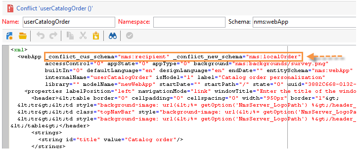

# 升級至新建版本（內部部署）{#upgrading}

在開始升級過程之前，確定並確認要升級到哪個版本的Adobe Campaign，並參閱[發行說明](../../rn/using/latest-release.md)。

>[!IMPORTANT]
>
>* Adobe強烈建議在更新之前對每個實例進行資料庫備份。 如需詳細資訊，請參閱[本區段](../../production/using/backup.md)。
>* 若要執行升級，請確定您具備存取例項和記錄檔的能力和權限。
>* 開始前，請閱讀[本節](../../installation/using/general-architecture.md)和[build upgrade](https://helpx.adobe.com/tw/campaign/kb/acc-build-upgrade.html)一章。

>


## Windows {#in-windows}

在Windows環境中，請遵循下列步驟將Adobe Campaign更新為新建版本：

* [關閉服務](#shut-down-services),
* [升級應用程式伺服器](#upgrade-the-adobe-campaign-server-application),
* [同步資源](#synchronize-resources),
* [重新啟動服務](#restart-services)。

要瞭解如何更新客戶機控制台，請參閱[本節](../../installation/using/client-console-availability-for-windows.md)。

### 關閉服務{#shut-down-services}

為了用新版本替換所有檔案，您需要關閉nlserver服務的所有實例。

1. 關閉以下服務：

   * 網站服務(IIS):

      **iisreset /stop**

   * Adobe Campaign社：**net stop nlserver6**
   >[!IMPORTANT]
   >
   >您還需要確保重定向伺服器(webmdl)已停止，以便IIS使用的&#x200B;**nlsrvmod.dll**&#x200B;檔案可以替換為新版本。

1. 運行&#x200B;**nlserver pdump**&#x200B;命令檢查沒有任務處於活動狀態。 應出現以下內容：

   ```
   C:<installation path>Adobe Campaign v7bin>nlserver pdump
   HH:MM:SS > Application Server for Adobe Campaign Classic (7.X YY.R build XXX@SHA1) of DD/MM/YYYY
   No tasks
   ```

   您可以使用Windows任務管理器來確保所有進程都已停止。

### 升級Adobe Campaign伺服器應用程式{#upgrade-the-adobe-campaign-server-application}

若要執行升級檔案，請套用下列步驟：

1. 運行&#x200B;**setup.exe**。

   若要下載此檔案，請使用您的使用者認證連線至[軟體散發入口網站](https://experience.adobe.com/#/downloads/content/software-distribution/en/campaign.html)。 在[本頁](https://experienceleague.adobe.com/docs/experience-cloud/software-distribution/home.html?lang=en)中進一步瞭解軟體分發。

1. 選擇安裝模式：選擇&#x200B;**[!UICONTROL Update or repair]**
1. 按一下 **[!UICONTROL Next]**。
1. 按一下 **[!UICONTROL Finish]**。

   然後，安裝程式會複製新檔案。

1. 操作完成後，按一下&#x200B;**[!UICONTROL Finish]**。

### 同步資源{#synchronize-resources}

使用以下命令行：

**nlserver config -postupgrade-allinstances**

這可讓您執行下列作業：

* 同步資源
* 更新結構描述
* 更新資料庫

>[!NOTE]
>
>此操作只應在(**nlserver web**)應用程式伺服器上執行一次。

然後檢查同步是否生成錯誤或警告。 有關詳細資訊，請參閱[解決升級衝突](#resolving-upgrade-conflicts)。

### 重新啟動服務{#restart-services}

要重新啟動的服務包括：

* 網站服務(IIS):

   **iisreset /start**

* Adobe Campaign社：**net start nlserver6**

## Linux {#in-linux}

在Linux環境中，請遵循以下步驟將Adobe Campaign更新為新構建版本：

* [下載更新的套件](#obtain-updated-packages),
* [執行更新](#perform-an-update),
* [重新啟動Web伺服器](#reboot-the-web-server)。

[進一步瞭解Client Console的可用性](../../installation/using/client-console-availability-for-windows.md)。

>[!NOTE]
>
>從建置8757起，就不再需要協力廠商資料庫。

### 獲取更新的軟體包{#obtain-updated-packages}

從恢復Adobe Campaign的兩個更新包開始：使用您的用戶憑據連接到[軟體分發門戶](https://experience.adobe.com/#/downloads/content/software-distribution/en/campaign.html)。 在[本頁](https://experienceleague.adobe.com/docs/experience-cloud/software-distribution/home.html?lang=en)中進一步瞭解軟體分發。

檔案為&#x200B;**nlserver6-v7-XXX.rpm**

### 執行更新{#perform-an-update}

* 以RPM為基礎的散發(RedHat、SuSe)

   要安裝它們，請以root用戶身份執行：

   ```
   $rpm -Uvh nlserver6-v7-XXXX.rpm
   ```

   其中XXX是檔案的版本。

   rpm檔案對包具有依賴性，您可以在CentOS/Red Hat分發上找到這些包。 如果您不想使用其中一些依賴項，則可能必須使用rpm的「nodeps」選項：

   ```
   rpm --nodeps -Uvh nlserver6-v7-XXXX-0.x86_64.rpm
   ```

* 以DEB為基礎的散發(Debian)

   要安裝它們，請以root用戶身份執行：

   ```
   dpkg -i nlserver6-v7-XXXX-amd64_debX.deb
   ```

>[!NOTE]
>
>[本節](../../installation/using/installing-campaign-standard-packages.md)中詳細介紹了完整的安裝過程。 資源會自動同步，但您需要確保未發生任何錯誤。 有關詳細資訊，請參閱[解決升級衝突](#resolving-upgrade-conflicts)。

### 重新啟動Web伺服器{#reboot-the-web-server}

您必須關閉Apache，新程式庫才能適用。

要執行此操作，請執行以下命令：

```
/etc/init.d/apache stop
```

>[!IMPORTANT]
>
>* 您的指令碼可能稱為&#x200B;**httpd**，而非&#x200B;**apache**。
>* 您必須執行此命令，直到您獲得以下回覆：

   >
   >   
   Apache必須執行此操作，才能應用新庫。


然後重新啟動Apache:

```
/etc/init.d/apache start
```

## 解決升級衝突{#resolving-upgrade-conflicts}

在資源同步期間， **postupgrade**&#x200B;命令使您能夠檢測同步是否生成了錯誤或警告。

### 查看同步結果{#view-the-synchronization-result}

查看同步結果有兩種方法：

* 在命令行介面中，錯誤由三重雪佛龍&#x200B;**>>>**&#x200B;實現，並自動停止同步。 警告由雙字形&#x200B;**>>**&#x200B;實現，並且必須在同步完成後解決。 在postupgrade的末尾，將在命令提示符中顯示一個摘要。 它可能如下所示：

   ```
   2013-04-09 07:48:39.749Z 00002E7A 1 info log =========Summary of the update==========
   2013-04-09 07:48:39.749Z 00002E7A 1 info log <instance name> instance, 6 warning(s) and 0 error(s) during the update.
   2013-04-09 07:48:39.749Z 00002E7A 1 warning log The document with identifier 'mobileAppDeliveryFeedback' and type 'xtk:report' is in conflict with the new version.
   2013-04-09 07:48:39.749Z 00002E7A 1 warning log The document with identifier 'opensByUserAgent' and type 'xtk:report' is in conflict with the new version.
   2013-04-09 07:48:39.750Z 00002E7A 1 warning log The document with identifier 'deliveryValidation' and type 'nms:webApp' is in conflict with the new version.
   2013-04-09 07:48:39.750Z 00002E7A 1 warning log Document of identifier 'nms:includeView' and type 'xtk:srcSchema' updated in the database and found in the file system. You will have to merge the two versions manually.
   ```

   如果警告涉及資源衝突，則需要使用者注意才能解決。

* **postupgrade_`<server version number>_<time of postupgrade>`.log**&#x200B;日誌檔案包含同步結果。 預設情況下，它位於以下目錄：**`<installation directory>/var/<instance/postupgrade`**。 錯誤和警告由錯誤和警告屬性指示。

### 解決衝突{#resolving-conflicts}

要解決衝突，請應用以下流程：

1. 在Adobe Campaign樹中，轉至&#x200B;**[!UICONTROL Administration > Configuration > Package management > Edit conflicts]**。
1. 在清單中選擇要解決的衝突。

解決衝突的方法有三種：

* **[!UICONTROL Declare as resolved]** :需要事先進行使用者干預。
* **[!UICONTROL Accept the new version]** :建議使用者是否未變更Adobe Campaign提供的資源。
* **[!UICONTROL Keep the current version]** :表示更新遭拒。

   >[!IMPORTANT]
   >
   >如果您選取此解析度模式，新版本中的修正可能不會讓您受益。

如果您選擇手動解決衝突，請按如下步驟進行：

1. 在窗口的下半部分中，搜索&#x200B;**_conflict_**&#x200B;字串以查找具有衝突的實體。 隨新版本安裝的實體包含&#x200B;**new**&#x200B;引數，與舊版相符的實體包含&#x200B;**cus**&#x200B;引數。

   

1. 刪除您不想保留的版本。 刪除您保留的實體的&#x200B;**_conflict_argument_**&#x200B;字串。

   

1. 前往您已解決的衝突。 按一下&#x200B;**[!UICONTROL Actions]**&#x200B;表徵圖並選擇&#x200B;**[!UICONTROL Declare as resolved]**。
1. 儲存變更：衝突現已解決。

### 最佳實務{#best-practices}

更新失敗可能與資料庫配置相連結。 確保技術管理員和資料庫管理員執行的配置相容。

例如，Unicode資料庫不僅必須授權儲存LATIN1資料等。

## 警告客戶機控制台可用更新{#warn-the-client-consoles-of-the-available-update}

### Windows {#in-windows-1}

在安裝Adobe Campaign應用伺服器的機器上(**nlserver web**)，下載並複製應用程式]/datakit/nl/eng/jsp **的檔案** setup-client-6.XXXX.exe **i n**[&#x200B;路徑。

下次連接客戶機控制台時，窗口將通知用戶更新的可用性，並為用戶提供下載和安裝更新的可能性。

>[!NOTE]
>
>請確定IIS_XPG用戶具有該安裝檔案的適當讀權限，並參閱[安裝指南](../../installation/using/general-architecture.md)以瞭解詳細資訊。

### Linux {#in-linux-1}

在安裝Adobe Campaign應用程式伺服器(**nlserver web**)的電腦上，檢索&#x200B;**setup-client-6.XXXX.exe**&#x200B;軟體包並複製它，另存為&#x200B;**/usr/local/neolane/nl6/datakit/nl/eng/jsp**:

```
 cp setup-client-6.XXXX.exe /usr/local/neolane/nl6/datakit/nl/eng/jsp
```

下次連接客戶機控制台時，窗口將通知用戶更新的可用性，並為用戶提供下載和安裝更新的可能性。

>[!NOTE]
>
>請確定Apache用戶具有此安裝檔案的適當讀權限，並參閱[安裝指南](../../installation/using/general-architecture.md)以瞭解詳細資訊。

