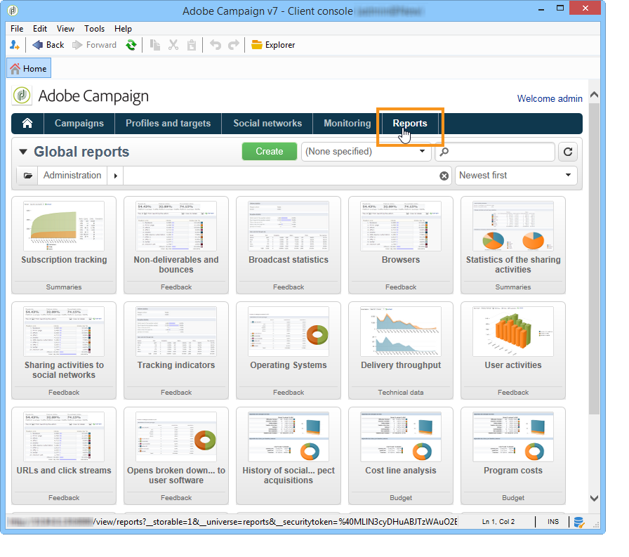
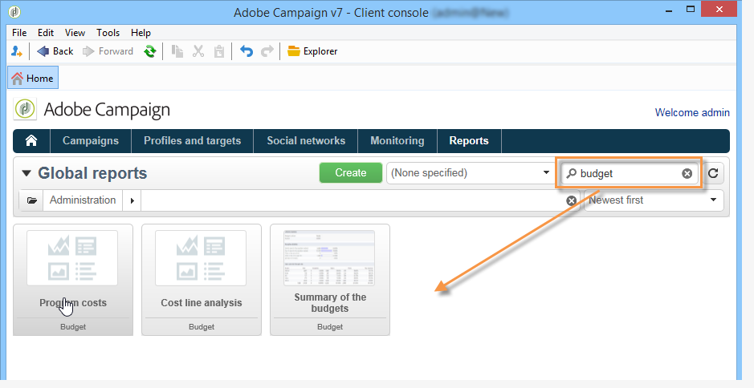

# 關於Campaign內建報表{#about-campaign-built-in-reports}

本章提供Adobe Campaign內建報告的清單、其內容與內容。 以下資訊可讓您避免建立平台中已提供的報告。

>[!NOTE]
>
>您也可以瞭解如何將自己的報告新增至「**[!UICONTROL Reports]**」索引標籤。 如需詳細資訊，請參閱此[頁面](../../reporting/using/configuring-access-to-the-report.md#defining-the-filtering-options)。

這些報告及其內容會在與其所關注功能相關的檔案中詳細說明。

Adobe Campaign提供多種型別的報表，可透過客戶主控台或網際網路瀏覽器存取。

可用的報表型別如下：

* 整個平台的報告，請參閱[全域報告](../../reporting/using/global-reports.md)。
* 傳遞報告，請參閱[傳遞報告](../../reporting/using/delivery-reports.md)。
* 累積報告，請參閱[累積報告](../../reporting/using/cumulative-reports.md)。

您可以從使用者端主控台首頁、報告控制面板或傳遞清單存取報告。 報告的顯示模式取決於其內容。 主要報告清單可在首頁上取得，並讓您快速存取傳遞資料。 您可以視需要變更此清單。 如需詳細資訊，請參閱[本節](../../reporting/using/about-reports-creation-in-campaign.md)。

若要存取Campaign內建報表：

1. 選取Adobe Campaign介面的&#x200B;**[!UICONTROL Reports]**&#x200B;標籤。

   

1. 使用搜尋欄位來篩選顯示的報表。

1. 然後按一下您要顯示的報表。

   

1. 按一下畫面頂端的&#x200B;**[!UICONTROL Back]**&#x200B;連結，可帶您回到報告清單。

   

正在編輯之報告上的其他可能動作在[此頁面](../../reporting/using/actions-on-reports.md)中有詳細說明。

行銷活動或傳送的特定報告可透過其各自的儀表板存取。

清單、服務、選件等的原則相同，如下所示：

