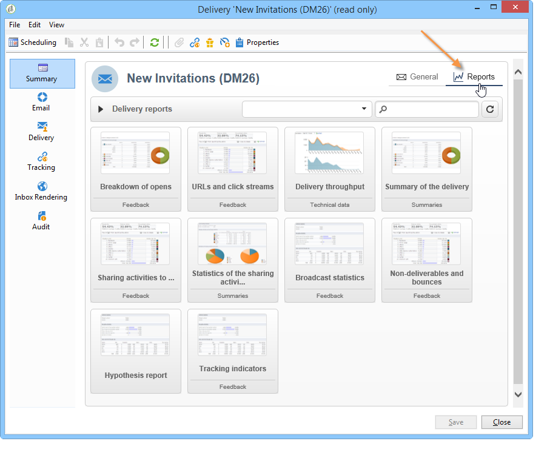

# 關於 Campaign 內建的報表{#about-campaign-built-in-reports}

本章提供Adobe Campaign內建報表的清單、其內容及其內容。 以下資訊可讓您避免建立平台中已有的報表。

>[!NOTE]
>
>您也可以了解如何將自己的報表新增至 **[!UICONTROL Reports]** 標籤。 如需詳細資訊，請參閱 [頁面](../../reporting/using/configuring-access-to-the-report.md#defining-the-filtering-options).

這些報告及其內容在與其相關功能相關的檔案中詳細說明。

Adobe Campaign提供數種報表類型，可透過客戶主控台或網際網路瀏覽器存取。

可使用下列類型的報表：

* 有關整個平台的報告，請參閱 [全域報表](../../reporting/using/global-reports.md).
* 傳送報表，請參閱 [傳送報表](../../reporting/using/delivery-reports.md).
* 累積報表，請參閱 [累積報表](../../reporting/using/cumulative-reports.md).

您可以從用戶端主控台首頁、報表控制面板或傳送清單存取報表。 報表的顯示模式取決於其內容。 首頁上提供主要報表的清單，可讓您快速存取傳送資料。 您可以變更此清單以符合您的需求。 請參閱 [本節](../../reporting/using/about-reports-creation-in-campaign.md) 以取得更多資訊。

若要存取Campaign內建報表：

1. 選取 **[!UICONTROL Reports]** 頁簽。

   

1. 使用搜尋欄位來篩選顯示的報表。

1. 然後按一下您要顯示的報表。

   

1. 按一下 **[!UICONTROL Back]** 螢幕頂端的連結會帶您回到報表清單。

   

欲知編輯中報表的其他可能動作，請參閱 [本頁](../../reporting/using/actions-on-reports.md).

行銷活動或傳送的特定報表可透過其各自的控制面板存取。

清單、服務、優惠方案等原則相同。 如下所示：

