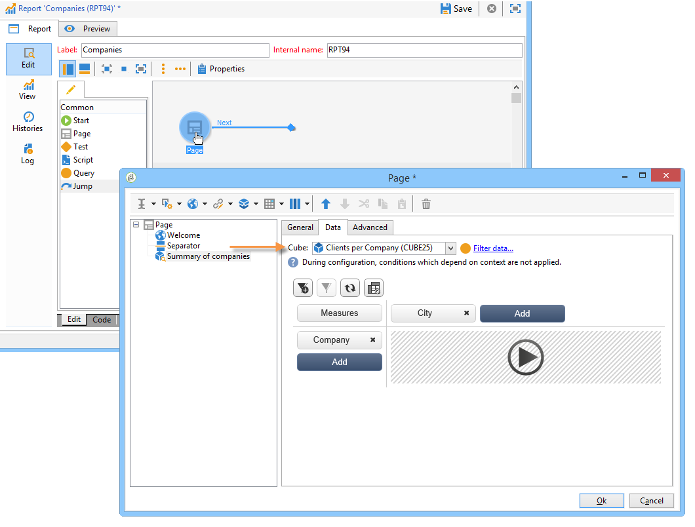

# 開始使用多維度資料集{#about-cubes}

## 術語 {#terminology}

以下列出使用立方體時的具體辭彙。

* **立方體**  — 立方體是多維度資訊的表示法：它可為使用者提供專為互動式資料分析設計的結構。

* **事實表格/結構描述**  — 事實表格（或事實綱要）包含分析所依據的原始資料或基本資料。 這些主要是大型磁碟區表格（可能有連結表格），可能會有較長的計算。 例如，事實表格可以是：broadlog表格、purchase表格等。

* **Dimension** -Dimension可讓您將資料分段成群組：建立後，維度會作為分析軸。 在大多數情況下，會針對指定維度定義數個層級。 例如，對於暫時維度，層次將為月、日、小時、分鐘等。 這組層級代表維度階層，並可啟用各種層級的資料分析。

* **量化**  — 對於某些欄位，您可以定義量化成群組，使其更容易讀取資訊。 量化會套用至層級。 建議您在可能有許多不同值時定義量化。

* **測量**  — 最常見的測量是總和、平均值、最大值、最小值、標準差等。 可以計算度量：例如，優惠的接受率是提供優惠的次數與接受次數的比率。

## Cube工作區 {#cube-workspace}

立方體儲存在 **[!UICONTROL Administration > Configuration > Cubes]** 節點。

立方結構使用的主要內容如下：

* 資料匯出可在報告中直接執行，設計方式為 **[!UICONTROL Reports]** Adobe Campaign索引標籤中的「 」變數。

  要執行此操作，請建立新報表並選取您要使用的立方結構。

  

  立方結構看起來就像範本，根據建立的報表而定。 選擇範本後，按一下 **[!UICONTROL Create]** 以設定及檢視相符報表。

  您可以調整測量、變更顯示模式或設定表格，然後使用主要按鈕顯示報表。

  

* 您也可以參照 **[!UICONTROL Query]** 報告方塊以使用指標，如下所示：

  

* 您也可以將以立方體為基礎的樞紐分析表插入報表的任何頁面。 要執行此操作，請參考要用於 **[!UICONTROL Data]** 頁上的樞紐分析表索引標籤。

  

  有關詳細資訊，請參閱 [探索報表中的資料](../../reporting/using/using-cubes-to-explore-data.md#exploring-the-data-in-a-report).
