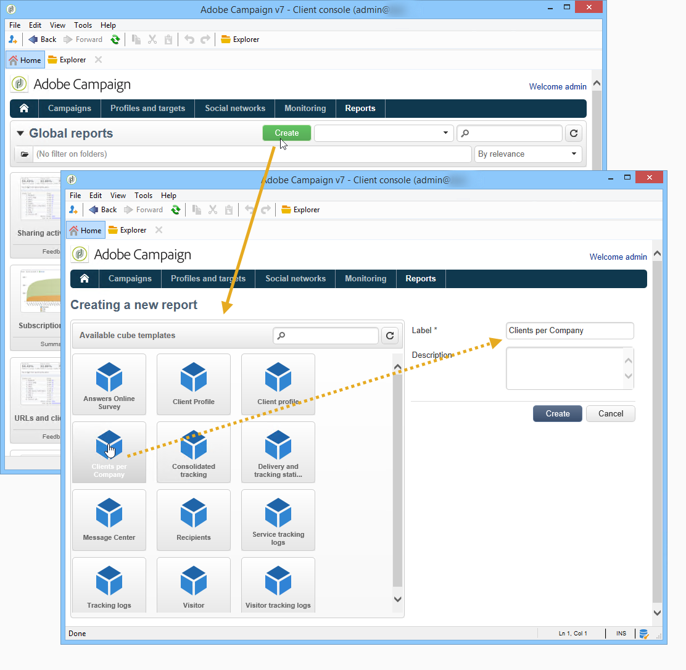

# 開始使用立方{#about-cubes}

透過&#x200B;**行銷分析**&#x200B;模組探索資料庫中的資料。 它可讓您分析和測量資料、計算統計資料、簡化並最佳化報表建立和計算。 除此之外，行銷分析還可讓您建立報表並建立目標人口族群。 在識別這些項目後，這些項目會儲存在可用於Adobe Campaign的清單中（定位、分段等）。

立方可用來產生特定的內建報表，包括傳送報表（傳送追蹤、點按、開啟等）。 基於立方的報告只能用作500萬條資料線以下資料卷的標準。

您可以擴充資料庫的探索和分析能力，同時讓最終使用者更容易設定報告和表格：他們只需在建立其報告或表格時，選取現有的（全設定好的）多維度資料集，以處理計算、測量和統計數據。

建立並設定多維度資料集後，便可以用於報告查詢方塊和網頁應用程式；可以在樞紐分析表內使用及操作多維度資料集。

>[!CAUTION]
>
>**行銷** 分析是Adobe Campaign模組。它必須安裝在您的例項上，您才能使用下述功能。

透過Marketing Analytics模組，Campaign可讓您：

1. 在以下視圖中建立立方：

   * 將資料匯總並儲存在工作表中，以根據用戶需求預先計算指標，
   * 減少用於報告和查詢的各種計算中涉及的資料量，從而顯著優化指標計算時間，
   * 簡化資料的存取，讓使用者根據不同的維度來控制資料（無論是否預先匯總）。

   有關詳細資訊，請參閱[建立指示符](../../reporting/using/creating-indicators.md)。

1. 在以下視圖中建立透視表：

   * 探索計算資料，設定測量，
   * 選取要顯示的資料及其顯示模式，
   * 個人化使用的措施和指標，
   * 為不具技術背景的使用者提供互動式分析工具。

   有關詳細資訊，請參閱[使用立方體來瀏覽資料](../../reporting/using/using-cubes-to-explore-data.md)。

1. 使用立方中計算和聚集的資料構建查詢。
1. 識別人口族群並在清單中加以參照。

## 術語 {#terminology}

使用立方時，必須知道以下概念：

* 立方

   立方體是多維資訊的表示：它為最終用戶提供了專為互動式資料分析而設計的結構。

* 數值表／方案

   事實表（或事實模式）包含分析所依據的原始或基本資料。 這些表主要是大量表（可能包含連結表），計算可能很長。

   例如，事實表可以是：broadlog表、購買表等。

* Dimension

   Dimension可讓您將資料分段至群組：建立維後，尺寸將用作分析軸。 在大多數情況下，對於給定維，將定義多個級別。 例如，對於時間維度，層級將是月、日、小時、分鐘等。 這組層代表維層次，並啟用各種級別的資料分析。

* Binning

   對於某些欄位，您可以定義群組值的系結，讓您更容易讀取資訊。 系結會套用至層級

   我們建議您在可能有許多不同的值時定義綁定。

* 測量

   最常用的測量方法有求和、平均、最大、最小、標準差等。

   可計算度量：例如，要約的接受率是其被提出的次數與被接受的次數之比。

## 立方工作區{#cube-workspace}

立方儲存在&#x200B;**[!UICONTROL Administration > Configuration > Cubes]**&#x200B;節點中。

立方的主要使用上下文如下：

* 資料輸出可直接在Adobe Campaign平台&#x200B;**[!UICONTROL Reports]**&#x200B;宇宙中設計的報告中執行。

   若要這麼做，請建立新報表並選取您要使用的立方。

   

   立方體的顯示方式與建立報表的範本類似。 選擇範本後，按一下&#x200B;**[!UICONTROL Create]**&#x200B;以設定並檢視相符的報表。

   您可以調整測量、變更顯示模式或設定表格，然後使用主按鈕顯示報表。

   

* 您也可以參考報表&#x200B;**[!UICONTROL Query]**&#x200B;方塊中的立方體，以使用其指標，如下所示：

   

* 您也可以將基於立方的樞紐表插入報表的任何頁面。 要執行此操作，請參考要用於相關頁上透視表的&#x200B;**[!UICONTROL Data]**&#x200B;頁籤的立方。

   

   有關詳情，請參閱[探索報表中的資料](../../reporting/using/using-cubes-to-explore-data.md#exploring-the-data-in-a-report)。

