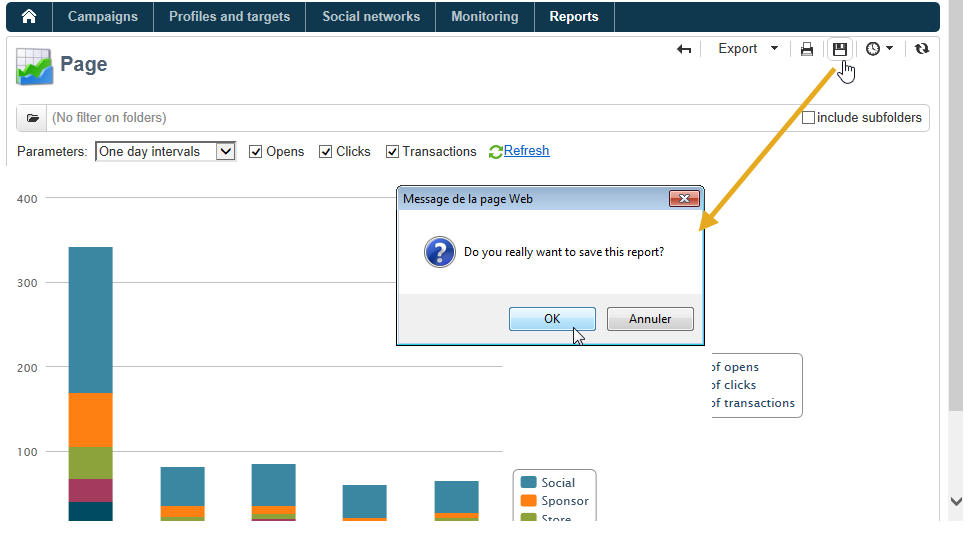
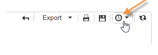

# 針對報吿的動作{#actions-on-reports}


檢視報表時，工具列可讓您執行特定數量的動作。 下文詳述。


例如，工具列可讓您匯出、列印、封存或在網頁瀏覽器中顯示報表。


## 匯出報表 {#exporting-a-report}

從下拉式清單中選取您要匯出報表的格式。 (.xls、.pdf或.ods)。


當報表包含數個頁面時，您必須對每個頁面重複此操作。

您可以以PDF、Excel或OpenOffice格式匯出報表，以設定報表。 開啟Adobe Campaign檔案總管並選取相關報表。

匯出選項可透過 **[!UICONTROL Page]** 報告的活動，在 **[!UICONTROL Advanced]** 標籤。

變更 **[!UICONTROL Paper]** 和 **[!UICONTROL Margins]** 來滿足你的需求。 您也可以僅授權以PDF格式匯出頁面。 要執行此操作，請取消勾選 **[!UICONTROL Activate OpenOffice/Microsoft Excel export]** 選項。


### 匯出至Microsoft Excel {#exporting-into-microsoft-excel}

針對 **[!UICONTROL List with group]** 類型報表會匯出至Excel，則套用下列建議和限制：

* 這些報表不得包含任何空行。

   

* 必須隱藏清單的圖例。

   

* 報表不必使用在儲存格層級定義的特定格式。 較好使用 **[!UICONTROL Form rendering]** 定義表格中儲存格的格式。 此 **[!UICONTROL Form rendering]** 可透過 **[!UICONTROL Administration > Configuration > Form rendering]**.
* 不建議插入HTML內容。
* 如果報表包含數個表格、圖表等 類型元素，它們將一個導出到另一個下。
* 可以強制單元格中的回車：此設定將保留在Excel中。 有關詳細資訊，請參閱 [定義儲存格格式](../../reporting/using/creating-a-table.md#defining-cell-format).

### 延遲出口 {#postpone-the-export}

您可以延遲匯出報表，例如等待非同步呼叫。 要執行此操作，請在頁面的初始化指令碼中輸入以下參數：

```
document.nl_waitBeforeRender = true;
```

若要啟動匯出並開始轉換為PDF，請使用 **document.nl_renderToPdf()** 函式而不含任何參數。

### 記憶體分配 {#memory-allocation}

導出某些大型報告時，可能會發生記憶體分配錯誤。

在某些情況下，預設值 **maxMB** (**SKMS** （適用於托管例項） **serverConf.xml** 配置檔案設定為64 MB。 如果在導出報告時遇到記憶體不足的錯誤，建議將此數字增加到512 MB:

```
<javaScript maxMB="512" stackSizeKB="8"/>
```

若要套用對設定所做的變更，請 **nlserver** 需要重新啟動服務。

若要進一步了解 **serverConf.xml** 檔案，請參閱 [本節](../../production/using/configuration-principle.md).

若要進一步了解 **nlserver** 服務，請參閱 [本節](../../production/using/administration.md).

## 列印報表 {#printing-a-report}

您可以列印報表：要執行此操作，請按一下打印機表徵圖：這會開啟對話方塊。

為獲得更好的結果，請編輯Internet Explorer打印選項並選擇 **[!UICONTROL Print background colors and images]**.


## 建立報表封存檔 {#creating-report-archives}

封存報表可讓您建立不同時段的報表檢視，例如顯示指定時段的統計資料。

若要建立封存，請開啟相關報表，然後按一下適當的圖示。



若要顯示或隱藏現有封存檔，請按一下顯示/隱藏圖示。



封存日期會顯示在顯示/隱藏圖示下方。 按一下封存即可檢視。


可以刪除報表封存。 若要這麼做，請前往儲存報表的Adobe Campaign節點。 按一下 **[!UICONTROL Archives]** 頁簽，選擇要刪除的頁簽，然後按一下 **[!UICONTROL Delete]**.


