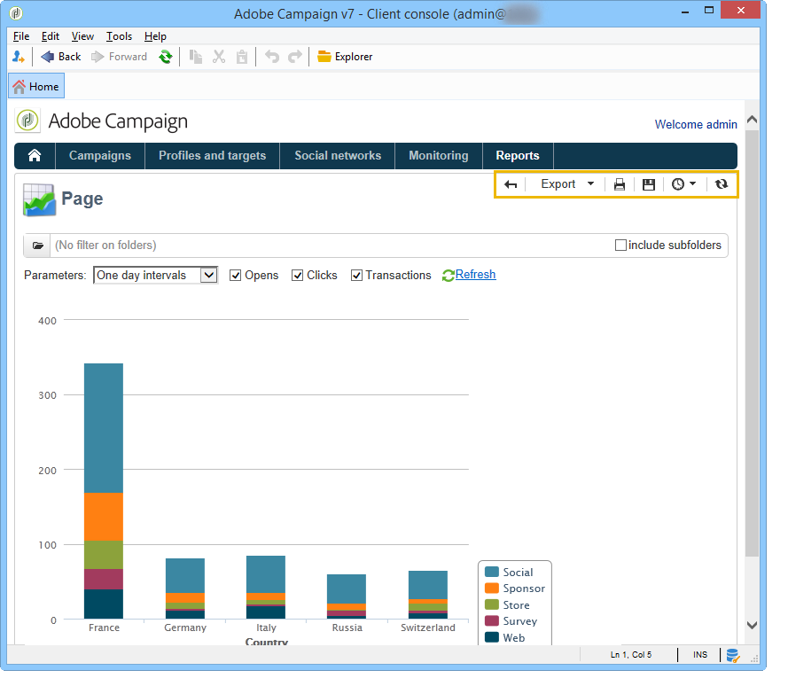

# 針對報吿的動作{#actions-on-reports}


檢視報表時，工具列可讓您執行特定數量的動作。 下文將詳述這些內容。



例如，工具列可讓您在網頁瀏覽器中匯出、列印、封存或顯示報表。


## 匯出報告 {#exporting-a-report}

從下拉式清單中選取您要匯出報告的格式。 (.xls、.pdf或.ods)。


當報表包含多個頁面時，您需要對每個頁面重複此操作。

您可以設定報表以檢視匯出為PDF、Excel或OpenOffice格式。 開啟Adobe Campaign檔案總管並選取相關報表。

匯出選項可透過以下方式存取： **[!UICONTROL Page]** 報表的活動，在 **[!UICONTROL Advanced]** 標籤。

變更設定 **[!UICONTROL Paper]** 和 **[!UICONTROL Margins]** 以符合您的需求。 您也可以授權僅以PDF格式匯出頁面。 若要這麼做，請取消勾選 **[!UICONTROL Activate OpenOffice/Microsoft Excel export]** 選項。


### 匯出至Microsoft Excel {#exporting-into-microsoft-excel}

對象 **[!UICONTROL List with group]** 鍵入要匯出至Excel的報告，以下建議和限制適用：

* 這些報表不得包含任何空白行。

   

* 清單的圖例必須隱藏。

   

* 報表不必使用在儲存格層級定義的特定格式。 最好使用 **[!UICONTROL Form rendering]** 以定義表格中儲存格的格式。 此 **[!UICONTROL Form rendering]** 可透過以下方式存取 **[!UICONTROL Administration > Configuration > Form rendering]**.
* 我們不建議插入HTML內容。
* 如果報表包含數個表格、圖表等， 文字元素，會將它們一個匯出到另一個之下。
* 您可以強制儲存格中的歸位字元：此設定將保留在Excel中。 如需詳細資訊，請參閱[本章節](../../reporting/using/creating-a-table.md#defining-cell-format)。

### 延遲匯出 {#postpone-the-export}

您可以延遲匯出報表，例如等候非同步呼叫。 若要這麼做，請在頁面的初始化命令檔中輸入下列引數：

```
document.nl_waitBeforeRender = true;
```

若要啟動匯出並開始轉換為PDF，請使用 **document.nl_renderToPdf()** 函式中沒有任何引數。

### 記憶體配置 {#memory-allocation}

匯出某些大型報表時，可能會發生記憶體配置錯誤。

在某些情況下，預設值 **maxMB** (**SKMS** （適用於託管例項）。 **serverConf.xml** 設定檔案設定為64 MB。 如果您在匯出報告時遇到任何記憶體不足錯誤，建議將此數字增加到512 MB：

```
<javaScript maxMB="512" stackSizeKB="8"/>
```

若要套用對組態所做的變更，請 **nlserver** 需要重新啟動服務。

若要進一步瞭解 **serverConf.xml** 檔案，請參閱 [本節](../../production/using/configuration-principle.md).

若要進一步瞭解 **nlserver** 服務，請參閱 [本節](../../production/using/administration.md).

## 列印報表 {#printing-a-report}

您可以列印報告：若要這樣做，請按一下印表機圖示：這會開啟對話方塊。

為了獲得更好的結果，請編輯Explorer列印選項並選取 **[!UICONTROL Print background colors and images]**.


## 建立報告封存 {#creating-report-archives}

封存報表可讓您建立不同期間的報表檢視，例如顯示指定期間的統計資料。

若要建立封存，請開啟相關報表，然後按一下適當的圖示。


若要顯示或隱藏現有的封存，請按一下顯示/隱藏圖示。


封存日期會顯示在顯示/隱藏圖示下。 按一下封存即可檢視。


可以刪除報告封存。 若要這麼做，請前往儲存報告的Adobe Campaign節點。 按一下 **[!UICONTROL Archives]** 索引標籤中，選取您要刪除的專案，然後按一下 **[!UICONTROL Delete]**.


