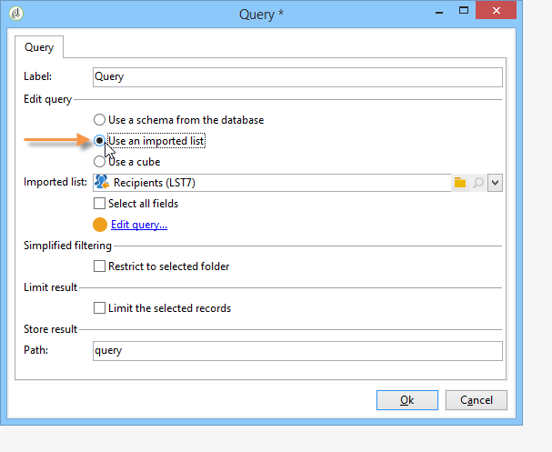

# 收集資料以進行分析{#collecting-data-to-analyze}

可直接在報表頁面中選取用於建立報表的資料(如需詳細資訊，請參閱 [使用內容](../../reporting/using/using-the-context.md))或透過一或多個查詢收集。

此活動提供三種不同的方法：

1. 使用資料庫中的資料建立查詢。
1. 處理清單中包含的資料。
1. 使用現有多維資料集中包含的資料。

方法的選擇取決於計算類型、資料量及其持久性等。 請務必仔細檢查這些參數，以避免超出Adobe Campaign資料庫負載，並最佳化所建立報表的產生和操作。 如需詳細資訊，請參閱[此頁面](../../reporting/using/best-practices.md#optimizing-report-creation)。

在所有情況下，資料都會透過 **[!UICONTROL Query]** 類型活動。

當需要使用資料庫中的資料收集或建立報表中的資料時，此資料選取模式即相關。 在某些情況下，您也可以直接從報表中使用的元素中選取資料。 例如，插入圖表時，可以直接選擇源資料。 有關詳細資訊，請參閱 [使用內容](../../reporting/using/using-the-context.md).

## 使用結構中的資料 {#using-the-data-from-a-schema}

要使用連結到資料庫架構的資料，請在查詢編輯器中選擇適當的選項，並配置要應用的查詢。

下列範例可讓您從資料庫中的設定檔中收集每個國家/地區的收件者人數。 然後，它們可以以表格的形式顯示在報表中。

## 使用匯入的清單 {#using-an-imported-list}

若要建立報表，您可以使用匯入資料清單中的資料。

若要這麼做，請選取 **[!UICONTROL Use an imported list]** 選項，然後選取相關清單。

按一下 **[!UICONTROL Edit query...]** 連結以定義要在此清單中用於建立報表之元素之間收集的資料。

## 使用多維資料集 {#using-a-cube}

可以選擇一個多維資料集來定義查詢。

多維資料集可讓您擴展資料庫的探索和分析能力，同時為最終用戶更輕鬆地配置報告和表：只需選擇一個現有的、完全配置的多維資料集，並使用其計算、度量和統計資訊即可。 有關建立多維資料集的詳細資訊，請參閱 [本節](../../reporting/using/about-cubes.md).

按一下 **[!UICONTROL Edit query...]** 連結，並選取您要在報表中顯示或使用的指標。

## 篩選查詢中的選項 {#filtering-options-in-the-queries}

為了避免在整個資料庫上運行查詢，需要篩選資料。

### 簡化的篩選 {#simplified-filter}

您可以選取 **[!UICONTROL Filter automatically with the context]** 選項，讓報表可透過樹狀結構的特定節點（例如清單、收件者或傳送）存取。

此 **[!UICONTROL Filter with the folder]** 選項可讓您指定資料夾，並僅考慮其內容。 這可讓您篩選報表資料，只顯示樹狀結構中其中一個資料夾的資料，如下所示：

### 限制收集的資料量 {#limiting-the-amount-of-data-collected}

使用結果限制選項配置要通過查詢提取的記錄數：

* **[!UICONTROL Limit to first record]** 要提取一個結果，
* **[!UICONTROL Size]** 以提取一組記錄。
