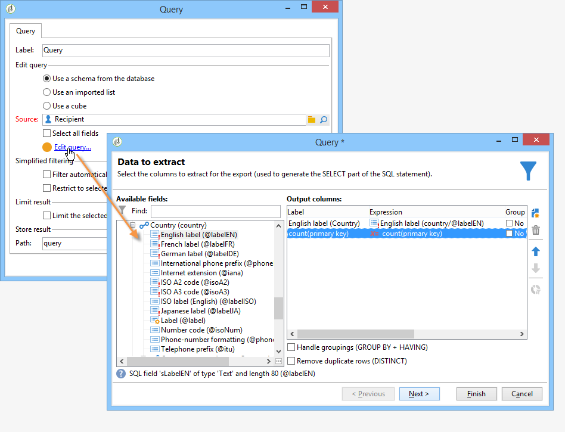

# 收集資料以進行分析{#collecting-data-to-analyze}

可直接在報表頁面中選取要用於建立報表的資料(如需詳細資訊，請參閱 [使用內容](../../reporting/using/using-the-context.md))或透過一或多個查詢收集而得。

此活動提供三種不同的方法：

1. 使用資料庫中的資料建置查詢。
1. 處理清單中包含的資料。
1. 使用現有Cube中包含的資料。

方法的選擇取決於計算型別、資料量及其耐久性等。 必須仔細檢查所有這些引數，以避免Adobe Campaign資料庫超載，並最佳化已建立報告的產生和操作。 如需詳細資訊，請參閱[此頁面](../../reporting/using/best-practices.md#optimizing-report-creation)。

在所有情況下，資料收集都是透過 **[!UICONTROL Query]** 輸入活動。

當需要使用資料庫中的資料來收集或建置報表中的資料時，此資料選擇模式是相關的。 在某些情況下，您還可以直接從報告中使用的元素中選取資料。 例如，插入圖表時，您可以直接選取來源資料。 有關詳細資訊，請參閱 [使用內容](../../reporting/using/using-the-context.md).

## 使用來自結構描述的資料 {#using-the-data-from-a-schema}

若要使用連結至資料庫模式的資料，請在查詢編輯器中選取適當的選項，並設定要套用的查詢。

以下範例可讓您在資料庫中的設定檔中，收集每個國家/地區的收件者人數。 然後它們可以表格形式顯示在報表中。

## 使用匯入的清單 {#using-an-imported-list}

若要建立報表，您可以使用匯入資料清單中的資料。

若要這麼做，請選取 **[!UICONTROL Use an imported list]** 選項，然後選取相關清單。

按一下 **[!UICONTROL Edit query...]** 此連結可定義此清單中元素間要收集的資料，以便建立報表。

## 使用立方體 {#using-a-cube}

您可以選取多維資料庫來定義查詢。

立方結構可讓您擴充資料庫的探索和分析能力，同時讓使用者更容易設定報告和表格：只要選取現有的完整設定立方結構，並使用其計算、測量和統計資料。 有關建立多維度資料集的詳細資訊，請參閱 [本節](../../reporting/using/ac-cubes.md).

按一下 **[!UICONTROL Edit query...]** 連結並選取您要在報告中顯示或使用的指標。

## 篩選查詢中的選項 {#filtering-options-in-the-queries}

為了避免在整個資料庫上執行查詢，需要篩選資料。

### 簡化的篩選器 {#simplified-filter}

您可以選取 **[!UICONTROL Filter automatically with the context]** 讓報表可透過樹狀結構的特定節點（例如清單、收件者或傳遞）存取的選項。

此 **[!UICONTROL Filter with the folder]** 選項可讓您指定資料夾，並僅考慮其內容。 這可讓您篩選報表資料，以僅顯示來自樹狀結構中其中一個資料夾的資料，如下所示：

### 限制收集的資料量 {#limiting-the-amount-of-data-collected}

使用結果限制選項，設定透過查詢擷取的記錄數：

* **[!UICONTROL Limit to first record]** 若要擷取一個結果，
* **[!UICONTROL Size]** 以擷取一組記錄。
