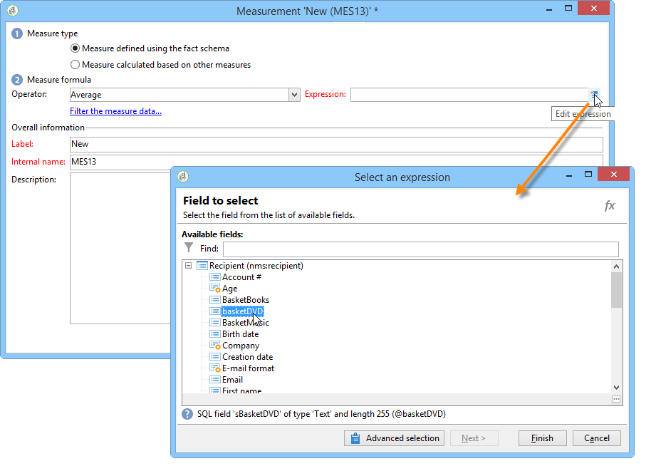
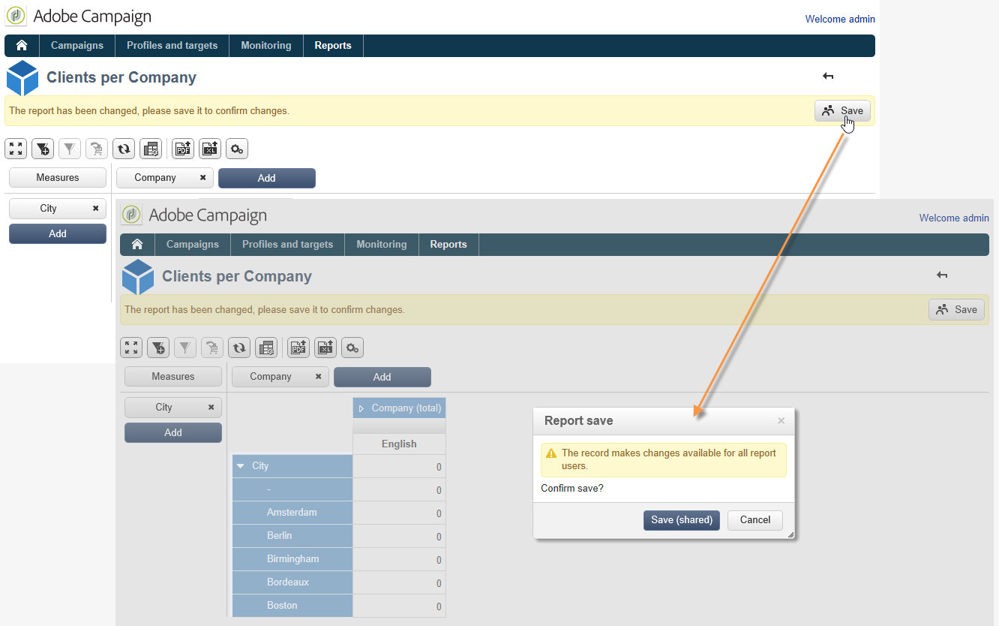

# 多維度資料集的最佳作法{#concepts-and-methodology}

## 資料量化 {#data-binning}

量化可讓您根據條件將值分組，以簡化資料顯示。 根據您可用的資訊，您可以定義年齡群組、將電子郵件網域群組在一起、限製為列舉值、明確將資料限製為在專用行或欄中顯示和群組所有其他資料，等等。

整體而言，有三種量化方式可供使用：

1. 使用手動定義的值範圍。 例如，年齡、平均購物車、開啟的傳送數量等)。 有關詳細資訊，請參閱 [定義每個資料匣](#defining-each-bin).
1. 動態地，根據分項清單的值：僅顯示分項清單中包含的值，其他所有值都會分組到「其他」中。 有關詳細資訊，請參閱 [動態管理回收筒](#dynamically-managing-bins).
1. 使用值範圍，將所有其他值分組在一起。 例如，18至25歲、26至59歲和其他人。 有關詳細資訊，請參閱 [建立值範圍](#creating-value-ranges).

若要啟用量化，請在建立維度時勾選適當的方塊。

您可以手動建立回收筒，或將回收筒連結至現有的分項清單。

Adobe Campaign也提供自動量化的輔助程式：值可以細分為N個群組，或根據資料庫中最常見的值分組。

### 定義每個紙匣 {#defining-each-bin}

若要個別建立每個間隔，請選取 **[!UICONTROL Define each bin]** 選項並使用表格來建立各種回收筒。

按一下 **[!UICONTROL Add]** 按鈕以建立新的bin並列出將分組到bin中的值。

在下列範例中，語言分為三類：英文/德文/荷蘭文、法文/義大利文/西班牙文和其他語言。

您可以使用SQL遮罩將數個值組合成濾鏡。 若要這麼做，請核取 **[!UICONTROL Yes]** 在 **[!UICONTROL Use an SQL mask]** 欄並輸入要套用的SQL篩選器 **[!UICONTROL Value or expression]** 欄。

在以下範例中，所有開頭為的電子郵件網域 **yahoo** (yahoo.fr、yahoo.com、yahoo.be等)或使用 **ymail** (ymail.com、ymail.eu等) 將會分組在標籤下 **YAHOO！**，以及包含的位址 **rocketmail.com** 網域。

### 動態管理回收筒 {#dynamically-managing-bins}

值可以透過列舉來動態管理。 這表示只會顯示列舉中包含的值。 當列舉值變更時，會自動調整Cube的內容。

若要建立此型別的值量化，請套用下列步驟：

1. 建立新維度並啟用量化。
1. 選取 **[!UICONTROL Dynamically link the values to an enumeration]** 選項並選取相符的列舉。

   

   每當更新分項清單值時，系統就會自動調整相符的回收筒。

### 建立值範圍 {#creating-value-ranges}

您可以根據所需的間隔將值分組為範圍。

若要手動定義範圍，請按一下 **[!UICONTROL Add]** 按鈕並選取 **[!UICONTROL Define a range]** ：

然後指定下限和上限，並按一下 **[!UICONTROL Ok]** 以確認。

### 自動產生回收筒 {#generating-bins-automatically}

您也可以自動產生回收筒。 若要這麼做，請按一下 **[!UICONTROL Generate bins...]** 連結。

您可以：

* 復原最常使用的值

  在下列範例中，將會顯示4個最常用的值，而其他值將會計算並分組到「其他」類別中。

* 以位置形式產生量化

  在下列範例中，Adobe Campaign會自動建立4個大小相同的值槽，以在資料庫中顯示值。

在此情況下，會忽略事實結構描述中選取的篩選器。

### 分項清單 {#enumerations}

為了改善報表的相關性和可讀性，Adobe Campaign可讓您建立特定的分項清單，將不同的值重新分組到相同的資料匣中。 這些保留供量化的分項清單會在多維度資料集中參考，然後顯示在報表中。

Adobe Campaign也提供網域列舉，可讓您顯示資料庫中所有連絡人（由ISP重新分組）的電子郵件網域清單，如下列範例所示：

這是使用下列範本建置：

若要使用此分項清單建立報表，請使用 **[!UICONTROL Email domain]** 維度。 選擇 **[!UICONTROL Enable binning]** option then **[!UICONTROL Dynamically link the values to an enumeration]**. 然後選取 **網域** 分項清單，如上所示。 所有未指定別名的值都會在 **其他** 標籤。

接著，根據此Cube建立報表以顯示值。

您只需要修改分項清單即可更新相關報表。 例如，建立 **Adobe** 值並新增 **adobe.com** 別名與報表會自動以列舉層級的Adobe值更新。

此 **[!UICONTROL Domains]** 列舉用於產生顯示網域清單的內建報表。 若要調整這些報表的內容，您可以編輯此清單。

您可以建立其他保留給量化使用的分項清單，並用於其他立方結構：所有別名值都會在第一個分項清單標籤中指定的分項清單中重新分組。

## 計算及使用彙總 {#calculating-and-using-aggregates}

最大資料量可在彙總中計算。

彙總在處理大量資料時很有用。 它們會根據專用工作流程方塊中定義的設定自動更新，以將最近收集的資料整合到指標中

彙總會在每個立方結構的相關頁簽中定義。

>[!NOTE]
>
>您可以在彙總本身中設定更新彙總計算的工作流程，或是透過連結至相關立方結構的外部工作流程來更新彙總。

若要建立新的彙總，請套用下列步驟：

1. 按一下 **[!UICONTROL Aggregates]** 立方結構的頁簽，然後按一下 **[!UICONTROL Add]** 按鈕。

   

1. 輸入彙總的標籤，然後新增要計算的維度。

   

1. 選取維度和層級。 對每個維度和每個層級重複此程式。
1. 按一下 **[!UICONTROL Workflow]** 定位點，以建立彙總工作流程。

   

   * 此 **[!UICONTROL Scheduler]** 活動可讓您定義計算更新的頻率。 排程器的詳細資訊，請參閱 [本節](../../workflow/using/scheduler.md).
   * 此 **[!UICONTROL Aggregate update]** 活動可讓您選取要套用的更新模式：完整或部分。

     依預設，每次計算期間都會執行完整更新。 若要啟用部分更新，請選取相關選項並定義更新條件。

     

## 定義測量 {#defining-measures}

量測型別定義於 **[!UICONTROL Measures]** 立方結構的頁簽。 您可以計算總和、平均值、偏差等。

您可以視需要建立任意數量的測量：然後選取要在表格中顯示或隱藏的測量。 有關詳細資訊，請參閱 [顯示量值](#displaying-measures).

若要定義新測量，請套用下列步驟：

1. 按一下 **[!UICONTROL Add]** 按鈕，並選取要計算的測量型別和公式。

   

1. 視需要並根據運運算元，選擇作業涉及的運算式。

   此 **[!UICONTROL Advanced selection]** 按鈕可讓您建立複雜的計算公式。 如需詳細資訊，請參閱[本章節](../../platform/using/about-queries-in-campaign.md)。

   

1. 此 **[!UICONTROL Filter the measure data...]** 連結可讓您限制計算欄位，並僅將其套用至資料庫中的特定資料。

   

1. 輸入測量的標籤並新增說明，然後按一下 **[!UICONTROL Finish]** 以建立它。

## 顯示量值 {#displaying-measures}

您可以視需要設定表格中測量的顯示：

* 測量的顯示順序(請參閱 [顯示順序](#display-sequence))，
* 要在報告中顯示/隱藏的資訊(請參閱 [設定顯示](#configuring-the-display))
* 要顯示的測量：百分比、總計、小數點數等。 (請參閱 [變更顯示的測量型別](#changing-the-type-of-measure-displayed))。

### 顯示順序 {#display-sequence}

在立方結構中計算的計量是透過以下方式設定： **[!UICONTROL Measures]** 按鈕。

移動線條以變更顯示順序。 在下列範例中，法國資料會移至清單底部：這表示它將顯示在最後一欄。

### 設定顯示 {#configuring-the-display}

可以針對每個測量或整體個別執行測量、直線和欄的組態。 特定圖示可讓您存取顯示模式選擇視窗。

* 按一下 **[!UICONTROL Edit the configuration of the pivot table]** 圖示以存取設定視窗。

  您可以選擇是否顯示測量的標籤，以及配置它們的版面（行或欄）。

顏色選項可讓您反白標示重要的值，以方便閱讀。

### 變更顯示的測量型別 {#changing-the-type-of-measure-displayed}

在每個測量中，您可以定義要套用的單位和格式。

## 共用您的報告 {#sharing-a-report}

設定報告後，您可以儲存報告並與其他運運算元共用。

若要這麼做，請按一下 **[!UICONTROL Show the report properties]** 圖示並啟用 **[!UICONTROL Share this report]** 選項。

指定報表所屬的類別及其相關性。 如需詳細資訊，請參閱 [此頁面](../../reporting/using/configuring-access-to-the-report.md#report-display-context) 至 **顯示順序**&#x200B;和 **定義篩選選項** 區段。

若要確認這些變更，您必須儲存報表。

## 建立篩選器 {#creating-filters}

您可以建立篩選器來檢視資料的區段。

操作步驟：

1. 按一下 **[!UICONTROL Add a filter]** 圖示。

   

1. 選取篩選器關注的維度

   

1. 選取篩選型別及其精確度等級。

   

1. 建立篩選器後，篩選器會顯示在報表上方。

   

   按一下篩選器以進行編輯。

   按一下十字以刪除它。

   您可以視需要合併多個篩選器：所有篩選器都會顯示在此區域中。

   

每次修改篩選器時（新增、移除、變更），都必須重新計算報表。

您也可以根據選取專案建立篩選器。 若要這麼做，請選取來源儲存格、行與欄，然後按一下 **[!UICONTROL Add a filter]** 圖示。

若要選取線條、欄或儲存格，請以滑鼠左鍵按一下該線條、欄或儲存格。 若要取消選取，請再按一下「 」。

篩選器會自動套用，並新增至報表上方的篩選器區域。

