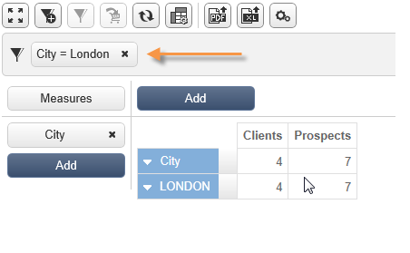

# 立方的最佳做法{#concepts-and-methodology}

## 資料綁定 {#data-binning}

通過按標準對值進行分組，可以簡化資料顯示。 根據您可用的資訊，您可以定義年齡組、將電子郵件域分組在一起、限制為值枚舉、明確限制資料顯示和分組專用行或列中的所有其他資料等。

總的來說，有三種類型的綁定：

1. 使用手動定義的值範圍。 例如，年齡、平均購物車、已開啟的交貨數量等。 有關此內容的詳細資訊，請參閱 [定義每個紙盒](#defining-each-bin)。
1. 根據枚舉的值動態：只顯示枚舉中包含的值，所有其它值都分組在「其他」中。 有關此內容的詳細資訊，請參閱 [動態管理框](#dynamically-managing-bins)。
1. 使用值範圍，將所有其它組合在一起。 例如18到25歲，26到59歲，以及其他人。 有關此內容的詳細資訊，請參閱 [建立值範圍](#creating-value-ranges)。

要啟用綁定，請在建立尺寸時選中相應的框。

您可以手動建立Bin或將其連結到現有枚舉。

Adobe Campaign還提供自動綁定助理：值可分為N個組，或根據資料庫中最頻繁的值進行分組。

### 定義每個紙盒 {#defining-each-bin}

要單獨建立每個紙盒，請選擇 **[!UICONTROL Define each bin]** 選項，然後使用表建立各種框。

按一下 **[!UICONTROL Add]** 按鈕，將選定控制項在Tab鍵次序中下移一個位置。

在以下示例中，語言分為三類：英語/德語/荷蘭語、法語/義大利語/西班牙語和其他語種。

可以使用SQL掩碼將多個值合併到篩選器中。 要執行此操作，請檢查 **[!UICONTROL Yes]** 的 **[!UICONTROL Use an SQL mask]** 列，並輸入要在 **[!UICONTROL Value or expression]** 的雙曲餘切值。

在下面的示例中，所有以 **雅虎** （yahoo.fr、yahoo.com、yahoo.be等），或 **郵件** （ymail.com 、 ymail.eu等） 將在標籤下分組 **雅虎！**，以及 **rocketmail.com** 。

### 動態管理框 {#dynamically-managing-bins}

值可通過枚舉進行動態管理。 這意味著只顯示枚舉中包含的值。 當枚舉值更改時，立方的內容將自動調整。

要建立此類型的值綁定，請應用以下步驟：

1. 建立新維並啟用綁定。
1. 選擇 **[!UICONTROL Dynamically link the values to an enumeration]** ，然後選擇匹配的枚舉。

   

   每當更新枚舉值時，匹配區自動調整。

### 建立值範圍 {#creating-value-ranges}

您可以根據所需間隔將值分組到範圍中。

要手動定義範圍，請按一下 **[!UICONTROL Add]** 按鈕 **[!UICONTROL Define a range]** :

然後指定下限和上限，然後按一下 **[!UICONTROL Ok]** 確認。

### 自動生成倉 {#generating-bins-automatically}

也可以自動生成倉庫。 要執行此操作，請按一下 **[!UICONTROL Generate bins...]** 的子菜單。

您可以：

* 恢復最常用的值

   在以下示例中，將顯示4個最常用的值，而其他值將被計數並分組到「其他」類別中。

* 以槽形式生成倉

   在以下示例中，Adobe Campaign自動建立4個大小相同的值插槽，以在資料庫中顯示值。

在這種情況下，忽略事實架構中選擇的篩選器。

### 分項清單 {#enumerations}

為了提高報告的相關性和可讀性，Adobe Campaign允許您建立特定枚舉，以將不同的值重新組合到同一個框中。 這些為綁定保留的枚舉在立方中引用，然後顯示在報告中。

Adobe Campaign還提供了域的枚舉，用於顯示資料庫中所有聯繫人的電子郵件域的清單，按ISP重新分組，如下例所示：

它使用以下模板構建：

要使用此枚舉建立報表，請使用 **[!UICONTROL Email domain]** 維。 選擇 **[!UICONTROL Enable binning]** 選項 **[!UICONTROL Dynamically link the values to an enumeration]**。 然後選擇 **域** 如上所示。 將在 **其他** 的子菜單。

接下來，基於此多維資料集建立報告以顯示值。

只需修改枚舉即可更新相關報表。 例如，建立 **Adobe** 值並添加 **adobe.com** 別名，並且報表將自動在枚舉級別使用Adobe值更新。

的 **[!UICONTROL Domains]** 枚舉用於生成顯示域清單的內置報告。 要調整這些報告的內容，可以編輯此清單。

您可以建立其他保留用於綁定的枚舉，並在其他多維資料集中使用它們：所有別名值將在第一個枚舉頁籤中指定的bin中重新分組。

## 計算和使用聚合 {#calculating-and-using-aggregates}

可以在聚合中計算最大的資料卷。

在處理大量資料時，聚合非常有用。 它們會根據在專用工作流框中定義的設定自動更新，以將最近收集的資料整合到指示符中

聚合在每個立方的相關頁籤中定義。

>[!NOTE]
>
>用於更新聚合計算的工作流可以在聚合本身中配置，或者可以通過連結到相關立方的外部工作流來更新聚合。

要建立新聚合，請應用以下步驟：

1. 按一下 **[!UICONTROL Aggregates]** 頁籤，然後按一下 **[!UICONTROL Add]** 按鈕

   

1. 輸入聚合的標籤，然後添加要計算的維。

   

1. 選擇維和級別。 對每個維和每個級別重複此過程。
1. 按一下 **[!UICONTROL Workflow]** 頁籤。

   

   * 的 **[!UICONTROL Scheduler]** 活動，用於定義計算更新的頻率。 計畫程式詳情請參閱 [此部分](../../workflow/using/scheduler.md)。
   * 的 **[!UICONTROL Aggregate update]** 活動，您可以選擇要應用的更新模式：全部或部分。

      預設情況下，在每次計算期間執行完全更新。 要啟用部分更新，請選擇相關選項並定義更新條件。

      

## 定義度量 {#defining-measures}

度量類型在 **[!UICONTROL Measures]** 頁籤。 可以計算和、平均值、偏差等。

您可以根據需要建立盡可能多的度量：然後選擇要在表中顯示或隱藏的度量。 有關此內容的詳細資訊，請參閱 [顯示度量](#displaying-measures)。

要定義新度量，請應用以下步驟：

1. 按一下 **[!UICONTROL Add]** 按鈕，選擇要計算的度量類型和公式。

   

1. 如有必要，並根據運算子選擇操作所關注的表達式。

   的 **[!UICONTROL Advanced selection]** 按鈕來建立複雜的計算公式。 如需詳細資訊，請參閱[本章節](../../platform/using/about-queries-in-campaign.md)。

   

1. 的 **[!UICONTROL Filter the measure data...]** 連結允許您限制計算欄位，並僅將其應用於資料庫中的特定資料。

   

1. 輸入度量的標籤並添加說明，然後按一下 **[!UICONTROL Finish]** 建立它。

## 顯示度量 {#displaying-measures}

可以根據需要配置表中度量的顯示：

* 度量的顯示順序(請參閱 [顯示順序](#display-sequence))
* 要在報告中顯示/隱藏的資訊(請參閱 [配置顯示](#configuring-the-display))
* 顯示哪些度量：百分比、總數、小數位數等。 (請參閱 [更改顯示的度量類型](#changing-the-type-of-measure-displayed))。

### 顯示順序 {#display-sequence}

多維資料集中計算的度量通過 **[!UICONTROL Measures]** 按鈕

移動行以更改顯示順序。 在以下示例中，法文資料將移到清單的底部：這意味著它將顯示在最後一列中。

### 配置顯示 {#configuring-the-display}

可針對每個測量或整體分別執行測量、線和列的配置。 特定表徵圖允許您訪問顯示模式選擇窗口。

* 按一下 **[!UICONTROL Edit the configuration of the pivot table]** 表徵圖以訪問配置窗口。

   您可以選擇是否顯示度量的標籤以及配置其佈局（行或列）。

顏色選項使您可以突出顯示重要值，以便輕鬆閱讀。

### 更改顯示的度量類型 {#changing-the-type-of-measure-displayed}

在每個度量中，可以定義要應用的單位和格式。

## 共用報告 {#sharing-a-report}

配置完報表後，您可以保存它並與其他運算子共用它。

要執行此操作，請按一下 **[!UICONTROL Show the report properties]** 表徵圖並啟用 **[!UICONTROL Share this report]** 的雙曲餘切值。

指定報表所屬的類別及其相關性。 有關此的詳細資訊，請參閱 [此頁](../../reporting/using/configuring-access-to-the-report.md#report-display-context) 到 **顯示順序**&#x200B;和 **定義篩選選項** 的下界。

要確認這些更改，需要保存報告。

## 建立篩選器 {#creating-filters}

可以建立用於查看資料部分的篩選器。

操作步驟：

1. 按一下 **[!UICONTROL Add a filter]** 表徵圖

   

1. 選擇篩選器所關注的維

   

1. 選擇濾鏡的類型及其精度級別。

   

1. 建立後，該篩選器將顯示在報告的上方。

   

   按一下篩選器以編輯它。

   按一下交叉點將其刪除。

   您可以根據需要組合多個篩選器：都會在這個區域展示。

   

每次修改過濾器（添加、刪除、更改）時，都必須重新計算報告。

也可以基於選擇建立過濾器。 為此，請選擇源單元格、行和列，然後按一下 **[!UICONTROL Add a filter]** 表徵圖

要選擇行、列或單元格，請左鍵按一下。 要取消選擇，請再次按一下。

該篩選器將自動應用並添加到報表上方的篩選器區域。

